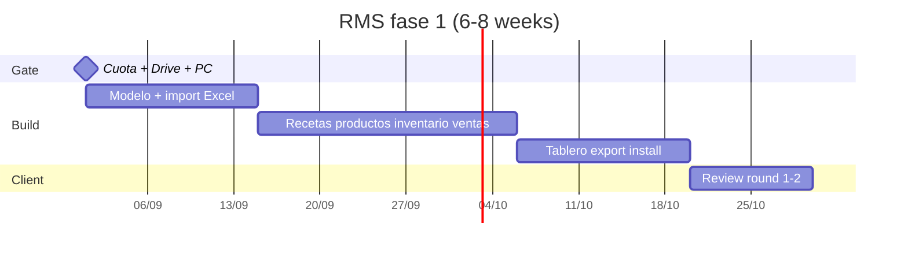

# RMS fase 1 — development plan (Saskia)

> **For the delivery team:** this is the only build plan for the signed quote. Do not implement the planning assistant, website, WhatsApp bot, or dedicated Hermes from this document.

**Goal:** Ship a **Spanish, single-user restaurant management system that runs on Saskia’s PC**: products, prices, recipes, inventory, sales, low-stock alerts, and a numbers dashboard — loaded from her Drive Excels, with Excel export as backup.

**Architecture:** Local app on her machine. SQLite file on disk. UI in the browser at `http://127.0.0.1` (not public, not hosted). Python services import/export `.xlsx`. No cloud account, no monthly server. Theoretical stock drop on each saved sale. Money in **integer Gs.** (no cents).

**Tech stack (locked for this plan):** Python 3.13 · FastAPI · SQLite · openpyxl · a simple Spanish HTML UI (server-rendered or HTMX). Windows first (confirm Mac at kickoff). Start via `run.bat` + desktop shortcut.

**Calendar:** **6–8 weeks** after first cuota + Drive + PC (quote). Budget: **70 h** at Gs. 250.000/h.

## Global constraints

- Product is **local RMS**, not a website, not table POS/KDS/card terminal, not SET, not WhatsApp bot.
- **Dedicated Hermes / own VPS is John’s SKU.** Do not build or estimate it here.
- Planning assistant (producción + compras + calendario, 38 h / Gs. 9.500.000) is **parked**. Do not sneak it into fase 1 screens.
- UI copy: **Spanish, vos**.
- OPSEC: do **not** commit workbooks, IDs, or banks from `saskia-personal-context`. Map columns from `04_foodbiz-management-system/tabs/*.md` locally; import from a **copy** of Drive files she provides.
- Guaraní amounts: **integers**. Ingredient qty may be decimal; money never `.00` display.
- Recipes and selling prices: **no silent overwrite**. Import is a first load + explicit re-import she confirms.
- Quote includes **2 review rounds** + onboarding **on that machine**.
- Production **does not start** until first cuota is in + Drive access + work PC named.

**Sources:** hub quote `2026-08-18-saskia-weiss-vander.md` · product `2026-08-18-saskia-ops-panel-product.md` · `docs/CURRENT-CONTEXT.md`.

---

## 1. What “done” means (acceptance)

She can sit at **her** PC, open the app, and without us:

1. See **today / week / month** sales, cost of goods from recipes, **margin**, and a **ranking** of what leaves more money.
2. See **red alerts:** stock below her minimum, recipes missing an ingredient price, sales with no recipe.
3. Edit **products** (name, portion, sale price Gs.), see **cost from recipe** and margin Gs. + %.
4. Create/edit **recipes** (ingredients, quantities, yield/portions).
5. Edit **inventory** (stock, purchase price Gs., **min stock** she defines).
6. **Register a sale** (what, how many, when). Saving **drops theoretical ingredient stock** when a recipe and stock exist.
7. **Import** her Drive Excel (v1 and later if she kept annotating). **Export** Excel anytime (that file is the backup).
8. App is a shortcut on that PC. No public URL. No monthly hosting.

If any of those fail, fase 1 is not delivered.

---

## 2. Explicitly do not build

| Item | Why |
|---|---|
| Public website / carta | Quote: after the local is running |
| Mesas, salón, KDS, datáfono | Out of scope |
| Login/SaaS, hosting, phone app | Local PC only |
| SET invoices, multi-sucursal | Deferred |
| WhatsApp bot / auto orders | Out; sales are typed in the RMS |
| Production-of-the-day planner, shopping list, peak calendar | Parked 38 h module |
| Merma, proveedores as a module, client CRM | Later à la carte |
| Reuse archived `IvanWeissVanDerPol/Saskia` Flask bakery as the product | Wrong era; use as **reference only** if useful |

---

## 3. Architecture (chosen)

Three options were on the table:

| Option | Fit | Verdict |
|---|---|---|
| A. Keep Excel as the database + thin UI | Fast, but formulas already painful; quote is a **panel**, not another workbook | No |
| B. **FastAPI + SQLite + local browser** | Matches existing Python workbook builders; Excel in/out; install = Python + shortcut; still “on her PC” | **Yes** |
| C. Electron / native desktop | Heavier than 70 h; no extra user value vs localhost | No for fase 1 |

**Runtime**

```
[Saskia PC]
  shortcut → run.bat
    → uvicorn 127.0.0.1:8765
    → opens browser to the Spanish UI
  data:  %LOCALAPPDATA%\AIW-Saskia\rms.sqlite
  backups: Excel export she copies to Drive
```

No port-forward, no ngrok, no “just host it.” If someone on the LAN can hit 8765, bind **127.0.0.1 only**.

**Code home:** new `app/` directory in **this** repo (`Ai-Whisperers/saskia`). Do not put the app inside `saskia-personal-context`.

---

## 4. File map (create in `app/`)

```
app/
  README.md                 # how to run locally / on her PC
  pyproject.toml            # or requirements.txt: fastapi, uvicorn, openpyxl, sqlalchemy
  run.bat                   # Windows: venv + uvicorn + start browser
  run.sh                    # only if kickoff says Mac
  rms/
    __init__.py
    config.py               # sqlite path, bind host, port
    db.py                   # engine, session, create_all
    models.py               # tables below
    money.py                # integer Gs. helpers
    costing.py              # recipe cost, product margin, sale COGS, stock drop
    main.py                 # FastAPI app, mount routes
    routers/
      dashboard.py
      products.py
      recipes.py
      inventory.py
      sales.py
      excel_io.py
    services/
      import_xlsx.py        # map Drive sheets → tables
      export_xlsx.py        # tables → backup workbook
    templates/              # Spanish pages
      base.html
      inicio.html
      productos.html
      recetas.html
      inventario.html
      ventas.html
      excel.html
    static/
      app.css
  tests/
    test_costing.py
    test_stock_drop.py
    test_import_roundtrip.py
    fixtures/
      mini.xlsx             # synthetic; never her real Drive file
installer/
  README.md                 # checklist for the install session on her PC
  shortcut-template.bat
```

---

## 5. Data model

All money columns: **integer Gs.** `NULL` purchase price means “missing” (feeds the dashboard alert).

| Table | Fields | Notes |
|---|---|---|
| `ingredient` | id, name, unit, stock_qty (numeric), purchase_price_gs (int, nullable), min_stock_qty (numeric, default 0), notes | Inventory + low-stock |
| `recipe` | id, name, yield_qty, yield_unit, notes | Yield = porciones / rendimiento |
| `recipe_line` | id, recipe_id, ingredient_id, qty | |
| `product` | id, name, portion_label, sale_price_gs (int), recipe_id (nullable) | Sale without recipe → alert |
| `sale` | id, sold_at, product_id, qty, unit_price_gs (snapshot), notes | Snapshot price so history survives catalog edits |
| `sale_stock_move` | id, sale_id, ingredient_id, qty_delta (negative) | Audit of theoretical drop; skip if no recipe or no lines |
| `import_batch` | id, imported_at, source_filename, note | Re-import is explicit |

**Derived (never stored as source of truth):**

- Recipe cost Gs. = Σ (line.qty × ingredient.purchase_price_gs) scaled to **one product portion** using `recipe.yield_qty` vs `product.portion_label` — if yield is “batch of 12 muffins” and product is “1 muffin”, cost = batch_cost / 12.
- Product margin Gs. = sale_price − unit_cost; % = margin / sale_price when sale_price > 0.
- Sale COGS = unit_cost × qty at **current** recipe (fase 1: current recipe, not historical cost. Document this; do not build cost layers).
- Dashboard ranking = margin Gs. × qty in the selected period (or total margin Gs. — pick **total margin Gs. in period**, not margin % , because she asked “dónde gano plata”).

**Stock drop (on sale save, one transaction):**

1. Resolve `product.recipe_id`. If missing → save sale, **no** stock move, flag “venta sin receta”.
2. For each `recipe_line`, `need = line.qty / recipe.yield_qty * sale.qty` (same unit as ingredient).
3. Insert `sale_stock_move` (−need) and `ingredient.stock_qty -= need`.
4. Allow negative stock (show it); do not block the sale. Kitchen reality > accounting purity.

**Delete/void sale:** reverse the moves. Fase 1 must support void; otherwise a typo wrecks stock.

---

## 6. Excel: source of truth for v1 load

**Do not invent a new catalog.** First import maps her foodbiz workbooks.

Canonical files (roles only — copy from Drive, never commit):

| Workbook (personal-context / Drive) | Maps into |
|---|---|
| `HEREBUS_FoodBiz.xlsx` | ingredients, recipes, recipe lines, stock, prices if present |
| `RECETARIO_EN_BLANCO.xlsx` | recipe create template — UI should feel like this form |
| `HEREBUS_Suppliers.xlsx` | **Do not** build a suppliers module. If a sheet has purchase prices, use them as `ingredient.purchase_price_gs` only |
| `HEREBUS_Analisis.xlsx` | Reference for KPIs; dashboard is **computed**, not a dump of that file |

**Import rules**

1. Kickoff: list **v1 products/recipes** with her (subset is OK). Import only that subset if the workbook is huge.
2. Empty ingredient prices stay `NULL` → dashboard “receta sin precio de ingrediente”.
3. Empty yields: recipe still imports; costing shows “sin rendimiento” until she fills it.
4. Re-import: default **additive / match by name**. Never wipe sales. Confirm on screen: “Esto puede pisar recetas e inventario. ¿OK?”
5. Export: one `.xlsx` with sheets `Ingredientes`, `Recetas`, `Lineas`, `Productos`, `Ventas` so she can put it on Drive. That is the backup. SQLite is not her backup.

**Hours in the quote for this block:** inside the **54 h** “registro + Excel” (see §7).

---

## 7. Hour budget (do not exceed without written OK)

From product catalog — **70 h** total. Extra is Gs. 250.000/h after written OK.

| Block | h | Owner-facing slice |
|---|---:|---|
| Registro + Excel (ingredients, recipes, sales CRUD, import/export, local install shell) | 54 | Tasks 1–6, 10 |
| Productos y precios (catalog + margin on product) | 4 | Task 4 polish |
| Stock bajo (mins + red list on Inicio) | 3 | Task 5 |
| Tablero (ventas, COGS, ranking, avisos) | 8 | Task 7 |
| QA extra de cifras | 1 | Task 8 |
| **Total** | **70** | |

The **2 review rounds + onboarding** are inside those hours (mostly 54 + QA). Do not add a 71st hour of features.

**If blocked** (no Drive, no PC, no prices): clock **pauses** per quote. Log idle; do not burn hours on fake data UI chrome.

---

## 8. Calendar (quote milestones)

Clock starts when: first cuota **and** Drive read access **and** work PC available.



| Hito (quote) | Week | Team output |
|---|---|---|
| Día 0–5 | 0 | Kickoff: v1 list, Drive copy, OS confirm, SQLite path, install user on that PC |
| Semanas 1–2 | 1–2 | Schema + import of **her** Excel into SQLite; she can see counts |
| Semanas 2–5 | 2–5 | CRUD recetas, productos, inventario, ventas + stock drop |
| Semanas 5–7 | 5–7 | Tablero, stock bajo, export, `run.bat` + shortcut on **her** machine |
| Rondas | +3–5 days each | Written feedback → fix → approve |
| **Usable on her PC** | **6–8 weeks** | Acceptance §1 |

---

## 9. Tasks (build order)

Each task has a **demo** the next person can run. Do not start Task N+1 if N’s demo fails.

### Task 0 — Kickoff (commercial + machine)

**Owner:** K.W. + whoever installs. **Not billed as extra features.**

- [ ] Quote signed, first cuota in (production may start).
- [ ] Named PC (quote field) + Windows vs Mac.
- [ ] Drive folder identified; **local copy** of foodbiz xlsx on the build machine (not committed).
- [ ] V1 product/recipe list written in `docs/intake/` (names only, no customer PII).
- [ ] Confirm: no login; bind 127.0.0.1; port 8765.

**Done when:** `docs/intake/v1-catalog.md` exists (names) and a laptop/PC is the install target.

### Task 1 — Skeleton app + SQLite

**Files:** create `app/` as in §4 (`config.py`, `db.py`, `models.py` empty tables, `main.py` health page in Spanish).

- [ ] `GET /` shows “Sistema de gestión — local” and does not listen on `0.0.0.0`.
- [ ] `create_all` produces `rms.sqlite` under the configured data dir.
- [ ] `tests/test_costing.py` exists with one failing test for “batch cost / yield” (write the test first).

**Demo:** `run.bat` on a clean Windows folder opens the page.

### Task 2 — Costing engine (no UI)

**Files:** `rms/costing.py`, `rms/money.py`, `tests/test_costing.py`, `tests/test_stock_drop.py`.

**Produces:**

- `recipe_batch_cost_gs(recipe_id) -> int | None` (`None` if any line lacks purchase price)
- `product_unit_cost_gs(product_id) -> int | None`
- `product_margin(product_id) -> tuple[int | None, float | None]`  # Gs., ratio
- `apply_sale(session, product_id, qty, sold_at) -> Sale`  # snapshot price, stock moves
- `void_sale(session, sale_id) -> None`

**Rules:** integer Gs. (round **half up** to integer at the last step only). Document rounding in `app/README.md`.

- [ ] Tests: muffin batch 12, cost 24_000 Gs. → unit cost 2_000; sale of 2 drops flour by `2 * (flour_per_batch/12)`.
- [ ] Test: sale without recipe creates sale, zero stock moves.
- [ ] Test: void restores stock.

**Demo:** pytest green. No UI yet.

### Task 3 — Inventario + recetas CRUD (Spanish)

**Files:** `routers/inventory.py`, `routers/recipes.py`, templates.

- [ ] List/add/edit ingredients: name, unit, stock, purchase Gs., min stock.
- [ ] List/add/edit recipes + lines (ingredient + qty). Cannot delete an ingredient that is on a recipe (block with a Spanish message).
- [ ] Vos copy: “Guardá”, “Stock bajo”, etc.

**Demo:** create flour + muffin recipe without Excel.

### Task 4 — Productos y precios (4 h in quote)

**Files:** `routers/products.py`.

- [ ] Product: name, portion label, sale price Gs., linked recipe.
- [ ] Screen shows computed cost + margin Gs. + % (or “falta precio/rendimiento”).

**Demo:** product “Muffin” sale 8_000, cost 2_000, margin 6_000 / 75%.

### Task 5 — Ventas + stock drop

**Files:** `routers/sales.py`.

- [ ] Form: product, qty, datetime (default now).
- [ ] Save calls `apply_sale`.
- [ ] History table. Void button calls `void_sale`.
- [ ] After save, inventory page reflects new stock.

**Demo:** sell 2 muffins, flour decreases, void restores.

### Task 6 — Excel import / export (core of 54 h)

**Files:** `services/import_xlsx.py`, `export_xlsx.py`, `routers/excel_io.py`, `tests/test_import_roundtrip.py`, `tests/fixtures/mini.xlsx`.

- [ ] Write `mini.xlsx` **synthetic** (3 ingredients, 1 recipe, 2 products). Never her real file in git.
- [ ] Import maps sheets documented in `app/README.md` (update the map after reading `tabs/*.md` **locally**).
- [ ] Roundtrip test: import mini → export → import again → same costing for the muffin.
- [ ] Production import: run once on her Drive copy; log unmapped columns in `docs/sessions/` (no PII).
- [ ] Re-import confirmation dialog.

**Demo:** import mini.xlsx; export; she-style “put on Drive” is the export file.

### Task 7 — Tablero Inicio (8 h)

**Files:** `routers/dashboard.py`, `templates/inicio.html`.

Period toggle: **hoy / semana / mes** (calendar month).

Widgets (all required by quote):

- [ ] Ventas Gs. (sum of `qty * unit_price_gs`)
- [ ] Costo de lo vendido Gs. (sum of unit_cost × qty; skip or flag lines with `None` cost)
- [ ] Margen Gs. and %
- [ ] Ranking: products by **margen Gs. in period** (best first, worst last — both visible)
- [ ] Avisos: low stock (`stock_qty < min_stock_qty` and min > 0), recipes with `batch_cost is None`, sales in period with no recipe

**Demo:** after fixtures + 3 sales, ranking and alerts match a hand spreadsheet.

### Task 8 — QA de cifras (1 h) + freeze

- [ ] Walk 3 real recipes from her v1 list: cost vs Excel / calculator.
- [ ] Fix rounding bugs only. No new modules.
- [ ] Note known limits in `app/README.md` (current recipe cost, not FIFO).

### Task 9 — Install on **her** PC + onboarding

**Files:** `installer/README.md`, `run.bat`, shortcut.

- [ ] Python 3.13 on that PC (or embed a portable venv — prefer official install if she allows).
- [ ] Data dir created; shortcut on desktop “Gestión Saskia”.
- [ ] Offline test: unplug network, app still opens.
- [ ] Teach: daily sales, export to Drive, do not delete `rms.sqlite`.
- [ ] Second PC = **out of quote** (Gs. 250.000/h).

### Task 10 — Review rounds (quote)

- [ ] Round 1: she uses it 3–5 days; WhatsApp list of fixes **in scope**.
- [ ] Round 2: same. Cosmetic only if hours remain.
- [ ] Written OK (WhatsApp) = fase 1 accepted.
- [ ] Scope creep (planning, web, bot) → “otro presupuesto”, do not start.

---

## 10. Team split (suggested)

| Role | Focus | Tasks |
|---|---|---|
| Backend | SQLite, costing, import/export | 1, 2, 6 |
| UI | Spanish screens, dashboard | 3, 4, 5, 7 |
| Delivery | Kickoff, her PC, QA with real recipes | 0, 8, 9, 10 |
| K.W. | Scope police, cuota, no planning in the build | all gates |

One person can do all of this; 70 h is **one** stream. Two people: backend and UI in parallel after Task 2, merge daily.

---

## 11. Risks

| Risk | Mitigation |
|---|---|
| Workbooks are 25 tabs of inconsistent names | V1 **subset**; mapping doc; do not wait for a perfect warehouse model |
| Yields / prices empty | Ship with alerts; do not block sales |
| She keeps editing Drive Excel after import | Re-import is explicit; sales never wiped |
| “Can I open it on my phone?” | No. Quote. Parking: another design |
| Agent/Hermes overwrites recipes | App is source of truth on PC; Excel export is backup; personal-context Python must not silently replace her live SQLite |
| Windows defender / no Python | Installer session; portable venv if needed (still in 54 h install shell) |
| Planning sneak-in | Reject PRs that add “producción del día” / shopping list / Navidad calendar |

---

## 12. Definition of ready / done (process)

**Ready to sprint:** Task 0 complete.

**Done for a task:** demo in §9 + tests if the task lists them + Spanish UI if the task has UI + no new out-of-scope screen.

**Done for the project:** §1 acceptance on **her** PC + written OK after round 2.

**Handoff artifacts**

- This plan
- `app/README.md` (run, backup, rounding)
- `docs/intake/v1-catalog.md`
- Installer notes (no passwords, no IDs)
- Hub quote remains commercial source of truth

---

*AI Whisperers · internal · 31 August 2026 · aligns with quote v4 / CURRENT-CONTEXT. Not for Saskia as-is.*
