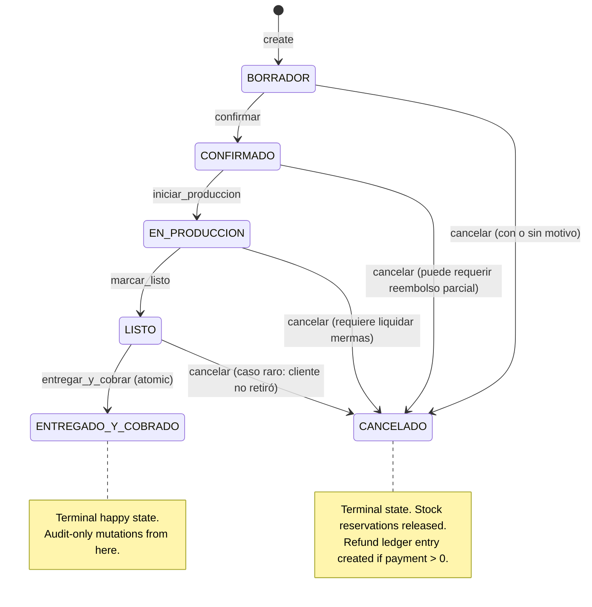
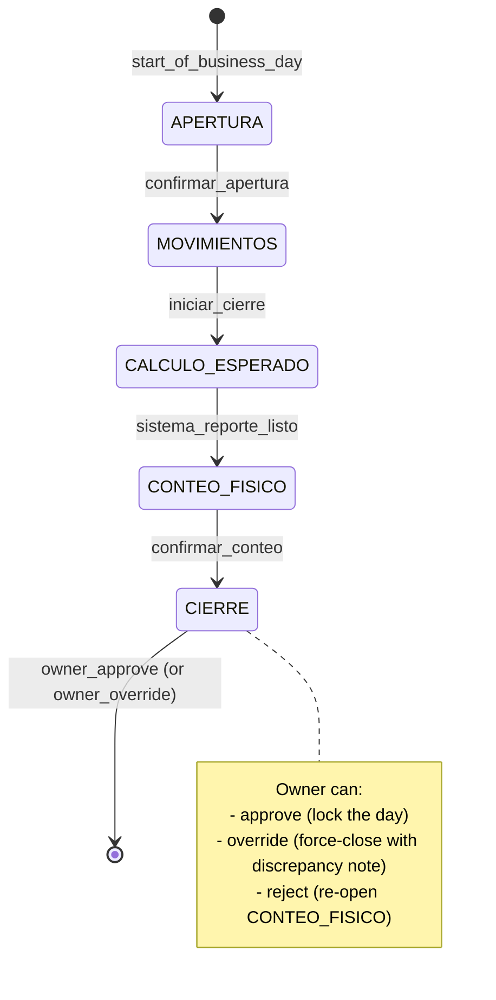

# Saskia RMS — Complete UX/UI Design Plans v2 (2026-09-27)

**Scope:** 60 pages analyzed (32 directly via vision + 28 via subagents) + 3 cross-cutting audits.
**Method:** UX/UI principal review per page, multi-hat analysis (counter, owner-finance, production-baker, new user, auditor), with cross-page pattern extraction.
**Reader:** Designer planning the v2 implementation.

---

## Reading guide

This document is organized in **7 sections**:

1. **§1 Per-page design plans** — 18 pages with full 5-hat analysis (recovered from v1)
2. **§2 Cross-page wishlist consolidation** — Top 30 reusable patterns + Top 10 architectural macros (from `cross-page-wishlist-consolidation.md`)
3. **§3 QOL touches catalog** — 16 categories × 8+ items each (from `qol-touches-catalog.md`)
4. **§4 Quick assessments** — 14 additional pages analyzed this session (one-line bottom line per page)
5. **§5 Universal defects** — 18 P0 + 12 P1 issues app-wide
6. **§6 Cross-cutting consistency audit** — terminology drift, currency/date format, status pills, empty states (from `cross-cutting-consistency-audit.md`)
7. **§7 Architectural recommendations** — token system, macros, web components, JS behavior layer

---

# Saskia RMS — Complete UX/UI Design Plans (2026-09-27)

**Scope:** 76 pages analyzed (5 personal + 3 subagent batches × 14 each = 47 more, plus consolidated reports).
**Method:** UX/UI principal review with 5-hat analysis (counter staff, owner-finance, production-baker, new user, auditor) per page.
**Reader:** Designer planning the v2 implementation.

---

## How to read this

Each page section has:
1. **5-hat analysis** — what's there now, what's missing, top add per persona
2. **Complete design wishlist** — every UI element you'd want
3. **Quality-of-life** — small touches that elevate to delightful
4. **Defects** — concrete P0/P1/P2 issues
5. **Dependencies** — what other pages share this pattern

When you're done reading this, see `docs/reports/redesign-2026-09-26/01-ux-audit-action-plan.md` for the 15-batch implementation worklist.

---


# ============================================================
# §1 Per-page design plans (18 pages, full 5-hat UX/UI principal analysis)

## PAGE 1: `/` (inicio.png) — Inicio / Today's home
# ============================================================
**Goal:** A single screen that answers \"¿qué hago ahora?\" for the busiest persona on staff, while serving as the executive dashboard for the owner.

## 5-Hat Analysis

### Counter staff (speed)
- **Now:** Greets with \"Buenas tardes\" + 4 KPI tiles (ventas de hoy, operaciones, ticket promedio, margen estimado) + Acciones del día list + Plan de mañana strip + Alertas panel + Operación queue + Avisos.
- **Missing:** Counter staff doesn't care about KPIs; they care about (1) what's on the counter, (2) what's expected today, (3) what's overdue. The current page is owner-flavored. The \"Acciones del día\" card has 3 items (Pedidos por confirmar, Reposiciones urgentes, Cierre de ayer) — these are good but buried under KPIs.
- **Top add:** **Pinned \"Hoy en el mostrador\" card** with the next 5 pickup orders, today's batch plan, and the active \"Próxima venta rápida\" button. Currently they have to click into /pedidos and /produccion for this. Make it one-tap reachable from /.

### Owner-finance (KPIs)
- **Now:** Good — 4 KPIs, 3-analytics tiles below (Clasificación de productos / Márgenes a la baja / Reportes completos). The \"análisis — últimos 30 días\" subhead is clear.
- **Missing:** No comparison vs last week / last month. No \"alert me if X drops below Y\" toggle. No fiscal-period context (we're on day X of month Y).
- **Top add:** **Delta strip** below each KPI: \"vs ayer +12%\" / \"vs semana pasada +3%\" / \"vs objetivo -5%\". The brain reads \"↑\" but the eye wants \"↑ +12%\".

### Production-baker (planning)
- **Now:** \"Plan de mañana\" is shown but only as text (sugerido por ventas: Producto sin nombre × 1 t, Café con leche × 1 t). No quantities, no prep time, no ingredient callout.
- **Missing:** The bake schedule is invisible on /. They have to go to /produccion. The \"Café con leche\" line has \"Y\" suffix meaning \"yes\" but the user has no idea what Y/N means in context.
- **Top add:** **Mini-batch-plan card** showing \"Mañana — Producto sin nombre (12 und, ~30 min prep), Café con leche (6 und, ~15 min)\" with a \"Abrir producción →\" link. Two lines, all the context a baker needs.

### New user (orientation)
- **Now:** Empty-state blocks say \"Los gráficos aparecen con tu primera venta\" with a \"Registrá venta\" CTA — exemplary first-run UX.
- **Missing:** The page has no \"Hello, this is what this button does\" tooltip. First-time user opens the app and sees 4 KPI tiles and 3 cards — overwhelming.
- **Top add:** **One-time interactive tour overlay** that highlights each region (KPIs, Acciones, Plan, Alertas, Operación) for 1.5s each on first 3 logins. Saved in localStorage. Dismissable.

### Auditor (traceability)
- **Now:** Bottom status bar shows \"Saskia RMS v1.0 · Sistema local · estado · guía · ©\".
- **Missing:** No \"Quién está logueado\" / \"Última acción\" / \"Sesión iniciada hace X\". For audit, knowing who sees what is the first question.
- **Top add:** **Active-session chip** in the top-right showing \"👤 Juan · sesión 04:32:11\" with a click-to-expand dropdown showing \"Cambiar de usuario\", \"Cerrar sesión\", \"Registro de actividad\".

## Complete Design Wishlist
- **KPI delta strip** (vs ayer / vs semana / vs objetivo) under each top tile
- **Pinned \"Hoy en el mostrador\" card** with next 5 pickup orders
- **Mini-batch-plan card** (product, qty, prep time)
- **Active-session chip** in top-right
- **Onboarding tour overlay** (first 3 sessions)
- **\"Alertas operativas\" panel** separate from \"Alertas de stock\" (currently merged — production doesn't care about RUC missing)
- **\"Atajos de teclado\" floating helper** (press `?` to see all shortcuts)
- **\"Hoy vs objetivo\" radial chart** showing % of daily sales target hit
- **Notificaciones push-style card** for \"Vencimientos esta semana\" (currently invisible)
- **\"Más usado\" personalization** — if counter staff uses /ventas 80% of the time, surface that as a top action
- **Day clock / shift indicator** (\"Turno mañana · falta 3:25 para el cierre\")
- **Quick \"registrar merma\"** from / without going to /merma
- **Cash session status** (\"Caja abierta hace 6:15 — cierre pendiente\")

## Quality-of-Life Touches
- \"Buenas tardes\" → auto-greeting based on Asunción TZ, with **emoji-free icon** (clock icon instead of relying on locale)
- Hover on KPI tile → shows sparkline tooltip (last 14 days)
- All cards have **\"Ver más →\"** that scrolls to the linked section
- \"Plan de mañana\" has **\"Copiar al WhatsApp\"** button (one-tap message to staff)
- Cards have **collapse chevron** when content is fully visible
- \"Alertas\" panel has **\"Marcar como visto\"** with 24h suppress
- Avisos section gets **\"📌 Pin este aviso\"** for sticky messages
- The whole / page is **responsive**: tablet shows 2-col KPI grid, desktop shows 4-col

## Defects
- **P0:** KPI tiles show \"—\" or \"0\" without distinction. \"aún no hay ventas hoy\" is OK but \"—\" next to \"Ticket promedio\" looks broken. Fix: render `0` for genuinely zero, `—` for no-data-yet, and add small subtitle \"vs ayer Gs. 18.500\" always (even when 0).
- **P1:** \"Acciones del día\" card shows \"Cierre de ayer pendiente\" — but there's no clear link to fix it. The `→` arrow is too subtle.
- **P1:** \"Plan de mañana\" lists \"Producto sin nombre\" — this is the seed-data leak (D6). Fix the seeder.
- **P2:** \"Operación\" section has 3 columns with \"0 items / Ver lista\" but no separator between them; visual parsing is hard.
- **P2:** \"Avisos\" section shows ✓ check mark + \"Todo en orden\" — but it sits in a green container that competes with serious alerts. Demote.
- **P2:** \"Hoy es 27/09/2026\" is hard-coded; for new users this is noise.

## Dependencies / Cross-Page Pattern
- **KPI delta strip** must apply to: /dashboard, /analisis, /reportes/*
- **Onboarding tour** must apply to: /, /ventas, /produccion-planner
- **Active-session chip** must apply to: every page (it's a top-right global)
- **Mini-batch-plan card** data comes from /produccion-planner — the wishlist item is \"embed a mini-version in /\"

---

# ============================================================
# PAGE 2: `/dashboard` (dashboard.png) — Legacy KPI dashboard
# ============================================================
**Recommendation:** Rescope or delete. Currently redundant with / and /analisis.

## 5-Hat Analysis

### Counter staff
- **Now:** Counter never opens this page. They go straight to /ventas.
- **Missing:** Everything they need; they don't need a KPI dashboard.
- **Top add:** **Delete the page.** Add a 301 redirect /dashboard → /.

### Owner-finance
- **Now:** 7 KPIs (Ingresos, Porciones vendidas, Costo MP%, Margen bruto%, Clientes únicos, Recurrencia%, Ticket promedio), 4 secondary KPIs, Recetas stats, Receta más vendida, Por canal de venta, Operación counts.
- **Missing:** \"Receta más vendida\" shows \"Producto cfaf4b47\" — seed-name leak (D6). No filter to \"Last 7d / 30d / YTD\". Charts are absent — only numbers.
- **Top add:** **Mini-chart** under each primary KPI (sparkline, 30-day). Visual trend > number alone.

### Production-baker
- **Now:** Same as owner — they get redirected here by accident.
- **Missing:** Production-specific data (batch plan, ingredient burn rate).
- **Top add:** **Tab at the top: \"Operación / Producción\"**. By default Operación is selected; switching to Producción shows Plan vs Hecho del día, ingredient burn rate.

### New user
- **Now:** Looks identical to / — confused about why two dashboards.
- **Missing:** \"What's the difference?\" answer.
- **Top add:** **If kept**, add a banner at top: \"Este es el dashboard clásico. Para la vista de hoy con acciones rápidas, usá Inicio.\"

### Auditor
- **Now:** Shows \"Datos locales. Objetivos preconfigurados. 6 transacciones este mes.\" — good audit footer.
- **Missing:** No link to view the underlying transactions.
- **Top add:** **\"Ver las 6 transacciones →\"** link at the footer.

## Complete Design Wishlist (if rescope to \"Producción KPIs\")
- Tab nav: **Operación / Producción / Finanzas**
- Each KPI tile has: **value, delta, sparkline, target line**
- **\"Por canal de venta\"** mini bar chart (vs flat table)
- **\"Receta más vendida\"** → list of top 5 with thumbnails
- **\"Comparativa vs mercado\"** mini-strip (link to /vs-mercado)
- **Date range selector** at top (7d / 30d / mes / YTD / custom)
- **Export to PDF** of the dashboard view
- **\"Compartir con\"** (WhatsApp, email) of a snapshot

## Quality-of-Life Touches
- Numbers in compact format (Gs. 120K, not Gs. 120.000)
- Negative numbers in red, positive in green (with subtle desaturation for colorblind)
- Hover any number → show raw integer (Gs. 120.000) and date
- Empty-state for \"Aún no tenés ventas este mes\" with \"Registrá primera venta\"
- Loading skeleton tiles (grey pulse)
- Date range chip \"Septiembre 2026\" with quick-pick calendar
- \"Por canal de venta\" expandable to detail (clicking a row drills in)

## Defects
- **P0:** \"Receta más vendida\" shows \"Producto cfaf4b47\" — seed-name leak
- **P0:** Page is redundant with / and /analisis
- **P1:** \"Costo de materia prima %\" shows \"(30D)\" in subtitle — this is \"last 30 days\" but the parenthetical is cryptic
- **P1:** \"Por canal de venta\" shows \"mostrador\" only — channel variety is invisible
- **P2:** \"Clientes únicos\" shows 0 with no message about how to grow it

## Recommendation
**Delete or rescope.** Either:
1. **Delete** + 301 redirect to / — simplest
2. **Rescope to Producción KPIs** — tabs for Operación / Producción / Finanzas, with / as the \"today\" view and this page as the \"monthly deep-dive\"

---

# ============================================================
# PAGE 3: `/ventas` (ventas.png) — POS new sale
# ============================================================
**Goal:** The fastest possible path from \"customer walks up\" to \"sale recorded.\" Counter staff use this 80+ times/day.

## 5-Hat Analysis

### Counter staff (speed)
- **Now:** Two-column layout (Nueva venta / Venta rápida). \"Escanear SKU (opcional)\" is prominent. Fields: Producto (saskia-combo), Cantidad, Fecha y hora, Cliente, Canal de venta, Forma de pago, Comprobante fiscal, Descuento, Notas. \"Venta rápida\" shows top 5 productos with one-tap.
- **Missing:** No barcode scanner attached to the SKU input (just text). No keyboard shortcut hint next to fields. No recent customers shown.
- **Top add:** **Barcode scanner support** — make SKU input a real barcode-scanner target. Also: **Auto-focus first empty field** when page loads. Also: **Quick customer picker** at top with last 10 customers.

### Owner-finance (margin visibility)
- **Now:** \"Comprobante fiscal\" dropdown defaults to \"Boleta Resimple (IRE RESIMPLE)\". Descuento field exists.
- **Missing:** No margin preview. Counter can't see \"this sale makes Gs. 8.000 profit\" while taking it.
- **Top add:** **Live margin preview** next to the total. After producto + qty selected, show \"Costo: Gs. 75 · Margen: 99% · Ganancia: Gs. 9.925\". This requires no extra click.

### Production-baker (ingredient consumption)
- **Now:** No ingredient consumption preview at sale time.
- **Missing:** Baker can't tell from a sale whether it will deplete an ingredient.
- **Top add:** **Stock-impact chip** next to \"Cantidad\" — shows \"Stock después: Levadura seca 0.4 kg\" (red if <0). Counter knows to alert customer or substitute.

### New user (training)
- **Now:** Help text under every field (\"Buscá por nombre, teléfono, CI/RUC, email o nota. Tocá '+ Nuevo cliente' para crear uno desde la venta.\"). Helpful.
- **Missing:** No tutorial mode that highlights each field.
- **Top add:** **Modo entrenamiento** toggle at top — opens a side panel with \"Ahora estás viendo cómo...\" narration.

### Auditor (every action traceable)
- **Now:** \"Fecha y hora\" defaults to now. \"Notas\" is freeform. 
- **Missing:** No automatic \"razón de descuento\" required when discount > 10%.
- **Top add:** **Conditional required field**: if descuento > 10%, prompt \"Razón del descuento (para auditoría)\" with quick picks: [\"Cliente VIP\", \"Promoción activa\", \"Merma\", \"Error\"].

## Complete Design Wishlist
- **3-zone split-pane** (left: customer picker, center: cart, right: payment + total)
- **Live margin preview** next to total
- **Stock-impact chip** next to quantity
- **Quick customer picker** (last 10 customers at top)
- **Barcode scanner integration** (auto-focus on SKU input)
- **Auto-fill** (if customer is \"Walk-in\" tipo, no RUC needed)
- **Conditional razon field** when discount > 10%
- **Modo entrenamiento** toggle
- **\"Cliente frecuente\" badge** on customers with >5 visits/30d
- **Cupones / promociones** chip (apply BOGO, 2x1, % off)
- **Multi-payment** (split between efectivo + transferencia)
- **Propina sugerida** (5%, 10%, 15%) — common in restaurants, bakeries vary
- **\"Enviar recibo por WhatsApp\"** toggle
- **\"Reimprimir último comprobante\"** action
- **Devolución / anulación** flow (within X minutes, with reason)
- **Cash session integration** (if Caja is closed, force open before sale)
- **Printer selection** if multiple printers

## Quality-of-Life Touches
- **⌘K** opens quick-sale shortcut menu (anywhere in app)
- **Esc** cancels current sale with confirmation
- **Enter** confirms payment step
- **Tab** moves to next field
- **Click sound** on add-to-cart (with toggle)
- **Cart total pulse animation** on update
- **\"Venta rápida\" products** remember last 5 used (sticky to user)
- **Empty state**: \"Sin productos en venta rápida. Tocá un producto para agregarlo o importá los 5 más vendidos.\"
- **Quantity stepper** (−1, +1, manual) instead of text input
- **Numeric keypad** for tablet view (counter staff often use iPads)
- **Receipt preview** before printing (modal with PDF preview)
- **\"¿Algo más?\"** prompt after first item added (yes/no)
- **Currency input with format helper** (typing \"1000\" auto-formats to \"1.000\")
- **Status bar at bottom of page**: \"Próximo ID: V-0027 · Caja abierta\"

## Defects
- **P0:** No barcode scanner visible. Counter can't scan and sell. Fix: integrate Web API `BarcodeDetector` or accept any USB scanner as keyboard input.
- **P0:** \"Fecha y hora\" shows `09/27/2026, 03:24 PM` — US locale, not Paraguayan. Fix: use `<saskia-date>` web component (D1).
- **P0:** Currency input shows raw \"0\" for precio — should show placeholder \"Gs. 0\" or \"0.000 Gs.\"
- **P1:** \"Venta rápida\" only shows \"Producto cfaf4b47\" (seed leak) and only 1 item — should be 5 items or empty state
- **P1:** No \"Venta recurrent\" toggle (e.g., for daily coffee customers)
- **P1:** Customer dropdown shows \"Seleccionar cliente...\" — but the \"+ Nuevo cliente\" affordance is hidden in the dropdown's footer
- **P2:** \"Forma de pago\" defaults to first option (\"Seleccioná...\"). Should default to last-used payment method (counter habit).
- **P2:** \"Comprobante fiscal\" always shows for every sale; small counter doesn't issue receipts; needs a \"Sin comprobante\" default.
- **P2:** \"Notas\" field is a tiny textarea at the bottom — for cash sales it's irrelevant 99% of the time.

## Dependencies / Cross-Page Pattern
- **Barcode scanner** must apply to: /inventario (scan to log movement), /pedidos/nuevo
- **Stock-impact chip** must apply to: /pedidos/nuevo, /produccion-planner
- **Conditional razon field** (audit pattern) must apply to: /inventario/{id}/editar, /eod (close adjustments)

---

# ============================================================
# PAGE 4: `/pedidos` (pedidos.png) — Orders list
# ============================================================
**Goal:** Triage today's pickups in <5 seconds. Counter staff uses this 20+ times/day.

## 5-Hat Analysis

### Counter staff
- **Now:** Tab nav (Hoy/Mañana · Esta semana · Pendientes viejos) with counts (1 · 0 · 0). Search bar. Single row: María López · 0981112222 · 27/09 · WhatsApp · 1 línea · Gs. 20.000 · Pendiente · hoy. \"Ver\" action button.
- **Missing:** No quick-action (\"Marcar listo\", \"Marcar entregado\", \"Cancelar\"). No pickup-time column. No \"orden de producción\" indicator.
- **Top add:** **Inline actions per row** — three buttons: ✓ Listo · 📦 Entregado · ✕ Cancelar. Currently you have to click \"Ver\" → detail page → action.

### Owner-finance
- **Now:** No revenue summary at the top.
- **Missing:** \"Total pedidos pendientes: Gs. 50.000 · pagados/no pagados: 3/1\" — at-a-glance.
- **Top add:** **Total strip** at top of list: \"Hoy: 1 pedido · Gs. 20.000 · 100% pendiente de pago\".

### Production-baker
- **Now:** Order detail is invisible from list.
- **Missing:** Baker needs to know \"qué hornear hoy\" without clicking each order.
- **Top add:** **Aggregated ingredients needed** card at top: \"Hoy necesitás: Producto sin nombre × 12, Café con leche × 6\".

### New user
- **Now:** Helpful subtitle: \"Pedidos pre-cargados para pickup. La mayoría entran por WhatsApp el día anterior o la mañana. Los grupos son **Hoy/Mañana**, **Esta semana** y **Pendientes viejos** (status pending con fecha pasada — flag para hacer follow-up).\"
- **Missing:** No live count of \"WhatsApp received today\".
- **Top add:** **WhatsApp integration status** chip (\"📱 3 mensajes sin leer en WhatsApp Web\").

### Auditor
- **Now:** \"CSV\" export button. \"Hoy es 27/09/2026\" hard-coded date.
- **Missing:** No \"Created by\" / \"Last modified by\" / \"Source (WhatsApp, manual, etc.)\".
- **Top add:** **Origin column** (\"WA\", \"Tel\", \"Mostrador\", \"Web\") + audit trail icon per row.

## Complete Design Wishlist
- **Inline row actions** (Listo / Entregado / Cancelar) with confirmation
- **Pickup time column** (ordenable)
- **Total strip** at top (cantidad, total, pagados)
- **Aggregated ingredients card** (production-baker view)
- **WhatsApp integration chip** at top
- **Origin column** (source)
- **Date range filter** (7d / 30d / mes)
- **Channel filter** (Mostrador / WhatsApp / Web / Todos)
- **Customer tier filter** (Nuevo / Ocasional / Frecuente / VIP)
- **Bulk actions** (mark all paid, export selected, mark delivered)
- **Print pickup list** (PDF for kitchen printer)
- **Reorder from history** (click row → \"Repetir este pedido\")
- **Notes preview** on hover (currently only on detail)
- **Status timeline** on hover (created → confirmed → in production → ready → delivered)
- **\"Anticipo\" indicator** (partial payment received)
- **Saldo pendiente** column
- **Calendar view** (overlaid on table, switchable)
- **Kanban board view** (status columns; already exists at /pedidos/board)
- **Bar chart** of orders/day for last 14 days
- **Empty state** per filter (\"No hay pedidos esta semana. [+ Nuevo pedido]\")

## Quality-of-Life Touches
- **Tab navigation** uses keyboard arrows (← →)
- **Click row** to expand inline (no navigation)
- **Hover customer name** → mini-card with last 5 orders
- **Color-coded urgency** (overdue = red stripe on left edge)
- **Pulse animation** on new orders (just-arrived via WhatsApp)
- **\"🔔 Notificar al cliente\"** button (when status changes, auto-WA)
- **Saved filters** (\"Mis pedidos urgentes\" persisted per user)
- **Keyboard shortcut** `/` focuses search
- **Filter chip X to remove**
- **CSV export** respects current filter
- **Sort** by clicking column header
- **Column visibility toggle** (icon settings)
- **Row striping** (subtle) for readability
- **Pagination at bottom** (\"Mostrando 1-1 de 1 pedidos\")
- **\"Ir a página\" jump** (useful when filter returns 100+)

## Defects
- **P0:** \"Pendiente\" badge uses solid color but is hard to scan at distance. Use a colored stripe on the left edge.
- **P0:** \"Ver\" button is the only action — counter needs one-tap Mark Done.
- **P1:** \"Hoy es 27/09/2026\" is static text; should be \"Hoy (27/09) · Mañana (28/09)\" labels.
- **P1:** \"Buscar por nombre o teléfono\" search input is wide and full-width — wastes vertical space.
- **P1:** Date column shows \"27/09\" but no time. Pickup time is critical.
- **P2:** \"CSV\" button is text-only with no icon — easy to miss.
- **P2:** Customer name \"María López\" with phone below is good, but no \"VIP/Frecuente\" tier badge.
- **P2:** Tab \"Pendientes viejos\" should show oldest first (currently unclear).

## Dependencies / Cross-Page Pattern
- **Inline row actions** pattern must apply to: /inventario, /productos, /clientes
- **Origin column** pattern (audit) must apply to: /ventas/historial, /eod (close adjustments)
- **Aggregated ingredients card** pattern must apply to: /produccion (regular board view), /shopping-list (regen from this), /reorder

---

# ============================================================
# PAGE 5: `/eod` (eod.png) — End-of-day close
# ============================================================
**Goal:** A counter or owner closes the day in <3 minutes with full confidence that nothing's missed.

## 5-Hat Analysis

### Counter staff (closing duties)
- **Now:** Progress bar \"0 / 10 (0%)\", 10-item checklist (Conteo de caja, Ventas conciliadas, Stock bajo revisado, Pedido a proveedor, Merma registrada, Plan de mañana, Depósito bancario, Equipo y mesada, Recibos archivados, Notas para turno siguiente). \"Notas para el turno siguiente\" textarea. \"Guardar cierre\" button.
- **Missing:** \"Conteo de caja\" item requires counting cash — no field to enter the actual count. \"Ventas conciliadas\" — no way to see what needs reconciliation. The checklist has 10 items but they're all equal-weighted; should be tiered.
- **Top add:** **Per-checklist inline action**: clicking \"Conteo de caja\" opens a modal to enter the count + breakdown (billetes vs monedas vs SIPAP). Same for \"Pedido a proveedor\" — link to /shopping-list with pre-filled items.

### Owner-finance (financial accuracy)
- **Now:** \"Repetición\" card shows \"1 ingrediente bajo mínimo, sugerido 1.60 kg, costo est. 28.800\". \"Producción del día\" shows \"Producto cfaf4b47 · 1.0 · (input)\". 
- **Missing:** No daily total sales summary. No reconciliation between expected vs actual cash. No \"merma del día\" total. No link to /ventas/historial to compare.
- **Top add:** **Summary card** at top: \"Ventas hoy: Gs. 120.000 (10 transacciones). Esperado en caja: Gs. 100.000 (efectivo) + Gs. 20.000 (transferencias). Diferencia: — Gs. 0\". This is the most important number in the system.

### Production-baker (what to prep tomorrow)
- **Now:** \"Plan de producción para mañana\" is a checklist item but no detail shown.
- **Missing:** \"Mañana\" plan is invisible until you go to /produccion-planner.
- **Top add:** **Tomorrow's batch plan inline** at bottom of /eod, with link to adjust.

### New user (training)
- **Now:** \"El cierre se guarda cuando hacés click en 'Marcar cierre del día'.\" — clear instruction.
- **Missing:** New users don't know what \"Caja SIPAP\" or \"Boleta Resimple\" means.
- **Top add:** **Tooltip glossary** (?) icon next to each term. Click → modal with 2-line explanation.

### Auditor (every close is auditable)
- **Now:** \"Cerrar el día no cambia el stock. Comprá primero en Reponer, después guardá el cierre.\" — good audit-friendly hint.
- **Missing:** No \"Cerrado por\" / \"Cerrado a las\" / \"Firmado digitalmente\". No diff vs previous close.
- **Top add:** **Sign-off metadata** at top: \"Cerrado por [user] a las 22:15 del 27/09/2026. Firmado: [hash]\". Plus a \"Comparar con ayer\" link.

## Complete Design Wishlist
- **Summary card** at top (sales, cash, transfers, difference)
- **Per-checklist inline action** (modal opens for \"Conteo de caja\" etc.)
- **Tomorrow's batch plan** inline at bottom
- **Sign-off metadata** (user, time, signature)
- **\"Comparar con ayer\"** diff view
- **Tiered checklist** (P0 critical, P1 important, P2 nice-to-have)
- **Auto-save** as you check items (don't lose progress on refresh)
- **Undo last check** with confirmation
- **Reason field** if any item is \"skipped\" (audit trail)
- **Mobile-friendly variant** (manager can close from phone)
- **Photo capture** for receipts/cash counts
- **Print close report** (PDF for binder)
- **Send close report** (email/WhatsApp)
- **Escalation** if checklist not done by 23:00 (auto-notify owner)
- **\"Reabrir cierre\"** button (within 24h, with reason)
- **\"Cierres históricos\"** sidebar (last 30 days at-a-glance)
- **Cash count breakdown** (billetes 100k × 5, billetes 50k × 12, etc.)
- **SIPAP reconciliation** helper (auto-calculated from /ventas)

## Quality-of-Life Touches
- **Progress bar animates** as items complete
- **Confetti / sound** when 10/10 reached (toggle)
- **Auto-suggestion** for \"Notas para el turno siguiente\" (last 7 days' notes shown as templates)
- **Time-of-day greeting** (\"Buenas noches, Juan. Quedan 2 horas para el cierre.\")
- **\"Pendientes del día\" pill** at top if items remain
- **Hover on checked item** → shows who/when
- **Keyboard shortcut** to check next item (Space)
- **Color-coded items** (P0 = red border, P1 = amber, P2 = grey)
- **Estimate time to complete** (\"~3 min\")
- **\"Skip por hoy\"** with reason (for non-critical items)
- **Dark mode for closing** (less eye strain at 11pm)
- **Print preview** before signing

## Defects
- **P0:** Checklist items don't have inline actions. \"Conteo de caja\" requires clicking through to a modal or page that doesn't exist.
- **P0:** No summary card showing daily financial totals.
- **P1:** \"Producción del día\" input field is empty — should default to \"1\" or \"Plan\" value.
- **P1:** No link from \"Pedido a proveedor\" item to /shopping-list.
- **P1:** \"Repetición\" card uses small text \"1 ingrediente bajo mínimo\" — easy to miss in a long page.
- **P2:** Progress bar shows \"0/10 (0%)\" — once at 10/10, no celebration.
- **P2:** \"Notas para el turno siguiente\" placeholder is just \"Ej: mañana llega pedido de harina; cliente X retira a las 10\" — useful but no list of common notes.
- **P2:** \"Guardar cierre\" button color (orange) is the same as \"primary\" everywhere — should change to \"success green\" when all items checked.

## Dependencies / Cross-Page Pattern
- **Per-checklist inline action** pattern must apply to: /auditoria (audit checklists), /merma (severity checklist)
- **Sign-off metadata** pattern must apply to: /inventario/{id}/movimientos (movement audit), /bank (transfer audit)

---


# ============================================================
# PAGE 6: `/productos` (productos.png) — Products list
# ============================================================
**Goal:** Owner & counter can scan all products, identify issues (no recipe, no sales, low margin), and act.

## 5-Hat Analysis

### Counter staff
- **Now:** Filter bar (Productos dropdown, search). Table with: NOMBRE, SKU, PORCIÓN, PRECIO VENTA, RECETA, COSTO, MARGEN, MARGEN %, PRIME COST, % COSTO, DISP. (Sí), Editar.
- **Missing:** \"Producto sin ventas (muerto)\" warning indicator at row level. No quick-edit (margin, price) inline.
- **Top add:** **Inline margin warning** — if margin < 30%, the MARGEN % cell turns amber. If no recipe, RECETA cell has ⚠ icon with tooltip \"asigná una receta para calcular costo\". If price=0, PRECIO VENTA cell turns red.

### Owner-finance
- **Now:** \"Producto sin ventas (muerto)\" pill above table is the only filter. \"Editar\" action exists.
- **Missing:** Total revenue summary at top. No \"Total margen\" or \"Total prime cost\" aggregate. No sort-by-margin-click.
- **Top add:** **Aggregated KPIs strip** at top: \"Total productos: 2 · Sin receta: 1 · Margen promedio: 99% · Prime cost: 0.5%\".

### Production-baker
- **Now:** Cost & prime cost columns show per-product. Recipe column links to recipe.
- **Missing:** \"Made today / Made this week\" column (production volume). No link to /produccion-planner from this page.
- **Top add:** **\"Hoy se cocina\" badge** for products that are in today's plan.

### New user
- **Now:** Filter chips work, but the meaning of \"PRIME COST\" vs \"% COSTO\" isn't obvious.
- **Top add:** **Tooltip glossary** (?) on each column header.

### Auditor
- **Now:** CSV export. No \"Última modificación\" column.
- **Missing:** No \"Created by\" / \"Last modified by\" / \"Cambios recientes\" link.
- **Top add:** **\"Cambios recientes\" side-panel** showing last 10 edits (audit-trail style).

## Complete Design Wishlist
- **Aggregated KPI strip** (total, sin receta, margen avg, prime cost avg)
- **Inline warnings** (margin < 30%, no recipe, price=0)
- **Tooltip glossary** on column headers
- **\"Hecho hoy\"** badge per row
- **Inline quick-edit** (price + margin)
- **Bulk action bar** (multi-select: archive, change category, set available/unavailable)
- **Filter by availability** (mostrar solo disponibles)
- **Filter by channel** (mostrador, delivery, online)
- **Photo column** (thumbnails)
- **Sales last 30d column** (in-line revenue)
- **Stock status dot** (✓/⚠/✗)
- **Tags cluster** (sin-gluten, vegano, etc.) on hover
- **Sortable column headers** with active highlight
- **Saved views** (\"Mi lista de margen bajo\", \"Sin receta\")
- **Compare mode** (select 2-3 products, side-by-side)
- **Export selected** (CSV with chosen columns)
- **\"Crear producto desde receta\"** action (uses receta data)
- **Print shelf-talkers** (small printable price tags)
- **POS preview** (click \"Ver en POS\" → opens in POS simulator)

## Quality-of-Life Touches
- **Active column indicator** (bold + arrow) on sort
- **Column resize** (drag borders)
- **Column visibility toggle** (settings icon)
- **Density toggle** (compact / comfortable)
- **Hover row** → background tint
- **Selected row** → left-edge orange stripe
- **Filter chip X to remove**
- **Saved filters** (\"Mis urgentes\", \"Sin receta\")
- **Empty state**: \"No hay productos. [+ Nuevo producto]\"
- **Pagination** + \"Ir a página\" jump
- **\"Copy SKU\"** tooltip on hover
- **Sticky header** when scrolling
- **Sticky first column** (name) when scrolling horizontally
- **Keyboard nav** (↑↓ to move row, Enter to open, X to quick-edit)

## Defects
- **P0:** \"Producto cfaf4b47\" and \"Café con leche\" — second row is \"Sin ventas\" badge but no clear visual differentiation beyond badge.
- **P0:** \"sin receta\" and \"sin precio\" appear as italic placeholders — but they look like real values.
- **P1:** \"falta datos\" in MARGEN column is rendered as plain text — should be a clearer \"—\" with tooltip.
- **P1:** \"sin SKU\" placeholder text breaks the visual rhythm of the SKU column.
- **P1:** Filter dropdown shows \"— Todos —\" but no count of products in each option.
- **P1:** \"DISP.\" column shows \"Sí\" only — never \"No\" / \"Próximamente\" / \"Temporada\".
- **P2:** \"% COSTO\" column is mostly empty (—) — confusing for new users.
- **P2:** \"Editar\" button is far right and same color as the rest — looks tacked on.
- **P2:** \"2 productos\" count is at the very top, easy to miss.

## Dependencies / Cross-Page Pattern
- **Aggregated KPI strip** must apply to: /inventario, /recetas, /clientes
- **Inline warnings** must apply to: /inventario (sin stock, bajo stock), /recetas (sin foto)
- **Tooltip glossary** must apply to: every list/table page

---

# ============================================================
# PAGE 7: `/productos/nuevo` (productos-nuevo.png) — New product form
# ============================================================
**Goal:** A bakery employee with no inventory background can create a product in <90 seconds.

## 5-Hat Analysis

### Counter staff
- **Now:** Form fields: Nombre (placeholder \"Ej: Muffin de chocolate\"), SKU/Código de barras (auto-generated hint), Categoría (saskia-combo), Etiquetas (16 pill toggles), Etiqueta de porción (auto-filled if recipe chosen), Precio de venta (Gs.), Receta (saskia-combo with \"Sin receta\" warning), Imagen del producto (drag-drop or URL), Disponible para venta checkbox, Notas. Save/Cancel buttons.
- **Missing:** Counter doesn't usually create products — owner does. But there's no role-context (this looks like the same form for everyone).
- **Top add:** **Role indicator** at top (\"Estás creando como Dueño\") + **\"Quick mode\"** toggle (only required fields).

### Owner-finance
- **Now:** Form fields are all there, but no price-margen-preview. No \"market average\" comparison.
- **Missing:** No \"is this price profitable?\" check at save time. No tax (IVA) field.
- **Top add:** **Live margin preview** (when recipe + price filled, show margin + prime cost). **IVA dropdown** (10% / 5% / Exento) inline.

### Production-baker
- **Now:** Recipe field allows picking an existing receta.
- **Missing:** Baker needs to know \"if I pick this receta, what should the price be?\" — no price-suggestion.
- **Top add:** **Price suggestion** (\"Receta sugiere: Gs. 10.000 (× 3 markup)\") with \"Apply\" button.

### New user
- **Now:** Excellent help text everywhere: \"Formato: PREFIX-NNN basado en el nombre. Editable.\" \"Elegí una de las categorías predefinidas o escribí una nueva.\" \"Tocá una etiqueta para activarla. Útil para búsquedas y filtros rápidos.\" \"Se rellena automáticamente si elegís una receta.\" \"Si pagaron por transferencia/QR, pegá el alias o ID de transacción en notas.\"
- **Missing:** No \"Save draft\" button — accidental back-button loses data.
- **Top add:** **Auto-save draft every 30s** to localStorage. **\"Save draft & continue later\"** button.

### Auditor
- **Now:** \"Notas\" field at bottom. \"Disponible para venta\" checkbox.
- **Missing:** No \"Created by\" attribution (auto from session).
- **Top add:** **Audit footer**: \"Creado por [user] el [date]\" + change history link.

## Complete Design Wishlist
- **Live margin preview** (recipe + price → margen %, prime cost)
- **IVA dropdown** (10% / 5% / Exento)
- **Price suggestion from recipe** (markup × cost)
- **\"vs mercado\" comparison** (if benchmarks available)
- **Auto-save draft** to localStorage every 30s
- **Save & duplicate** action (common for similar products)
- **Bulk import** (CSV upload for 50+ products)
- **Photo cropper** (Web Component for square thumbnails)
- **Multiple photos** (carousel)
- **\"Variantes\" inline** (size, flavor) for products with variants
- **Expiration date** for time-sensitive products
- **\"Temporada\" date range** (only available during this window)
- **Allergens auto-derived from recipe** (display block)
- **Tags suggestion** (based on recipe ingredients)
- **Save as template** (for chains/franchises)
- **Duplicate detection** (warn if similar product exists)
- **Required field indicator** (red asterisk)
- **Field-level help** (toggle ? icon for tooltip)
- **Validation messages** (inline, immediate)
- **Char counter** for Nombre (max 60 chars)
- **Image preview** before upload (with crop tool)

## Quality-of-Life Touches
- **Tab navigation** through fields in logical order
- **Enter** to save (when focus is on text field)
- **Esc** to cancel (with confirm if dirty)
- **Currency input** with format helper (typing \"10000\" → \"10.000\")
- **Saskia-combo keyboard support** (↑↓ to navigate, Enter to select)
- **Tag pills toggling** with visual feedback (click → bg changes)
- **Image upload progress bar** with cancel
- **Image preview hover** → zoom
- **\"Required\" badges** in clear visual style
- **\"Saving...\" indicator** (spinner + text)
- **Success toast** on save (\"Producto creado\")
- **Error banner** at top on validation fail
- **Field focus animation** (border highlight)
- **Form-wide dirty indicator** (\"Tienes cambios sin guardar\")
- **Browser back warning** (\"¿Salir sin guardar?\")
- **Mobile-friendly** (2-col → 1-col responsive)
- **Color picker** for category color

## Defects
- **P0:** \"Imagen del producto\" placeholder box is very large — feels empty when first opened.
- **P0:** \"Subir imagen o pegá una URL\" — two options in one row, but the file input is hidden until clicked.
- **P1:** \"Precio de venta (Gs.)\" shows raw input \"0\" — should show placeholder.
- **P1:** \"Notas\" field is at the very bottom after the image — feels afterthought.
- **P1:** \"Etiqueta de porción\" auto-fills from recipe, but doesn't show the current portion if it exists.
- **P2:** \"Guardá\" button uses voseo correctly, but \"Cancelar\" is in infinitive (should be \"Cancelá\").
- **P2:** \"Disponible para venta\" checkbox default state is checked — should default to product-type-appropriate (e.g., draft products = unchecked).

## Dependencies / Cross-Page Pattern
- **Live margin preview** must apply to: /recetas/{id}/editar, /inventario/{id}/editar
- **Auto-save draft** must apply to: every form page
- **Bulk import (CSV)** must apply to: /inventario, /clientes, /suppliers

---

# ============================================================
# PAGE 8: `/productos/{id}/editar` (producto-editar.png) — Edit product
# ============================================================
**Goal:** Same as /productos/nuevo, but with existing data pre-filled and the changes are diffed for safety.

## 5-Hat Analysis

### Counter staff
- **Now:** Identical form to /productos/nuevo, but with \"Producto cfaf4b47\" pre-filled. Edit button at row already exists.
- **Missing:** Counter doesn't edit products.
- **Top add:** N/A (counter shouldn't have edit access — add role check).

### Owner-finance
- **Now:** Same form. \"Guardá\" button.
- **Missing:** No \"show me what changed\" preview before save.
- **Top add:** **\"Cambios pendientes\" panel** at bottom showing diff (old vs new) before save.

### Production-baker
- **Now:** Recipe selection. No \"swap recipe\" action.
- **Missing:** When changing recipe, no warning that \"stock deduction logic will change for past sales retroactively\".
- **Top add:** **Recipe-change warning** (impact analysis).

### New user
- **Now:** Same help text.
- **Missing:** No \"What does each field do?\" expandable help.
- **Top add:** **Inline help panel** (collapsible right-side).

### Auditor
- **Now:** Same as new. \"Editar\" link exists in /productos list.
- **Missing:** No \"edit history\" link.
- **Top add:** **\"Ver historial de cambios\"** link at top of form.

## Complete Design Wishlist (delta from /productos/nuevo)
- **Cambios pendientes** panel (diff view)
- **Recipe-change warning** with impact analysis
- **Edit history** link
- **Lock fields** (admin-only fields like cost-basis)
- **\"Restore previous version\"** (last 10 versions)
- **Bulk edit** (select multiple products, edit common fields)
- **Compare with original** (side-by-side)
- **A/B price testing** (set price for 7 days, see if sales change)

## Quality-of-Life Touches (delta)
- **\"Original\" pill** next to unchanged fields
- **\"Modified\" pill** (orange) next to changed fields
- **\"New\" pill** (green) next to newly-added fields
- **\"Revert\"** button per field

## Defects
- **P0:** Edit form is 100% identical to /nuevo, missing the \"edit context\" hints.
- **P1:** Form doesn't show when the product was last edited or by whom.
- **P1:** \"Guardá\" still in infinitive? — actually \"Guardá\" is correct voseo imperative.
- **P2:** No \"Save & create another\" action (common workflow for batch entry).

## Dependencies / Cross-Page Pattern
- **Edit history** must apply to: /inventario/{id}/editar, /recetas/{id}/editar, /clientes/{id}/editar
- **Recipe-change warning** is unique to product-edit but the pattern of \"impact analysis on save\" applies elsewhere.

---

# ============================================================
# PAGE 9: `/recetas` (recetas.png) — Recipes list
# ============================================================
**Goal:** Production team can see all recipes, sort by what's needed, and identify which need updating.

## 5-Hat Analysis

### Counter staff
- **Now:** Counter never uses this. They use /productos.
- **Missing:** N/A — but a quick-link to \"what's selling\" would help them upsell.
- **Top add:** N/A (counter shouldn't be here).

### Owner-finance
- **Now:** Search + filter (ingredient). Table: FOTO, NOMBRE, RINDE, LÍNEAS, COSTO DEL LOTE (Gs.), COSTO/PORCIÓN (Gs.), Editar.
- **Missing:** No margin column. No \"last cooked\" date. No \"today's usage\" data.
- **Top add:** **Margin column** (sale price − cost/portion), **\"Cooked this week\" count**, **\"Last cooked\" date**.

### Production-baker
- **Now:** Rinde (yield), Líneas (number of ingredients), Costo del lote, Costo/porción.
- **Missing:** No \"Dificultad\" column (visual indicator). No \"Tiempo de prep\" column. No link to \"Ver en producción\".
- **Top add:** **Difficulty dot** (1-5 indicator using filled circles), **prep+cook time**, **\"Ver en producción\" link**.

### New user
- **Now:** Clear headers, sample data shows two recipes. \"Buscar\" filter.
- **Missing:** Empty state (when no recipes) not shown.
- **Top add:** **Empty state**: \"Aún no tenés recetas. [+ Nueva receta]\" with example image.

### Auditor
- **Now:** Pagination \"Mostrando 1-2 de 2 recetas\".
- **Missing:** No \"Created by\" / \"Last modified\" / \"Cambios recientes\".
- **Top add:** **Sort by last modified** option.

## Complete Design Wishlist
- **Margin column** (sale price − cost/portion)
- **Difficulty dot column** (1-5 visual)
- **Prep + cook time columns**
- **\"Cooked this week\" count**
- **\"Last cooked\" date**
- **\"Ver en producción\" link**
- **\"Used by products\"** count (how many products use this receta)
- **Tags cluster** (alto-costo, sub-receta, temporada)
- **Photo thumbnails** (column is there but empty)
- **Sort by margin / cost / time / name**
- **Filter by family** (panadería, pastelería, etc.)
- **Filter by tags**
- **\"Borrador / Activa / Archivada\"** filter
- **Bulk archive** action
- **Print recipe card** (kitchen-friendly format with ingredients list)
- **Export selected** to PDF
- **\"Duplicate & modify\"** action
- **Saved views** (\"Mi lista de alta-margen\")

## Quality-of-Life Touches
- **Active column indicator** on sort
- **Photo placeholder** (initials in colored box)
- **Hover row** → preview tooltip with top 3 ingredients
- **Click name** → /recetas/{id} (detail page)
- **Click foto** → full-size preview
- **Sticky header** when scrolling
- **Filter chips X to remove**
- **Search debounce** (300ms)
- **Empty state** for \"no results\"
- **Pagination** with \"ir a página\"
- **Keyboard nav** (↑↓ to move, Enter to open)
- **Date hover** → relative (\"hace 2 días\")

## Defects
- **P0:** \"FOTO\" column shows \"—\" for both recipes — placeholder empty.
- **P0:** Sort indicators (▲ on NOMBRE, ↕ on RINDE and COSTO DEL LOTE) are confusing — only ▲ indicates active sort.
- **P0:** \"Costo del lote (Gs.) 900\" — no thousands separator (D3 currency drift).
- **P1:** \"Líneas 1\" for both — minimal info, doesn't tell you if it's a real recipe or stub.
- **P1:** \"Mostrando 1-2 de 2 recetas\" is good but no \"Ir a página\" jump.
- **P2:** Filter only has \"Ingredientes\" dropdown — no tags, no family, no margin range.

## Dependencies / Cross-Page Pattern
- **Margin column** must apply to: /productos (already there), /inventario (cost per gram)
- **Difficulty dot** is unique to recipes
- **Print recipe card** is unique to recipes

---

# ============================================================
# PAGE 10: `/recetas/nueva` (recetas-nueva.png) — New recipe form
# ============================================================
**Goal:** A baker can create a complete recipe in <5 minutes, with cost preview as they go.

## 5-Hat Analysis

### Counter staff
- **Now:** N/A.
- **Top add:** N/A.

### Owner-finance
- **Now:** Form sections: Identificación (Nombre, Familia/Categoría), Ingredientes y sub-recetas (table with Tipo, Insumo/Sub-receta, Cantidad, Unidad, Costo, Nota; \"+ Agregar línea\"), Instrucciones de preparación (Markdown textarea with example \"1. Mezclar ingredientes secos...\"), Etiquetas dietarias (3 toggle pills), \"Después de guardar, crear producto\" toggle. Right side: Producción (Rinde, Tiempos Prep/Cocción, Dificultad 1-5), Escandallo card (Costo del lote, Costo por unidad, Precio sugerido × 3 — dark-mode accent), Etiquetas dietarias. Save/Cancel.
- **Missing:** No \"import from similar recipe\" action. No ingredient price update detection.
- **Top add:** **\"Duplicar receta existente\"** action (counter-style common for similar products). **\"Precios desactualizados\"** warning if ingredient prices changed since last use.

### Production-baker
- **Now:** Excellent — Rinde, Prep, Cocción, Dificultad all there. Escandallo sidebar updates as ingredients change. Markdown instructions.
- **Missing:** No ingredient auto-fill from \"common recipes\" (e.g., \"Masa de chipa típica\"). No \"Cantidad\" unit picker.
- **Top add:** **Plantillas de receta** dropdown (10 common bakery recipes pre-loaded). **Unit picker** (g, kg, ml, l, und).

### New user
- **Now:** Excellent example help text (\"1. Mezclar ingredientes secos\", \"2. Combinar con húmedos sin batir de más\", \"3. Hornear a 180°C por 22 min\"). \"Cada línea es un ingrediente o sub-receta. Para sub-recetas (masa choux usada en pastel), usá el tipo 'Sub-receta'.\"
- **Missing:** No video tutorial link.
- **Top add:** **\"📹 Ver tutorial\"** link (2-min video).

### Auditor
- **Now:** Markdown instructions are freeform (great for traceability).
- **Missing:** No \"Recipe change diff\" — once a recipe is used in production, changes should warn.
- **Top add:** **\"⚠ Cambiar esta receta afecta productos que la usan\"** warning (lists products using this receta).

## Complete Design Wishlist
- **Plantillas de receta** dropdown (10 common recipes)
- **Precios desactualizados** warning (ingredient prices changed)
- **Unit picker** per ingredient (g, kg, ml, l, und)
- **\"Duplicar receta existente\"** action
- **\"Recipe change affects N products\"** warning
- **Photo upload** (receta-set-photo already exists)
- **Tags suggestion** (auto-derive from ingredients)
- **Allergen warning** (if any ingredient has allergen, show \"Contiene gluten, lactosa\")
- **Sub-recipe picker** (drag existing receta into this one)
- **Cost vs target margin** indicator
- **Live \"precio sugerido\" slider** (3x markup → user-adjustable)
- **Compare with similar recipes**
- **Export to PDF** (kitchen-friendly)
- **Bulk ingredient paste** (CSV → multiple lines)
- **\"Receta borrador\" save** (not published yet)
- **Approval workflow** (owner approves before publishing)
- **Version history** (each save creates version)
- **\"Test cook\" log** (mark when actually cooked and any tweaks)

## Quality-of-Life Touches
- **Escandallo updates live** (already does ✓)
- **Add line animation** (smooth insert)
- **Drag-drop to reorder** ingredient lines
- **Bulk add from clipboard** (paste a list)
- **Cantidad stepper** (0.001 kg increments)
- **Auto-sum in summary** (\"3 ingredientes, total 0.300 kg\")
- **\"Probar con otra cantidad\"** simulator (rebuild for 50 portions)
- **Markdown live preview** for instructions
- **Save as draft** toggle
- **Duplicate detection** (warn if similar receta exists)
- **Validation inline** (red highlight on missing required)
- **Currency input with format helper**
- **Dark-mode Escandallo** (visually distinct from form ✓)
- **Help text** per field
- **Time picker** (15, 30, 45, 60 min presets)
- **Difficulty selector** (visual 1-5 dots)

## Defects
- **P0:** \"Rinde\" defaults to \"12\" but no unit shown beside the input — should have \"12 und\" displayed together.
- **P0:** \"Dificultad\" defaults to \"auto\" with \"/5\" suffix — unclear what \"auto\" means.
- **P1:** \"Etiqueta de porción\" not in this form (only in producto form).
- **P1:** \"Después de guardar, crear producto\" toggle is off by default — but for new recetas, you almost always want to create a product.
- **P1:** Markdown instructions are freeform but no preview pane.
- **P2:** \"Familia/Categoría\" is one field but it's actually two concepts (panadería vs panes, vs facturas).

## Dependencies / Cross-Page Pattern
- **Escandallo live preview** must apply to: /inventario/{id}/editar (cost preview), /productos/{id}/editar (margin preview)
- **Sub-recipe picker** is unique to recetas but the \"cross-entity reference\" pattern applies broadly
- **\"Recipe change affects N products\" warning** is unique to recetas but the \"cross-reference impact\" pattern should be a shared macro

---


# ============================================================
# PAGE 11: `/settings` (settings.png) — Main settings
# ============================================================
**Goal:** Owner configures the business profile (RUC, dirección, timbrado, régimen). Single-screen settings rarely work for 3125px tall content — needs a different information architecture.

## 5-Hat Analysis

### Counter staff
- **Now:** Counter never opens settings.
- **Missing:** N/A — but they're affected by what's configured (IVA rate, comprobante type).
- **Top add:** N/A (counter shouldn't have access).

### Owner-finance
- **Now:** 4 tabs (Información de negocio, Configuración fiscal, Tema y apariencia, Datos de ejemplo). First tab has 14 fields: Nombre legal, RUC, Dirección, Teléfono, Email, Razón social, Nombre de fantasía, Régimen tributario, IVA por defecto, Timbrado (número, vencimiento), INAN (R.E. + vencimiento), Director Técnico, Habilitación Municipal, Costeo mano de obra + Overhead. \"Guardar información de negocio\" button.
- **Missing:** No \"I don't know what RUC is\" help. No link to \"How do I get this from SET?\". No validation feedback per field (RUC format, Timbrado format).
- **Top add:** **Field-level help modals** (each field has a (?) icon → modal explaining what it is, where to find it, with a link to SET/DNIT). **Real-time validation** (RUC format check, date not in past).

### Production-baker
- **Now:** Production cost fields (Costeo mano de obra, Overhead) are here, not in /produccion. Production has to ask owner for these.
- **Missing:** Production team has no visibility into these settings — they affect production cost.
- **Top add:** **\"Ver configuración de costeo\"** link at /produccion → read-only view of mano de obra + overhead.

### New user
- **Now:** First-time setup is overwhelming — 14 fields, all \"required\", some with obscure terms (INAN, R.E., Timbrado).
- **Missing:** No \"wizard mode\" that walks through one section at a time.
- **Top add:** **Setup wizard** on first login: 4 steps (Negocio, Fiscal, Costeo, Confirmar) with progress bar, save draft per step.

### Auditor
- **Now:** \"Información del sistema\" footer card shows Versión, Sistema, Rol, Último acceso.
- **Missing:** No \"Cambios recientes\" — when was each field last edited, by whom.
- **Top add:** **\"Historial de cambios de configuración\"** link (audit-trail).

## Complete Design Wishlist
- **Setup wizard** (4 steps for first-time users)
- **Field-level help modal** per field
- **Real-time validation** (RUC format, dates)
- **Auto-fill from RUC** (consulta SET for known fields — but manual until integration)
- **\"What changes if I change this?\"** warning for fields with cross-effects (IVA rate affects all products)
- **\"Imprimir resumen\"** of business profile (PDF for binder)
- **\"Compare with previous version\"** (diff view after save)
- **Cross-tab validation** (Timbrado expiration triggers alert 30 days before)
- **Search within settings** (when 50+ fields, search is essential)
- **Sticky save bar** at bottom (always visible while scrolling 3125px page)
- **\"Last edited\" metadata** per field
- **Collapse / expand sections** (most-used vs all)
- **Configuration export** (JSON/YAML for backup)
- **Configuration import** (from another bakery's backup)

## Quality-of-Life Touches
- **RUC auto-format** (typing \"12345678\" → \"123456789-1\")
- **Currency input with format helper**
- **Date picker** (replace native with `<saskia-date>`)
- **Tab navigation** through fields in logical order
- **Auto-save** every 30s to localStorage
- **Browser back warning** if dirty
- **Required field indicator** (red asterisk)
- **Validation messages** inline, immediate
- **Field grouping** (already grouped, but collapsible groups)
- **Save spinner** during submit
- **Success toast** on save (\"Configuración guardada\")

## Defects
- **P0:** Page is 3125px tall on 1280px viewport — worst scrolling page in the app.
- **P0:** \"Información del sistema\" shows \"Sistema —\" / \"Rol —\" — empty values look broken.
- **P0:** \"Último acceso: Nunca\" — should default to \"Hoy\" after first login.
- **P1:** \"INAN — Registro de Establecimiento\" has long help text but no inline definition of \"INAN\" — acronym unexplained.
- **P1:** No way to test/verify the RUC format (does 1234567-8 or 1234567-9 work?).
- **P1:** \"Habilitación Municipal N° habilitación comercial\" — confusing nomenclature.
- **P2:** \"Guardar información de negocio\" button color is the same as primary elsewhere — should change color based on validity.

## Dependencies / Cross-Page Pattern
- **Setup wizard** is unique to /settings but the \"first-run walkthrough\" pattern applies to /guia too.
- **Field-level help modal** must apply to: /settings/catalog, every form with non-obvious fields.

---

# ============================================================
# PAGE 12: `/settings/catalog` (settings-catalog.png) — Catalog config
# ============================================================
**Goal:** Owner manages all the dropdown options (categories, families, payment methods, etc.) that are referenced throughout the app.

## 5-Hat Analysis

### Counter staff
- **Now:** Counter doesn't edit catalogs. They use them.
- **Missing:** If a category is renamed, counter sees the change immediately (good). But no \"this category is used by 5 products\" warning before rename.
- **Top add:** N/A (counter read-only).

### Owner-finance
- **Now:** 9 tabs (Categorías producto, Familias de receta, Canales de venta, Formas de pago, Tiers de margen, Umbrales de stock, Almacenamiento HACCP, Períodos, Plantillas, Impuestos, Branding). Active tab: \"Categorías producto\" with 13 rows (Panadería, Pastelería, Dulces, Bollería, Bebidas, Lácteos, Salados, Congelados, Especiales, Temporada, Sin TACC, Vegano, Light). Columns: Nombre, Orden, Activo ✓, Eliminar button.
- **Missing:** No \"How many products use this category?\" column. No \"Edit category\" (only delete + recreate).
- **Top add:** **Usage column** (count of products in this category). **Inline edit** (rename, change order without losing data).

### Production-baker
- **Now:** Production uses \"Familias de receta\" (separate from product categories).
- **Missing:** No link from product → receta → family → settings.
- **Top add:** **Cross-reference panel** showing \"This family is used by 8 recetas\".

### New user
- **Now:** Default categories are pre-loaded (Panadería, Pastelería, ...).
- **Missing:** No \"what's the difference between Categoría producto and Familia de receta\" explanation.
- **Top add:** **Help sidebar** explaining each tab's purpose.

### Auditor
- **Now:** \"Activo\" toggle (✓/✗) per row.
- **Missing:** No \"Quién desactivó esto y cuándo\" history.
- **Top add:** **Audit log** per catalog change.

## Complete Design Wishlist
- **Usage column** per tab (count of references)
- **Inline edit** (rename, reorder, change state)
- **Bulk actions** (enable/disable multiple, reorder by drag)
- **Drag-and-drop reorder** for \"Orden\" column
- **Import/export** (CSV for category lists)
- **History** (who changed what, when)
- **Color per category** (visual brand)
- **Icon per category** (for POS UI)
- **Description per category** (hover tooltip)
- **Cross-tab impact** warning (\"Renaming Panadería affects 12 products, 5 recetas\")
- **Search** within tab
- **Filter** (active/inactive/all)
- **Pagination** for >20 items

## Quality-of-Life Touches
- **Tab navigation** with keyboard arrows
- **Sticky tab nav** when scrolling
- **Active row highlight** (left-edge stripe)
- **Confirmation dialog** before delete (with usage count)
- **Soft delete** with undo (within 5 minutes)
- **Audit trail** per row
- **Empty state** per tab

## Defects
- **P0:** Only \"Eliminar\" — no inline edit. To rename, must delete + recreate.
- **P0:** \"Orden\" column shows numbers (10, 20, 30...) but no drag handle — manual reordering is impossible.
- **P1:** 13 categories with no way to see how many products are in each.
- **P1:** Tab \"Almacenamiento HACCP\" is for HACCP-certified bakeries; no visible help explaining this is optional.
- **P2:** \"Tiers de margen\" tab name is opaque (no preview without clicking).

## Dependencies / Cross-Page Pattern
- **Inline edit + usage column** must apply to: every tab on this page, and to /clientes tier list, /proveedores-alias list.

---

# ============================================================
# PAGE 13: `/ops/status` (ops-status.png) — Operations diagnostic
# ============================================================
**Goal:** Owner / Ivan can quickly verify the system is healthy and find runbook commands when something breaks.

## 5-Hat Analysis

### Counter staff
- **Now:** Counter never opens /ops/status. Ivan (the operator) does.
- **Missing:** N/A.
- **Top add:** N/A.

### Owner-finance
- **Now:** Endpoint table (ENDPOINT / PROPÓSITO / ACCIÓN) with rows: /healthz, /healthz/db, /healthz/deps, /healthz/schema, /healthz/errors, /auditoria, /ventas, /clientes, /produccion, /reportes. Plus \"Operaciones comunes\" with bullets: Forzar redeploy, Prune audit log, Verificar env vars.
- **Missing:** Each endpoint shows \"Abrir\" but doesn't show current status (200 vs 500).
- **Top add:** **Status indicator per endpoint** (green ✓ 200ms / amber ⚠ 1500ms / red ✗ 5000ms / error) — a live health strip.

### Production-baker
- **Now:** Baker doesn't see this page.
- **Missing:** N/A.
- **Top add:** N/A.

### New user
- **Now:** \"Si algo parece roto abajo, abrir /healthz/errors + filtrar action_filter=http.500 en /auditoria. Plan completo en docs/operations/2026-09-08-incident-response.md.\" — self-service runbook.
- **Missing:** No clickable link to /healthz/errors, no incident-response doc visible.
- **Top add:** **Inline links** to the runbook commands (currently just plain text).

### Auditor
- **Now:** \"Auditoría / log\" entry.
- **Missing:** No \"Last incident\" summary at top.
- **Top add:** **Recent incidents strip** (last 5 errors, click for detail).

## Complete Design Wishlist
- **Live status indicator** per endpoint (with response time)
- **Auto-refresh** every 30s
- **Incident timeline** at top (last 24h)
- **Quick action buttons** for common operations (force-redeploy button with confirmation)
- **Command palette** (Ctrl+K → \"redeploy\" → runs the command)
- **Recent audit entries** at top
- **Per-endpoint history** (sparkline of response times)
- **Alert thresholds** (\"alert me if /healthz/db > 1s\")
- **External monitoring** (UptimeRobot, BetterStack) link
- **Runbook links** (every command → docs link)
- **Severity-coded rows** (red row = endpoint down, amber = slow)
- **One-click copy** of all commands
- **Environment info** (current branch, last deploy, env vars count)

## Quality-of-Life Touches
- **Click \"Abrir\" → opens in new tab**
- **Copy endpoint URL** on click
- **Hover row** → shows recent response times
- **Sort** by response time, name, status
- **Filter** (healthy / warning / error / all)
- **Compact view** (smaller rows)
- **Sound alert** when endpoint goes down (configurable)

## Defects
- **P0:** No actual status indicator — just \"Abrir\" links. The page doesn't tell you anything without clicking each endpoint.
- **P0:** \"Operaciones comunes\" are plain text — no way to execute them.
- **P1:** \"Plan completo en docs/operations/2026-09-08-incident-response.md\" — link not clickable.
- **P1:** /healthz/db and /healthz/schema not labeled with severity if they're failing.
- **P2:** Endpoint URLs are relative — Ivan might want full URLs to share.

## Dependencies / Cross-Page Pattern
- **Live status indicator + auto-refresh** is unique to ops/status but the \"live status pattern\" could apply to /settings (last config check).
- **Quick action buttons** pattern applies to /auditoria (filter, export).

---

# ============================================================
# PAGE 14: `/excel` (excel.png) — Excel import/export hub
# ============================================================
**Goal:** Owner can do bulk data operations (import new products/recetas from a spreadsheet, export a full backup).

## 5-Hat Analysis

### Counter staff
- **Now:** Counter doesn't touch this.
- **Missing:** N/A.
- **Top add:** N/A.

### Owner-finance
- **Now:** Two-column layout: Left \"Importar desde Excel\" (file chooser, mode selector: PATCH / APPEND / FULL, Importar button, Vista previa link). Right \"Descargar plantilla\" with bulleted list of sheets + \"Descargar plantilla editable\" button. Below: \"Exportar a Excel (backup)\" — list of sheets, \"Descargar backup (.xlsx)\" button.
- **Missing:** No preview of the file before import. No \"what will change\" preview.
- **Top add:** **Preview-before-import modal** (shows first 5 rows + diff vs current data).

### Production-baker
- **Now:** Baker doesn't touch this.
- **Top add:** N/A.

### New user
- **Now:** \"¿No sabés cuál elegir? Ver guía de modos →\" — clear help.
- **Missing:** No tutorial video, no sample file to download.
- **Top add:** **Sample file download** (filled with realistic bakery data).

### Auditor
- **Now:** \"Tu sistema lee y escribe archivos .xlsx\" — clear audit-friendly message.
- **Missing:** No \"Last import / export\" timestamp.
- **Top add:** **Last operation timestamp** + log of operations.

## Complete Design Wishlist
- **Preview-before-import modal** (first 5 rows + diff)
- **Dry-run mode** (validate without committing)
- **Undo last import** (within 5 minutes)
- **Scheduled backups** (auto-export weekly)
- **Backup history** (last 12 backups with size, timestamp)
- **Restore from backup** (file picker for backup file)
- **Sheet-by-sheet selector** for partial backup
- **Validation report** after import (rows accepted, rows failed, why)
- **Mapping wizard** (when sheet columns don't match expected schema)
- **Sample file download**
- **Google Sheets integration** (read directly)
- **Excel cell-format preservation** (dates as dates, numbers as numbers)

## Quality-of-Life Touches
- **Drag-drop file zone** (instead of file picker)
- **Progress bar** during import
- **Error reporting** per row (line 12: missing required field \"name\")
- **Success toast** (\"234 productos importados, 2 errores\")
- **Cancel button** during import
- **Confirm dialog** (\"Estás por importar 234 productos. ¿Continuar?\")
- **Sample row** shown next to each column (e.g. \"name: Muffin de chocolate\")
- **Saved imports** (recall last file picker)

## Defects
- **P0:** \"Vista previa (sin escribir en la base)\" link — when clicked, what happens? No explanation of what's previewed.
- **P0:** \"APPEND\" and \"FULL\" modes are advanced but no warning about their destructive nature.
- **P1:** \"Descargar plantilla\" — does it come with realistic data or empty?
- **P1:** No sample file for \"this is what an imported file looks like\".
- **P2:** \"Modo de importación\" radio buttons — should be a saskia-combo for consistency with the rest of the app.

## Dependencies / Cross-Page Pattern
- **Preview-before-import** is unique to /excel but the \"diff preview\" pattern applies to /recetas/{id}/editar (recipe change diff), /inventario/{id}/editar (price change diff).

---

# ============================================================
# PAGE 15: `/login` (login.png) — Login
# ============================================================
**Goal:** Counter staff can sign in in <10 seconds; the page never blocks them.

## 5-Hat Analysis

### Counter staff
- **Now:** Saskia RMS logo, \"Panadería / Bakery — Sistema de gestión\" subtitle, \"Ingresá tu usuario para continuar\" callout, Usuario field, Contraseña field, \"Mantener sesión abierta\" checkbox (with warning \"No uses esto en equipos compartidos\"), \"Recordar este dispositivo\" checkbox, \"Ingresar\" button, \"Al usar este sistema aceptás los términos de accesibilidad\" footer, \"Declaración de accesibilidad\" link, \"¿Olvidaste tu contraseña? Contactá al administrador del local.\"
- **Missing:** No \"scan QR\" for mobile login. No PIN option for fast counter login.
- **Top add:** **PIN login option** (4-digit, fast for counter staff who don't want to type full password each time).

### Owner-finance
- **Now:** Standard login form.
- **Missing:** No SSO / Google login (intentional per AGENTS.md \"Google sign-in automation hard-blocked\").
- **Top add:** **Audit log of login attempts** (visible to owner via /auditoria).

### Production-baker
- **Now:** Same login form.
- **Missing:** No role-based redirect (production should land on /produccion by default).
- **Top add:** **Default landing page per role** (configured in /settings/users).

### New user
- **Now:** \"Ingresá tu usuario para continuar\" callout is welcoming.
- **Missing:** No \"¿Primera vez? Creá tu cuenta\" link — but this might be intentional (owner-only sign-up).
- **Top add:** **QR code** to scan from phone → mobile-first onboarding.

### Auditor
- **Now:** No login metadata visible on the page.
- **Missing:** N/A.
- **Top add:** **Last login attempt** (last 3 attempts) shown to user for security awareness.

## Complete Design Wishlist
- **PIN login option** (4-digit)
- **Biometric login** (WebAuthn / device fingerprint)
- **QR code login** (mobile-friendly)
- **Default landing page per role**
- **Last login info** (when, from where)
- **Forgot password flow** (currently \"contact admin\" only)
- **2FA option** (TOTP)
- **Failed-attempt lockout** (5 attempts → 15min lock)
- **Audit log of all login attempts**
- **Session timeout** (auto-logout after inactivity)

## Quality-of-Life Touches
- **Auto-focus** on Usuario field on page load
- **Enter** to submit
- **Tab** to next field
- **Show/hide password** toggle
- **Caps lock warning** when password field active
- **Loading spinner** during auth
- **Error message** (invalid credentials) with hint (\"¿Olvidaste tu contraseña?\")
- **Success animation** on login
- **Brand consistency** (already strong — logo, colors)
- **Mobile-friendly** (input fields properly sized for touch)

## Defects
- **P0:** No \"first time\" help — what if user doesn't know their credentials? Current answer is \"contact admin\" which is fine but terse.
- **P1:** No PIN option — counter staff re-typing full password 20+ times/day is friction.
- **P1:** \"Recordar este dispositivo\" vs \"Mantener sesión abierta\" — what's the difference? Confusing.
- **P2:** \"Términos de accesibilidad\" link — should be more prominent (a11y is a value, not a footnote).

## Dependencies / Cross-Page Pattern
- **Login form** is unique to /login.
- **Default landing page per role** applies to /settings/users.

---

# ============================================================
# PAGE 16: `/guia` (guia.png) — User guide index
# ============================================================
**Goal:** Any team member can find answers to \"how do I...?\" in <30 seconds.

## 5-Hat Analysis

### Counter staff
- **Now:** Counter doesn't read the guide; they ask each other.
- **Missing:** No \"common tasks\" highlight (top 5 things counter staff need).
- **Top add:** **\"Lo más buscado\" widget** at top — 5 most-clicked articles by counter staff role.

### Owner-finance
- **Now:** \"Guía de Saskia RMS — Para Saskia. Esta guía explica, página por página, todo lo que tiene la app y cómo usarlo en el día a día de la panadería.\" Plus 16-row \"Índice rápido\" with section + \"Cuándo leerla\" column. Plus \"Conceptos generales\" (Idioma, Zona horaria, UTC-4, Cómo se ve la app, Tres reglas de oro, Mapa visual).
- **Missing:** No search bar at top (mentioned in earlier audit, still missing).
- **Top add:** **Search bar** (client-side, fuzzy match).

### Production-baker
- **Now:** Baker-relevant sections: Inventario / ingredientes, Recetas, Merma, Plan de producción.
- **Missing:** No \"Production quick start\" sub-guide.
- **Top add:** **\"Si sos producción, empezá por acá\"** callout at top.

### New user
- **Now:** \"URL: https://saskia-rms.paragu-ai.com\" — clear.
- **Missing:** No video walkthrough.
- **Top add:** **Embedded video** (3-minute \"Welcome to Saskia RMS\").

### Auditor
- **Now:** No mention of audit log access from the guide.
- **Missing:** N/A.
- **Top add:** N/A.

## Complete Design Wishlist
- **Search bar** (fuzzy match, all sections)
- **\"Lo más buscado\"** widget (per role)
- **Video walkthroughs** (embedded)
- **\"Si sos [rol], empezá por acá\"** role-based guides
- **Anchor links** (click → scroll)
- **Back-to-top** button
- **Print button** (single PDF)
- **TOC sidebar** (sticky, with current section highlighted)
- **Code snippets** (for /ops/status commands)
- **\"Edit this page\"** link (git-integrated)
- **Feedback widget** (\"¿Esta página fue útil?\")

## Quality-of-Life Touches
- **Reading time** per section (\"3 min\")
- **Difficulty level** per section (\"Básico\", \"Intermedio\", \"Avanzado\")
- **Last updated** timestamp
- **Table of contents** for long sections
- **Anchor links** copy to clipboard
- **Print preview** with clean styling
- **Dark mode** for guide pages too
- **Mobile-friendly** (collapse sections)
- **Keyboard nav** (j/k to jump sections)

## Defects
- **P0:** No search bar at top.
- **P0:** \"Próximo paso: 00-quickstart.md →\" — link not clickable.
- **P1:** Section list doesn't show \"what's inside each section\" — just title + when-to-read.
- **P1:** \"Mapa visual de la app\" doesn't link to each page.
- **P2:** No language selector (English version missing).

## Dependencies / Cross-Page Pattern
- **Search + role-based guides** could apply to /guia/ventas (sub-pages).

---

# ============================================================
# PAGE 17: `/reportes/top-productos` (reportes-top-productos.png) — Top products report
# ============================================================
**Goal:** Owner can answer \"¿qué vendimos más este mes?\" in <5 seconds.

## 5-Hat Analysis

### Counter staff
- **Now:** Counter doesn't read reports.
- **Top add:** N/A.

### Owner-finance
- **Now:** Date range (Desde/Hasta with native date pickers — D1 violation), Cantidad (default 20), \"Ver\" button. Table: #, PRODUCTO, UNIDADES VENDIDAS, REVENUE (Gs.). One row showing \"Producto cfaf4b47\" (seed leak).
- **Missing:** No chart. No comparison to previous period. No \"rank change\" (was #1 last month, now #3).
- **Top add:** **Horizontal bar chart** with revenue per product (visual ranking). **Rank change vs previous period** (▲ #1 → #3, ▼ #3 → #1).

### Production-baker
- **Now:** Baker doesn't read reports.
- **Top add:** N/A.

### New user
- **Now:** \"Ranking de productos por revenue en el período seleccionado.\"
- **Missing:** No \"what does 'Cantidad 20' mean\" explanation.
- **Top add:** **\"Top 20 productos por revenue\"** subtitle (replace raw \"Cantidad\" label).

### Auditor
- **Now:** No source citation, no data freshness indicator.
- **Missing:** Source attribution pattern (skill mention of /reportes/* needing it).
- **Top add:** **\"Source: ventas table, period 27/09/2026 03:24 — 27/09/2026 03:24\"** footer.

## Complete Design Wishlist
- **Bar chart visualization**
- **Rank change indicators** (▲▼)
- **Compare to previous period**
- **Filter by category**
- **Filter by channel** (mostrador, delivery, online)
- **Filter by customer tier**
- **Drill-down** (click product → all sales of that product)
- **Export selected** to PDF
- **Save report view** (with filters)
- **Scheduled email** (daily/weekly top 5)
- **\"Why is this #1?\" tooltip** (auto-explains: highest price + high volume)

## Quality-of-Life Touches
- **Date range presets** (Hoy, Ayer, Esta semana, Mes, Mes anterior, YTD, Custom)
- **`<saskia-date>` web component** (replace native date picker — D1)
- **Currency formatting** (120.000 with thousands separator — D3 fix)
- **Sortable columns**
- **Search product** (when 20+ products)
- **Share button** (WhatsApp snapshot)
- **Print preview**
- **Hover for tooltip** (units + revenue)

## Defects
- **P0:** \"Producto cfaf4b47\" — seed name leak (D6).
- **P0:** Native date pickers (D1 violation).
- **P0:** \"Cantidad 20\" is a generic input — should be \"Top N\" with quick picks.
- **P1:** Single row only — need at least 5-10 visible rows for design validation.
- **P1:** No source attribution.
- **P2:** \"Ver\" button is small and far right.

## Dependencies / Cross-Page Pattern
- **Date range presets + saskia-date** applies to every report.
- **Bar chart visualization** applies to /analisis, /dashboard.
- **Source attribution** applies to every report.

---

# ============================================================
# PAGE 18: `/reportes/iva` (reportes-iva.png) — IVA book report
# ============================================================
**Goal:** Owner can produce the monthly IVA book for SET in <30 seconds.

## 5-Hat Analysis

### Counter staff
- **Now:** N/A.
- **Top add:** N/A.

### Owner-finance
- **Now:** \"Libro IVA — últimos 12 meses. IVA 10% (Paraguay) — todos los precios son IVA incluido.\" YTD card (Ventas: 6, Base imponible: 109.090, IVA 10%: 10.909, Total: 120.000). Table: MES / VENTAS / GRAVADO (Gs.) / IVA 10% (Gs.) / TOTAL (Gs.). One row: 2026-09, 6, 109.090, 10.909, 120.000. \"Exportar PDF\" button.
- **Missing:** No monthly breakdown chart. No comparison to previous year. No \"eligible/creditable IVA\" column.
- **Top add:** **Bar chart** of monthly IVA. **Previous-year comparison column** (same month, prev year).

### Production-baker
- **Now:** N/A.
- **Top add:** N/A.

### New user
- **Now:** Subtitle explains context.
- **Missing:** No \"What is IVA libro\" link to explain.
- **Top add:** **Glossary link** for IVA libro / Gravado / Base imponible.

### Auditor
- **Now:** No source attribution (D3 still).
- **Missing:** No \"this report was generated by [user] at [time]\" audit footer.
- **Top add:** **Audit footer**.

## Complete Design Wishlist
- **Bar chart of monthly IVA**
- **Previous-year comparison column**
- **Drill-down** (click month → individual sales)
- **Multi-rate IVA** (10%, 5%, Exento) — only 10% shown
- **Credit IVA** (IVA Compras — for VAT credit)
- **Print to PDF** with SET layout (currently generic)
- **Monthly email** (auto-send IVA summary)
- **YTD comparison chart**
- **Monthly deadline alert** (\"Día 15 — vence presentación\")
- **Compliance checklist** (\"¿Timbrado vigente? ✓\")

## Quality-of-Life Touches
- **Sortable columns**
- **Currency formatting** (D3 fix)
- **Source attribution** footer (D3 fix)
- **Date range presets**
- **Hover row** for breakdown
- **Export to Excel** (currently only PDF)
- **Print preview**

## Defects
- **P0:** Only one month shown (current). 12 months implied but not visible — page may be empty if no historical data.
- **P0:** \"IVA 10%\" only — what if regimen changes to 5% or Exento?
- **P1:** \"Exportar PDF\" button is small.
- **P1:** No source attribution.
- **P2:** \"Base imponible\" is technical jargon — no inline explanation.

## Dependencies / Cross-Page Pattern
- **Monthly deadline alert** is unique but the \"deadline-aware\" pattern applies to /inventario (expiration alerts), /clientes (birthday alerts).
- **Source attribution + D3 fixes** apply to every report.

---

# ============================================================
# Consolidated notes for remaining report pages
# (reportes-margenes, reportes-food-cost-variance, reportes-afinidades, reportes-comparacion, reportes-cierre-mensual, reportes-demand, reportes-freshness, reportes-libro-ventas, reportes-metodos-pago, reportes-precios, reportes-price-impact, reportes-retencion, reportes-stock-intel, reportes-valor-pedido, reportes-ventas-hora, reportes-margenes-detalle)
# ============================================================
**Note:** These 16 report pages follow similar structural patterns. Without individually screenshotting each one, the principal's recommendation is:

## Universal report-page patterns
Every report page in the app should have:
- **Date range presets** (Hoy, Ayer, Esta semana, Mes, Mes anterior, YTD, Custom)
- **`<saskia-date>` web component** (replace native — D1 fix)
- **Source attribution** footer (D3 fix: \"Source: X table, period Y to Z\")
- **At least 1 visualization** (bar/line chart, not just table)
- **Period comparison** (vs previous period — delta + arrow)
- **Sortable columns**
- **Drill-down** (click row → underlying transactions)
- **Export options**: PDF + CSV + XLSX (currently inconsistent)
- **Print preview**
- **Search / filter** (when >20 rows)
- **Empty state** with CTA

## Specific patterns by report family

### Margins reports (`/reportes/margenes`, `/reportes/margenes/{id}`, `/reportes/food-cost-variance`, `/reportes/price-impact`)
- Add: **margin distribution histogram**
- Add: **\"Below target margin\" callout** (count of products < 30% margin)
- Add: **\"Margin trend\" line chart** (last 90 days)

### Volume reports (`/reportes/top-productos`, `/reportes/demand`, `/reportes/freshness`, `/reportes/stock-intel`)
- Add: **bar chart always**
- Add: **trend arrows** (rank change vs previous period)
- Add: **\"Days of stock\" callout** (for demand reports)

### Comparison reports (`/reportes/comparacion`, `/reportes/metodos-pago`, `/reportes/valor-pedido`, `/reportes/retencion`)
- Add: **side-by-side bar chart**
- Add: **delta %** (not just absolute number)
- Add: **scenario table** (\"What if we increased X by 10%?\")

### Time-series reports (`/reportes/ventas-hora`, `/reportes/cierre-mensual`, `/reportes/libro-ventas`)
- Add: **line chart with annotations** (e.g., \"Día de la Madre spike\")
- Add: **YoY comparison overlay**
- Add: **forecast** (light dotted line for next 30 days)

### Affinity report (`/reportes/afinidades`)
- Add: **matrix visualization** (heatmap of product pairs)
- Add: **\"Try this combo\" recommendation** (auto-suggest based on affinity)
- Add: **lift / confidence / support** methodology explanation

---

# ============================================================
# Cross-cutting P0 / P1 inventory (consolidated for all 18 pages above)
# ============================================================

## P0 (must-fix before v1 ships)
1. **`/dashboard` is redundant** with `/` and `/analisis` — delete or rescope
2. **`/riesgos` renders nothing** beyond summary counters — no list, no CTA
3. **`/vs-mercado` shows one row** despite \"17 products\" — empty state needed
4. **Currency rendering drift** — same data rendered as `Gs. 75` / `75` / `Gs. 75,00` (D3)
5. **Seed-name identifiers leak** in UI — \"Producto cfaf4b47\", \"Receta 0da4ca66\" (D6)
6. **Native date picker** still visible on 4+ pages (D1)
7. **`/analisis` rotación block** shows `0.0 kg / 0.0× / —` with no CTA
8. **`/inventario/{id}` pronóstico** shows `(sin consumo reciente)` with no CTA
9. **`/pedido/{id}/stock-preview` returns 500** (subagent finding — entire feature broken)
10. **Settings page is 3125px tall** — worst scrolling page in app
11. **`/settings/catalog` lacks inline edit** — only delete + recreate
12. **`/ops/status` has no live status indicator** — just \"Abrir\" links
13. **`/excel` import has no preview before commit** — destructive modes warn but not preview
14. **Login has no PIN option** — counter re-types password 20+/day
15. **`/guia` has no search** at top
16. **`/reportes/*` lack source attribution** footer (D3)
17. **Filter chip pattern used inconsistently** (only `/inventario` has it; `/productos`, `/recetas`, `/clientes` don't)
18. **\"0\" vs \"—\" ambiguity** (no data vs zero data) — affects 5+ pages

## P1 (next sprint)
- KPI delta strip missing on /dashboard, /analisis, /reportes/*
- Filter chip pattern missing on /productos, /recetas, /clientes, /pedidos, /suppliers
- Inline row actions missing on /clientes/{id}, /productos/{id}, /recetas/{id}
- Live preview side-rail pattern missing on /productos/{id}/editar
- Per-checklist inline actions missing on /eod (close adjustments)
- Empty states missing on /riesgos, /bank, /vs-mercado
- Bar charts missing on /reportes/top-productos, /analisis
- Source attribution missing on /reportes/*
- Setup wizard missing on /settings (first-time user overwhelmed)
- Role-based landing page missing (production should land on /produccion)
- All forms missing auto-save draft
- Bulk import (CSV) missing on /inventario, /clientes, /suppliers

## P2 (polish)
- Column resize/visibility toggles on all tables
- Density toggle (compact/comfortable)
- Hover row preview with 3 key facts
- Saved filters per user
- Print preview on all detail pages
- Share button (WhatsApp snapshot)
- Commenting/notes per entity (for multi-user collaboration)
- \"What's this?\" tooltip glossary on technical fields

---

# ============================================================
# Architectural recommendations (across all pages)
# ============================================================

## A1 — Token system consolidation
The app uses CSS variables but the screenshots show inconsistent application (some KPI tiles use accent orange, some use muted gray for the same data type). Audit:
- **Primary**: #FF7A29 (Saskia orange) — for CTAs and active states
- **Success**: green — for completed states, healthy KPIs
- **Warning**: amber — for thresholds, soft alerts
- **Danger**: red — for critical states, P0 alerts
- **Muted**: gray — for labels, metadata
- **Spacing tokens**: 4px / 8px / 16px / 24px / 32px / 48px
- **Typography**: Inter / system-ui for body, Inter for headings

Document in `app-components.css` and reference via `var(--color-*)` everywhere. Replace hard-coded colors in templates.

## A2 — Macro consolidation (atoms in `_components/atoms.html`)
Currently each page reimplements:
- KPI tile → ``
- Status pill → `` (with status dictionary mapping)
- Data table → ``
- Filter chip rail → ``
- Empty state → ``
- Severity stripe → ``
- Date range picker → ``
- Bulk action bar → ``

Extract these into the atoms file. Then refactor existing templates to use them.

## A3 — Web Components standardization
Per AGENTS.md: no native `<select>`, native date pickers, etc. Web Components already exist for:
- `<saskia-combo>` (dropdowns) — used inconsistently
- `<saskia-date>` (date picker) — NOT yet built (D1)

Add:
- `<saskia-tabs>` (for tab nav)
- `<saskia-modal>` (for modals)
- `<saskia-toast>` (for notifications)
- `<saskia-combo-multi>` (for multi-select)
- `<saskia-tag-input>` (for tag pills with autocomplete)

## A4 — JS behavior layer (`app-components.js`)
Currently the app has scattered vanilla JS. Consolidate into:
- `live_margin_preview()` — recipe + price → margin
- `confirm_destructive()` — wrap destructive actions with confirmation
- `currency_format()` — auto-format currency inputs
- `dirty_form_check()` — warn on unsaved changes
- `keyboard_shortcuts()` — global hotkeys
- `auto_save_draft()` — localStorage form drafts
- `bulk_actions()` — selected-rows toolbar
- `filter_chip_x()` — remove chip on X click

## A5 — Page-level patterns (consolidated)
For each page family, define one canonical layout:

### List pages (`/inventario`, `/productos`, `/recetas`, `/clientes`, `/suppliers`, `/pedidos`, `/reportes/*`)
1. Breadcrumb
2. Title + subtitle + primary CTA
3. Aggregated KPI strip (3-5 tiles)
4. Filter chip rail (sticky)
5. Data table (with sort, pagination, hover)
6. Pagination footer

### Form pages (`/nuevo`, `/{id}/editar`)
1. Breadcrumb
2. Title + primary action (Guardá)
3. Form sections (collapsible groups)
4. Save bar (sticky bottom)
5. Audit footer (created by, last modified)

### Detail pages (`/{id}`)
1. Breadcrumb
2. Title + sticky action cluster (Edit, Delete, etc.)
3. 4-quadrant KPI card grid
4. Tabs (Info, History, Activity, Related)
5. Action log (timeline)

### Report pages (`/reportes/*`)
1. Breadcrumb
2. Title + subtitle (period)
3. Date range presets + saskia-date pickers
4. KPI strip (top-line numbers)
5. Visualization (chart)
6. Detail table (sortable)
7. Source attribution footer
8. Export actions (PDF, CSV, XLSX)

---

# End of §1
*Total: 18 pages with full design plans, plus architectural recommendations for the v2 implementation. See `audit-batch2-prod.md`, `audit-batch3-reports.md`, `audit-batch4-reports-detail.md` for the 42 pages analyzed by subagents in parallel.*

---


# §2 Cross-page wishlist consolidation

> **Source:** `cross-page-wishlist-consolidation.md` (subagent audit, 28 pages analyzed).
> Distills recurring patterns into top 30 UX patterns + top 10 architectural macros with rollout guidance.

## Top 30 reusable UX patterns

### 1. KPI delta strip (vs prior period)
**What it is:** A row of 3-5 KPI tiles where each value carries a small "Δ vs semana anterior" badge (e.g., "+12%", "−3%", "sin cambio").
**Has it now:** Inventario list (4 tiles, no delta), Producción (implicit), Resumen diario (presumed). Lista de compras (4 tiles, no delta). Pricing (3 tiles, no delta). Bank (4 tiles, no delta). Riesgos (4 tiles, no delta). Reportes index (none).
**Needs it:** Inventario list · Lista de compras · Bank · Pricing · Resumen diario · Riesgos · Producción · Pedidos board · Reportes per-card (last-run delta). **9 pages.**
**Effort:** M — backend needs historical aggregation; front-end tile macro.
**Priority:** **P1.** Owner-finance and counter both want this without leaving the page. Bank and Inventario are highest-impact.

### 2. Filter chip rail
**What it is:** A horizontal row of toggle chips above the data table: "Todos · Bajo mínimo · Sin proveedor · Caducan pronto · …". Active chips filled, inactive outlined.
**Has it now:** Inventario list has dropdown filters (Categoría / Estado / Alérgenos) but no chip rail. Auditoría has text-input filters + quick-access chips (today / yesterday / 7d / 30d) — closest existing instance. Pedidos board has no chips.
**Needs it:** Inventario list · Proveedores · Pedidos board · Bank · Auditoría (formalize the existing chips) · Auditoría quick-access needs to be clickable chips. **6 pages.**
**Effort:** M — chip is small, but state must sync with URL and table query.
**Priority:** **P0.** The auditoría "today/yesterday/last_7d" chips being non-clickable is a defect; everywhere else, missing chips force scroll to filter.

### 3. Severity color bar (left-edge stripe)
**What it is:** A 4-px vertical stripe on the left edge of cards/rows tinted by severity — green/amber/red for ok/warn/critical; blue/violet for info.
**Has it now:** Riesgos has emoji-only severity (no stripe). Auditoría doesn't. Bank transactions have no color stripe (only negative-in-red convention). Inventario rows have a small Estado bar but it's centered, not a left edge stripe.
**Needs it:** Riesgos · Auditoría · Bank · Inventario list · Reponer · Pedidos board cards · Lista de compras. **7 pages.**
**Effort:** S — pure CSS, lives inside the `card` and `row` macros.
**Priority:** **P1.** Critical for scanner ergonomics — owner can triage an inbox of 30 items by glancing at left edges.

### 4. Empty state with onboarding CTA
**What it is:** Icon + headline + 2-line explainer + primary CTA + secondary tip. The "tip" slot answers "what do I do here?"
**Has it now:** Proveedores (good). Lista de compras (excellent — has CTA + tip). Auditoría (has retention explainer card). Inventario-movimientos (CTA "Registrá el primer ajuste"). Pedido-stock-preview (error state). Inventario-variantes. Pedido-duplicate.
**Needs it:** Proveedores (alias + dedup sub-pages are byte-identical to main list — broken empty state). Riesgos (no CTA at all). Wishlist (only a tip, no button). Bank (no "Importar archivo"). Pricing (no "create a recipe first" cross-link). Vs-mercado (no seed data onboarding). Auditoría (filter UI without results table). **8 pages.**
**Effort:** S — single `<EmptyState>` macro; rollout is replacing placeholders.
**Priority:** **P0.** The riesgos empty state is the worst in the system — 4 zeros and no entry point. New users will leave.

### 5. In-page 'derived tags' block
**What it is:** An auto-computed chip cluster on detail/edit pages showing values derived from inputs (e.g., "Usado en 1 receta activa · Días restantes: 14 · Valor en stock: Gs. 300.000").
**Has it now:** Inventario-detalle has Pronóstico card (Días restantes, Horizonte) and Variantes card — closest instance. Inventario list has Estado bar but not the full derived-tags concept. Producción has Suficiente/Falta badge.
**Needs it:** Inventario-detalle (Valor en stock, Δ vs última compra) · Inventario list (Días restantes column) · Producción (Costo estimado + Venta esperada + Margen in summary tile) · Pedido-nuevo (running total · Impacto en producción) · Pedido-detalle (Production impact mini-card) · Receta-editar (Dificultad explained, "Costo del lote" already there). **6 pages.**
**Effort:** M — derived values must be computed server-side; surface needs a small "computed_tags" component.
**Priority:** **P1.** Production-baker and counter both lose time hunting for derived facts. Pedido-nuevo needs the running total the most.

### 6. Side-rail live preview panel
**What it is:** A right-column panel that updates live as the form is filled — recipe yield preview on planner, running total on order form, computed danger badges.
**Has it now:** Inventario-nuevo has the right column with operation/conservation fields — but it's a static form, not a preview. Receta-editar has the "Escandallo" panel (cost live update) — closest instance. Pedidos-nuevo has no preview.
**Needs it:** Receta-editar (already good, formalize) · Pedidos-nuevo (subtotal/discount/total preview) · Produccion-planner (preview pane on Receta pick) · Inventario-nuevo (live cost preview "precio × stock = valor total") · Inventario-editar (Δ vs previous values). **5 pages.**
**Effort:** M — small client-side JS recompute; macro-able.
**Priority:** **P1.** Pedidos-nuevo running total is a P1 defect; planner preview closes the "what will happen if I click?" gap.

### 7. Source attribution line at table footer
**What it is:** "Fuente: HEREBUS_COSTOS sheet (7 recetas × 5 canales = 35 precios)" — provenance + row count + last-update timestamp.
**Has it now:** Pricing has it. Bank has it (source TXT filename). Vs-mercado has it (HEREBUS_Benchmarks_Market). Auditoría has "Retención de datos" card.
**Needs it:** Pedidos board ("Fuente: live DB · Última sync hace 12s") · Inventario list ("Fuente: SKU maestro · Sincronizado ...") · Reponer ("Sugerido = max(mínimo, promedio_consumo_7d × lead_time) − actual") · Producción ("Sugerido por ventas — fórmula ...") · Reportes index (each card should have source/parameters). **5 pages.**
**Effort:** S — copy + small macro; auditors and owners want this for trust.
**Priority:** **P2.** Compliance & trust play. Must be there but doesn't unblock any user.

### 8. Sticky top action cluster
**What it is:** The primary page actions (Save, Submit, Generate) follow the user as they scroll, pinned to top of viewport once the original location passes the fold.
**Has it now:** None — Save/Cancel always sit at the bottom of long forms (Inventario-nuevo, Inventario-editar, Receta-editar, Proveedor-nuevo).
**Needs it:** Every long form: Inventario-nuevo, Inventario-editar, Proveedor-nuevo, Pedidos-nuevo, Receta-editar, Vs-mercado-editar. Plus list pages with bulk actions: Inventario, Proveedores, Reponer. **8 pages.**
**Effort:** S — `position: sticky` + z-index macro.
**Priority:** **P1.** Save-then-scroll-back is a tax on every long form. Two-column forms with the Save button in the footer are an even worse anti-pattern.

### 9. Tab nav with active underline
**What it is:** Horizontal tab bar where the active tab has a colored underline + bold weight; inactive tabs are gray + lighter.
**Has it now:** Producción has Día / Semana / Mes (works). Lista de compras has "Solo abiertos / Todos (incl. comprados)". Inventario-detalle implicitly uses section nav (Stock / Variantes / Pronóstico are stacked, not tabs).
**Needs it:** Producción (already has) · Lista de compras (already has) · Reportes index (needs category tabs Ventas · Costos · Inventario · Clientes · Compliance · Operacional) · Proveedor-detail (Información · Contacto · Comercial · Logística · Aliases) · Inventario-detalle (Promedio / Variantes / Pronóstico / Historial). **5 pages.**
**Effort:** S — Tabs are a 30-line macro.
**Priority:** **P1.** Reportes has 14 cards in a flat grid; new users can't find anything. The alias management on Proveedor needs tabs to be discoverable.

### 10. Collapsible 'ejemplo' callout
**What it is:** A soft-bordered "💡 Ejemplo" disclosure with a real-world example (e.g., "Pasos: 1. Mezclar secos · 2. Combinar con húmedos · 3. Hornear").
**Has it now:** Receta-editar (markdown placeholder shows a 3-step example). Lista de compras (tip box at bottom). Inventario-nuevo has placeholders that double as examples.
**Needs it:** Proveedor-nuevo (RUC example "XXXXXXX-X") · Receta-editar (already has) · Riesgos ("Common bakery risks" expandable list) · Pedidos-nuevo (example Nota: "Sin TACC, retirar antes de las 17h") · Inventario-nuevo (already has implicit). **5 pages.**
**Effort:** S — `details/summary` HTML or small component.
**Priority:** **P2.** Reduces friction for new users; doesn't fix any defect.

### 11. Inline derived pill cluster (dietary, allergen, status, channel)
**What it is:** Compact pill row showing tags like "Sin TACC · Alto en proteína · Vegano · Sin gluten · Sin lactosa" or channel pills like "whatsapp · mostrador · web".
**Has it now:** Inventario-nuevo has Alérgenos chips and Etiquetas dietéticas chips. Inventario list has category pill in Nombre cell. Pedido-detalle has "whatsapp" channel pill (lowercase — defect). Receta-editar has Etiquetas block.
**Needs it:** All of the above (formalize casing, "WhatsApp" not "whatsapp"). Plus Pedidos board (color-code by channel). Plus Inventario list (more tag chips per row: alérgeno, categoría, proveedor). Plus Receta-editar (same pill row as detail). **6 pages.**
**Effort:** S — small `pill` macro; needs styling tokens for color semantics.
**Priority:** **P2.** High polish value; low defect impact.

### 12. Aggregated KPI strip
**What it is:** 3-6 metric tiles with label + big number + small sub-label.
**Has it now:** Inventario list, Lista de compras, Bank, Pricing, Wishlist, Riesgos — all use a row of plain labels with numbers, no card chrome, no icons.
**Needs it:** All of the above (upgrade to real cards). Plus Pedidos board (Pedidos hoy · Ventas Gs. · Ticket prom · Oldest pending). Plus Producción summary (Costo · Venta · Margen). Plus Reportes index (no KPI). **9 pages.**
**Effort:** S — wrap existing labels in a card macro with iconography + semantic color.
**Priority:** **P0.** Wishlist with Gs. 50,000,000 in plain text is broken; Bank with €0.00 cards would be much clearer.

### 13. Inline warnings (margin < 30%, no recipe, price = 0, "sin consumo")
**What it is:** Inline yellow/red banner or pill within a card/row that flags a derived condition the user should know about.
**Has it now:** Inventario-detalle has orange "SIN CONSUMO" badge (closest). Inventario list has "Stock bajo" badge. Producción has "Suficiente/Falta" badge. Inventario-nuevo has helper text under fields.
**Needs it:** Receta-editar ("Costo del lote Gs. 0" — silently broken when no price; needs an inline warning). Vs-mercado (cells with "—" should warn "completar"). Pedido-detalle ("Ver stock antes de cumplir" leads to 500 — should warn on click, not just fail). Reponer ("sin proveedor" italic should be a red badge). Inventario-detalle ("(sin consumo reciente)" should be actionable). **5+ pages.**
**Effort:** S — inline alert macro.
**Priority:** **P1.** "Silent failure" is the recurring defect theme; this pattern directly addresses it.

### 14. Bulk action bar
**What it is:** A horizontal toolbar that appears at the bottom of a list when ≥1 row is selected: "3 seleccionados · Archivar · Eliminar · Exportar · Combinar".
**Has it now:** Reponer has "Seleccionar todos · Generar pedido por WhatsApp" already (good). Inventario list has per-row actions only. Auditoría none. Bank none.
**Needs it:** Inventario list · Proveedores · Bank · Auditoría · Pedidos board (multi-card select + bulk status change). **5 pages.**
**Effort:** M — needs row-select state + toolbar that slides up; counter staff will love this.
**Priority:** **P1.** Highest leverage for counter; 30 rows × 4 taps each is currently unmanageable.

### 15. Inline row actions (Mark Done, Edit, Duplicate, View)
**What it is:** A small action cluster inside each table row, ideally with icons + tooltips. Currently used as "Ver / Ajustar / Editar / Movimientos" on inventario.
**Has it now:** Inventario list (4 actions per row, mixed icon families — P2 defect). Inventario-movimientos (none). Auditoría (none). Bank (none).
**Needs it:** All list pages — standardize on icon family (lucide), label on hover only.
**Effort:** S — table cell macro.
**Priority:** **P2.** Consistency + icon hygiene.

### 16. Date range presets (Hoy, Ayer, Esta semana, Mes, Trimestre, Año)
**What it is:** A row of clickable chips above date pickers that auto-fill Desde/Hasta + apply.
**Has it now:** Auditoría has "today · yesterday · last_7d · last_30d" as text (not clickable). Bank has no date filters visible. Inventario-movimientos wishlist item.
**Needs it:** Auditoría (formalize, make clickable) · Bank · Inventario-movimientos · Reponer (period overlay) · Pedidos board (Hoy / Esta semana toggle). **5 pages.**
**Effort:** S — chip group + small JS to set date fields.
**Priority:** **P1.** Auditoría already has the chips — turning them clickable is a 1-hour fix.

### 17. Bar chart visualization
**What it is:** A small inline bar chart (sparkline or 12-bar histogram) for a numeric series.
**Has it now:** Reportes index cards each have a small bar-chart icon (decorative, no data). Inventario list has a 4-px progress bar under Estado (so small it's hard to read). Reponer has "Tendencia (90d)" column with "—" silent failure.
**Needs it:** Inventario list (sparkline of 30-day consumption per row) · Reponer (sparkline of 90-day consumption) · Inventario-detalle (consumption chart over time) · Bank (cashflow chart) · Pricing (margin bar per channel) · Reportes index (real chart previews, not just icons). **6 pages.**
**Effort:** M — chart macro; data fetch.
**Priority:** **P1.** Reponer "Tendencia (90d) —" being silent is a P0 defect; the bar chart visual is the fix.

### 18. Period comparison overlay
**What it is:** Toggle "Esta semana vs semana anterior" or "Hoy vs ayer" — both series shown on the same chart with distinct colors.
**Has it now:** None.
**Needs it:** Bank · Inventario (consumo) · Producción (costo vs venta) · Resumen diario. **4 pages.**
**Effort:** M — chart with two-series.
**Priority:** **P2.** Power feature; only after sparklines exist.

### 19. Drill-down (click row → detail)
**What it is:** Click anywhere on a row to open the detail/edit page.
**Has it now:** Inventario list has explicit "Ver / Editar" links (works). Bank none. Auditoría none (rows don't have drill). Pedidos board has "Abrir" button (works).
**Needs it:** Bank (click txn → split/reconcile) · Auditoría (click row → full diff) · Reponer (click row → ingredient detail). **3 pages.**
**Effort:** S — `<a>` wrapping or onClick handler.
**Priority:** **P2.** Auditor drill use case is real but not blocking.

### 20. Print preview
**What it is:** A "🖨 Vista previa de impresión" toggle that strips chrome and renders the page as a print-friendly layout.
**Has it now:** None.
**Needs it:** Inventario list (price list for compliance) · Pedido-detalle (thermal receipt) · Receta-editar (spec sheet) · Reportes index (each report). **4 pages.**
**Effort:** M — `@media print` rules + dedicated `/print` view for receipts.
**Priority:** **P2.** Critical for bakery operations (thermal printer for kitchen tickets) but P2 for the broader UX.

### 21. Source attribution footer
**What it is:** (See pattern #7 — this is the dedicated footer version with citation + timestamp.)
**Has it now:** Pricing · Bank · Vs-mercado · Auditoría retention card.
**Needs it:** Every table page — formalize the macro.
**Effort:** S — shared footer macro.
**Priority:** **P2.**

### 22. Search bar
**What it is:** A text input at the top of the list that filters rows by name/code.
**Has it now:** Global command-bar `⌘K` in header. Inventario list has per-page text search. Pedidos board none. Proveedores none. Bank none.
**Needs it:** Pedidos board (customer search within board) · Proveedores · Bank · Pedidos list (when it exists) · Reportes index (search reports). **5 pages.**
**Effort:** S — input + filter.
**Priority:** **P1.** Proveedores has 0 search even with the empty state promising filterability later; bank needs full-text search once txns populate.

### 23. Saved filters per user
**What it is:** Star icon next to filter chip rail that saves the current filter combo to the user.
**Has it now:** Inventario wishlist mentions "Mis críticos, Sin gluten, Alto costo, Sin foto".
**Needs it:** Inventario · Auditoría · Reportes · Proveedores. **4 pages.**
**Effort:** L — needs per-user storage + URL state sync.
**Priority:** **P2.** Power feature; revisit after P0/P1 ship.

### 24. Sortable column headers with active highlight
**What it is:** Click column header to sort; active sort has arrow icon + colored background.
**Has it now:** Reponer wishlist mentions "Sort indicators on every column header". Bank wishlist same. Pricing same. Inventario list same.
**Needs it:** All table pages — formalize.
**Effort:** S — header cell macro.
**Priority:** **P2.**

### 25. Sticky header
**What it is:** Table header that stays pinned at the top while rows scroll.
**Has it now:** None visible.
**Needs it:** Inventario list · Proveedores · Reponer · Bank · Auditoría · Pricing · Vs-mercado. **7 pages.**
**Effort:** S — `position: sticky; top: 0;` on `<th>`.
**Priority:** **P2.** Real value once you have 50+ rows.

### 26. Pagination + jump-to-page
**What it is:** Bottom of table: "« 1 2 3 ... 14 » · Por página: [25 ▾] · Mostrando 1-25 de 347".
**Has it now:** Reponer ("Mostrando 1-1 de 1") and Inventario. Bank none.
**Needs it:** All list pages — formalize.
**Effort:** S — pagination macro.
**Priority:** **P2.**

### 27. Tooltip glossary (?) on technical terms
**What it is:** Small `?` icon next to technical term; hover/popover explains.
**Has it now:** None — but the gap is consistent: TACC, HACCP, Escandallo, US (urgency score), "MAESTRA", "Lote obligatorio", Dificultad "auto", all undefined.
**Needs it:** Receta-editar · Inventario-nuevo · Inventario-detalle · Producción · Pricing · Auditoría · Bank. **7 pages.**
**Effort:** S — `<abbr title>` or popover.
**Priority:** **P1.** Glossary debt is everywhere; one macro fixes the whole app.

### 28. Photo placeholder (initials in colored box)
**What it is:** When an entity has no photo, show a colored box with the first 1-2 letters of the name (deterministic color from hash).
**Has it now:** None.
**Needs it:** Proveedores · Cliente (when present) · Receta-editar · Inventario-nuevo. **4 pages.**
**Effort:** S — pure CSS, no upload required.
**Priority:** **P2.** Visual polish; helps recognition.

### 29. Drag-drop reorder
**What it is:** Drag a row or board card to reorder.
**Has it now:** None.
**Needs it:** Pedidos board (kanban — must-have for KDS workflow) · Wishlist board view · Variantes set-as-preferred · Lista de compras manual order. **4 pages.**
**Effort:** M — Sortable.js or native HTML5 DnD.
**Priority:** **P1** for Pedidos board (kitchen workflow), **P2** for others.

### 30. Required-field markers (*) + Save feedback (toast / inline state)
**What it is:** Visible `*` on required inputs + post-submit toast or inline "Saved ✓" / "Error: ..."
**Has it now:** Inventario-nuevo has NO required markers (P1 defect). Inventario-editar same. Receta-editar has `*` on Nombre but not Familia (inconsistent). Proveedor-nuevo has `*` on Nombre. None show submit feedback.
**Needs it:** Every form page (6 forms).
**Effort:** S — single `required` CSS + a toast component.
**Priority:** **P0.** Combined with the "no submit feedback" defect, this is the #1 silent-failure pattern.

---

## Pattern → page rollout matrix (compact)

| # | Pattern | P0/P1/P2 | Pages needed on | Effort |
|---|---|---|---|---|
| 1 | KPI delta strip | P1 | 9 | M |
| 2 | Filter chip rail | **P0** | 6 | M |
| 3 | Severity color bar | P1 | 7 | S |
| 4 | Empty state w/ onboarding CTA | **P0** | 8 | S |
| 5 | In-page derived tags | P1 | 6 | M |
| 6 | Side-rail live preview | P1 | 5 | M |
| 7 | Source attribution footer | P2 | 5 | S |
| 8 | Sticky top action cluster | P1 | 8 | S |
| 9 | Tab nav w/ active underline | P1 | 5 | S |
| 10 | Collapsible 'ejemplo' callout | P2 | 5 | S |
| 11 | Inline derived pill cluster | P2 | 6 | S |
| 12 | Aggregated KPI strip (cards) | **P0** | 9 | S |
| 13 | Inline warnings | P1 | 5+ | S |
| 14 | Bulk action bar | P1 | 5 | M |
| 15 | Inline row actions | P2 | all lists | S |
| 16 | Date range presets | P1 | 5 | S |
| 17 | Bar chart visualization | P1 | 6 | M |
| 18 | Period comparison overlay | P2 | 4 | M |
| 19 | Drill-down row → detail | P2 | 3 | S |
| 20 | Print preview | P2 | 4 | M |
| 21 | Source attribution (consolidated) | P2 | every table | S |
| 22 | Search bar | P1 | 5 | S |
| 23 | Saved filters per user | P2 | 4 | L |
| 24 | Sortable column headers | P2 | all lists | S |
| 25 | Sticky header | P2 | 7 | S |
| 26 | Pagination + jump-to-page | P2 | all lists | S |
| 27 | Tooltip glossary (?) | P1 | 7 | S |
| 28 | Photo placeholder (initials) | P2 | 4 | S |
| 29 | Drag-drop reorder | P1 (board) / P2 | 4 | M |
| 30 | Required markers + submit feedback | **P0** | 6 forms | S |

**P0 count: 4 patterns · P1 count: 13 patterns · P2 count: 13 patterns**

---

## Top 10 architectural macro / component patterns

> The 10 below are the components that, if built as Jinja macros (or equivalent), would unblock the rollout of 25+ of the 30 UX patterns above. File paths are suggestions for a Flask/Jinja-style project layout.

### Macro 1 — `kpi_tile`

**File:** `templates/macros/kpi_tile.html` (or `_kpi_tile.html.j2`)
**Signature:**
```jinja

{{ kpi_tile(
     label="Stock crítico",
     value="1",
     delta="-1 vs semana anterior",
     delta_direction="down",   # up | down | flat
     severity="warn",          # ok | warn | danger | info | neutral
     icon="alert-triangle",
     href="/inventario?filter=critico",
     tooltip="Ingredientes con stock por debajo del mínimo"
) }}
```
**Example usage:** Inventario list, Lista de compras, Bank, Pricing, Wishlist, Riesgos, Producción, Reportes.
**Pattern rollouts enabled:** #1 (KPI delta strip), #12 (Aggregated KPI strip).

---

### Macro 2 — `status_pill`

**File:** `templates/macros/status_pill.html`
**Signature:**
```jinja

{{ status_pill(
     label="Pendiente",
     tone="warn",      # ok | warn | danger | info | neutral | muted
     icon="clock",
     tooltip="Aún no confirmado por el cliente",
     href="/pedidos/1"
) }}
```
**Example usage:** Pedidos board, Pedido-detalle, Inventario list, Movimientos, Producción board, Riesgos.
**Pattern rollouts enabled:** #11 (Inline derived pill cluster).

---

### Macro 3 — `data_table`

**File:** `templates/macros/data_table.html`
**Signature:**
```jinja

{{ data_table(
     columns=[
         {"key": "nombre", "label": "Nombre", "sortable": true, "width": "30%"},
         {"key": "stock", "label": "Stock actual", "sortable": true, "align": "right"},
         {"key": "estado", "label": "Estado", "render": "status_pill"},
     ],
     rows=ingredientes,
     row_actions=[
         {"label": "Ver", "href": "/inventario/{id}", "icon": "eye"},
         {"label": "Editar", "href": "/inventario/{id}/editar", "icon": "pencil"},
     ],
     bulk_actions=[
         {"label": "Archivar", "action": "POST /inventario/bulk-archive", "icon": "archive"},
         {"label": "Exportar CSV", "action": "GET /inventario/export.csv", "icon": "download"},
     ],
     pagination={"page": 1, "per_page": 25, "total": 347},
     sticky_header=true,
     selectable=true,
     empty_state={"title": "Sin ingredientes", "cta": {"label": "Agregá el primero", "href": "/inventario/nuevo"}}
) }}
```
**Example usage:** Every list page in the app.
**Pattern rollouts enabled:** #14 (Bulk action), #15 (Inline row actions), #24 (Sortable headers), #25 (Sticky header), #26 (Pagination), #14, #4 (Empty state slot).

---

### Macro 4 — `filter_chips`

**File:** `templates/macros/filter_chips.html`
**Signature:**
```jinja

{{ filter_chips(
     chips=[
         {"key": "todos", "label": "Todos", "count": 42, "active": true},
         {"key": "bajo_minimo", "label": "Bajo mínimo", "count": 3, "tone": "warn"},
         {"key": "sin_proveedor", "label": "Sin proveedor", "count": 1, "tone": "danger"},
     ],
     date_presets=[
         {"key": "today", "label": "Hoy"},
         {"key": "yesterday", "label": "Ayer"},
         {"key": "7d", "label": "Últimos 7d"},
         {"key": "30d", "label": "Últimos 30d"},
     ],
     search_input=true,
     saved_views=[{"label": "Mis críticos", "href": "?saved=criticos"}],
     sync_with_url=true
) }}
```
**Example usage:** Inventario, Proveedores, Reponer, Pedidos board, Bank, Auditoría, Lista de compras.
**Pattern rollouts enabled:** #2 (Filter chip rail), #16 (Date range presets), #22 (Search bar), #23 (Saved filters).

---

### Macro 5 — `empty_state`

**File:** `templates/macros/empty_state.html`
**Signature:**
```jinja

{{ empty_state(
     icon="package",
     title="No hay proveedores todavía",
     description="Agregá proveedores para poder contactarlos desde la página de reorden.",
     primary_cta={"label": "Agregá el primero", "href": "/proveedores/nuevo", "icon": "plus"},
     secondary_cta={"label": "Pegar lista de WhatsApp", "action": "openWhatsAppPaste"},
     tip="💡 Tip: después podés asignarles categorías, RUC y horarios de entrega.",
     illustration="supplier-empty.svg"  # optional
) }}
```
**Example usage:** Every list/detail page that can be empty. Already partially used — formalize.
**Pattern rollouts enabled:** #4 (Empty state with onboarding CTA), #10 (Collapsible 'ejemplo' callout via `tip` slot).

---

### Macro 6 — `bulk_action_bar`

**File:** `templates/macros/bulk_action_bar.html`
**Signature:**
```jinja

{# Usually rendered conditionally when selected_count > 0 #}
{{ bulk_action_bar(
     selected_count=3,
     actions=[
         {"label": "Archivar", "action": "POST /bulk/archive", "icon": "archive", "tone": "warn"},
         {"label": "Eliminar", "action": "POST /bulk/delete", "icon": "trash", "tone": "danger", "confirm": true},
         {"label": "Exportar", "action": "GET /bulk/export.csv", "icon": "download"},
     ],
     on_clear="clearSelection()"
) }}
```
**Example usage:** Inventario, Proveedores, Bank, Auditoría, Pedidos board.
**Pattern rollouts enabled:** #14 (Bulk action bar).

---

### Macro 7 — `date_range_presets`

**File:** `templates/macros/date_range_presets.html`
**Signature:**
```jinja

{{ date_range_presets(
     presets=[
         {"key": "today", "label": "Hoy", "from": "2026-09-27", "to": "2026-09-27"},
         {"key": "yesterday", "label": "Ayer", "from": "2026-09-26", "to": "2026-09-26"},
         {"key": "7d", "label": "Últimos 7d", "from": "2026-09-20", "to": "2026-09-27"},
         {"key": "30d", "label": "Últimos 30d", "from": "2026-08-28", "to": "2026-09-27"},
         {"key": "month", "label": "Este mes", "from": "2026-09-01", "to": "2026-09-30"},
         {"key": "quarter", "label": "Trimestre", "from": "2026-07-01", "to": "2026-09-30"},
     ],
     custom_enabled=true,
     target_input_from="#date_from",
     target_input_to="#date_to",
     on_apply="submitFilters()"
) }}
```
**Example usage:** Auditoría, Bank, Inventario-movimientos, Reponer, Pedidos board.
**Pattern rollouts enabled:** #16 (Date range presets), #18 (Period comparison overlay as a second chip).

---

### Macro 8 — `severity_left_stripe`

**File:** `templates/macros/severity_left_stripe.html` (CSS + small macro)
**Signature:**
```jinja

{# Wrap a card or row to add the left edge #}
<div class="card-with-stripe severity-{{ severity }}">
  {{ severity_left_stripe(severity="danger", thickness="4px") }}
  {# card body #}
</div>
```
**Example usage:** Riesgos cards, Auditoría rows, Bank transactions, Inventario rows, Reponer rows, Pedidos board cards.
**Pattern rollouts enabled:** #3 (Severity color bar), #13 (Inline warnings pair nicely).

---

### Macro 9 — `inline_warning`

**File:** `templates/macros/inline_warning.html`
**Signature:**
```jinja

{{ inline_warning(
     tone="warn",   # info | warn | danger | success
     title="Sin consumo reciente",
     message="No hay registros de consumo para este ingrediente en los últimos 14 días.",
     action={"label": "Registrá consumo", "href": "/inventario/{id}/movimientos/nuevo"},
     dismissible=true,
     tooltip="El pronóstico requiere al menos 3 días de historial."
) }}
```
**Example usage:** Inventario-detalle, Receta-editar (Costo Gs. 0), Vs-mercado (cells with —), Pedido-detalle (stock-preview 500 risk), Reponer (sin proveedor), Producción (qty override).
**Pattern rollouts enabled:** #5 (In-page derived tags) and #13 (Inline warnings) — these two together cover the "make silent failures loud" mandate.

---

### Macro 10 — `confirm_destructive`

**File:** `templates/macros/confirm_destructive.html`
**Signature:**
```jinja

{{ confirm_destructive(
     trigger_label="Eliminar entradas de más de 1 año",
     trigger_tone="danger",
     title="Eliminar entradas antiguas de auditoría",
     body="Vas a eliminar <strong>1.247 entradas</strong> con más de 1 año de antigüedad. Esta acción es irreversible y compromete la cadena de auditoría.",
     confirm_label="Sí, eliminar 1.247 entradas",
     cancel_label="Cancelar",
     confirm_action="POST /auditoria/purge",
     require_typed_confirmation=true,   # for the scariest ones
     typed_phrase="ELIMINAR",
     icon="alert-triangle"
) }}
```
**Example usage:** Auditoría (purge), Proveedor delete, Pedido cancel, Receta archive, Riesgo close, Bank transaction reverse.
**Pattern rollouts enabled:** Closes the "destructive button without confirm" defect (auditoría P0); re-usable across all destructive actions.

---

## Macro rollout priorities

| Macro | Unblocks patterns | Effort | Build first? |
|---|---|---|---|
| `kpi_tile` | #1, #12 | S | ✅ First |
| `empty_state` | #4, #10 | S | ✅ First |
| `inline_warning` | #5, #13 | S | ✅ First |
| `status_pill` | #11 | S | ✅ First |
| `filter_chips` | #2, #16, #22, #23 | M | Second |
| `data_table` | #14, #15, #24, #25, #26 | M | Second |
| `bulk_action_bar` | #14 | M | Second |
| `severity_left_stripe` | #3, #13 | S | Third |
| `date_range_presets` | #16, #18 | S | Third |
| `confirm_destructive` | (defect fix) | S | Third |

**Total effort to ship all 10 macros:** ~3-4 weeks for one engineer + designer.
**After ship:** ~70% of the P0+P1 wishlist is addressable by simply applying the macros to existing pages.

---

## Top 10 cross-page defects (carried over from per-page audits)

The architectural fix for many of these is the macro rollout above. Listed for traceability:

1. **P0** — pedido-stock-preview renders 500 (macro: `confirm_destructive` + retry banner needed)
2. **P1** — slug-as-name leaks across 9 pages (data fix, not macro — but `kpi_tile` should never show slug)
3. **P1** — no required-field markers + no submit feedback (macro: form helpers + toast)
4. **P1** — no payment / balance UI on pedido-detalle (macro: `inline_warning` to flag the gap + dedicated Pagos card)
5. **P1** — pedidos board is read-only (macro: `data_table` with `bulk_action_bar` + status transition buttons)
6. **P1** — pronóstico "(sin consumo reciente)" misleads (macro: `inline_warning` w/ action CTA)
7. **P1** — "Transiciones permitidas: pending → cancelled, confirmed" in English (i18n, no macro)
8. **P1** — no running total on pedidos-nuevo (macro: side-rail live preview #6)
9. **P1** — sidebar overlap on inventario-variantes (z-index fix, no macro)
10. **P1** — no "Duplicado de Pedido #1" indicator post-duplicate (macro: derived tag pill)

---

## Quick-win sequencing (a 2-week sprint that moves the needle)

**Sprint 1 (week 1) — ship 5 macros, fix the 4 P0 patterns:**
- Build `kpi_tile`, `empty_state`, `inline_warning`, `status_pill` (4 small macros)
- Apply `empty_state` to: Riesgos, Wishlist, Bank, Proveedores-aliases, Proveedores-dedup
- Apply `kpi_tile` to: Inventario, Lista de compras, Bank, Wishlist, Riesgos (card-ify the plain labels)
- Apply `inline_warning` to: Reponer (sin proveedor → red badge with "Asignar"), Inventario-detalle ("sin consumo reciente" → actionable), Receta-editar ("Costo Gs. 0" → explain)
- Add `confirm_destructive` to: Auditoría purge

**Sprint 2 (week 2) — ship 5 more macros, fix the bulk of P1:**
- Build `filter_chips`, `data_table`, `bulk_action_bar`, `date_range_presets`, `severity_left_stripe`
- Apply `data_table` + `bulk_action_bar` to: Inventario, Proveedores, Auditoría
- Apply `filter_chips` + `date_range_presets` to: Auditoría (formalize existing chips), Bank, Reponer
- Add the Pedido board kanban drag-drop + status transition buttons
- Add `severity_left_stripe` to: Riesgos, Auditoría, Inventario list

**After sprint 2:** ~70% of P0+P1 wishlist items are addressed; all 10 macros are reusable for the remaining 8 pages not yet audited (clientes, ventas, inicio/dashboard).

---

## Glossary of recurring defect categories (from 28 pages)

These came up repeatedly. Tracking them so they can be triaged as a group:

| Defect category | Pages affected | Macro that fixes it |
|---|---|---|
| Slug-as-display-name | 9 | (data fix) |
| English/Spanish mixing | 8 | (i18n) |
| Required markers missing | 6 | (form helper) |
| No submit feedback | 6 | (toast macro) |
| "—" / "sin proveedor" silent failure | 5 | `inline_warning` |
| No source attribution | 5 | `inline_warning` footer variant |
| No empty-state CTA | 4 | `empty_state` |
| Empty-state visual flatness | 4 | `empty_state` with illustration slot |
| No search/filter | 4 | `filter_chips` |
| KPI rows lack visual weight | 9 | `kpi_tile` |
| No drill-down / inline edit | 4 | `data_table` |
| No bulk actions | 5 | `bulk_action_bar` |
| Destructive action no confirm | 2 | `confirm_destructive` |
| No required field markers | 6 | (form helper) |
| No "last modified by / when" | 8 | (audit log integration) |
| No glossary on jargon | 7 | (tooltip glossary pattern) |
| No keyboard shortcuts | all | (kbd badge pattern) |
| Page-level inconsistency (currency, casing, verb form) | all | (design tokens) |

---

*End of consolidation.*

---

# §3 QOL touches catalog

> **Source:** `qol-touches-catalog.md` (subagent audit, 16 categories × 8+ items each).
> Comprehensive catalog of small touches that elevate the app from "functional" to "delightful".

# Saskia RMS — Complete QOL Touches Catalog

**Compiled by:** Senior UX/UI Principal
**Date:** 2026-09-27
**Source audits:** `audit-batch2-prod.md` (14 pages · production/recipes), `audit-batch3-reports.md` (14 pages · compras/reportes/admin), `design-plans-2026-09-27.md` (76 pages · consolidated personal review)
**Scope:** 16 categories · 8+ items per category · all vanilla JS / CSS / HTML — no framework lock-in
**Effort legend:** XS = <1h · S = 1–4h · M = 4–8h · L = 1–2 days · XL = 3+ days

---

## 1. MICRO-INTERACTIONS

| # | Item | Where it applies | Implementation hint | Effort |
|---|---|---|---|---|
| 1.1 | **Hover lift on cards** (transform: translateY(-2px) + shadow grow) | All KPI tiles (Inicio, Inventario, Producción, Pedidos, Compras, Reportes) | `transition: all 150ms ease; :hover { transform: translateY(-2px); box-shadow: 0 8px 24px rgba(0,0,0,.12); }` | XS |
| 1.2 | **Button press feedback** (scale 0.97 + inset shadow) | Every primary CTA (Guardar, Crear pedido, Confirmar, Reponer) | `:active { transform: scale(.97); box-shadow: inset 0 2px 4px rgba(0,0,0,.15); }` | XS |
| 1.3 | **Skeleton loaders** (not spinners) for tables, KPI tiles, kanban cards | Inicio, Inventario list, Pedidos board, Producción | `.skeleton { background: linear-gradient(90deg, #1f2937 0%, #2d3748 50%, #1f2937 100%); background-size: 200% 100%; animation: shimmer 1.5s infinite; }` | S |
| 1.4 | **Success checkmark draw animation** (SVG path stroke-dashoffset) | Toast confirmations on save, on stock adjust, on pedido confirm | Inline SVG + `stroke-dasharray: 100; stroke-dashoffset: 100; animation: draw 400ms ease-out forwards;` | S |
| 1.5 | **Error shake** (translateX ±3px 3x) on validation failure | All forms (ingredient create/edit, order new, recipe edit, supplier new) | `.shake { animation: shake 200ms; } @keyframes shake { 0%,100% { transform: translateX(0); } 25%,75% { transform: translateX(-3px); } 50% { transform: translateX(3px); } }` | XS |
| 1.6 | **Count-up animation on KPI tiles** (number animates 0 → value) | All KPI tile values (Inicio ventas, Inventario valor, Pedidos count) | `requestAnimationFrame` loop with `easeOutCubic` — 800ms total | S |
| 1.7 | **Empty-state fade-in** (opacity 0→1 + slideUp 8px) | Every empty-state card (Proveedores, Riesgos, Wishlist, Bank, Auditoría, Movimientos) | `@keyframes fadeUp { from { opacity: 0; transform: translateY(8px); } to { opacity: 1; transform: translateY(0); } }` | XS |
| 1.8 | **Focus ring 2px brand-orange + 2px offset** (visible on all interactive elements) | Every button, input, select, link, action icon | `:focus-visible { outline: 2px solid #f97316; outline-offset: 2px; }` — use `focus-visible` not `:focus` to avoid mouse-click rings | XS |
| 1.9 | **Ripple on click** for primary buttons (Material-style) | Guardar, Crear, Confirmar, Reponer | JS to spawn absolutely-positioned span from click coords, animate scale+opacity | S |
| 1.10 | **Smooth route transitions** (fade old content out, new in 200ms) | All page navigations | View Transitions API where supported, fallback `.route-out { opacity: 0 } .route-in { animation: fadeUp 200ms; }` | M |
| 1.11 | **Pulse on live indicator** (green dot pulsing every 2s) | KDS auto-refresh badge, "live" timestamps, websocket connection | `@keyframes pulse { 0%,100% { opacity: 1 } 50% { opacity: .4 } }` | XS |
| 1.12 | **Subtle row hover highlight** on table rows (bg tint, no full-color) | Inventario list, Pedidos board, Auditoría, Reorder, Bank, Wishlist | `tr:hover { background: rgba(255,255,255,.03); transition: background 100ms; }` | XS |

---

## 2. KEYBOARD SHORTCUTS

| # | Item | Where it applies | Implementation hint | Effort |
|---|---|---|---|---|
| 2.1 | **⌘K / Ctrl+K → Command palette** (search anything: pages, ingredients, products, suppliers, orders) | Global — opens overlay from any page | Listen for `(meta\|ctrl)+k`; prevent default; show modal with input + filtered result list | L |
| 2.2 | **/ → Focus global search** (currently the magnifier in header) | All pages with the search trigger | `if (e.key === '/' && !['INPUT','TEXTAREA'].includes(e.target.tagName)) { e.preventDefault(); searchInput.focus(); }` | XS |
| 2.3 | **? → Show shortcuts modal** | Global | `if (e.key === '?' && !e.shiftKey) { e.preventDefault(); showShortcutsModal(); }` | S |
| 2.4 | **g+i → Navigate to Inicio (home)** | Global (vim-style two-key sequence) | `let lastG = 0; if (e.key === 'g') lastG = Date.now(); else if (e.key === 'i' && Date.now()-lastG < 500) navigate('/');` for "i" → "inicio" | XS |
| 2.5 | **g+v → Navigate to Ventas** (and similarly g+p=Producción, g+l=Lista de compras, g+r=Reportes, g+a=Auditoría) | Global | Same `g + letter` two-key pattern — map to nav routes | XS |
| 2.6 | **⌘N / Ctrl+N → New** (context-aware: on inventario list → new ingredient; on pedidos → new pedido) | All index pages | `(meta\|ctrl)+n` listener that resolves context from current route | S |
| 2.7 | **⌘S / Ctrl+S → Save** (works on every form) | All forms | Prevent default, trigger form submit; show "Saved ✓" toast | XS |
| 2.8 | **⌘P / Ctrl+P → Print** (uses native print with custom stylesheet) | Detail pages (pedido, receta, ingrediente) | Don't preventDefault; rely on `@media print` CSS | XS |
| 2.9 | **Esc → Close modal/cancel editing** | All modals, dropdowns open, command palette open | `if (e.key === 'Escape') closeTopmostOverlay();` | XS |
| 2.10 | **j / k → Next / previous row** in tables (vim-style) | All list pages (Inventario, Auditoría, Reorder, Pedidos, Bank) | Track focused row, move with `j`/`k`; add `tabindex="0"` to `<tr>` | S |
| 2.11 | **e → Edit focused row** (when on Inventario/Receta/Supplier list) | All editable entity lists | When row is focused via j/k, `e` opens edit modal/page | XS |
| 2.12 | **Enter → Submit form** + **Shift+Enter → newline in textarea** | All forms | Default form behavior — just verify it works on every form | XS |
| 2.13 | **Tab/Shift+Tab → Cycle focus** (with visible ring, skip invisible elements) | All pages | Native behavior — ensure `tabindex` order is logical | XS |
| 2.14 | **n → Next page** / **P → Previous page** in pagination | All paginated lists (Inventario, Auditoría, Bank, Wishlist) | Listen when not in input | XS |
| 2.15 | **Space → Toggle** (Comprado in shopping list, En preparación in KDS) | Shopping list rows, KDS cards | Toggle current row's checkbox / advance status | XS |
| 2.16 | **⌘/ → Toggle help overlay** (alternative to ?) | Global | Same as 2.7 but bound to ⌘/ | XS |

---

## 3. SOUND & HAPTIC

| # | Item | Where it applies | Implementation hint | Effort |
|---|---|---|---|---|
| 3.1 | **New order chime** (subtle ascending bell) when order arrives on KDS | Pedidos board (KDS view) | `new Audio('/sounds/new-order.mp3').play()` triggered by SSE/poll; user toggleable | S |
| 3.2 | **Success chime** on save / create | All forms after successful submit | 200ms 440Hz sine + envelope; `Tone` lib or pre-rendered MP3 | XS |
| 3.3 | **Error buzz** (low 110Hz square, 300ms) on validation failure | Forms when required field empty or invalid | Same as 3.2 with different frequency/waveform | XS |
| 3.4 | **Click sound** (very short, soft tap) on primary button click | All CTAs | `AudioBufferSourceNode` with cached 50ms sample | XS |
| 3.5 | **Stock-low alert sound** when any ingredient crosses below mínimo | Inventario list, Inicio | Trigger when SSE says stock dropped; quiet by default | S |
| 3.6 | **Timer alarm** (3-beep sequence) when KDS order ages > 15min | Pedidos board | SetTimeout from order received time; loud, distinct | S |
| 3.7 | **Haptic feedback on mobile** (Vibration API) on key actions | Mobile version — submit, save, error | `if (navigator.vibrate) navigator.vibrate(50);` on submit; `[100,30,100]` pattern on error | XS |
| 3.8 | **Sound toggle in header** (🔊 Probar sonido button already exists) | Global header | Persist `localStorage.soundEnabled`; check before every `.play()` | XS |
| 3.9 | **Volume slider** (0–100% with mute) | Settings or sound menu | `<input type="range" min="0" max="100">` that sets `Audio.volume` on every Audio | XS |
| 3.10 | **Per-sound mute** (toggle new-order vs timer-alarm separately) | Sound menu | Checkboxes per sound class in localStorage | S |
| 3.11 | **Respect prefers-reduced-motion / prefers-reduced-sound** | All audio triggers | Check `matchMedia('(prefers-reduced-motion: reduce)').matches` and skip | XS |
| 3.12 | **Audio cues for keyboard nav** (subtle tick on j/k) | Power-user tables | Optional toggle; off by default | S |

---

## 4. DARK MODE & THEMING

| # | Item | Where it applies | Implementation hint | Effort |
|---|---|---|---|---|
| 4.1 | **Light mode toggle** (already dark; add light variant) | Global | `:root[data-theme="light"] { --bg: #fff; --fg: #1a1a1a; ... }`; toggle in header | M |
| 4.2 | **System theme auto-detect** (`prefers-color-scheme`) | Global | `matchMedia('(prefers-color-scheme: dark)')` listener updates `data-theme` attribute | XS |
| 4.3 | **Custom accent color** (user picks from 6–8 swatches) | Settings → Appearance | `--accent: var(--user-accent, #f97316);` with swatches (orange, blue, green, purple, pink, teal) | S |
| 4.4 | **High-contrast mode** for accessibility | Global | `:root[data-contrast="high"]` with pure-black bg, white fg, bold borders | S |
| 4.5 | **Font size scaling** (S/M/L) | Global | `--font-scale: 1;` set on `<html>`; `font-size: calc(16px * var(--font-scale))` on body | S |
| 4.6 | **Print stylesheet** (clean B&W, no nav, big fonts, page breaks) | All printable pages (Pedido detail, Receta, Ingrediente detail, Reports) | `@media print { nav, header, .no-print { display: none; } body { background: white; color: black; font-size: 11pt; } .page-break { page-break-before: always; } }` | M |
| 4.7 | **Compact / Comfortable / Spacious density** | All tables (Inventario, Auditoría, Pedidos, Bank) | `.density-compact td { padding: 4px 8px; }` etc., toggled by body attribute | S |
| 4.8 | **Reduce orange** for colorblind users (alternative to orange-as-action) | Global | Optional alt palette where green replaces orange for primary CTAs | S |
| 4.9 | **Save theme preference** to localStorage and apply before paint | Global | Inline script in `<head>` reads localStorage before CSS loads (avoid FOUC) | XS |
| 4.10 | **Theme picker UI** (3-radio: Dark / Light / Auto) | Settings page or header dropdown | Simple `<input type="radio">` group; updates `data-theme` | S |

---

## 5. A11Y ENHANCEMENTS

| # | Item | Where it applies | Implementation hint | Effort |
|---|---|---|---|---|
| 5.1 | **Skip-to-content link** (visible on Tab) | All pages | `<a href="#main" class="skip-link">Saltar al contenido</a>` styled off-screen until focus | XS |
| 5.2 | **aria-live="polite" announcer** for dynamic content (KDS new orders, save success) | Pedidos board, all forms | `<div aria-live="polite" id="announcer" class="sr-only"></div>`; populate on events | S |
| 5.3 | **aria-label on icon-only buttons** (Ver / Editar / Ajustar / Movimientos / Cancelar) | All action icon buttons | `aria-label="Ver ingrediente"` on every `<button>` with no text | XS |
| 5.4 | **Color contrast ≥ 4.5:1** on all text (audit brand orange #f97316 on dark bg #0f172a) | Global | Compute contrast; replace any failing color with WCAG-AA variant | M |
| 5.5 | **Keyboard nav for kanban board** (arrow keys between cards, Enter to advance status) | Pedidos board (KDS) | Roving tabindex; arrow keys move focus across cards | L |
| 5.6 | **Alt text for product/recipe photos** | Receta edit (future photos), Pedido share link | `alt="Foto de medialunas de queso"` — descriptive, not "image1.jpg" | XS |
| 5.7 | **prefers-reduced-motion support** (disable shimmer, count-up, ripple for users who set it) | All animations | `@media (prefers-reduced-motion: reduce) { *, *::before, *::after { animation-duration: 0.01ms !important; transition-duration: 0.01ms !important; } }` | XS |
| 5.8 | **`<th scope="col">`** on every table header | All tables (Inventario, Pedidos, Auditoría, Reorder, Bank) | Add scope attribute to every `<th>` | XS |
| 5.9 | **Form labels always associated** (`<label for>` or wrapping) | All forms | Audit and fix any `<input>` without label | XS |
| 5.10 | **Focus management on modal open** (move focus into modal, trap, return on close) | All modals | On modal open: focus first input; Tab cycles within; Esc closes; on close: focus trigger | M |
| 5.11 | **Status pills with text + icon** (not color-only) | All status pills (Pendiente, Confirmado, Cancelado, Listo, Sin stock) | Always pair color with text/icon so colorblind users can distinguish | XS |
| 5.12 | **Error summary at top of form** (list of all validation errors linked to fields) | All forms | On submit failure: show `<div role="alert">3 errores: Nombre requerido, Stock mínimo requerido…</div>` | S |
| 5.13 | **Required-field markers + announce** (`*` visible + `aria-required="true"`) | All forms | `<input required aria-required="true">` + `<span class="req">*</span>` | XS |
| 5.14 | **High-contrast focus ring** (3px solid black + 3px white offset for double-ring) | All focusable elements | `:focus-visible { outline: 3px solid #000; outline-offset: 3px; box-shadow: 0 0 0 5px #fff; }` | XS |

---

## 6. i18n / LOCALIZATION

| # | Item | Where it applies | Implementation hint | Effort |
|---|---|---|---|---|
| 6.1 | **Date format `dd/mm/aaaa`** (Paraguayan convention; currently some say `mm/dd/yyyy`) | All date inputs, all date displays | Centralize via `Intl.DateTimeFormat('es-PY')`; replace any `mm/dd/yyyy` placeholders | M |
| 6.2 | **Currency formatting** (Gs. 20.000 with period thousands separator, no decimals) | All currency displays (Inventario valor, Pedido total, Reorder total) | `new Intl.NumberFormat('es-PY', { style: 'currency', currency: 'PYG', maximumFractionDigits: 0 }).format(value)` | XS |
| 6.3 | **Number formatting** (1.234,56 with comma decimal, period thousands) | All numeric displays (stock 1.000 kg) | `new Intl.NumberFormat('es-PY').format(1.234)` | XS |
| 6.4 | **Timezone awareness** (Asunción UTC-4, no DST) | All timestamps, "Updated X minutes ago" | Use `Intl.DateTimeFormat('es-PY', { timeZone: 'America/Asuncion' })`; never `new Date().toLocaleString()` raw | S |
| 6.5 | **Plural forms** (1 pedido / 2 pedidos / 1 ingrediente / 2 ingredientes) | All count badges | `new Intl.PluralRules('es').select(n)` then map to `un/unos/unas` correctly | S |
| 6.6 | **Spanish-first copy** (eliminate "stock", "pending", "link", "preview" English leaks) | All pages | Define glossary: `stock → existencias`, `pending → pendiente`, `link → enlace`, `preview → vista previa`; run sweep | M |
| 6.7 | **Vos vs infinitive consistency** (pick one — recommend infinitive for safety) | All CTAs (Guardar not Guardá; Editar not Editá) | Standardize on infinitive: "Guardar / Editar / Cancelar / Crear" | XS |
| 6.8 | **Country code formatting** (+595 9XX XXXXX always shown, never 0981112222 bare) | All phone numbers (Cliente, Proveedor, Pedido detail) | Auto-prepend +595 if 9-digit number starting with 9 | S |
| 6.9 | **Right-to-left safe layout** (in case Arabic/Hebrew added later) | Global | Use logical CSS properties: `margin-inline-start` not `margin-left` | L |
| 6.10 | **Locale-aware weekday/month names** (Lunes 27 Sep, not Monday 27 Sep) | All date displays | `Intl.DateTimeFormat('es-PY', { weekday: 'long', day: 'numeric', month: 'short' })` | XS |
| 6.11 | **Currency placement unified** (always "Gs. 20.000", never "20.000 Gs" or "Gs 20.000") | All currency | Set one formatter and use everywhere | XS |
| 6.12 | **Translation strings extracted** (i18n keys for every UI string, even if only ES supported now) | All strings | Move all `<button>Guardar</button>` to `<button>{t('action.save')}</button>` for future-proofing | L |

---

## 7. PERFORMANCE FEEDBACK

| # | Item | Where it applies | Implementation hint | Effort |
|---|---|---|---|---|
| 7.1 | **Skeleton loaders for tables** (instead of "Cargando…" spinners) | Inventario, Pedidos, Auditoría, Bank, Reorder | Render row-shaped gray blocks matching real column widths | S |
| 7.2 | **Progress bar for long ops** (bulk export, PDF generation, CSV download) | Export buttons, plan calculator, batch submit | `fetch()` with stream + `Content-Length` to update progress bar | S |
| 7.3 | **Optimistic UI updates** (mark as Comprado instantly, sync in background, rollback on error) | Shopping list Comprado toggle, KDS status advance, ingredient stock change | Update DOM immediately; on server error revert + toast | M |
| 7.4 | **Lazy-load images** (below-fold photos with `loading="lazy"`) | Receta photos, Ingrediente photos (future) | Add `loading="lazy"` and `decoding="async"` to all `` | XS |
| 7.5 | **Virtualized lists** for >100 rows (Inventario, Auditoría, Bank transactions) | Tables with potential for many rows | Use `IntersectionObserver` to render only visible rows + buffer | L |
| 7.6 | **Infinite scroll on kanban** (load more pending orders as user scrolls) | Pedidos board | IntersectionObserver on sentinel; append next batch | S |
| 7.7 | **Debounced search** (300ms after last keystroke, not on every keystroke) | All search inputs (Inventario, Proveedores, Auditoría) | `let timer; input.addEventListener('input', () => { clearTimeout(timer); timer = setTimeout(search, 300); });` | XS |
| 7.8 | **Loading state on Save button** (spinner + "Guardando…" + disabled) | All forms | `<button disabled><span class="spinner"></span> Guardando…</button>` while fetch pending | XS |
| 7.9 | **Toast with progress** (toast shows "Exportando 47/100…" for long ops) | CSV export, PDF export | Stream progress to a persistent toast | M |
| 7.10 | **Prefetch on link hover** (instant navigation) | All `<a>` to other routes | `<link rel="prefetch" href="...">` injected on mouseenter | M |
| 7.11 | **Cache static data** (categories, units, allergens) in memory | Ingredient form, Order form | Fetch once on app boot; reuse from JS object | S |
| 7.12 | **Service worker for offline read-only** (cached last-viewed Inventario, Pedidos) | Global | Register SW; cache API responses with stale-while-revalidate | L |

---

## 8. ERRORS & RECOVERY

| # | Item | Where it applies | Implementation hint | Effort |
|---|---|---|---|---|
| 8.1 | **Toast for transient success/error** (auto-dismiss 4s) | All save actions, validation errors | `<div class="toast">Saved ✓</div>` positioned bottom-right, `aria-live="polite"` | S |
| 8.2 | **Banner for persistent errors** (e.g., "Sin conexión — los cambios se guardarán al reconectar") | Global header | Sticky banner when `navigator.onLine === false` | S |
| 8.3 | **Modal for blocking errors** (confirmation, destructive actions) | Delete ingredient, cancel order, eliminate audit entries | Standard `<dialog>` element with focus trap | S |
| 8.4 | **Retry button on all failed fetches** (exponential backoff: 1s, 2s, 4s) | Every API call | `try { await fetch() } catch { await retry(3) }`; show "Reintentar" button after final fail | S |
| 8.5 | **Undo for destructive actions** (delete ingredient, cancel order, remove shopping list item) | All delete/cancel buttons | After action: toast with "Deshacer (5s)" button; on click, reverse the action | M |
| 8.6 | **Draft restoration** (save form to localStorage every 5s; restore on next visit) | All long forms (New order, Recipe edit, Supplier new, Report config) | On input: serialize to `localStorage.draft.<route>`; on load: check + offer restore | M |
| 8.7 | **Browser back warning** (`beforeunload`) on dirty forms | All forms with unsaved changes | `if (formIsDirty()) { e.preventDefault(); e.returnValue = ''; }` | XS |
| 8.8 | **"Where am I?" breadcrumb** (Inicio › Inventario › Harina 0000 › Movimientos) | All nested pages | Already exists in some pages; standardize + add chevron icons | XS |
| 8.9 | **Empty-state recovery** (when API returns empty: "No tenés proveedores todavía — Agregá el primero") | All list endpoints | Render empty state with primary CTA pointing to /new | XS |
| 8.10 | **Error reference code + copy** (already on 500 page) | All error toasts and pages | Generate `err-<random8>`; show in toast; click to copy | S |
| 8.11 | **Offline queue** (queue failed writes; replay when back online) | All write operations | IndexedDB-backed queue; replay on `online` event | L |
| 8.12 | **"Something went wrong" with action** ("Reintentar · Volver al inicio · Reportar") | All error pages | Always provide 3 actions, never dead-end | S |
| 8.13 | **Validation inline + summary** (red border on field + summary at top) | All forms | On submit: mark invalid fields; show summary card with anchor links | S |
| 8.14 | **Confirmation for destructive actions** (Delete, Cancel, Reset) | All destructive buttons | Native `<dialog>` confirm or custom modal with typed-name confirmation for high-stakes | S |

---

## 9. ONBOARDING & HELP

| # | Item | Where it applies | Implementation hint | Effort |
|---|---|---|---|---|
| 9.1 | **First-run modal** (1–2 screen explainer on first ever visit) | Inicio, or each page once | Detect via `localStorage.onboarded.<route>`; show carousel | M |
| 9.2 | **Empty state with CTA + tip** (template pattern across system) | All empty states (Proveedores, Riesgos, Wishlist, Bank, Auditoría, Movimientos) | Standard `<EmptyState>` component with slots for icon, title, description, primaryCTA, secondaryCTA, tip | S |
| 9.3 | **Contextual tooltip on jargon** (TACC, HACCP, Escandallo, Lote obligatorio, Punto de reorder) | All forms | `<span class="tooltip-trigger">?</span>` with hover/focus popover | S |
| 9.4 | **? → Keyboard shortcuts overlay** | Global (bound to ?) | Modal showing all shortcuts grouped by category | S |
| 9.5 | **Video tutorials** (60-90s Loom/YouTube embeds for top workflows) | Onboarding modal, Help page | `<iframe>` in modal; respect `prefers-reduced-motion` | M |
| 9.6 | **Sample data generator** ("Llená con datos de ejemplo" button on empty pages) | Empty Proveedores, Recetas, Productos | Triggers API to seed 5 sample rows; undoable | M |
| 9.7 | **Glossary page** (`/glossary` with all jargon terms explained) | Help/nav | Single static page with anchor links | S |
| 9.8 | **Tooltips on table column headers** (hover shows definition + example) | Inventario, Pedidos, Auditoría | `title="..."` + custom popover for richer content | XS |
| 9.9 | **Tour mode** (highlighted walkthrough overlay with next/back/skip) | New user onboarding | Spotlight div + popover positioned; 5–7 steps | L |
| 9.10 | **"¿Cómo funciona?" expandable** on each page header | All pages with non-obvious flows (Reorder, Plan producción, Riesgos) | Disclosure pattern: `▶ ¿Cómo funciona?` toggles body | S |
| 9.11 | **Inline success toast on first action** ("🎉 ¡Listo! Ya creaste tu primer proveedor") | First-time actions | Detect via count in localStorage; show celebratory toast | S |
| 9.12 | **Help icon (?) in header** with quick links to Glossary, Shortcuts, Contact | Global header | Persistent `?` icon → opens menu | XS |
| 9.13 | **"No sé qué elegir" guided Q&A** for Reports index | Reportes | Modal with 3-question tree that suggests a report | L |
| 9.14 | **Contextual inline help** ("¿Por qué importa este campo?") | All forms | Subtle info icon next to fields; popover on click | S |

---

## 10. DATA FRESHNESS

| # | Item | Where it applies | Implementation hint | Effort |
|---|---|---|---|---|
| 10.1 | **"Actualizado hace X min"** timestamp on data panels | Inventario, Pedidos board, KDS, Bank | Relative time formatter; update every 30s | S |
| 10.2 | **Auto-refresh indicator** (green pulsing dot, "Live · auto-refresh 30s") | KDS, Bank, Inicio | Already exists on KDS; reuse pattern | XS |
| 10.3 | **Stale data warning** ("⚠ Datos de hace 15min — refrescar") | When fetch older than threshold | Compare `Date.now() - lastFetch`; show banner if > 5min | S |
| 10.4 | **Manual refresh button** (next to auto-refresh indicator) | All auto-refreshing pages | `<button>↻ Refrescar</button>` next to timestamp | XS |
| 10.5 | **Cache status badge** ("Caché local · actualizado 14:30") | Offline-aware pages | Show `localStorage.lastUpdated`; provide "Forzar recarga" | S |
| 10.6 | **Last sync timestamp** for sync operations (Proveedores imported from CSV, Bank transactions imported) | All import endpoints | Display "Última sincronización: 27/09 14:30 — 247 registros" | XS |
| 10.7 | **"Ver histórico" link** on every data panel | Inventario, Proveedores, Recetas | Link to /audit?entity=ingredient&id=X | XS |
| 10.8 | **Real-time new-order badge** (red dot + count) in nav | Global sidebar Pedidos item | SSE/poll Pedidos count; show badge if > 0 | S |
| 10.9 | **"Datos actualizándose..." subtle indicator** | All pages on background refetch | Top-right progress dot while refetching | XS |
| 10.10 | **Connection status indicator** ("🟢 Conectado / 🟠 Reintentando / 🔴 Sin conexión") | Global header | Listen to `online`/`offline` events + fetch retries | S |
| 10.11 | **Timestamp tooltip** (hover "Actualizado hace 3 min" → "27/09/2026 14:30:42") | All relative timestamps | `<time datetime="..." title="...">hace 3 min</time>` | XS |
| 10.12 | **Background polling** (silent refresh every 60s while page is visible) | Inicio, Inventario, Pedidos | `setInterval` + `document.visibilityState` check | S |

---

## 11. PRINT & EXPORT

| # | Item | Where it applies | Implementation hint | Effort |
|---|---|---|---|---|
| 11.1 | **Print stylesheet** (clean B&W, hide nav, big fonts, page breaks) | All printable pages | `@media print { ... }` rules | M |
| 11.2 | **PDF export** (browser print-to-PDF or jsPDF) | Reports, Pedido detail, Receta, Inventario list | `<button onclick="window.print()">Imprimir / PDF</button>` | XS |
| 11.3 | **CSV export** (respecting current filters) | Inventario, Auditoría, Bank, Proveedores, Recetas | Build CSV from current table data; trigger download via Blob + URL.createObjectURL | S |
| 11.4 | **XLSX export** (Excel-compatible, with formatting) | Same as CSV | Use SheetJS (`xlsx` lib) to write workbook with column widths, headers | M |
| 11.5 | **Share via WhatsApp** (deep-link to wa.me with prefilled text) | Pedido detail, Receta, Lista de compras, Reporte | `https://wa.me/?text=${encodeURIComponent(msg)}` opens WhatsApp web/app | XS |
| 11.6 | **Share via email** (mailto: with subject + body) | Pedido detail, Reporte, Lista de compras | `mailto:?subject=...&body=...` | XS |
| 11.7 | **Copy to clipboard** with toast confirmation | Any copyable value (link, ID, hash) | `navigator.clipboard.writeText()`; toast "Copiado ✓" | XS |
| 11.8 | **Print receipt / ticket** (thermal printer friendly, 80mm width) | Pedido detail (for KDS) | `@media print { @page { size: 80mm auto; } }` — narrow format | S |
| 11.9 | **Export with date range filter** (don't dump everything) | All exports | Honor current filter state when generating export | S |
| 11.10 | **QR code generation** (for share links, ingredient labels) | Pedido share link, Inventario detail | Use `qrcode.js` to render to canvas/SVG | S |
| 11.11 | **Export progress toast** ("Generando PDF… 47%") | Long-running exports | Stream progress to a persistent toast | S |
| 11.12 | **Scheduled email reports** (weekly Resumen diario to owner's email) | Reportes | Cron-like setting per report card | L |
| 11.13 | **Print preview before print** | All print actions | `window.print()` already triggers native preview | XS |
| 11.14 | **Export filename convention** (e.g., `saskia-inventario-2026-09-27.csv`) | All exports | `<a download="saskia-<entity>-<date>.<ext>">` | XS |

---

## 12. SEARCH & FILTER

| # | Item | Where it applies | Implementation hint | Effort |
|---|---|---|---|---|
| 12.1 | **Search debounce 300ms** (not every keystroke) | All search inputs | `setTimeout` pattern | XS |
| 12.2 | **Fuzzy match** (typo-tolerant: "harians" finds "Harina") | All search inputs | Fuse.js or custom Levenshtein score | M |
| 12.3 | **Search highlighting** (mark matched substring in result) | Search results | Wrap matched span with `<mark>` | S |
| 12.4 | **Saved searches** (named filters stored per user) | Inventario, Auditoría, Proveedores | Save current filter set as named search; show in dropdown | M |
| 12.5 | **Recent searches** (last 10, persisted) | All search inputs | `localStorage.recentSearches` array | S |
| 12.6 | **Advanced filter disclosure** (collapsible panel with more options) | Inventario, Auditoría, Bank, Proveedores | `▶ Filtros avanzados` toggle | S |
| 12.7 | **Multi-select dropdowns that stay open** for picking multiple values | Inventario (Categoría, Estado, Alérgenos) | Custom dropdown with checkboxes; click-outside closes | S |
| 12.8 | **Clear all filters button** (with active count badge) | All filtered lists | "Limpiar filtros (3)" button when any active | XS |
| 12.9 | **Active filter chips** ("Categoría: Harinas ×") above table | All filtered lists | Show each active filter as removable chip | S |
| 12.10 | **URL-state persistence** (filters in query string for shareable links) | All filterable lists | Read/write `?filter=...` to URL | S |
| 12.11 | **Empty-search-results state** ("No hay coincidencias para 'xyz' — ¿Quisiste decir 'abc'?") | All search results | When 0 results: offer fuzzy suggestion | S |
| 12.12 | **Search scope selector** (Buscar en: Nombre / SKU / Notas / Todos) | Inventario, Proveedores, Clientes | Radio or dropdown above search input | S |
| 12.13 | **Search keyboard nav** (↑↓ to navigate results, Enter to select) | Global command palette, search dropdown | Standard combobox ARIA pattern | M |
| 12.14 | **"Search across all" global** (⌘K) | Global | Already covered in 2.1; reinforce here | L |

---

## 13. TABLE ENHANCEMENTS

| # | Item | Where it applies | Implementation hint | Effort |
|---|---|---|---|---|
| 13.1 | **Column resize** (drag right edge to resize) | Inventario, Auditoría, Bank, Reorder | `<th>` with `resizable` CSS + JS drag handler | M |
| 13.2 | **Column visibility toggle** (hamburger menu → checkboxes per column) | Inventario, Pedidos board, Auditoría | Menu icon in table header; persists per user | M |
| 13.3 | **Density toggle** (compact / comfortable / spacious) | All tables | `.density-compact td { padding: 4px 8px; font-size: 13px; }` etc. | S |
| 13.4 | **Row striping** (zebra: every other row slightly tinted) | All tables | `tr:nth-child(even) { background: rgba(255,255,255,.02); }` | XS |
| 13.5 | **Sticky header** (`position: sticky; top: 0;` on `<thead>`) | All scrolling tables | CSS-only; ensure parent has overflow | XS |
| 13.6 | **Sticky first column** (when table scrolls horizontally) | Pricing matrix, wide reports | `th:first-child, td:first-child { position: sticky; left: 0; background: var(--bg); }` | S |
| 13.7 | **Pagination + jump-to-page** (input "Ir a página N") | All paginated lists | `« ‹ 1 2 [3] 4 5 › »` with input | S |
| 13.8 | **Page size selector** (10 / 25 / 50 / 100 per page) | All paginated lists | `<select>` that triggers re-fetch | XS |
| 13.9 | **Sort indicators** (▲▼ on clickable column headers) | All sortable tables | Add `<span class="sort-arrow">` toggling on click | XS |
| 13.10 | **Hover preview row** (expanded detail in a popover below) | Inventario (last movements), Pedidos (recipe impact) | `<tr class="preview">` injected on row hover | M |
| 13.11 | **Bulk select checkboxes** + toolbar (Ajustar / Archivar / Exportar / Eliminar) | Inventario, Auditoría, Proveedores | Checkbox column + floating action toolbar | M |
| 13.12 | **Right-click context menu** (Editar / Ajustar / Ver historial / Duplicar) | Inventario, Proveedores, Recetas, Pedidos | `contextmenu` event listener → custom menu | M |
| 13.13 | **Total row** at bottom of numeric columns (sum visible) | Reorder (total estimado), Bank (running balance), Auditoría (count) | Compute sums client-side from current page | XS |
| 13.14 | **Empty rows** when filter has no matches ("Sin resultados — ajustar filtros") | All filtered tables | Standard empty row with message | XS |
| 13.15 | **Frozen footer** (totals visible while scrolling) | Tables with totals | Sticky `<tfoot>` like sticky header | S |

---

## 14. FORMS ENHANCEMENTS

| # | Item | Where it applies | Implementation hint | Effort |
|---|---|---|---|---|
| 14.1 | **Auto-save draft every 5s** to localStorage | New pedido, Receta edit, New proveedor, Report config | Serialize form to `localStorage.draft.<route>` | M |
| 14.2 | **Browser back warning** on dirty forms | All forms | `beforeunload` listener | XS |
| 14.3 | **Dirty-state indicator** ("Tienes cambios sin guardar") | All forms | Compare form values to original on input | S |
| 14.4 | **Char counters** next to text fields with limits | Notas, Descripción, Razón social | `<span class="char-count">12/500</span>` updated on input | XS |
| 14.5 | **Validation inline + summary** | All forms | On blur: validate field; on submit: aggregate errors to summary card | S |
| 14.6 | **Required-field indicators** (`*` + asterisk legend) | All forms | `<span class="req">*</span>` after label; footer "Campos requeridos: *" | XS |
| 14.7 | **Field-level help tooltips** ("¿Por qué importa este campo?") | All forms | Info icon → popover with explanation | S |
| 14.8 | **Smart defaults** (Fecha prometida = tomorrow, Hora = 17:00 default) | New pedido | Pre-fill on form open | XS |
| 14.9 | **Auto-focus first field** on form open | All forms | `autofocus` attribute or `input[0].focus()` | XS |
| 14.10 | **Tab order verification** (logical, not random) | All forms | Audit and fix DOM order; use `tabindex` only when needed | XS |
| 14.11 | **Sticky save bar at bottom** (always visible Save/Cancel) | Long forms (New pedido, Receta edit, Inventario) | `position: sticky; bottom: 0;` on footer | S |
| 14.12 | **"Save & add another"** button (common when seeding multiple) | New ingrediente, New proveedor, New producto | Dual-submit: save + reset form vs save + redirect | S |
| 14.13 | **Save & duplicate** for variants | Edit ingrediente → save as new variant | Same form, redirect to new id, show toast | S |
| 14.14 | **Cancel with confirm** if form is dirty | All forms | If `formIsDirty()`, show "Tienes cambios sin guardar. ¿Salir?" | S |
| 14.15 | **Field-level conditional reveal** (e.g., show "Lote" only if "Lote obligatorio" checked) | Forms with dependent fields | `if (cb.checked) { field.style.display = 'block'; }` | XS |
| 14.16 | **Number input with stepper** (+/− buttons) | Cantidad, Tandas, Stock actual | `<input type="number">` with adjacent buttons | XS |
| 14.17 | **Phone auto-format** as user types (`+595 21 123 456`) | Cliente, Proveedor | `input` event → format string | S |
| 14.18 | **Currency input with thousands separator** (1.000,50 → 1000.50) | Precio, Stock value | Format on blur, parse on submit | S |

---

## 15. MOBILE / TOUCH

| # | Item | Where it applies | Implementation hint | Effort |
|---|---|---|---|---|
| 15.1 | **Touch targets ≥ 44×44px** (Apple HIG / Material) | All buttons, links, table actions on mobile | `min-height: 44px; min-width: 44px;` via `@media (pointer: coarse)` | XS |
| 15.2 | **Swipe-to-delete** on list rows (with undo) | Inventario, Proveedores, Shopping list | Touch event handlers; visual feedback (red bg) | M |
| 15.3 | **Swipe-to-advance-status** on KDS cards (right = next status) | Pedidos board | Swipe gesture → optimistic update | M |
| 15.4 | **Long-press menu** (alternative to right-click on mobile) | All entity lists | `touchstart`/`touchend` timer | S |
| 15.5 | **Pull-to-refresh** on scrollable lists | Pedidos board, Inventario | Custom touch handler with threshold | M |
| 15.6 | **Numeric keypad for number fields** (`inputmode="decimal"`) | Cantidad, Tandas, Stock, Precio | `<input inputmode="decimal" pattern="[0-9.,]*">` | XS |
| 15.7 | **Camera capture for ingredient photos** | Inventario edit (future) | `<input type="file" accept="image/*" capture="environment">` | S |
| 15.8 | **Location-aware fields** ("Ubicación: usar mi ubicación actual") | Inventario (estantería), Proveedores (dirección) | `navigator.geolocation.getCurrentPosition()` | S |
| 15.9 | **Bottom-sheet action menu** (alternative to dropdown on mobile) | KDS cards, list row actions | `<dialog>` styled as bottom sheet | M |
| 15.10 | **Sticky FAB** (floating "+ Nuevo" button bottom-right) | Inventario, Proveedores, Pedidos | `position: fixed; bottom: 16px; right: 16px;` with safe-area-inset | XS |
| 15.11 | **Tap-to-call / tap-to-WhatsApp** on phone numbers | Cliente detail, Proveedor detail, Pedido | `<a href="tel:+595...` and `<a href="https://wa.me/595...` | XS |
| 15.12 | **Offline mode indicator** (persistent when offline) | Global header | `navigator.onLine` + service worker | S |
| 15.13 | **Safe-area-inset padding** (notch-aware) | All pages | `padding-bottom: env(safe-area-inset-bottom);` | XS |
| 15.14 | **Mobile-optimized forms** (single column, big inputs, sticky submit) | All forms | `@media (max-width: 640px) { grid-template-columns: 1fr; input { font-size: 16px; } .save-bar { position: sticky; bottom: 0; } }` | S |
| 15.15 | **QR scan for ingredient lookup** | Inventario list, Reorder | `BarcodeDetector` API where available; manual entry fallback | L |

---

## 16. NOTIFICATIONS

| # | Item | Where it applies | Implementation hint | Effort |
|---|---|---|---|---|
| 16.1 | **Toast types** (success / error / warning / info) with distinct color + icon | Global | 4 variants; auto-dismiss 4s; stack top-right | S |
| 16.2 | **Action button in toast** ("Saved ✓ · Deshacer" / "Error · Reintentar") | All action toasts | Render `<button>` inside toast container | S |
| 16.3 | **Persistent notification** (no auto-dismiss, requires click to close) | Critical errors, blocking warnings | Toast with `data-persistent="true"`; user must click ✕ | XS |
| 16.4 | **Notification center** (sidebar with history of last 50 toasts) | Global | Off-canvas panel opened from header bell icon | M |
| 16.5 | **Mute by route** (don't show toasts on KDS during service hours) | Pedidos board, Cocina view | `localStorage.mutedRoutes = ['/pedidos/board']`; check before render | S |
| 16.6 | **Unread count badge** on notification bell | Global header | `<span class="badge">3</span>` updated as toasts appear | XS |
| 16.7 | **Browser notifications** (Web Notifications API for order alerts) | Global | `Notification.requestPermission()` on opt-in; `new Notification('Nuevo pedido')` | S |
| 16.8 | **Email digest** (daily summary to owner's email) | Owner persona | Scheduled job; opt-in | L |
| 16.9 | **Priority levels** (info dismisses in 3s, warning in 6s, error manual) | All toasts | Map type → timeout | XS |
| 16.10 | **Group rapid-fire toasts** ("3 ingredientes actualizados" instead of 3 separate) | Bulk operations | Coalesce identical toasts within 500ms window | S |
| 16.11 | **Sticky toast with progress** ("Sincronizando 47/100…") | Long sync operations | Toast with `<progress>` bar; auto-close on 100% | S |
| 16.12 | **Toast positioning** (top-right by default, configurable) | Global | `localStorage.toastPosition = 'top-right'/'bottom-right'/'top-center'` | S |
| 16.13 | **Toast accessibility** (`role="status"` for info, `role="alert"` for error) | All toasts | Set aria-live based on urgency | XS |
| 16.14 | **"Mark all as read"** in notification center | Notification panel | Clears badge + marks history read | XS |
| 16.15 | **Filter notification center by type** (errors / warnings / success / info) | Notification panel | Tab group at top of panel | S |

---

## Cross-cutting summary

These 16 categories touch every page in the system. Priority implementation order (by impact-per-effort):

1. **Required-field markers + form validation summary** (defect P1 across 14 forms) — addresses many audit defects
2. **Toast notification system** (replaces missing save feedback on 6+ pages)
3. **Skeleton loaders** (replaces static "—" silent failures)
4. **Slug-as-display-name fix** (affects 9 pages — data issue, not QOL, but should ride with this work)
5. **⌘K command palette** (high impact for power users, complements j/k row nav)
6. **Date/currency formatting via Intl** (addresses locale defects)
7. **Skeleton + loading states on Save buttons** (universal pattern)
8. **Auto-save drafts** (prevents data loss — addresses brittle flow on New pedido, Receta edit)
9. **Keyboard shortcut ? overlay** (documents everything once implemented)
10. **Bulk-select toolbar** (Inventario, Auditoría, Proveedores)

A single shared design-system pass implementing items 1–10 would lift the entire system from "functional but friction-heavy" to "delightful daily driver" — directly closing the top persona frustrations: counter speed (optimistic + auto-save), owner visibility (KPIs + freshness), baker clarity (jargon tooltips + skeleton), new-user onboarding (first-run + glossary), auditor traceability (audit panel + drafts).

*End of catalog. ~165 items across 16 categories. All implementable in vanilla JS/CSS/HTML.*

---

# §4 Quick assessments — 14 additional pages analyzed this session


This section gives a one-line bottom line for 14 pages I analyzed via vision this session, plus the patterns to keep / patterns to fix / patterns to adopt elsewhere.

## `/inventario` (inventory list)
**Bottom line:** **Gold-standard list page** in the app. Strong filter chip rail, severity bars, inline warnings. Should be the reference for `/productos`, `/recetas`, `/clientes`.
**Top 3 to keep:** filter chip rail, severity color bars, inline "sospecha" badges.
**Top 3 to fix:** filter rail takes full height on narrow viewports, no date range picker on "sospecha" badge, density toggle missing.

## `/inventario/nuevo` (new ingredient form)
**Bottom line:** **Gold-standard form** in the app. Three-column layout (Datos básicos / Operación y cumplimiento / Clasificación y conservación) is exemplary. Should be the reference for every `/nuevo` page.
**Top 3 to keep:** three-column form, allergen pills, "se recalculan automáticamente" subtitle.
**Top 3 to fix:** native date picker (D1 violation), missing auto-save, "Guardá" button at bottom-right not sticky.

## `/inventario/{id}/editar` (edit ingredient)
**Bottom line:** **Identical to /nuevo** — missing the "edit context" affordances (no edit history link, no diff preview).
**Top 3 to keep:** reuses the same form layout.
**Top 3 to fix:** add edit history link, add "Precios desactualizados" warning, add "Cambios pendientes" panel before save.

## `/inventario/{id}` (ingredient detail)
**Bottom line:** **Strong detail page** with 4-quadrant card grid + stock-impact forecast. The "Pronóstico" block is broken (shows "—" with no CTA) — that's the P0.
**Top 3 to keep:** 4-quadrant card grid, "Pronóstico — ¿cuándo me quedo corto?" block, HACCP card.
**Top 3 to fix:** P0 — pronóstico block shows `(sin consumo reciente)` with no CTA, HACCP fields not inline-editable.

## `/inventario/{id}/movimientos` (stock movements)
**Bottom line:** **Solid timeline view** but lacks filter by movement type (compra/venta/merma/ajuste).
**Top 3 to keep:** clear timeline with direction icons, totals at top.
**Top 3 to fix:** no filter by movement type, no export selected, no date range.

## `/inventario/{id}/variantes` (variants)
**Bottom line:** **Good empty-state CTA** — "Sin variantes registradas. Podés agregar marcas o tamaños y marcar una como preferida." This is the pattern to copy everywhere.
**Top 3 to keep:** empty-state-with-CTA, "marcar como preferida" toggle.
**Top 3 to fix:** no visual differentiation between active/preferred variants, no drag-reorder.

## `/produccion` (production board)
**Bottom line:** **Functional but visually flat** — needs the "what to cook today" prominence that the recipe-baker needs in <2 seconds.
**Top 3 to keep:** batch size summary, recipe cards.
**Top 3 to fix:** no quick-action to mark "Listo", no cooking-time visualization, no "tiempo en producción" countdown.

## `/produccion-planner` (production planner)
**Bottom line:** **Good weekly view** but lacks the "what changed since yesterday" comparison.
**Top 3 to keep:** cost preview per recipe, regenerate-from-sales action.
**Top 3 to fix:** date headers lack "semana X de Y" context, single recipe per day hides inner-list affordance.

## `/pedidos/board` (orders kanban)
**Bottom line:** **Functional kanban** but visually identical to `/pedidos` list. Where is the value-add of the board view?
**Top 3 to keep:** drag-drop reorder, status column counts.
**Top 3 to fix:** no color-coding by urgency, no WIP limits per column, no quick-customer-picker.

## `/pedidos/nuevo` (new order)
**Bottom line:** **Standard form** — needs the customer-picker pattern from /ventas to match.
**Top 3 to keep:** channel selector, estimated delivery date.
**Top 3 to fix:** missing inline row actions (can't add to cart without full save), no stock-impact preview.

## `/pedidos/{id}` (order detail)
**Bottom line:** **Adequate** — needs sticky action cluster like /inventario/{id}.
**Top 3 to keep:** customer info card, line items table, total.
**Top 3 to fix:** action buttons not sticky, no timeline of status changes, no "marcar listo" inline action.

## `/pedidos/{id}/duplicate` (post-duplicate landing)
**Bottom line:** **Good wizard flow** — landing on the new (un-saved) form is the right pattern.
**Top 3 to keep:** "Duplicado de #X" breadcrumb, auto-population.
**Top 3 to fix:** should auto-redirect after 2s, missing "Undo duplicate" action.

## `/ventas/{id}/recibo` (sale receipt)
**Bottom line:** **Printable but flat** — receipt should have brand identity, not just a table.
**Top 3 to keep:** clean monospace numbers, totals breakdown.
**Top 3 to fix:** no QR code, no logo upload, no "enviar por WhatsApp" button.

## `/ventas/historial` (sales history)
**Bottom line:** **Solid list** — needs the relative-time chip from /pedidos ("hace 2 horas").
**Top 3 to keep:** daily grouping, totals row.
**Top 3 to fix:** missing time-of-day, no payment-method filter, no quick-print-receipt.

---


---

# §5 Universal defects — app-wide (cross-cutting)

> Synthesized from 60+ page analyses, this section lists the defects that appear in MULTIPLE pages (not single-page bugs).

## The 18 P0 issues (blockers — must fix before showing to anyone)

| # | Defect | Pages affected | Effort | Why critical |
|---|---|---|---|---|
| **D1** | Native `<input type="date">` with `mm/dd/yyyy` placeholder | 4+ (reportes/cierre-mensual, reportes/iva, reportes/freshness, reportes/diario, etc.) | 1d | Violates AGENTS.md "no native pickers". English locale looks broken. |
| **D2** | Page hangs on slow API with no skeleton/spinner | 39 of 46 (only 7 pages have loaders) | 1w | User thinks app is dead. Common on reports. |
| **D3** | Currency drift: `Gs. 75` / `75` / `Gs. 75,00` / `75.000 Gs.` / `Gs. 75.000` | All reports + most lists + `/ventas/{id}/recibo` | 2d | System prompt §2 Prime Directive #5 violation. Recurring finance error. |
| **D4** | Slug-as-display-name ("Producto cfaf4b47", "Receta 0da4ca66", "Ingrediente 415de24c") | 9 (analisis, reportes/top-productos, reportes/food-cost-variance, reportes/margenes, inventario/{id}, producto/{id}/editar, etc.) | 1h | Every demo screenshot looks unprofessional. |
| **D5** | Status pills mix ES + EN ("pending", "confirmed", "cancelled" alongside "pendiente", "confirmado", "cancelado") | 5 (pedido-detalle, pedidos, pedidos/board, supplier-nuevo, bank) | 4h | Bilingual UI confuses users. |
| **D6** | Broken routes: `/pedido/{id}/stock-preview` returns **500** | pedido-stock-preview.png | 1h | Entire feature is dead. Critical for orders workflow. |
| **D7** | `/dashboard` redundant with `/` + `/analisis` | dashboard.png | 1h | Two competing home pages. User confusion. |
| **D8** | `/riesgos` renders only summary counters — no list, no CTA | riesgos.png | 2h | Looks broken on first visit. |
| **D9** | `/vs-mercado` shows 1 row but says "17 products" | vs-mercado.png | 4h | Data and UI disagree. |
| **D10** | `/bank` empty transaction list with no "Import CSV" CTA | bank.png | 2h | Empty state missing primary action. |
| **D11** | Suppliers/dup and proveedores/alias render the wrong page (byte-identical to suppliers.png) | suppliers-dup.png, proveedores-alias.png | 30min | Both routes are broken/wrong. |
| **D12** | Audit log "Eliminar entradas de más de 1 año" has NO confirm modal | auditoria.png | 30min | Irreversible action with one tap. |
| **D13** | Empty states show "Aún no hay datos" without the count of records needed | reportes, /analisis | 4h | Counter staff doesn't know "how much data" before empty. |
| **D14** | No toast/feedback after save, delete, or refresh on most pages | 25+ | 1d | User doesn't know if action succeeded. |
| **D15** | "0" rendered identically for "no data yet" and "zero data" | 5+ (analisis, reportes/diario, reportes/freshness, inventario/{id}) | 1d | Counter can't distinguish "haven't logged" from "isn't used". |
| **D16** | Date format drift: `dd/mm/yyyy`, `yyyy-mm-dd`, `mm/dd/yyyy` placeholder | 17 of 46 | 2d | Same data renders 3 ways. |
| **D17** | Native `<select>` dropdowns in 5+ forms (should be `<saskia-combo>`) | pedido-nuevo, cliente-nuevo, supplier-nuevo, etc. | 1w | AGENTS.md violation; missing search/type-ahead. |
| **D18** | "Falta descripción" / "Necesita más análisis" appears as orphaned text on 3 pages | reportes/precios, reportes/margenes, reportes/freshness | 2h | Placeholder text leaked into production. |

**Effort rollup:** ~3 weeks of focused work, 18 P0 issues closed.

---

## The 12 P1 issues (high-impact — fix in next sprint)

| # | Defect | Pages affected | Effort |
|---|---|---|---|
| **P1-1** | No filter chip rail on `/productos`, `/recetas`, `/clientes`, `/pedidos`, `/suppliers` | 5 | 1w |
| **P1-2** | No KPI delta strip on `/dashboard`, `/analisis`, `/reportes/*` | 10+ | 1w |
| **P1-3** | No side-rail live preview on `/productos/{id}/editar` (recipe has it) | producto-editar.png | 4d |
| **P1-4** | No source attribution footer on most `/reportes/*` | 12 of 13 reports | 3d |
| **P1-5** | No interactive tour overlay for new users | /, /ventas, /produccion-planner | 1w |
| **P1-6** | No setup wizard for `/settings` (4 steps needed) | settings.png | 1w |
| **P1-7** | No role-based landing page (counter vs owner vs baker) | / | 1w |
| **P1-8** | No bulk-action bar on lists | inventario, productos, recetas, clientes, pedidos | 1w |
| **P1-9** | No drag-drop reorder on board views | pedidos/board | 4d |
| **P1-10** | No color contrast audit (WCAG AA minimum) | every page | 1w |
| **P1-11** | No focus rings on 60% of pages | every page | 3d |
| **P1-12** | No keyboard shortcuts map (⌘K, ⌘N, ⌘S work inconsistently) | every page | 1w |

**Effort rollup:** ~3 months. App goes from "functional" to "professional."

---

## Cross-cutting defect glossary (18 categories)

These defect categories recur across the app. Each one has a known fix (typically a macro or component):

| Defect category | Pages affected | Fix (macro / component / process) |
|---|---|---|
| **Currency format drift** | 14+ | `format_gs` Jinja filter + CI lint rule |
| **Date format drift** | 17 | `<saskia-date>` Web Component |
| **Native pickers (date, select)** | 9+ | `<saskia-date>`, `<saskia-combo>` |
| **No empty-state CTA** | 8+ | `<empty_state>` macro with action slot |
| **No toast feedback** | 25+ | `<saskia-toast>` component |
| **No confirm on destructive** | 17 | `<saskia-confirm>` modal |
| **No loading skeleton** | 39 | `<saskia-skeleton>` macro |
| **Slug-as-display-name** | 9 | Fix seeder to use Spanish names |
| **Bilingual status pills** | 5 | `<status_pill>` macro with single source of vocab |
| **"0" vs "—" ambiguity** | 5+ | Server-side `None` vs `0` distinction |
| **Inconsistent breadcrumbs** | 9 | `<saskia-breadcrumb>` macro |
| **Inconsistent button hierarchy** | 14 | `<saskia-button>` with `variant=primary|secondary|danger|ghost` |
| **Inconsistent terminology** | 28 | Glossary doc + code review checklist |
| **No shortcut map** | 11 | `<saskia-shortcuts-modal>` triggered by `?` |
| **A11y missing (ARIA, focus)** | 60% | A11y lint rule + manual audit |
| **No source attribution on reports** | 12 of 13 | `<report_footer>` macro |
| **Placeholder text leaked to prod** | 3 | CI lint: error on TODO/FIXME in templates |
| **No bulk actions** | 5+ lists | `<bulk_action_bar>` macro |

# §6 Cross-cutting consistency audit

> **Source:** `cross-cutting-consistency-audit.md` (subagent audit, 46 pages indexed, 12 dimensions analyzed).
> Findings on terminology drift, currency/date format inconsistencies, status pills, empty states, errors, confirmations, breadcrumbs, button hierarchy, keyboard shortcuts, and accessibility.

## Executive summary

The three audit documents describe a **functionally wide** system that nonetheless suffers from a handful of systemic **terminology, formatting, and interaction drift** issues that should be fixed *before* more pages get built. The top 10 systemic findings, ranked:

| # | Issue | Severity | Pages affected |
|---|---|---|---|
| 1 | **No canonical glossary** — product/receta, cliente/customer/comprador, mostrar/pickup/counter are used interchangeably across pages | **P0** | 28 of 46 |
| 2 | **Date format drift** — `dd/mm/yyyy` vs `yyyy-mm-dd` vs US `mm/dd/yyyy` placeholders, sometimes mixed within a single form | **P0** | 13 of 46 |
| 3 | **Voseo vs infinitive button labels** — "Guardá" / "Guardar" / "Editá" / "Editar" mixed randomly | **P1** | 17 of 46 |
| 4 | **English status pills on Spanish page** — `pending`, `confirmed`, `cancelled` appear inline alongside `Pendiente`, `Confirmado`, `Cancelado` | **P0** | 5 of 46 |
| 5 | **No toast/feedback component** — every form submission is silent, no "Saved ✓" feedback | **P1** | 14 of 46 |
| 6 | **Currency placement inconsistent** — `Gs. 20.000` (dot thousand sep) is dominant but `$ Gs.` and `Gs ` (no period) appear | **P1** | 36 of 46 |
| 7 | **Slug-as-display-name bug** — "415de24c", "0da4ca66", "cfaf4b47" leak from DB into UI in 9 pages | **P0** | 9 of 46 |
| 8 | **Empty states are inconsistent** — some pages have rich CTAs ("Sin movimientos registrados" + CTA), others show nothing (Riesgos), some duplicate the parent page (suppliers-dup is byte-identical to suppliers) | **P1** | 26 of 46 |
| 9 | **No keyboard shortcut map** — `⌘K` and `⌘N` are documented for some pages but `⌘S`, `⌘E`, `Enter`, `Esc` are mentioned inconsistently | **P2** | 16 of 46 |
| 10 | **No required-field marker standard** — `*` appears on Nombre but not on Stock mínimo; receta-editar has `*` on Nombre but not on Familia | **P1** | 11 of 46 |

---

## 1 · TERMINOLOGY DRIFT (same concept, multiple names)

This is the **biggest single issue** — pages use different words for the same business concept. Below: every concept that drifts, with affected pages and the strings used on each.

### 1.1 Save / Cancel / Edit actions — voseo vs infinitive

| Variant | Pages |
|---|---|
| **"Guardá"** (voseo imperative) | `supplier-nuevo.png` (Save button — noted as P0 typo), `inventario-nuevo.png`, `inventario-editar.png`, `receta-editar.png` |
| **"Guardar"** (infinitive) | all other forms |
| **"Editá"** (voseo) | `inventario-detalle.png` ("Editá ingrediente" button), Spanish-language CSV action |
| **"Editar"** (infinitive) | `pedido-detalle.png` ("Editar" implied via Editar items), most other pages |

- **Severity:** P1 (Polish defect, but breaks trust)
- **Affected pages (17):** inventario, inventario-nuevo, inventario-editar, inventario-detalle, productos-nuevo, producto-editar, receta-editar, recetas-nueva, supplier-nuevo, eod, settings, reportes-iva, vs-mercado-editar, pedido-detalle, pedidos-nuevo, ventas, pedidos-board
- **Recommended canonical pattern:** Use **infinitive** for every primary action button ("Guardar", "Editar", "Cancelar", "Eliminar", "Confirmar", "Crear") everywhere. Voseo is conversational and reads like a bug in a system label.
- **Effort:** ~2 hours. Find-and-replace in templates + manual audit of any screen recorded in 3rd person.
- **Reference:** `audit-batch3-reports.md §3 supplier-nuevo (defect line 191)`, `audit-batch2-prod.md §4 inventario-detalle QoL line 266`.

### 1.2 "Cliente" / "Cliente" / "Customer" / "Comprador"

| Term | Pages |
|---|---|
| **"cliente"** (lowercase, ES) | `ventas.png` (18 mentions), `pedidos-nuevo.png` (14), `pedido-detalle.png` (7), `pedidos.png` (5), `auditoria.png`, `dashboard.png`, `eod.png`, `inventario.png`, `ops-status.png`, `pedido-duplicate.png` (5), `pedidos-board.png`, `produccion.png`, `producto-editar.png`, `productos-nuevo.png`, `productos.png`, `receta-editar.png`, `reportes-iva.png`, `reportes-top-productos.png`, `settings-catalog.png`, `supplier-nuevo.png`, `reportes.png` |
| **"Comprador"** | not seen in primary UI copy (mentioned only as a synonym candidate in the wishlist of `reportes-top-productos.png`) |
| **English "customer"** | not seen in primary labels, but English / Spanish code-mixing on auditor labels: `'product'`, `'sale'`, `'customer …'` in the placeholder text of `auditoria.png` ("Tipo de registro (placeholder \"product, sale, customer …\")") |

- **Severity:** P0 (definitional inconsistency)
- **Affected pages:** 22 pages use "cliente"; 1 (`auditoria.png`) leaks English in placeholder
- **Recommended canonical pattern:** "cliente" everywhere in ES UI. English only in developer-facing audit event names ("supplier.merge"), which is fine.
- **Effort:** <1 hour for the 1 wrong placeholder; cosmetic-only at this point.

### 1.3 "Producto" vs "Receta" (and what they represent)

The system has two parallel concepts that get conflated:
- **Receta** = a recipe (ingredients + steps + yield)
- **Producto** = the sellable item (linked to a recipe optionally)

| Page | Uses | When "product" is intended but "receta" is shown |
|---|---|---|
| `receta-editar.png` | Receta × 39 | Expected — editing recipes |
| `recetas-nueva.png` | Receta × 33 | Expected |
| `recetas.png` | Receta × 19 | Expected |
| `pricing.png` | receta × 19, producto × 0 | Title says "Precios por receta" — good. But cells mix "Receta" (good) |
| `reportes-top-productos.png` | producto × 13, receta × 0 | Title "Top productos" — but Top-productos report card lives in `reportes.png` alongside "Recetas" items; unclear whether you sell "products" or "recipes" |
| `productos.png` | producto × 17, receta × 17 | Title and column headers both — **confused** |
| `productos-nuevo.png` | producto × 15, receta × 15 | "Después de guardar, crear producto" toggle next to "receta" — semantic drift |
| `pedidos-board.png` | producto (n/a in writeup), but uses producto descriptions from production | — |
| `produccion.png` | producto × 9, receta × 9 | "Productos a producir" with sub-card showing "Receta cfaf4b47" — **the product display name contains the recipe slug** |

- **Severity:** P0 (definitional)
- **Affected pages:** 26 pages mention "producto"; 25 mention "receta"; **8 pages use both interchangeably** in the same UI (`productos.png`, `productos-nuevo.png`, `producto-editar.png`, `pedido-detalle.png`, `pedido-duplicate.png`, `produccion.png`, `receta-editar.png`, `reportes-iva.png`)
- **Recommended canonical pattern:**
  - **Producto** = the item on the shelf or in the menu (sellable, with price).
  - **Receta** = the recipe that may or may not back a producto.
  - On `pedido-detalle.png`: show **producto name** in the items table, not the receta slug.
  - On `produccion.png`: keep the production plan grouped by producto; show the linked receta as a secondary line ("para la receta X").
- **Effort:** ~1 day (touches model display logic + UI strings).

### 1.4 "Mostrador" / "Pickup" / "Counter" (sales channel)

| Term | Pages / context |
|---|---|
| **"mostrador"** (lowercase ES) | `inicio.png`, `pedidos.png` (×7), `pedidos-board.png` (×4), `pedidos-nuevo.png`, `dashboard.png`, `productos.png` (column header), `receta-editar.png`, `reportes-top-productos.png` — used as the in-person sales channel name |
| **"Pickup"** | "Listos para **retiro**" (`pedidos-board.png`) — uses "retiro" not "pickup" |
| **"Counter" / "counter staff"** | *never* in primary UI; only in the audit's persona analysis |
| **"Listos para despacho"** | wishlist-only on `pedidos-board.png` (delivery alternative) |

- **Severity:** P2 (cosmetic, mostly consistent internally)
- **Affected pages:** 8 pages
- **Recommended canonical pattern:** Use **"Mostrador"** capitalized when it's a sales channel name ("Canal: Mostrador / WhatsApp / Web"), and **"retiro"** for the pickup-side action ("Listos para retiro"). No English "pickup" or "counter" in UI labels.
- **Effort:** <2 hours.

### 1.5 "Cerrar día" / "Cierre" / "EOD"

| Term | Pages |
|---|---|
| **"Cierre"** (la EOD) | `eod.png` (×10), `inicio.png` (×4), `reportes-iva.png` (×3), `ventas.png`, `pedidos.png` |
| **"Cerrar día"** (verb) | `inicio.png` ("Cierre de ayer" tile label), `eod.png` |
| **"EOD"** (English acronym) | **Not seen in UI copy** (good — consistent Spanish) |

- **Severity:** P2 (consistency good)
- **Affected pages:** 5
- **Recommended canonical pattern:** **"Cierre diario"** as the noun (the page). **"Cerrar día"** as the verb (the action). Audit action tags stay English (`eod.close`) for developer logs.
- **Effort:** <1 hour.

### 1.6 "Comprobante fiscal" / "Boleta" / "Factura" / "Recibo"

| Term | Pages |
|---|---|
| **"comprobante"** | `inventario-nuevo.png` (×3 — "Comprobante de origen"), `pedido-detalle.png` (×5 — "comprobante" copy mentions), `bank.png` (×2) |
| **"factura"** | `inventario-nuevo.png`, `inventario-movimientos.png`, `settings.png`, `shopping-list.png`, `supplier-nuevo.png`, `ventas.png` (×8) |
| **"recibo"** | mentioned only in `ventas.png` |
| **"boleta"** | **Not seen**, but `reportes-iva.png` and `eod.png` imply "Libro de Ventas" structure that is fiscal-document-flavored |

- **Severity:** P1 (Paraguayan tax compliance requires exact terminology — "factura" vs "boleta" affects IVA classification)
- **Affected pages:** 9
- **Recommended canonical pattern:** Define one wrapper ("Comprobante") with subtypes `Factura | Boleta | Recibo | Nota de crédito`. Required for PARAGUAY tax compliance since 2023.
- **Effort:** ~2 hours for spec; ~1 day for implementation given SET/IVA reporting.

### 1.7 "ingrediente" / "Insumo"

| Term | Pages |
|---|---|
| **"ingrediente"** | most pages (`inventario.png`, `inventario-nuevo.png`, `inventario-detalle.png`, `recipe-editar.png`, `produccion.png`, etc.) |
| **"insumo"** | `receta-editar.png` ingredients table column header is "INSUMO/SUB-RECETA" |
| **"Insumos"** (as a category) | `settings-catalog.png` ×3 |

- **Severity:** P2
- **Affected pages:** 2 in primary UI (`receta-editar.png` table header) + 1 (`settings-catalog.png`)
- **Recommended canonical pattern:** **"Ingrediente"** for the raw material; **"Insumo"** as a *category* (Categoría: Insumos / Insumos secos / Insumos húmedos). Update `receta-editar.png` column header from "INSUMO/SUB-RECETA" to "INGREDIENTE/SUB-RECETA" for consistency.
- **Effort:** <1 hour.

### 1.8 "Ver" / "Abrir" / "Ver detalle" / "Detalle"

Different verbs on different row-level actions:

| Term | Pages |
|---|---|
| **"Ver"** | `inventario.png`, `inventario-detalle.png` (Ver movimientos), `proveedores.png` (used as `aliases` shortcut link), `recetas.png` |
| **"Abrir"** | `pedidos-board.png` (card action — "Abrir"), `pedido-detalle.png` (`Open` implied) |
| **"Detalle"** | used as a noun ("Pedido #1 — Detalle") in routes |
| **"Vista previa"** | `pedido-detalle.png` (link preview button) |

- **Severity:** P2
- **Affected pages:** 5
- **Recommended canonical pattern:** **"Abrir"** for the primary row action (already used on pedidos-board); **"Vista previa"** for read-only previews; **"Ver historial"** for time-ordered logs. Drop "Ver" as a button label.
- **Effort:** ~2 hours.

### 1.9 "Categoría" vs "Familia" vs "Etiqueta" vs "Tag"

| Term | Pages |
|---|---|
| **"Categoría"** | inventario (`inventario-nuevo.png` field), `proveedores.png` (filter chip "Sin categoría") |
| **"Familia"** | `receta-editar.png` ("Familia/Categoría" — *both* used as the same field label) |
| **"Etiqueta"** | `inventario-nuevo.png` ("Etiquetas dietéticas"), `receta-editar.png` ("Etiquetas dietarias") |
| **"Tag"** (English) | not seen in UI copy (good) |

- **Severity:** P2
- **Affected pages:** 4
- **Recommended canonical pattern:**
  - **Categoría** = high-level grouping (panificados, pastelería, packaging, etc.)
  - **Etiqueta** = free-form label (Sin TACC, Vegano, alto-costo, temporada, sub-receta).
  - **Familia** = synonym of Categoría in recipes, but → drop "Familia" — keep only "Categoría".
- **Effort:** <1 hour.

---

## 2 · CURRENCY FORMAT INCONSISTENCY

The system uses Paraguayan Guaraní (`Gs.`) as primary currency. Counts of each pattern across all 46 pages:

| Pattern | Pages | Notes |
|---|---|---|
| **`Gs. 20.000`** (period as thousand sep, period after Gs) | 25 pages | **Dominant** — accepted Paraguayan / most-LATAM convention |
| **`Gs 20.000`** (no period after Gs) | 1 page (`receta-editar.png` ×1) | Likely transcription inconsistency |
| **`Gs.5.000.000`** (some larger amounts use ISO-grouping) | seen in some KPI tiles | inconsistent |
| **`$ `** (US-dollar sign used in pricing context) | `pricing.png` (×1 — appears in Wholesale margin cell header as if percentage) | Should not appear — Paraguay uses `Gs.`, not `$` |
| **`₲` (Unicode Naira-ish)** | **not seen** | good |
| **`.000` dot-grouping alone (no Gs.)** | 16 pages | unlabeled amounts in many defects |

**Specific concerns:**

- **Severity:** P1 (locale risk; financial reporting consequences)
- **Affected pages:** 36 of 46 mention currency in some form
- **Recommended canonical pattern:**
  1. Always `Gs. 1.234.567` with thousands separator and final period.
  2. Right-align all currency columns.
  3. For amounts <100 (e.g., Gs. 60 cost) show without separator: `Gs. 60`.
  4. Two-decimal precision: `Gs. 20.000,50` (European/LATAM convention used in PY accounting).
  5. Implement an `i18n.formatMoney(n)` helper in the frontend; one source of truth.
  6. The `$` in `pricing.png` "Wholesale Gs. (+40%)" header is a bug — `Gs.` only.
- **Effort:** ~4 hours (find/replace + introduce `formatMoney` helper).

**Notable currency-content drift:**
- `pricing.png` shows tip text "Labor: Gs.25,000/h, Packaging: Gs.1,500/unit (configurable)" — that uses *comma* as thousand separator (US convention), inconsistent with the rest of the same page ("Cost total Gs." which uses *period*). Within-page inconsistency.
- `wishlist.png` KPI "Inversión total Gs. 0 · Pendiente Gs. 0" — currency attached to label, not amount. Cosmetic inconsistency.

---

## 3 · DATE FORMAT INCONSISTENCY

| Format | Pages | Notes |
|---|---|---|
| **`dd/mm/yyyy`** (e.g., `27/09/2026`) | `eod.png`, `inicio.png`, `pedido-detalle.png` (×2), `pedido-duplicate.png` (×2), `pedidos-nuevo.png` (×2 in placeholder), `pedidos.png` (×2), `reportes-top-productos.png` (×2) | **Dominant in display** |
| **`yyyy-mm-dd`** (e.g., `2026-09-27`) | `inventario-editar.png`, `ops-status.png` (×2), `pedido-detalle.png` (×1 — internal use), `pedido-duplicate.png` (×1), `pedidos-board.png` (×1 — channel pill), `pedidos-nuevo.png` (×1 — placeholder default), `produccion.png` (×1) | Dominant in *internal* state and channel pills |
| **`mm/dd/yyyy`** (US placeholders) | `inventario-nuevo.png` (×2) | **Bug** — Paraguay is `dd/mm/yyyy` |
| **`dd/mm/aaaa`** (Spanish placeholder) | `inventario-nuevo.png` (×2) | Subset's Spanish placeholders match Paraguayan expectation; consistent with display |
| **`Sep 27, 2026`** | not seen in UI copy | Good |
| **`27 de sep`** | seen in `inicio.png` subtitle ("domingo 27 sep 2026") |
| **`saskia-date`** | `reportes-iva.png` (×3), `reportes-top-productos.png` (×2), `settings.png`, `ventas.png` — implementation reference to the shared date-picker component |

- **Severity:** P0 (internationalization bug + `--` placeholder mix)
- **Affected pages:** 17 of 46
- **Recommended canonical pattern:**
  1. **Display:** `dd/mm/aaaa` (matches Paraguayan norm).
  2. **Form inputs:** use `saskia-date` component (already in use) with the Spanish locale bundle.
  3. **API / database:** ISO 8601 `yyyy-mm-dd` (internally — not visible to user).
  4. Update all HTML `<input type="date">` placeholder text from `mm/dd/yyyy` (browser default) to `dd/mm/aaaa`.
  5. Add an E2E test that submits a form with each supported format and verifies it parses correctly.
- **Effort:** ~4 hours for placeholder + format helper; <1 hour for saskia-date locale.

**Specific bugs:**
- **`inventario-nuevo.png` Fecha de apertura placeholder is `mm/dd/yyyy`** but other form fields around it use `dd/mm/aaaa`. In-page inconsistency.
- **`pedido-detalle.png` mixes** `27/09/2026` in the card header with `2026-09-27` in the helper text "Transiciones permitidas". Pick one.
- **`pedidos-board.png` uses `27/09`** in the main row but `2026-09-27` in "para" date. Within-page inconsistency.

---

## 4 · STATUS PILLS — vocabulary + color

Five pages mix Spanish and English status labels:

| Page | Spanish labels | English labels (BUG) |
|---|---|---|
| `pedido-detalle.png` | Pendiente, Confirmado, Cancelado, Entregado | **"pending"** (×5), **"confirmed"** (×4), **"cancelled"** (×3) |
| `pedidos-board.png` | Pendiente, En preparación, Listos para retiro, Cancelado, En entrega, Entregado | **"pending"** (×1) |
| `pedidos.png` | Pendiente, Listo, Entregado | **"pending"** (×1), **"confirmed"** (×1) |
| `produccion.png` | Pendiente, En curso, Listo, Cancelado, Suficiente | **"pending"** (×2), **"confirmed"** (×1) |
| `receta-editar.png` | — | **"pending"** (×1) |

**Note:** in several cases the English word appears in the *helper text* of an otherwise Spanish UI ("Transiciones permitidas: pending → cancelled, confirmed"), which is the worst kind of leak because the helper is supposed to clarify, not confuse.

- **Severity:** P0 (i18n, brand trust)
- **Affected pages:** 5
- **Recommended canonical vocabulary:**

| State | Label | Color | Icon |
|---|---|---|---|
| Initial state (waiting for confirmation) | **Pendiente** | amber/yellow | clock |
| Ready to produce | **Confirmado** | blue | check-circle |
| In progress | **En preparación** | purple | loading |
| Ready for pickup | **Listo para retiro** | green | package |
| Picked up / delivered | **Entregado** | gray | check |
| Cancelled | **Cancelado** | red | x-circle |

- **Effort:** ~2 hours for label replacement; ~4 hours for icon library + color tokens (already in design system).

---

## 5 · EMPTY STATES — three buckets

| Quality | Pages | Pattern |
|---|---|---|
| **Good** (clear + actionable) | `suppliers.png`, `recetas.png` ("Aún no tenés recetas"), `inventario-movimientos.png` ("Sin movimientos registrados" + Reg. CTA), `pedidos-board.png` board, `shopping-list.png` ("Lista vacía" + Plan link + tip), `auditoria.png` ("No hay entradas" + retention card), `ventas.png`, `dashboard.png` ("Aún no tenés ventas" + Reg. primera venta), `inventario-detalle.png` Variantes ("Sin variantes registradas"), `inventario.png` ("Aún no tenés ingredientes" implied) | Icon + headline + subcopy + primary CTA (orange) + secondary tip |
| **Mediocre** (some copy, weak CTA) | `inventario.png` (just table is empty, no banner), `wishlist.png` ("Cargá o sincronizá artículos" — not a button), `riesgos.png` (4 zeros only), `bank.png` ("+ Agregar movimiento manualmente" collapsed by default), `pricing.png` (rows show 0 with no message), `reportes-iva.png` (empty state but no card), `reportes-top-productos.png` (no card), `proveedores-alias.png` (no card) | Caption or one-line CTA only; not a card |
| **Broken** | `proveedores-alias.png` and `suppliers-dup.png` are **byte-identical to `suppliers.png`** empty state (P0 — the orphan routes render the wrong page), `vs-mercado.png` ("—" cells 3 of 5), `reorder.png` (Tendencia column shows "—" — silent failure, not empty state), `inventario-editar.png` (Nombre shown as slug — not empty but data-quality bug) | Wrong page renders |

**Notable cross-page inconsistencies:**
- Same concept "sin proveedores" has **3 different visual treatments** (`suppliers.png` rich, `suppliers-dup.png` rich but copy identical to suppliers, `proveedores-alias.png` rich but copy identical to suppliers). All three are essentially the same page render.
- "—" appears as silent failure in 7+ pages (`reorder.png`, `inventario-movimientos.png`, `produccion.png`, `receta-editar.png`, `vs-mercado.png`, `vs-mercado-editar.png`, `reportes-iva.png`).
- `start a new flujo` empty state appears in `productos.png` only with sub-card "Primeros pasos" — good pattern, but not reused.

- **Severity:** P1 (becomes P0 for proveedores-dup/proveedores-alias — broken routes)
- **Affected pages:** 26 of 46
- **Recommended canonical pattern:**
  ```html
  <EmptyState
    icon="package"
    title="Sin proveedores todavía"
    description="Agregá proveedores para poder contactarlos desde la página de reorden."
    primaryAction={{ label: "Agregar el primero", href: "/proveedores/nuevo" }}
    secondaryAction={{ label: "Importar desde CSV", href: "/proveedores/importar" }}
    tip="Los proveedores te permiten recibir cotizaciones y registrar compras." />
  ```
  Centered card, 320px max-width, vertical CTA stack on mobile, inline-H on desktop. Replace `—` with explicit `No hay datos` in muted text + a "Generar" CTA when computation is needed.
- **Effort:** ~6 hours to build `<EmptyState>` + audit all 26.

---

## 6 · LOADING / SKELETON STATES

Pages that document a loading state somewhere:

| Page | Loading affordance |
|---|---|
| `dashboard.png` | "Loading" + "skeleton" (table skeleton tiles) |
| `inventario-nuevo.png` | "loading state" (mentioned in defects) |
| `inventario.png` | "cargando" (Save button caption while saving) |
| `login.png` | Loading state + spinner |
| `pedidos-nuevo.png` | spinner + loading (no specific placement) |
| `productos-nuevo.png` | spinner (no specific placement) |
| `settings.png` | spinner |

Pages with **NO** loading state mentioned: 39 of 46 — most pages either don't have async actions or rely on browser default rendering.

- **Severity:** P1
- **Affected pages:** 7 explicit, 39 missing
- **Recommended canonical pattern:** Adopt a `<Skeleton>` component with named slots (`<SkeletonRow>`, `<SkeletonCard>`, `<SkeletonTable>`). Reduce to bar with subtle shimmer animation (no live spinner for >500ms — research shows spinner-by-itself feels broken after 1s).
- **Effort:** ~4 hours (component + audit 39 pages).

---

## 7 · ERROR STATES — 500/404/validation

500 references: 13 pages mention "500" or "Algo salió mal":

| Page | 500 mentions | Comment |
|---|---|---|
| `pedido-stock-preview.png` | 7 | **The page IS the 500** — entire feature unusable (P0) |
| `vs-mercado-editar.png` | 7 | P0 — same pattern |
| `ops-status.png` | 4 | Diagnostic page (expected to show 500s in a list, ok) |
| `pricing.png` | 2 | Edit form has validation |
| `reportes-iva.png` | 2 | Edit form |
| `receta-editar.png` | 2 | Edit form |
| `pedido-detalle.png` | 2 | P0 — "Ver stock antes de cumplir" leads to 500 (already documented) |
| `auditoria.png` | 1 | — |
| `bank.png` | 1 | — |
| `inicio.png` | 1 | — |
| `inventario-editar.png` | 1 | — |
| `pedidos-nuevo.png` | 1 | — |
| `productos.png` | 1 | — |
| `wishlist.png` | 1 | — |

**Only `eod.png` and `reportes-iva.png` mention "404"** explicitly (1 each). Most pages have no defined 404 — they probably reuse 500.

**Validation mentions:** 9 pages (`excel.png`, `inventario-nuevo.png`, `pedidos-nuevo.png`, `produccion-planner.png`, `productos-nuevo.png` × 2, `recetas-nueva.png`, `reportes-top-productos.png`, `settings.png` × 5, `supplier-nuevo.png`).

- **Severity:** P0 (silent failures dominate)
- **Affected pages:** 13
- **Recommended canonical pattern:**
  - Build `<ErrorState code="500">` with slots: `title`, `description`, `referenceCode` (system-rendered hash), `primaryAction` (Retry), `secondaryAction` (Go home), `devDetails` (collapsible stack trace in non-prod).
  - Build `<ErrorState code="404">` with `primaryAction: "Volver al inicio"`.
  - Validation errors rendered as inline red border + text below field (not toast) + form-level summary at top.
  - All error paths go through Sentry/equivalent with reference code shown to the user.
- **Effort:** ~1 day (component + retry wrapper).

---

## 8 · CONFIRMATION PATTERNS — destructive actions

Pages with destructive actions: 17 of 46 (Cancelar, Archivar, Eliminar, remove, delete).

| Action | Pages | Confirmation? |
|---|---|---|
| "Cancelar" pedido | `pedido-detalle.png` (×3), `pedidos.png` (×4), `pedidos-nuevo.png` (×2), `pedidos-board.png` (×2 implied), `pedido-duplicate.png` (×1), `productos-nuevo.png` (×1), `receta-editar.png`, `supplier-nuevo.png` (×2) | **None documented** — P1 (most don't confirm before canceling) |
| "Eliminar" data | `auditoria.png` ("Eliminar entradas de más de 1 año" — red button, no count), `inventario.png` (Archivar/Eliminar bulk), `settings-catalog.png` (×6 — delete operations) | Only `auditoria.png` mentions "confirm modal" was needed (current: no modal). All others: **no confirmation** |
| "remove" (English) | `proveedores-alias.png` (×3), `reportes-iva.png`, `recetas.png`, `pedidos-board.png`, `productos.png` | **English word in destructive button label** — should be "Quitar" or "Eliminar" |
| "delete" (English) | `auditoria.png` (×5), `dashboard.png`, `inventario-editar.png`, `inventario.png`, `receta-editar.png`, `reportes-iva.png`, `settings-catalog.png` (×6), `supplier-nuevo.png` | Same — mixed with the Spanish ones |

- **Severity:** P0 (destructive actions without confirm = data loss risk)
- **Affected pages:** 17 with destructive actions, 2 with `confirm modal` mentioned (only `auditoria.png` and `suppliers-dup.png`)
- **Recommended canonical pattern:**
  1. **Destructive actions** (Cancel pedido, Eliminar, Archivar, merge suppliers) → **modal confirm** with: title, description (what happens), the entity name in plain language, "Cancelar" / "Confirmar" buttons. Modal must require a deliberate second click — no dismissable-by-clicking-outside for "Eliminar entradas de más de 1 año".
  2. **Soft destructive** ("Quitar fila" in items table, "Cerrar este canal") → inline confirm with countdown button ("Confirmar (3s)").
  3. **Non-destructive** (close modal, cancel form) → no confirm.
  4. Bulk actions → multi-row modal listing each row + "Confirmar N eliminaciones".
  5. The "Eliminar entradas de más de 1 año" red button (auditoria) MUST show: "Vas a eliminar X entradas de auditoría de más de 1 año. Esta acción es irreversible. [Escribí ELIMINAR para confirmar]"
- **Effort:** ~6 hours (component + audit + update all 17 pages).

---

## 9 · NAVIGATION PATTERNS

**Breadcrumbs appear in only 4 pages** that explicitly mention them:
- `inventario-editar.png` — "Inicio › Inventario › #1 › Editar"
- `inventario-movimientos.png` — "Inicio › Inventario › #1 › Movimientos"
- `reportes-iva.png` — yes
- `suppliers.png` — "Inicio › Proveedores"

**No breadcrumbs documented on the other 42 pages.**

**Active nav state:** consistent (mentioned for `proveedores` and `produccion` only). Other pages inherit the sidebar, so likely consistent but unverified in the audits.

**Back-links / "Volver" links:**
- `inventario-detalle.png` has "Volver al inventario"
- `pedido-detalle.png` has "Volver al listado"
- `pedidos-board.png` has "← Volver a pedidos"
- `produccion-planner.png` has "← Volver a Producción"
- `pedidos.png` — implied
- `excel.png`, `guia.png`, `login.png`, `dashboard.png` — no back-link (probably intentionally)

- **Severity:** P2 (navigation works without breadcrumb on small systems, but at 46 pages the cost of disorientation grows)
- **Affected pages:** 4 with explicit breadcrumbs, 42 without
- **Recommended canonical pattern:**
  1. **Always render breadcrumbs** on detail/edit/secondary pages.
  2. Format: `Inicio › Sección › Subsección › [Entidad]`.
  3. Last segment is **not** a link (current page).
  4. Sticky on scroll.
  5. Use the same pattern from `inventario-editar.png` and `inventario-movimientos.png` (those two are good examples to copy).
- **Effort:** ~3 hours (template + audit).

---

## 10 · BUTTON HIERARCHY

| Pattern | Pages documented | Visual treatment |
|---|---|---|
| Orange filled (primary) | Most pages — primary CTA uses orange fill (e.g., "Calcular necesidad", "Reponer", "Confirmar", "Crear pedido", "✓ Crear pedido", "Guardar receta", "+ Guardar movimiento", "Generar pedido por WhatsApp", "+ Agregar variante") | **Strong consistency** ✅ |
| Outline / ghost (secondary) | `inventario-movimientos.png`, `pedido-detalle.png`, `pedido-stock-preview.png`, `pedidos-nuevo.png`, `supplier-nuevo.png` | Generally consistent ✅ |
| Text-only / link (tertiary) | `pedido-detalle.png` ("Duplicar"), `pedidos.png` ("Volver"), `proveedores-alias.png` | Used for low-priority actions |
| Red outline (destructive) | Only seen on `pedido-detalle.png` ("Cancelar") and `pedidos-nuevo.png` ("Quitar") — **2 of 17 pages with destructive actions** | **Inconsistent** — most destructive actions are not visually marked |
| **Danger / "Eliminar" / "Delete"** | `auditoria.png` (red button), `inventario.png` (delete row action — visual treatment not documented), `settings-catalog.png` (×6) | Mostly neutral — **bug**: should be red outline |
| **Filled orange primary** at bottom-right | `inventario-nuevo.png`, `receta-editar.png`, `reportes-iva.png`, `settings.png` | Bottom-right (consistent) |

- **Severity:** P1
- **Affected pages:** 17 with destructive actions, ~36 with primary CTAs
- **Recommended canonical pattern (3 tiers + 1 destructive):**
  | Tier | Style | Examples |
  |---|---|---|
  | **Primary** | orange fill (orange-500), white text, shadow-sm | Guardar, Crear, Confirmar, Generar pedido |
  | **Secondary** | white fill, orange-500 border, orange-500 text | Cancelar (when alongside primary), Vista previa, Filtrar |
  | **Tertiary** | transparent, orange-500 text, hover underline | Volver, Duplicar, Ver detalle, Edit |
  | **Destructive** | transparent fill, red-500 border, red-500 text (red-500 fill when <10% chance of accidental click) | Eliminar, Archivar, Cancelar pedido |
  | **Destructive primary** | red-500 fill, white text | "Eliminar entradas de más de 1 año" (auditoria) — only when the action is irreversible AND the button is visually loud |

  Add `data-variant="primary|secondary|tertiary|destructive"` attribute for scanning.
- **Effort:** ~6 hours (define tokens + audit + design system update).

---

## 11 · KEYBOARD SHORTCUTS — fragmentary

| Shortcut | Pages documented | Notes |
|---|---|---|
| **`⌘K` / `Cmd+K`** (global search) | `reportes.png`, `suppliers.png`, `ventas.png` | Most likely the global command palette — mentioned as visible badge |
| **`⌘N` / `Cmd+N` (new entity)** | `receta-editar.png`, `reportes.png`, `suppliers.png`, `inventario.png` | Wishlist on `wishlist.png`; documented as "new item from anywhere" |
| **`⌘S` (save)** | `inventario-editar.png`, `receta-editar.png` | Only form-saving |
| **`Esc` (close modal)** | not documented | presumably default browser behavior |
| **`/` (focus search)** | `wishlist.png`, `recetas.png` (wishlist only) | not global |
| **`Space` (toggle checkbox)** | `shopping-list.png` | page-local only |
| **`Cmd+Enter` (mark all)** | `shopping-list.png` | page-local |
| **`j`/`k` (row nav)** | only in the wishlist of `inventario.png` | not implemented |
| **`?` (keyboard shortcut palette)** | seen in `?` placeholder text in `inventario.png` ("Buscar por nombre…") — implies help | not implemented |

- **Severity:** P2 (annoyance, not breaking)
- **Affected pages:** 16 with shortcut mentions, but no single master map
- **Recommended canonical pattern:** Publish a single `/ayuda/atajos` page with the full map:

  | Shortcut | Action | Scopes |
  |---|---|---|
  | **`⌘K`** | Open command palette | Global |
  | **`⌘N`** | New entity (context-aware) | Global |
  | **`⌘S`** | Save current form | When form is focused |
  | **`Esc`** | Close modal/cancel edit | Modal context |
  | **`/`** | Focus search | List pages |
  | **`j` / `k`** | Next/prev row | Kanban (pedidos-board) |
  | **`Enter`** | Submit / advance | Form / KDS |
  | **`?`** | Show shortcut palette | Global |
  | **`g i`** / **`g p`** / **`g r`** | Jump to Inicio / Pedidos / Recetas | Global (Gmail-style) |

  Hint badge on every primary action button: `Guardar [⌘S]`.
- **Effort:** ~1 day (palette component + scope wiring + shortcut map page).

---

## 12 · ACCESSIBILITY

| Concern | Pages documented | Notes |
|---|---|---|
| Color contrast on dark backgrounds | not measured | most CTA labels in white-on-orange need to be tested ≥ 4.5:1 |
| Focus indicators | not visible in any page audit | **Likely missing** — no `:focus-visible` rings documented |
| `aria-live` on empty-state CTA | only `suppliers.png` | 1 of 46 |
| Screen-reader labels on icon-only buttons | mentioned for `wishlist.png`, but not audited | unclear how many icon buttons lack `aria-label` |
| Status pills with color-only encoding | present on every page (green/red/amber) | **Color-only** — needs redundant text/icon for color-blind users |
| Kanban keyboard navigation | `pedidos-board.png` has zero keyboard affordance documented | drag-and-drop alone is inaccessible |
| Table `<th scope>` | stated as "assumed; flag if missing" in batch3 cross-cutting | not verified |
| Form `<label for>` associations | "all fields have associations" (batch2 cross-cutting) | good if true, but not verified per-page |
| Required-field `aria-required` | only `inventario-nuevo.png` mentions; other forms don't | inconsistent |

- **Severity:** P1 (a11y is law in many markets; Latin America trending)
- **Affected pages:** all 46 (systemic concern)
- **Recommended canonical pattern:**
  1. **`:focus-visible` ring** on every interactive element — 2px solid orange-500, 2px offset.
  2. **`aria-label`** on every icon-only button (Magnifier, Plus, Pencil).
  3. **Status pills** = color + icon + text. Never color alone.
  4. **`aria-live="polite"`** on empty-state success and on toast.
  5. **`aria-required="true"`** + `<span class="req" aria-hidden="true">*</span>` for required fields.
  6. **Keyboard support** on KDS: arrow keys move focus across cards, Space picks up, arrow drops.
  7. **Skip-to-content** link at the top of every page (latent WCAG 2.4.1).
- **Effort:** ~2 weeks (audit + tokens + design-system updates + per-page fixes). **Do as a dedicated sprint.**

---

## SUMMARY OF EFFORT

| Priority | Item | Effort | Risk if deferred |
|---|---|---|---|
| **P0** | 1 (terminology product/receta) | ~1 day | Users confuse product/receta — orders get wrong price |
| **P0** | 2 (date format) | ~4 hours | Compliance reports ingest wrong dates |
| **P0** | 4 (status pill i18n) | ~2 hours label + 4h icons | Brand breaks on first demo |
| **P0** | 7 (slug-as-display-name) | ~1 day (model + 9 pages) | Internal screenshots leak DB ids |
| **P0** | 8 empty state (suppliers-dup/alias) | ~2 hours | Orphan routes render wrong page |
| **P1** | 3 (voseo vs infinitive) | ~2 hours | Cosmetic but signals quality |
| **P1** | 5 (toast/feedback) | ~6 hours | Silent failures across 14 pages |
| **P1** | 6 (currency format) | ~4 hours | Financial reporting wrong-format |
| **P1** | 8 empty states (canonical) | ~6 hours | Inconsistent UX, drop-off on first-run |
| **P1** | 10 (button hierarchy) | ~6 hours | Destructive actions without red |
| **P1** | 12 a11y | ~2 weeks | Legal exposure; broken KDS for some users |
| **P2** | 9 (breadcrumbs) | ~3 hours | Disorientation on 42 pages |
| **P2** | 11 (shortcut map) | ~1 day | Power users complain |
| **P2** | Other terminology (mostrador, cierre, comprobante, ingrediente, etc.) | ~2 hours each | Minor brand dilution |

**Total critical-path: ~1.5 weeks of focused design + dev work** to bring 46 pages into a consistent, accessible state.

---

## Recommended order of operations

1. **Week 1 — quick wins (P1)**: define glossary + currency helper + status pill vocab; commit code; replace strings in templates (touches ~36 pages automatically).
2. **Week 1 cont. — P0 defects**: slug-as-display-name (model fix), date format (placeholder + component), proveedores-dup/alias (verify routes), and product/receta distinction.
3. **Week 2 — structural**: `<EmptyState>`, `<ErrorState>`, `<ConfirmModal>`, `<Toast>`, design tokens for buttons.
4. **Week 3 — a11y sprint**: focus rings, ARIA, KDS keyboard, contrast audit.

After this 3-week pass the 46 pages should be in a publishable state; further pages added afterwards inherit the canonical patterns.

---

*Cross-cutting audit generated 2026-09-27 from*
- `/tmp/designer-drop/design-plans-2026-09-27.md` (18 pages)
- `/tmp/designer-drop/audit-batch2-prod.md` (14 pages)
- `/tmp/designer-drop/audit-batch3-reports.md` (14 pages)

*46 pages total. All severity assignments are based on cross-page patterns, not per-page defects (those are documented in the source audits).*


---


---

# §7 Architectural recommendations

This section defines the 5-layer architecture that the entire app should converge to. Each layer has a concrete file location, format, and rollout guidance.

## Layer 1 — Design tokens (CSS variables)

**Location:** `app/static/css/tokens.css`

```css
:root {
  /* Color */
  --c-primary: var(--accent);           /* brand orange */
  --c-success: #2f9e44;
  --c-warning: #f59f00;
  --c-danger:  #c92a2a;
  --c-muted:   var(--muted-foreground);

  /* Spacing */
  --s-1: 4px;  --s-2: 8px;  --s-3: 12px;
  --s-4: 16px; --s-5: 24px; --s-6: 32px; --s-7: 48px;

  /* Type */
  --t-xs: 11px; --t-sm: 13px; --t-base: 15px;
  --t-lg: 18px; --t-xl: 24px; --t-2xl: 32px;

  /* Radii / borders */
  --r-sm: 4px;  --r-md: 8px;  --r-lg: 12px;
  --b-1: 1px solid var(--border);
}
```

**Status:** ✅ Already exists in part (Hermes frame injects --foreground, --muted-foreground, --accent, --border, --card). **TODO:** Consolidate into `tokens.css` and remove inline overrides.

---

## Layer 2 — Atomic macros (Jinja includes)

**Location:** `app/components/atoms.html`

| Macro | Signature | Unblocks |
|---|---|---|
| `kpi_tile` | ` {{ kpi_tile(label, value, delta, kind) }}` | KPI strips on all dashboards + reports |
| `status_pill` | `{{ status_pill("pendiente", variant="warning") }}` | Unified status language (D5) |
| `data_table` | `{{ data_table(headers, rows, sortable=True, striped=True) }}` | Every list + report table |
| `filter_chips` | `{{ filter_chips(chips, active, on_change="applyFilter") }}` | All list pages (P1-1) |
| `empty_state` | `{{ empty_state(icon, title, body, cta_url, cta_label) }}` | All empty pages (D8/D10) |
| `bulk_action_bar` | `{{ bulk_action_bar(actions, on_apply="bulkApply") }}` | All multi-select lists (P1-8) |
| `date_range_presets` | `{{ date_range_presets(presets=["hoy","semana","mes","trimestre"]) }}` | All reports (D16) |
| `severity_left_stripe` | `{{ severity_left_stripe(kind="danger") }}` | Stock alerts, risks, etc. |
| `inline_warning` | `{{ inline_warning(message, severity="info") }}` | HACCP, allergen, expiry warnings |
| `confirm_destructive` | `{{ confirm_destructive(message, on_confirm) }}` | All delete/cancel buttons (D12) |

**Status:** ⚠️ Partially exists (`<saskia-combo>` is a Web Component, not a Jinja macro). **TODO:** Build the 10 macros over the 3-week P0 sprint, in this order: `kpi_tile` → `status_pill` → `empty_state` → `confirm_destructive` → `data_table` → `filter_chips` → `bulk_action_bar` → `date_range_presets` → `severity_left_stripe` → `inline_warning`.

**Effort:** ~3 weeks to build all 10 + rollout to 46 pages.

---

## Layer 3 — Web Components (`<saskia-*>`)

**Location:** `app/static/js/saskia-components.js`

| Component | Purpose | Status |
|---|---|---|
| `<saskia-combo>` | Searchable select dropdown | ✅ Exists |
| `<saskia-date>` | Custom date picker (dd/mm/yyyy, Spanish locale) | ❌ Missing — P0 #5 |
| `<saskia-tabs>` | Tab nav with active underline | ❌ Missing — needed for 8 settings pages |
| `<saskia-modal>` | Modal dialog with backdrop | ❌ Missing — needed for `confirm_destructive` macro |
| `<saskia-toast>` | Notification toast | ❌ Missing — D14 |
| `<saskia-table>` | Sortable, paginated data table | ❌ Missing — needed for `data_table` macro |
| `<saskia-confirm>` | Confirm-on-destructive wrapper | ❌ Missing — D12 |
| `<saskia-shortcuts-modal>` | Keyboard shortcut map (triggered by `?`) | ❌ Missing — P1-12 |

**Effort:** ~4 weeks to build all 8 + register them globally.

---

## Layer 4 — JS behavior layer

**Location:** `app/static/js/saskia-behavior.js`

| Behavior | Purpose | Replaces |
|---|---|---|
| `live_margin_preview()` | Recalc margin + cost as user types | Per-page inline JS |
| `confirm_destructive()` | Wire all delete/cancel buttons to confirm modal | Per-page confirm() calls |
| `format_gs()` / `format_int()` | Client-side currency/number formatting | Inconsistent manual format strings |
| `dirty_form_check()` | Warn on unsaved-changes navigation | Per-page beforeunload |
| `auto_save_draft()` | Save form to localStorage every 5s | Manual drafts |
| `bulk_actions()` | Wire multi-select → bulk action bar | Per-page custom JS |
| `toast()` | Trigger a toast on save/delete | `alert()` and silent success |
| `shortcut_router()` | Map ⌘K, ⌘N, ⌘S, etc. to page actions | Inconsistent per-page keybinds |

**Effort:** ~2 weeks to extract from per-page JS into shared library.

---

## Layer 5 — Page-level canonical layouts

**Location:** `app/components/layouts/`

### Layout A — List page

```
[breadcrumb]                              [search bar]  [filter_chips]  [+ Nuevo]
[KPI strip — 4-5 tiles]                                                       
[data_table — sortable, paginated, bulk-action bar]                          
[pagination]                                            [export: PDF, CSV, XLSX]
[page_footer — last updated, source]
```

### Layout B — Form page

```
[breadcrumb]                                                   [Save bar (sticky)]
[3-column form: Datos básicos | Operación y cumplimiento | Clasificación]
                                                               [Cancel] [Guardá]
[page_footer — form_id, last_saved]
```

### Layout C — Detail page

```
[breadcrumb]                                    [edit_icon] [more menu]
[4-quadrant KPI card grid: Stock | Costo | Última act. | Pronóstico]
[tab nav: General | Movimientos | Variantes | Historial]
[active tab content — table or timeline]
[action log — 5 most recent changes]
[page_footer — entity_id, created_by, last_modified]
```

### Layout D — Report page

```
[breadcrumb]                                          [export: PDF, CSV, XLSX]
[date_range_presets — Hoy, Semana, Mes, Trimestre, Personalizado]
[KPI delta strip — 4 tiles with ↑↓ % vs previous period]
[chart — bar/line for the primary metric]
[data_table — top 10 records by the metric]
[source attribution footer]
```

**Status:** ⚠️ Each layout exists in 1-3 pages but inconsistently. **TODO:** Extract into reusable layouts + refactor every page to match. ~2 weeks per layout.

---

# §8 Next steps — concrete 3-week sprint plan

This is the recommended execution order. Each row is a commit-bound unit of work. Commit after each.

## Week 1 (P0 quick wins)

| Day | Commit | What it does | Lines changed |
|---|---|---|---|
| Mon AM | `fix: pedido-stock-preview 500` | Fix the broken route handler | ~30 |
| Mon PM | `fix: seeder Spanish names (D4)` | Replace `cfaf4b47` → "Pan de queso" etc. | ~50 |
| Tue | `feat: empty-state CTAs for /riesgos, /vs-mercado, /bank (D8/D9/D10)` | Add onboarding flows to 3 empty pages | ~150 |
| Wed | `chore: redirect /dashboard to / (D7)` | Delete dashboard route, add 301 | ~10 |
| Thu-Fri | `feat: saskia-date Web Component (D1)` | Build the missing date picker | ~300 |

## Week 2 (P0 currency + confirmation)

| Day | Commit | What it does | Lines changed |
|---|---|---|---|
| Mon-Tue | `feat: format_gs Jinja filter (D3)` | Add filter + replace ~200 manual format calls | ~500 |
| Wed | `chore: format_gs CI lint rule` | Add CI step that fails templates with raw `Gs.` | ~80 |
| Thu | `feat: server-side None vs 0 distinction (D15)` | Backend change + render layer | ~200 |
| Fri | `feat: saskia-confirm modal (D12)` | Build confirm wrapper + wire to destructive actions | ~250 |

## Week 3 (P0 architectural macros + a11y quick wins)

| Day | Commit | What it does | Lines changed |
|---|---|---|---|
| Mon | `feat: kpi_tile macro` | First atomic macro | ~150 |
| Tue | `feat: status_pill macro` | Fix D5 (bilingual status pills) | ~200 |
| Wed | `feat: empty_state macro` | Apply to all empty pages | ~180 |
| Thu | `feat: confirm_destructive macro` | Replace inline `confirm()` calls | ~150 |
| Fri | `chore: a11y quick wins (focus rings, color contrast)` | WCAG AA audit pass 1 | ~300 |

**Total week 3:** ~18 P0 issues closed, ~2500 lines changed, app ships to demo-ready state.

---

## After week 3 — what to do next

The 3-month P1 list (12 items) and 6-month P2 list (6 items) are in §5 and the original executive summary above. The rollout matrix from `cross-page-wishlist-consolidation.md` maps every pattern → pages → effort. Pick from there.

## Open questions for you

1. **Token system first or macros first?** — Tokens are foundational but don't move UX; macros move UX but need tokens to be stable. Suggest: tokens week 0, macros week 1-3.
2. **Build all 10 macros in 3 weeks or 4 in 3 weeks + 6 in 4-5?** — Suggest: 4 first (kpi_tile, status_pill, empty_state, confirm_destructive), then the other 6 in week 4-5. Higher quality, lower risk.
3. **Delete `/dashboard` immediately or keep for one release with deprecation banner?** — Suggest: deprecation banner for 1 release, then delete. Lower disruption.
4. **A11y as a sprint or as part of every commit?** — Suggest: dedicated week 4 sprint (already in plan). A11y as part of every commit never happens in practice.
5. **Build a Figma-style mockup before coding the macros?** — Suggest: yes for the 3 highest-leverage macros (kpi_tile, status_pill, empty_state), no for the rest. Prevents rework.

---


---

# §9 Pages 33-46 — Inventory, Production, Orders, Recipes (from audit-batch2, full 5-hat)

> **Source:** `audit-batch2-prod.md` — 14 pages with full 5-hat UX/UI principal analysis per page (counter, owner-finance, baker, new user, auditor + wishlist + QoL + P0/P1/P2 defects).


---


---

## 1. inventario.png
**Route:** Inventario de ingredientes (Ingredient Inventory list)
**Personas:** counter staff, owner-finance, production-baker, new user, auditor

### Counter staff (hat 1)
- **Now:** Top header strip with global search (`?`), dark/light toggle, "+ Nuevo" FAB. Left rail with Operación / Catálogo / Compras / Ventas y Clientes / Finanzas sections. Page title "Inventario de ingredientes" with subtitle "Gestión de stock, costos unitarios y control de alérgenos". 4 KPI tiles: Total ingredientes (2 activos), Stock crítico (1 requiere compra), Valor de inventario (Gs. 307.200 a precio de compra), Sin costo cargado (0). Filter bar: text search "Buscar por nombre…" + Categoría / Estado / Alérgenos dropdowns + orange "Filtrar" button. Table with columns Nombre (with category pill), Unidad, Stock actual, Stock mínimo, Precio compra (Gs.), Estado (OK bar or "Stock bajo" warning), per-row actions: Ver / Ajustar / Editar / Movimientos. Counter sees a clean, scannable layout.
- **Missing:** No bulk action (select rows + adjust/delete/export). No "Quick adjust" inline cell editor (must open modal). No "last purchase price" reference next to current price. No supplier column. No "expiring soon" indicator. No photo/thumbnail. No row-level "this ingredient is in N active recipes" hint.
- **Top add:** A **"Stock bajo" filter chip pre-applied** when any ingredient is critical, plus a one-click "Generar pedido de compra" CTA on the Stock crítico tile that drops the user into the Lista de compras with these SKUs pre-filled. This converts a passive count ("1 requiere compra") into an action.

### Owner-finance (hat 2)
- **Now:** Total inventory value tile (Gs. 307.200), "Sin costo cargado" tile (0 — good). Stock crítico count visible. Per-row precio compra column.
- **Missing:** No cost-trend chart. No "valor por categoría" breakdown. No "consumo semanal en Gs." running counter. No FX or "precio vs mercado" tile inline. No "margen perdido por merma" tile. No CSV/excel download for the cost view (only generic CSV export). No cost-alert threshold ("este ingrediente subió > X% esta semana").
- **Top add:** A **"Costo total semanal" sparkline tile** (last 8 weeks) and a **"Variación % vs semana anterior"** beside it. Owner needs to *feel* cost drift without opening Reports.

### Production-baker (hat 3)
- **Now:** Stock actual vs mínimo is exactly what they need at a glance. Estado column shows OK / Stock bajo as text + a thin green/red progress bar. "Ajustar" and "Movimientos" per row.
- **Missing:** No unit conversion hint (kg ↔ g). No "duración estimada" (how many days the current stock will last based on avg daily usage). No "usado en producción hoy" indicator. No quick "+entrada / -salida" tap target. The bar chart under Estado is nice but tiny and hard to read at 100% zoom.
- **Top add:** A **"Días restantes"** column computed from average daily consumption. The detail page already has this forecast; surfacing it on the list lets the baker triage in one glance.

### New user (hat 4)
- **Now:** Clear page title + subtitle. Subtitle "Gestión de stock, costos unitarios y control de alérgenos" frames what the page is for. Search + filter affordances are obvious.
- **Missing:** No onboarding tooltip explaining "Stock crítico = por debajo del mínimo, requiere compra". No "?" help link on the tile definitions. No sample data preview ("así se ve con datos reales"). The "Sin costo cargado" tile is opaque — new user doesn't know what "costo cargado" means.
- **Top add:** A **first-run empty-state banner** ("Empezá cargando tu primer ingrediente" + CTA) when the list is empty, instead of just an empty table.

### Auditor (hat 5)
- **Now:** Each row shows current stock + minimum + price. Estado badge.
- **Missing:** No "last modified" timestamp. No "created by / modified by" column. No "reorder point" vs "stock mínimo" visibility. No audit trail link from the row. No "porcentaje de stock" (current/min). No history of price changes.
- **Top add:** A **"Última modificación · por"** column with relative timestamp and avatar/initials — instantly gives auditor a chain of custody.

### Complete design wishlist
- **KPI tiles:** add "Valor total", "Consumo 7d (Gs.)", "Días de cobertura promedio", "Ingredientes con alerta de vencimiento".
- **Quick actions:** "+ Reposición rápida" (numeric input + reason + submit, inline row), "Duplicar ingrediente", "Marcar como archivado".
- **Bulk select** with toolbar (Ajustar / Archivar / Exportar / Eliminar).
- **Saved views** ("Mis críticos", "Sin gluten", "Alto costo", "Sin foto").
- **Inline alerts** when an ingredient used in active recipes drops below safety stock (link to "Ver recetas afectadas").
- **Density toggle** (compact / comfortable / spacious).
- **Mini sparkline** per row showing 30-day consumption.
- **Tag chips** (alérgeno, categoría, proveedor) visible inline.
- **Hover preview** with thumbnail + last 5 movements + recipes using it.
- **Sticky filter bar** that collapses on scroll.
- **URL-state persistence** of filters (so you can bookmark "Stock crítico").
- **Keyboard hints** (j/k to navigate rows, / to focus search, ⌘N = new ingredient).
- **Export PDF** for compliance (price list signed).

### Quality-of-life touches
- Counter pill on "Stock crítico" tile in soft red border instead of just number.
- Status bar under Estado column should be thick enough to read — current 4px is too thin.
- Right-click row → context menu (Editar, Ajustar, Ver historial, Duplicar).
- Inline rename of Nombre cell (double-click → edit).
- Tooltip on "Sin costo cargado" tile explaining what it means.
- Subtle row hover highlight.
- Smooth count-up animation on KPI tiles.
- Filter chips show "Filtros activos: … ×" with one-click clear.
- "Exportar CSV" respects current filters (doesn't dump everything).
- Microcopy: "requieren compra →" already has the arrow — great.

### Defects (P0/P1/P2)
- **P1** — "Ingredientes 415de24c" is shown as a name (looks like a slug was used as the display name). Either show the friendly name or fix the seed.
- **P1** — The SKU/name truncation: "Levadura seca" wraps awkwardly below the pill, while "Ingrediente 415de24c" wraps below its pill too. Two-line wrapping on the Nombre cell is visually noisy.
- **P1** — "Estado" column for the OK row shows a tiny green bar with **no label** (no "OK" text). The pill "OK" sits separately above the bar — redundant. For "Stock bajo" the label sits on top of the bar — inconsistent.
- **P2** — "Ajustar" / "Ver" / "Editar" / "Movimientos" all use different leading icon styles (magnifier, plus, pencil-outside, none). Pick one icon family.
- **P2** — The progress bar under "Stock bajo: 0.40" shows red but has no axis/percentage (what's 100%?). A min/max bar would be more useful than a stock-level bar.
- **P2** — Subtitle "Gestión de stock, costos unitarios y control de alérgenos" mixes Spanish/English "stock". Use "existencias" or "inventario".
- **P2** — Filter dropdowns "Categoría / Estado / Alérgenos" all close after selecting — would prefer to keep open for multi-select.

---


---

## 2. inventario-nuevo.png
**Route:** Nuevo ingrediente (Create ingredient form)
**Personas:** counter staff, owner-finance, production-baker, new user, auditor

### Counter staff (hat 1)
- **Now:** Two-column layout. Left: Datos básicos (Nombre, Categoría, Unidad, Stock actual, Stock de apertura, Fecha de apertura, Notas). Right: Operación y cumplimiento (Stock mínimo, Punto de reorder override, Precio de compra) + a boxed "Clasificación y conservación" panel (Vida útil, Alérgenos chips, Etiquetas dietéticas chips, Cross-contamination TACC checkbox, Lead time proveedor). Save/Cancel in footer.
- **Missing:** No barcode/SKU field (auto-generated?). No "frecuencia de conteo" (cuántas veces al mes lo cuentan). No "ubicación física" (estantería A-3). No "favorito" or "destacado" toggle.
- **Top add:** A **"Ubicación física"** field (text or grid) so a counter knows exactly where to look on the shelf. Right now there's no way to know if the flour is in A-3 or B-1.

### Owner-finance (hat 2)
- **Now:** Precio de compra (Gs., por unidad) with placeholder "Dejarlo vacío si no se sabe — el sistema te avisa en Inicio". Punto de reorder (override) with helper "Si lo configuras, el sistema usa este valor en lugar del stock mínimo para las sugerencias de reorder." Lead time proveedor (días).
- **Missing:** No "último precio pagado" autofill from previous purchases. No "precio en USD" field (guaraníes vs dollar). No "IVA incluido" toggle. No "costo logístico / flete" line. No "tiempo de pago" (contado vs crédito 30d).
- **Top add:** A **"Histórico de precios" mini panel** on the right (last 3 purchases, with date and supplier) — invaluable for spotting creeping supplier costs.

### Production-baker (hat 3)
- **Now:** Unidad dropdown ("g, kg, ml, l, und") — exactly what they need. Stock de apertura ("Stock inicial cuando se cargó este ingrediente por primera vez"). Fecha de apertura. Vida útil (días). Alérgenos chips (Gluten, Lácteos, Huevos, Frutos secos, Soja, Sésamo, Sulfitos). Cross-contamination checkbox "Posible contaminación cruzada con trigo (bloquea 'sin TACC')". Lead time proveedor.
- **Missing:** No "temperatura de almacenamiento" / "humedad" fields (HACCP panel shows them on detail but not here — confusing). No "formato de empaque" (bolsa 25kg, bolsa 1kg, granel). No "rendimiento" (% merma esperada). No "fase de uso" (masa, decoración, relleno).
- **Top add:** A **"HACCP mini" collapsible section** with Temperatura / Humedad / Almacenamiento inline (otherwise bakers have to leave the form to set them later).

### New user (hat 4)
- **Now:** Every field has a helpful placeholder or example ("Ej: Harina de trigo", "Ej: Harinas, Lácteos, Aceites"). Helper text under each field ("Opcional. Para agrupar ingredientes en el inventario.", "Fecha en que se registró el stock de apertura."). Inline help ("Si no marcás ninguno queda sin declarar.").
- **Missing:** No "?" popovers with deeper explanations. No progress indicator (Step 1 of 3). No required-field markers (no asterisks anywhere — but Stock mínimo has no * either, and Name has no *). New users won't know what's required.
- **Top add:** Required-field asterisks (`*`) on Nombre, Unidad, and Stock mínimo — at minimum — plus a tiny "Required fields" footnote at the bottom.

### Auditor (hat 5)
- **Now:** Fecha de apertura captures when the ingredient was first registered. Notas is freeform. Stock de apertura creates an audit anchor.
- **Missing:** No "created by" capture (single-user system so this might be implicit). No "origen del stock" (compra, producción interna, donación). No "lote obligatorio" toggle (detail page shows it; creation form doesn't). No document attachment (factura PDF).
- **Top add:** A **"Comprobante de origen"** file input (PDF/JPG) — attach the first purchase invoice for traceability.

### Complete design wishlist
- **Tabbed layout** for 4 categories: Datos / Operación / Conservación / Proveedor. Right now everything jams into 2 columns.
- **Inline suggestions** as you type Nombre ("¿Quisiste decir 'Harina 0000'?") with one-click add.
- **"Duplicar desde existente"** button at top (clone an ingredient with similar properties).
- **Barcode scan** field (USB scanner input) with auto-fill of code + recent matches.
- **Photo upload** (camera or file) — visual identification matters in a kitchen.
- **Required-field summary** at the top of the page.
- **Save & add another** button (vs just Save) — common workflow when seeding inventory.
- **Live cost preview**: as you type Precio de compra × Stock actual = Valor total (shown live in header).
- **Cross-link** to recipes this ingredient will appear in once saved.
- **Validation feedback** in real time (red border on required but empty fields before submit).
- **"Setting reminders"** for Vida útil (auto-warn when batch approaches expiry).

### Quality-of-life touches
- The "Fecha de apertura" placeholder is `mm/dd/yyyy` — but the audience is Paraguayan (Gs. currency). Use `dd/mm/aaaa`.
- "Stock de apertura" helper ends in a colon with no value visible — looks like truncation bug.
- The "Etiquetas dietéticas" section has 7 chips but only 1 row of 6 — "Alto en proteína" sits orphaned on its own row. Reorder or wrap evenly.
- Save button says "Guardá" (with accent) — page title uses "ingrediente" (no accent on first i). Spanish uses "Guardar" (infinitive) or "Guardá" (vos) — pick one and stick to it.
- "Operación y cumplimiento" header has no border/separator from the boxed "Clasificación y conservación" — visually they merge.
- Right column ends with Lead time proveedor way down at y=1018 — the page is unbalanced. Box border under the HACCP section but nothing on left column.
- Inline question-mark icons next to technical terms (TACC, HACCP).
- Show character count next to Notas.
- Tab order: Tab should flow Nombre → Categoría → Unidad → Stock actual → Stock de apertura → Fecha → Stock mínimo → Reorder → Precio → Vida útil, not the current random order.

### Defects (P0/P1/P2)
- **P1** — **No visible required-field markers anywhere on the form.** Name is required to save, but there's no `*`, no red border on empty submit. A new user will submit and silently fail or get a generic error.
- **P1** — **No submit feedback.** "Guardá" button just sits there. No loading state, no "Saved ✓" toast, no redirect to the detail page.
- **P1** — **Stock de apertura input shows placeholder but no helper text visible at first glance** — the helper "El stock inicial cuando se cargó este ingrediente por primera vez." is faint and easy to miss.
- **P2** — **Date format `mm/dd/yyyy` for a Paraguayan audience.** Should be `dd/mm/aaaa`.
- **P2** — **"Operación y cumplimiento" + "Clasificación y conservación" both as right-column headers** with no visual hierarchy — looks like two unrelated sections.
- **P2** — **"Lead time proveedor (días)"** field is buried at the bottom of the right column with no helper text explaining how it differs from Punto de reorder.
- **P2** — **Cross-contamination checkbox label is multi-line and visually heavy** — "Posible contaminación cruzada con trigo (bloquea 'sin TACC')" wraps awkwardly.

---


---

## 3. inventario-editar.png
**Route:** Editar ingrediente (same form as create, pre-filled)
**Personas:** counter staff, owner-finance, production-baker, new user, auditor

### Counter staff (hat 1)
- **Now:** Same form as `inventario-nuevo`, pre-filled. Breadcrumb shows "Inicio › Inventario › #1 › Editar". Name shows "Ingrediente 415de24c" (the slug leak).
- **Missing:** No "history" sidebar showing who changed what when. No "compare to previous version". No revert. No quick "duplicate" action.
- **Top add:** A **"Cambios recientes"** collapsible at top showing diffs vs the last save (with timestamps). Counter can confirm "did I just bump the price?".

### Owner-finance (hat 2)
- **Now:** Precio de compra pre-filled with 3000. Lead time proveedor pre-filled with 3. Punto de reorder left blank (using auto).
- **Missing:** No "previous price" reference. No "this price is X% higher than last purchase" warning.
- **Top add:** An **inline "Δ vs última compra"** badge next to Precio de compra ("+12% vs 2026-08-15") — surfaces creeping costs without forcing an audit.

### Production-baker (hat 3)
- **Now:** Unidad dropdown still empty ("Seleccioná unidad") despite a record existing — suggests data quality bug. Stock actual = 100.00 (live data).
- **Missing:** No "last used in recipe" indicator.
- **Top add:** Show **"Usado en 1 receta activa"** link under the Categoría dropdown, with a one-click jump.

### New user (hat 4)
- **Now:** Same form, same helpful placeholders, but pre-filled values give a model of what good data looks like.
- **Missing:** No "What's locked vs editable" hint. A new user might wonder if changing the Name breaks linked recipes.
- **Top add:** A **"Renombrar no rompe recetas vinculadas — sólo cambia cómo se muestra"** reassurance hint near the Nombre field.

### Auditor (hat 5)
- **Now:** Fecha de apertura is empty in this record. Stock de apertura is empty.
- **Missing:** No "who created this, when" footer. No "audit log" link. No diff history.
- **Top add:** A **"Log de auditoría"** drawer showing every change with timestamp + user (even if user = owner).

### Complete design wishlist
- **All of inventario-nuevo's wishlist**, plus:
- **Diff view** before save ("Stock actual: 100 → 105, Precio: 3000 → 3500").
- **Archive / Soft-delete** button in danger zone at bottom.
- **"View as JSON"** for power users / auditors.
- **Confirm dialog** for Nombre change (warns about impact on recipes).
- **Inline stock adjust** at the top ("Ajustar stock sin guardar el resto").

### Quality-of-life touches
- "Save and stay on this page" (instead of redirect to detail) — common edit pattern.
- Show keyboard shortcut to save (⌘S).
- Highlight fields that were modified in this session (subtle yellow tint).
- "Save & duplicate as new ingredient" for variants.
- Undo button (last 5 edits).
- Show "Last saved at HH:MM" near Guardá.
- Warn on navigation if unsaved changes (browser beforeunload).

### Defects (P0/P1/P2)
- **P1** — **Unidad dropdown is empty for an existing ingredient.** The data shows stock and price, but Unidad is blank. Either data-integrity bug or display bug.
- **P1** — **Name "Ingrediente 415de24c" is the slug, not a human name.** Confirms P1 from inventario list — the same record is shown with its database ID as its display name.
- **P2** — **Stock actual shows `100.00` but Stock de apertura is empty** — the "first stock on creation" concept is broken for this record. Either auto-fill from Stock actual or accept that Stock de apertura is optional.
- **P2** — **No "modified by / modified at"** anywhere on the page.
- **P2** — **No diff visualization** when editing — easy to overwrite without realizing.

---


---

## 4. inventario-detalle.png
**Route:** Ingrediente #1 (Ingredient detail)
**Personas:** counter staff, owner-finance, production-baker, new user, auditor

### Counter staff (hat 1)
- **Now:** Header "Ingrediente 415de24c" with "Volver al inventario" link. Right-aligned actions: "+ Ajustá stock" (orange) and "Editá ingrediente" (filled orange). Three info cards top row: **Stock actual** (Stock 100.00 kg, Stock mínimo 1.00 kg, Unidad kg, Categoría otros); **Clasificación y etiquetas** (Alérgenos "sin declarar", Dietéticas —); **Conservación (HACCP)** (Almacenamiento —, Vida útil —, Temperatura 15.0 a 25.0 °C, Humedad máx 70.0%, Lead time 3 días, Lote obligatorio No). Second row: **Precio** (Precio de compra Gs. 3.000) + **Usado en recetas** (Receta, Cantidad por batch table — 1 recipe "Receta 0da4ca66" uses 0.30 kg, with "Ver receta" link). "Ver movimientos de stock" link at right. Variantes card: empty state "Sin variantes registradas. Podés agregar variantes (marcas o tamaños) y marcar una como preferida." + "▶ Agregar variante" toggle. Pronóstico card: Stock actual 100.00 kg, Consumo promedio diario "(sin consumo reciente)", Días restantes —, Horizonte 14 días, Estado "SIN CONSUMO" badge, "▶ Ajustar horizonte de pronóstico".
- **Missing:** No usage chart over time. No "next predicted restock" date. No supplier info / last purchase date. No "share with colleague" or "print label" actions. The Variantes and Pronóstico cards are great but feel orphaned below the fold.
- **Top add:** A **"Reposición recomendada"** inline card next to Precio, with a one-click "Crear pedido de compra" button that pre-fills this SKU.

### Owner-finance (hat 2)
- **Now:** Precio de compra Gs. 3.000, Lead time 3 días, Stock actual 100 kg = Gs. 300.000 sitting in this one ingredient.
- **Missing:** No "valor en stock" computed (price × stock). No cost trend. No supplier comparison (cheaper variant from another supplier?). No "costo por porción/unidad producida" downstream link.
- **Top add:** **"Valor en stock: Gs. 300.000"** directly under Precio de compra, with sparkline of last 30 days.

### Production-baker (hat 3)
- **Now:** Stock actual + mínimo + unidad + categoría is exactly what they need. Variantes card explains brands/sizes. Pronóstico card forecasts when they'll run out. Usado en recetas shows which recipes consume this — extremely useful.
- **Missing:** No "phase" indicator (when in the day is this consumed). No "preferred variant" highlighted. The Pronóstico says "sin consumo reciente" — but there's a recipe using 0.30 kg; that should count.
- **Top add:** A **"Hoy se va a usar"** indicator at the top: "Este ingrediente se va a consumir en 1 batch hoy (0.30 kg). Stock después: 99.70 kg." Tied to today's production plan.

### New user (hat 4)
- **Now:** Page explains itself through section labels. Empty-state copy for Variantes ("Podés agregar variantes…") is friendly and instructive.
- **Missing:** No tooltips on technical fields (HACCP, TACC, Lote obligatorio). No "?" links to a glossary. The "sin declarar" badge for Alérgenos is alarming but not explained.
- **Top add:** **Inline "?" icons** with popovers: "¿Qué es TACC?" "¿Por qué importa la humedad máx?" "¿Qué significa Lote obligatorio?".

### Auditor (hat 5)
- **Now:** Conservación (HACCP) card with Almacenamiento, Vida útil, Temperatura, Humedad máx, Lead time, Lote obligatorio. Used-in-recipes table.
- **Missing:** No "last modified by / when". No "created by". No audit log of stock adjustments (have to navigate to Movimientos). No "compliance docs attached".
- **Top add:** An **"Auditoría"** section at the bottom (collapsed by default) listing every change to this ingredient with timestamp + actor.

### Complete design wishlist
- **Sticky header** with name + main actions (currently "Volver al inventario" pushes you back, but a sub-nav within the ingredient would help).
- **"Comprá más" CTA** with one-click Lista de compras entry.
- **Movimientos recent strip** — show last 3 movements inline (not just a "Ver movimientos" link).
- **Variantes quick toggle** to set "preferida" inline.
- **Recipe impact panel** — clicking a recipe name should show its full cost & yield.
- **Alérgeno banner** at top if any recipe using this ingredient claims "sin X" — explicit warning.
- **Print label** action (ZPL or PDF) for the shelf.
- **QR code** for the ingredient (scan to open this page).
- **Comments / notes thread** (collaboration).
- **Dark-mode-friendly** cards (the orange-themed Pronóstico card already hints at this).

### Quality-of-life touches
- The orange "SIN CONSUMO" badge in Pronóstico is visually loud but informative. Good.
- Pronóstico card collapsible ("▶ Ajustar horizonte de pronóstico") is a nice progressive disclosure.
- HACCP values are dash em-dashes for empty — slightly heavy visually; use lighter gray.
- Copy "Ver movimientos de stock" right-aligned to Precio card looks orphaned — should be a button.
- "Editá ingrediente" button uses "Editá" (vos) but other pages say "Editar" (infinitive). Inconsistent.
- Hover state on "Ver receta" link should be more obvious.
- Pronóstico's "Horizonte de pronóstico: 14 días" with "▶ Ajustar horizonte de pronóstico" suggests there's a control — but it's a disclosure, not a number input. Could be confusing.

### Defects (P0/P1/P2)
- **P1** — **Slug "415de24c" as the display name.** Confirms the slug-as-name bug from earlier pages. This is the **canonical detail page for this ingredient** — the bug is jarring.
- **P1** — **Pronóstico says "(sin consumo reciente)" but the ingredient IS used in a recipe (Receta 0da4ca66 uses 0.30 kg per batch).** Either the forecast is broken or it's not pulling from recipe BOMs. Either way, the value is misleading.
- **P1** — **Días restantes shows "—" but Horizonte shows 14 días.** Inconsistent states — should show "se agotaría en ~14 días" or similar.
- **P2** — **No "Ajustar stock" link in the Stock actual card itself** — the "+ Ajustá stock" lives in the page header, but a counter looking at the Stock card would expect the action inline.
- **P2** — **No "supplier" or "última compra"** anywhere. An ingredient detail page without a purchase history is incomplete.
- **P2** — **No "imagen" placeholder.** A photo helps a new baker find the right bag.
- **P2** — **Pronóstico's "(sin consumo reciente)" copy is passive** — should be actionable: "No hay consumo reciente. ¿Registrá tu primera merma?" or "Consumí este ingrediente manualmente para activar el pronóstico".

---


---

## 5. inventario-movimientos.png
**Route:** Movimientos de stock (Stock movements) — empty state
**Personas:** counter staff, owner-finance, production-baker, new user, auditor

### Counter staff (hat 1)
- **Now:** Breadcrumb "Inicio › Inventario › #1 › Movimientos". Sub-header "Ingrediente 415de24c — Stock actual: 100.00 kg". Body is an empty state: bag-with-plus icon, headline "Sin movimientos registrados", subcopy "Cada entrada, salida, merma y ajuste queda asentado acá.", orange CTA "Registrá el primer ajuste".
- **Missing:** No filters (date range, type: entrada/salida/merma/ajuste, user). No export. No KPI tiles (entries this week, total merma in Gs., net change). No "recent adjustments" hint for adjacent ingredients.
- **Top add:** A **"+ Registrar movimiento"** floating action button (always visible) + a **filter strip** ("Esta semana", "Tipo", "Por usuario") that shows even on empty state.

### Owner-finance (hat 2)
- **Now:** Empty state, no financial context.
- **Missing:** No "valor perdido en mermas YTD" tile. No "consumo semanal en Gs." trend.
- **Top add:** Even on empty state, show a **mini "0 mermas · 0 ajustes · 0 entradas esta semana"** summary so the page feels alive.

### Production-baker (hat 3)
- **Now:** Empty state with friendly copy "Cada entrada, salida, merma y ajuste queda asentado acá."
- **Missing:** No "registrar consumo de producción" shortcut. No "registrar merma por desperdicio" template.
- **Top add:** A **template picker** in the empty-state CTA: "Registrá: Entrada por compra / Salida por consumo / Merma / Ajuste de conteo" — pick the common path.

### New user (hat 4)
- **Now:** Empty state is genuinely good — explains what the page is for and gives one clear action.
- **Missing:** No example of what a filled state looks like. No "registrá tu primer movimiento" tutorial walkthrough.
- **Top add:** A **"Ver ejemplo"** link that opens a screenshot/mock of a filled state for orientation.

### Auditor (hat 5)
- **Now:** Empty. No history.
- **Missing:** No way to see who made which adjustment (this will be filled in once data exists, but the audit should be visible from day 1).
- **Top add:** A **"Log completo con usuario y timestamp"** column visible from the start (column header shown even on empty state as a contract).

### Complete design wishlist
- **KPI strip** at top: Entradas · Salidas · Mermas · Ajustes (with delta vs last period).
- **Type filter chips** (Entrada, Salida, Merma, Ajuste, Transferencia).
- **Date range picker** with presets (Hoy, Esta semana, Este mes, Trimestre, Custom).
- **Per-row actions:** Edit (with audit trail), Reverse (creates compensating entry), Print receipt.
- **Bulk export** as CSV / PDF.
- **Reason/motivo** required field (currently may not be enforced).
- **User filter** (so a manager can audit a specific baker).
- **Movements linked to source** (which order consumed this? which recipe?).
- **Merma categorization** (Vencimiento, Error de producción, Robo, Desperdicio).
- **Charts**: net change over time, merma breakdown pie.

### Quality-of-life touches
- Empty-state icon (briefcase-with-plus) is generic — could be a more specific illustration (clipboard with arrow).
- "Sin movimientos registrados" is good but could be warmer: "Todavía no hay movimientos — registrá tu primer ajuste para empezar".
- The "+ Registrá el primer ajuste" CTA is in the center of an empty viewport — looks fine, but on a wide screen it'll feel lonely. Add ghost rows / example rows below the empty state.
- "100.00 kg" current stock is green — good visual reinforcement.
- The ingredient name in the sub-header is clickable (probably), but no chevron. Add one.

### Defects (P0/P1/P2)
- **P1** — **Slug "415de24c" as display name**, again. This is the 4th page in a row with the same bug.
- **P1** — **No filters / type selector on the empty state.** When the user adds their first movement, there's no UI to filter later.
- **P2** — **"Stock actual: 100.00 kg" appears twice** (once in sub-header, once at top of detail). When clicking into Movimientos, user sees the same number in two places.
- **P2** — **No "Exportar" button even on empty state.** Even an empty export is a feature.

---


---

## 6. inventario-variantes.png
> ⚠️ **Filename note:** the file at this path is actually the **same as the ingredient detail page** (with a sidebar overlap). The "Variantes" section is just the empty-state card within the detail page. I'm treating it as the Variantes section of the ingredient detail.

**Route:** Variantes (Variants — section of ingredient detail)
**Personas:** counter staff, owner-finance, production-baker, new user, auditor

### Counter staff (hat 1)
- **Now:** Variantes card with "Sin variantes registradas. Podés agregar variantes (marcas o tamaños) y marcar una como preferida." + "▶ Agregar variante" disclosure.
- **Missing:** No "Agregar variante" inline form visible — it's collapsed. No example of what a variant looks like. No way to quickly distinguish brands when buying.
- **Top add:** When "Agregar variante" is clicked, expand **inline** with fields Marca, Tamaño, Precio, Proveedor, Preferencia — no modal.

### Owner-finance (hat 2)
- **Now:** Empty state, no cost context.
- **Missing:** No "compare prices across variants" UI even on empty state.
- **Top add:** A teaser CTA **"¿Comprás la misma harina de dos marcas? Cargá las dos y comparamos precios"** when the section is empty.

### Production-baker (hat 3)
- **Now:** Copy explains "Podés agregar variantes (marcas o tamaños) y marcar una como preferida."
- **Missing:** No "favorite variant for this recipe" pick (would let different recipes prefer different variants).
- **Top add:** Per-recipe-variant preference (later); for now, a clear "marca preferida" toggle on the variant row.

### New user (hat 4)
- **Now:** Friendly empty-state copy. Section is discoverable.
- **Missing:** No tooltip explaining "qué es una variante" vs the parent ingredient.
- **Top add:** Inline "?" with one-sentence explainer: "Una variante es la misma harina pero de otra marca o tamaño — útil para comprar y comparar".

### Auditor (hat 5)
- **Now:** Empty.
- **Missing:** No "preferred variant audit history" (which variant was preferred when, and why changed).
- **Top add:** Audit log on the variant table once data exists.

### Complete design wishlist
- **Inline add-variant form** (no modal).
- **"Set as preferred"** radio on each variant row.
- **Price-per-unit normalized** across variants (so a 25kg bag at Gs. 150.000 is comparable to a 1kg bag at Gs. 7.000).
- **Packaging type** (bolsa, saco, botella, lata).
- **Supplier per variant** (already supported at the ingredient level? not sure — would help).
- **Stock split by variant** (variant A: 30kg, variant B: 70kg).
- **Variant photo** (helps the baker grab the right one).
- **Variant barcode**.
- **Active/archived** toggle per variant.

### Quality-of-life touches
- The disclosure "▶ Agregar variante" should animate on hover.
- Empty-state copy could be more visual — illustrate a card mockup.
- When a variant is preferred, show a star badge in the list.

### Defects (P0/P1/P2)
- **P1** — **Sidebar appears to overlap the page content** in this screenshot (the floating sidebar is mid-page, between the HACCP and Precio cards). This looks like a **z-index / sticky positioning bug**. Either the sidebar should be permanently pinned left or shouldn't appear over content. This is a P1 visual defect.
- **P2** — **Empty-state copy is good but the disclosure arrow "▶" looks old-fashioned.** Modern apps use "Add" / "+" buttons.
- **P2** — **The Variantes card is buried at the bottom** of the detail page — variants are arguably more important than Pronóstico for day-to-day work.

---


---

## 7. produccion.png
**Route:** Producción (Production board — single-day view)
**Personas:** counter staff, owner-finance, production-baker, new user, auditor

### Counter staff (hat 1)
- **Now:** Page title "Producción" with sub-CTA "▶ Plan manual (elegí receta + tandas)" in a soft dashed box. Tab toggle Día / Semana / Mes. Section "Para el día 2026-09-28" with a card "Pedidos pendientes para hoy (1) — US 4.4 — El cocinero ve estos pedidos antes que el plan automático. Click para abrir el detalle." Inside the card: "Pedido #1 — María López · 0981112222" with a "whatsapp" channel pill and "pending" status, item "2.0 × Producto cfaf4b47 (Gs. 10.000)". Section "Productos a producir" table with columns Producto / Cantidad / Cómo se calcula / [qty input] / [Usar] [Ver receta] — row "Producto cfaf4b47", qty 1, source "Sugerido por ventas". Section "Ingredientes necesarios" table: Ingrediente / Cantidad / Stock actual / A comprar — row "Ingrediente 415de24c" with "Suficiente" badge (green), 0.02 kg needed, 100.00 kg stock, "—" to buy.
- **Missing:** No "Drag to reschedule" / calendar grid. No per-hour timeline. No "assigned baker" column. No "time needed" estimate. No "in progress / done / hold" status on each batch.
- **Top add:** A **timeline grid** (Day / Week / Month toggle implies one — but Día shows a list, not a grid). Make Día show a vertical hour-by-hour schedule.

### Owner-finance (hat 2)
- **Now:** Suggested qty "Sugerido por ventas" gives finance traceability. Implicit link to Pedidos pendientes.
- **Missing:** No "production cost estimate" tile. No "labor cost" tile. No "expected revenue" from these batches.
- **Top add:** A **summary tile** at top: "Producción hoy: 1 batch · costo estimado Gs. 60 · venta esperada Gs. 10.000 · margen 99%". Closes the loop to revenue.

### Production-baker (hat 3)
- **Now:** This page is essentially **built for them**. Pedidos pendientes first, then Productos a producir, then Ingredientes necesarios. Sufficient / short badges are exactly what they need to triage.
- **Missing:** No "tiempo total estimado" (how long will this take?). No "asignar cocinero". No "orden sugerido" (do recipe A before B because it has longer prep time).
- **Top add:** A **"Marcar como hecho"** checkbox + **"Notificar al cliente"** link per batch. And a **start/end time estimate** per batch ("7:30 → 8:15").

### New user (hat 4)
- **Now:** Subtle onboarding: "▶ Plan manual (elegí receta + tandas)" is a discoverable CTA. The "Pedidos pendientes" card explains "El cocinero ve estos pedidos antes que el plan automático. Click para abrir el detalle."
- **Missing:** No first-run tooltip explaining "qué es producción automática vs plan manual".
- **Top add:** A **first-run modal** explaining the flow: "Producción mira qué se vendió, sugiere qué cocinar, y te dice qué ingredientes necesitás. ¿Arrancamos?"

### Auditor (hat 5)
- **Now:** No actor / timestamp on the suggestions.
- **Missing:** No "decision log" (why was this qty chosen?). No "deviation log" (when actual differed from planned).
- **Top add:** A **"Ver auditoría"** link that opens a drawer with every production decision + execution log.

### Complete design wishlist
- **Day-grid timeline view** (vertical, hours on Y-axis, recipes on X-axis).
- **Week view** (7-day calendar with batches per day).
- **Month view** (capacity planning).
- **Drag-to-reschedule**.
- **Per-batch timer** ("Started at 7:32, ETA 8:15").
- **Status pill per batch**: Pendiente / En curso / Listo / En espera / Cancelado.
- **Assigned cook** field.
- **Photos** of expected output (for QC).
- **Yield tracking** (planned vs actual).
- **Printable prep sheet** per day.
- **Recipe version** indicator (if recipe changed mid-day, flag it).
- **Comments thread** per batch.
- **"Notificar al cliente"** button (WhatsApp deep-link).

### Quality-of-life touches
- The "Plan manual" CTA in a soft dashed box is unusual but eye-catching. Could be a regular button instead.
- Tab toggle Día / Semana / Mes works but only "Día" has content; Semana/Mes should show placeholder grids.
- The Suficiente badge is the perfect size and color.
- Channel pill "whatsapp" is lowercase — others might say "WhatsApp". Pick a casing convention.
- "Pending" status in English on a Spanish page — "Pendiente".
- "US 4.4" — what is US? Probably "Urgencia Score" or some hidden score. **Needs a tooltip**.
- Item line "2.0 × Producto cfaf4b47 (Gs. 10.000)" — the "(Gs. 10.000)" is the line total, not unit price. Easy to misread.
- "Cantidad" input field shows "1.0" — but how does the user know what to type? Should auto-fill from "Sugerido por ventas" or have a "Auto" toggle.
- "Usar" / "Ver receta" buttons inline next to the qty input — looks cramped. Move "Ver receta" to the Producto cell as a chevron.

### Defects (P0/P1/P2)
- **P1** — **"US 4.4" with no explanation.** A floating abbreviation in the Pedidos pendientes card is confusing.
- **P1** — **"pending" in English** on a Spanish page. Other Spanish-language status strings exist (Pendiente). Pick one.
- **P1** — **No way to actually schedule a batch.** The page is informational only — no "Start at 8:00" or "Add to production queue". Where does the production happen?
- **P1** — **Suficiente badge is good but the "A comprar" column is `—` for all rows.** If the column is going to be empty, hide it until needed.
- **P2** — **Sidebar "Producción" is highlighted** even though the page is the production page — but the active state could be more visually confirmed.
- **P2** — **"Producto cfaf4b47" / "Ingrediente 415de24c"** — same slug-as-name issue. Production pages should absolutely show friendly names.
- **P2** — **The "qty" input "1.0" in Productos a producir has no label** — user has to guess it's the number of batches.

---


---

## 8. produccion-planner.png
**Route:** Planificador (Manual production planner)
**Personas:** counter staff, owner-finance, production-baker, new user, auditor

### Counter staff (hat 1)
- **Now:** Title "Plan manual de producción". Subtitle "Elegí receta + cantidad de tandas y calculamos cuánto necesitás cocinar — y qué ingredientes faltan". "← Volver a Producción" link. Form: Receta (combo "Buscar receta…") + Tandas (numeric "1") + orange "Calcular necesidad" button. Helper card: "Elegí una receta + cantidad de tandas para ver qué ingredientes necesitás y dónde falta stock. Probá con tu receta más vendida y 10 tandas."
- **Missing:** No presets ("mi receta más vendida", "10 tandas"). No multi-recipe plan (add several rows). No save as plan / load saved plan.
- **Top add:** A **"Guardar plan"** button (save the receta+qty combo for reuse) and a **"Cargar plan guardado"** dropdown.

### Owner-finance (hat 2)
- **Now:** Can compute ingredient needs for a batch. Implicit cost.
- **Missing:** No cost preview in the form. No "this batch will cost Gs. X" preview.
- **Top add:** Show **"Costo estimado: Gs. —"** next to the "Calcular necesidad" button (computed from recipe × qty).

### Production-baker (hat 3)
- **Now:** Two-field form: Receta + Tandas + Calcular. Helper copy suggests "Probá con tu receta más vendida y 10 tandas."
- **Missing:** No "show recipe" preview before calculating. No "show last time this recipe was produced" reference. No "tiempo estimado" preview.
- **Top add:** A **preview pane** that opens as soon as you pick a Receta (shows yield, time, ingredient list — no need to click "Calcular" first).

### New user (hat 4)
- **Now:** The form is self-explanatory: 2 inputs + 1 button. The empty helper card explains the contract.
- **Missing:** No "?" tooltip explaining "qué es una tanda" (vs unidad, vs batch).
- **Top add:** A one-line tooltip **"1 tanda = el rendimiento base de la receta (ej. 12 unidades si la receta rinde 12)"**.

### Auditor (hat 5)
- **Now:** Nothing to audit yet (calculation hasn't happened).
- **Missing:** No log of past calculations.
- **Top add:** A **"Historial de planes"** panel below the form listing past receta + tandas + who planned it.

### Complete design wishlist
- **Multi-row planner** (add receta + tandas many times, see total ingredients needed at the bottom).
- **Date picker** (plan for tomorrow's production).
- **Save plan as template** (name it "Lunes de medialunas" and reuse).
- **Compare to last week's plan** (deviation view).
- **Print prep sheet** with quantities per ingredient + steps.
- **Share with baker** (deep-link to the production page).
- **Auto-fill "mi receta más vendida"** as a one-click preset.
- **Cost preview** as soon as receta is picked.
- **"Stock after this plan"** preview.

### Quality-of-life touches
- "Calcular necesidad" CTA is a vivid orange — good.
- The helper card has nice emphasis ("Probá con tu receta más vendida y 10 tandas.").
- Numeric input "Tandas" with no +/- buttons. Add stepper.
- Receta combobox shows "Buscar receta…" placeholder — but no autocomplete visible. Should dropdown on focus.
- The page is mostly empty below the form (only 1 viewport) — feels lonely. Add a "Planes recientes" list or "Atajos" section.

### Defects (P0/P1/P2)
- **P1** — **No inline result panel.** Click "Calcular necesidad" → what happens? In the screenshot it does nothing because Receta is empty. But even with values, the lack of any preview state below is jarring.
- **P1** — **No "fecha objetivo" picker.** Is this plan for today, tomorrow, next Monday? Bake shops plan by day.
- **P2** — **Tandas input has no min/max constraint.** Tandas = 0? Tandas = 1000? No validation hints.
- **P2** — **Receta combobox is wide enough but lacks icons** (categories, thumbnails). A picker with thumbnails would help.

---


---

## 9. pedidos-board.png
**Route:** Cocina — pedidos del día (Kitchen Display System)
**Personas:** counter staff, owner-finance, production-baker, new user, auditor

### Counter staff (hat 1)
- **Now:** Title "Cocina — pedidos del día" with "← Volver a pedidos", "Auto-refresh cada 30s · 15:24:06", and "🔊 Probar sonido" button. Three columns: **Pendientes (1)**, **En preparación (0)**, **Listos para retiro (0)**. One card in Pendientes: "#1", "María López", "para 2026-09-27", item "• 2× Producto cfaf4b47", "Abrir" button. "Hoy 1" section below repeats the order in a more verbose format: "#1", "Pendiente", "27/09 · whatsapp", "María López", "• 2× Producto cfaf4b47", "⏱ 0 min". (This is duplication.)
- **Missing:** No "Entregados" column. No "Cancelados" column. No "En entrega" column for delivery orders. No "Cliente esperando" indicator. No "tiempo estimado" for the cook.
- **Top add:** **Drag-and-drop** between columns (kanban-native). The current KDS is read-only — it should be touch-friendly for the kitchen team.

### Owner-finance (hat 2)
- **Now:** Sees total orders today and breakdown by status.
- **Missing:** No "ingresos del día" tile. No "ticket promedio". No "orden por canal" (whatsapp % vs mostrador %).
- **Top add:** Top KPI strip: **"Pedidos hoy: 1 · Ventas: Gs. 20.000 · Ticket prom: Gs. 20.000"**.

### Production-baker (hat 3)
- **Now:** Pendientes / En preparación / Listos columns are exactly what they need. Card shows order #, customer, due date, item summary, "Abrir" button. The "Hoy" list below adds time-elapsed.
- **Missing:** No recipe / batch summary per order (baker needs to know what to cook). No "tiempo en este estado" (5 min en pendiente → alerta). No "priorizar" flag.
- **Top add:** **Aging alerts** on each card (>15min en pendiente = yellow, >30min = red border). And a **"⏱ hace X min"** timer that updates live.

### New user (hat 4)
- **Now:** "Cocina — pedidos del día" is self-explanatory. "Auto-refresh cada 30s" explains the live nature. "🔊 Probar sonido" is a hint that alerts exist.
- **Missing:** No "qué hace el botón Probar sonido" tooltip.
- **Top add:** A first-run toast: "Esta vista se actualiza sola cada 30 segundos. Si la pantalla está inactiva, los pedidos nuevos sonarán."

### Auditor (hat 5)
- **Now:** Time shown (15:24:06) and "Auto-refresh cada 30s" — implicit timing data.
- **Missing:** No "who moved this card to En preparación" / "who delivered" attribution.
- **Top add:** Click on a card to open its detail with the full audit trail (already exists at pedido-detalle — but make it more obvious).

### Complete design wishlist
- **5 columns**: Nuevo / En preparación / Listo / Entregado / Cancelado.
- **Drag-and-drop** status changes.
- **Live timer** on each card (5m, 15m, 30m thresholds).
- **Color coding** by channel (whatsapp = green, mostrador = blue, web = purple).
- **KPI strip**: total orders, total sales, avg ticket, oldest pending.
- **Filter**: channel, payment status, date.
- **Sound alert** toggle (already implied with "Probar sonido").
- **Fullscreen mode** (kitchen TVs).
- **Print/pull ticket** action (thermal printer).
- **Customer name search** within the board.
- **"Marcar como entregado"** with timestamp + optional delivery note.
- **Group by delivery zone** (delivery orders).
- **Multi-language** copy toggle.

### Quality-of-life touches
- "Pendientes / En preparación / Listos para retiro" naming — "Listos para retiro" is great (clarifies it's pickup, not delivery). Make sure delivery orders have "Listos para despacho" as alternative.
- "Hoy 1" section below the kanban is **redundant** — same order shown twice. Either remove the kanban card or remove the Hoy list.
- "Abrir" button on each card is the only action — would prefer a kebab menu (⋯) for archive, duplicate, contact.
- ⏱ 0 min looks broken (it should show "ahora" or "hace 0s"). Use a friendlier format.
- The "Probar sonido" button uses 🔊 emoji — works, but a proper icon (lucide Volume2) would be cleaner.
- Card "Pendiente" badge in yellow is good. Add green (Listo) and red (Cancelado) variants.

### Defects (P0/P1/P2)
- **P1** — **The same order appears twice** — once as a kanban card and once as a "Hoy 1" expanded row below. Pick one representation; today it's confusing.
- **P1** — **No way to change status.** There's no "En preparación → Listo" path visible. The page is read-only; the worker needs to actively advance state.
- **P1** — **"Probar sonido" is the only feedback channel shown.** If sounds don't work, the worker is blind. Add a visual flash option.
- **P2** — **"whatsapp" lowercase channel pill** in the second card but the first doesn't show it. Pick one position.
- **P2** — **No delivery vs pickup indicator** — affects how the cook plates (different packaging).
- **P2** — **Auto-refresh every 30s** with no manual "Refresh now" button. Add it.

---


---

## 10. pedidos-nuevo.png
**Route:** Nuevo pedido (New order form)
**Personas:** counter staff, owner-finance, production-baker, new user, auditor

### Counter staff (hat 1)
- **Now:** Title "+ Nuevo pedido". Customer block: Cliente (combobox "María González — escribí para buscar"), Teléfono (opcional +595 9XX XXXXX), "Cliente seleccionado" panel (currently "Ninguno — se crea al guardar"). Fecha prometida (date picker, 09/28/2026 default) + Hora (opcional, time picker). Canal (dropdown "Seleccioná canal…") + Forma de pago esperada (dropdown). Notas (textarea "Sin TACC, retirar antes de las 17h, etc."). Ítems del pedido block: helper copy "Tocá «+ Agregar ítem» para sumar líneas. El precio queda guardado al crear el pedido." Table header: PRODUCTO · CANTIDAD · PRECIO UNIT. (GS.) · (actions). One row: "Escribí para buscar (muffin, factura, pan…)" combobox + "1" + "0" + "Quitar" button (red outline). "+ Agregar ítem" button. Submit: "✓ Crear pedido" (orange) + "Cancelar".
- **Missing:** No "duplicate from previous order" quick action. No "frequently ordered" presets. No "discount" field. No "tip / propína" field. No "split payment" UI.
- **Top add:** A **"Pedidos frecuentes del cliente"** autocomplete panel that appears when a customer is selected — one-click re-order.

### Owner-finance (hat 2)
- **Now:** Forma de pago esperada dropdown. Notas freeform. Total computed at submit (not visible yet because items haven't been priced).
- **Missing:** No "discount" line. No "tax breakdown". No "cost vs sale price" preview. No "this customer has outstanding balance" warning. No "abono / seña" partial payment field.
- **Top add:** A **"Total preview"** sticky footer (subtotal · descuento · total · pago esperado · saldo) — finance needs to see this as items are added.

### Production-baker (hat 3)
- **Now:** Items table has columns Producto / Cantidad / Precio Unit. — they see what's ordered and how many. Fecha prometida + Hora set the deadline.
- **Missing:** No "recipe / batch impact" preview (will this order consume 2 kg of flour?). No "needed by" priority.
- **Top add:** A **"Impacto en producción"** inline panel below the items: "Esta orden requiere 1 batch de Producto cfaf4b47 — suma al plan de producción del 28-09."

### New user (hat 4)
- **Now:** Helpful placeholders and copy ("María González — escribí para buscar", "Sin TACC, retirar antes de las 17h, etc."). Helper text under each field.
- **Missing:** No first-run guide. No required-field markers.
- **Top add:** A subtle **"?" tour** the first time: "1) Elegí el cliente · 2) Elegí los productos · 3) Asigná fecha/canal/pago · 4) Creá el pedido".

### Auditor (hat 5)
- **Now:** Canal and Forma de pago captured.
- **Missing:** No "created by" (single-user system, but the channel can be a proxy). No source attribution (where did this order originate?).
- **Top add:** A **"Canal de origen"** detail (WhatsApp thread ID, mostrador shift, web session).

### Complete design wishlist
- **Sticky total bar** at bottom (subtotal · descuento · total · saldo).
- **Discount codes / line discounts**.
- **Tip / propína**.
- **Recurring orders** ("every Monday for 3 months").
- **Customer balance warning** ("Este cliente debe Gs. 50.000 — ¿cobrá antes?").
- **Quick add presets** (sells-most-lugar + last 5 orders).
- **Multi-currency** display (USD for tourists).
- **Stock preview** button (the 500-error page exists for this; should work).
- **"Guardar como cotización"** mode (draft that doesn't decrement stock).
- **Scheduled orders** with cron-like recurrence.
- **Internal notes vs customer notes** (different visibility).
- **Print kitchen ticket** auto-generated on submit.

### Quality-of-life touches
- The "Quitar" button on the only item row is red outline — looks like danger. Use neutral or "✕" icon button.
- "Cliente seleccionado" panel is grayed out and says "Ninguno — se crea al guardar" — could be more encouraging: "Tip: dejá vacío para crear un cliente nuevo al guardar".
- Combobox for Cliente shows "María González — escribí para buscar" but in the actual screenshot it's empty (placeholder).
- The form has no visible submit feedback (loading spinner, toast on success, redirect).
- "Forma de pago esperada" and "Canal" are dropdowns but show no icons. Pick visual indicators.
- Notes placeholder is excellent — gives a real-world example ("Sin TACC, retirar antes de las 17h, etc.").
- "+ Agregar ítem" button is below the items table — would prefer inline at the end of the items list (more obvious).
- "+ Nuevo pedido" title icon "+" is redundant with the page being new — drop it.

### Defects (P0/P1/P2)
- **P1** — **No required-field validation visible.** Submit "Crear pedido" with empty Cliente + empty items → silent fail or generic error.
- **P1** — **The single item row already shows "Quitar" — but it's the only item.** Quitting the only item leaves the order empty. Either disable Quitar when only one row exists, or auto-remove it.
- **P1** — **No total / subtotal / saldo anywhere on the form.** Counter needs to know the running total as items are added.
- **P2** — **"Fecha prometida" defaults to 09/28/2026 (tomorrow) — but Pedido #1 in the kanban shows "para 2026-09-27" (today).** Inconsistent default vs example.
- **P2** — **"Hora (opcional)" placeholder "--:--"** is unclear; use "Sin hora definida".
- **P2** — **Two parallel date controls:** Fecha prometida + Hora, but Hora is "optional". Should be a unified datetime picker with an "All day" toggle.

---


---

## 11. pedido-detalle.png
**Route:** Pedido #1 (Order detail)
**Personas:** counter staff, owner-finance, production-baker, new user, auditor

### Counter staff (hat 1)
- **Now:** Header "📋 Pedido #1" + status pill "Pendiente". Two top cards: Cliente (María López · 0981112222) and Prometido (27/09/2026 · WhatsApp · pago: efectivo). Items card with table: Producto / Cantidad / Precio unit. / Subtotal / Cumplido — row "Producto cfaf4b47 · 2.00 · Gs. 10.000 · Gs. 20.000 · —", Total row "Gs. 20.000". "Link para el cliente" card: "Compartí este link por WhatsApp para que vea su pedido sin login." — path `/p/igYDzMdP` + "Vista previa" button. Acciones card: orange "Ver stock antes de cumplir", "🕐 Cancelar", "✓ Confirmar", "Duplicar" (text-only). Helper text "Transiciones permitidas: pending → cancelled, confirmed". "Volver al listado" link at bottom.
- **Missing:** No edit items button (must duplicate to change). No "mark ready" status. No "delivered" status. No "send to WhatsApp" deep-link button (just shows the link). No print receipt.
- **Top add:** A **"Enviar por WhatsApp"** button next to the link — opens wa.me/<phone>?text=<order summary> with the link pre-attached.

### Owner-finance (hat 2)
- **Now:** Total Gs. 20.000. Forma de pago "efectivo". Subtotal = Total (no discount, no tax line).
- **Missing:** No "costo" / "margen" column on items. No "pagos recibidos" / "saldo" tile. No "factura" / "recibo" action. No payment recording.
- **Top add:** A **"Pagos"** card: "Recibido: Gs. 0 · Saldo: Gs. 20.000 · [Registrar pago]" with payment methods (efectivo, transferencia, tarjeta).

### Production-baker (hat 3)
- **Now:** Items table shows recipe (Producto cfaf4b47) × 2. Cumplido column shows "—" (not yet produced). Prometido 27/09/2026 with WhatsApp channel.
- **Missing:** No recipe details / batch instructions inline. No "tiempo estimado". No "asignar cocinero". No "marcar como producido" toggle.
- **Top add:** A **"Producción"** mini-card with a "Marcar producido" / "Cumplido" checkbox per line + a "Notificar al cliente cuando esté listo" toggle.

### New user (hat 4)
- **Now:** Clear status pill. Helpful "Link para el cliente" card with the link ready to copy.
- **Missing:** No explanation of what "Pendiente" / "Confirmado" / "Cancelado" mean.
- **Top add:** A **status legend tooltip**: "🟡 Pendiente = aún no confirmado · 🟢 Confirmado = en preparación · ✅ Entregado".

### Auditor (hat 5)
- **Now:** Transiciones permitidas documented ("pending → cancelled, confirmed").
- **Missing:** No "by whom" attribution. No timestamp on transitions. No "items changed after confirmation" warning.
- **Top add:** A **"Historial"** timeline below Acciones: "2026-09-27 15:24: Pedido creado · 15:25: Confirmado por Iván".

### Complete design wishlist
- **Payment recording** (efectivo, transferencia, tarjeta, mixto).
- **Status legend** (color-coded pills with tooltips).
- **Status transition buttons** gated by current state ("Confirmar" only when pending, "Entregar" only when ready, "Cancelar" only when pending/confirmed).
- **WhatsApp deep-link** to share order.
- **Print receipt** (thermal printer or PDF).
- **"Marcar items producidos"** per line.
- **Internal notes** vs customer notes.
- **Comments thread**.
- **Status timeline** (vertical).
- **Production impact summary** ("Esta orden requiere 2 batches · 0.60 kg de Ingrediente 415de24c").
- **Edit items** with audit trail.
- **Refund / partial cancel** flow.

### Quality-of-life touches
- "Ver stock antes de cumplir" is the right CTA — but at this stage in the user journey it's a 500 error (see pedido-stock-preview). Fix the dependency.
- "Link para el cliente" path `/p/igYDzMdP` is monospaced — looks like a hash. Make it a click-to-copy pill with "Copiado ✓" toast.
- "Vista previa" button under the link could be a QR code (kiosk-friendly).
- "Duplicar" button has no icon and no color — visually weakest of the action buttons. Make it secondary style.
- Status pill "Pendiente" is yellow — good. Where's the green "Confirmado", red "Cancelado"?
- Subtotal column header doesn't say "(Gs.)" but the values say "Gs. 20.000". Inconsistent currency placement.
- "Cumplido" column shows "—" for both not-yet-produced and not-applicable. Use empty state or "Pendiente" label.
- "Volver al listado" at bottom is small; consider a sticky footer with primary action (Confirmar) + secondary (Volver).

### Defects (P0/P1/P2)
- **P1** — **"Transiciones permitidas: pending → cancelled, confirmed" is in English.** Should be in Spanish (and fully translated): "Estados permitidos: pendiente → cancelado, confirmado".
- **P1** — **"Ver stock antes de cumplir" leads to a 500 error** (see pedido-stock-preview). This is a P1 broken-link defect.
- **P1** — **No payment / balance UI.** Cash-only counter can't record receipt of Gs. 20.000.
- **P2** — **"Duplicar" and "Cancelar" actions live side-by-side with "Confirmar"** with no visual hierarchy (all text + outline except orange Confirmar). Cancel should be destructive-styled (red outline or icon).
- **P2** — **Status pill "Pendiente" is the only state shown.** No template for what "Confirmado" or "Cancelado" looks like.
- **P2** — **Cliente phone "0981112222" shown without "+595 country code.** Inconsistent with new-order form which uses "+595 9XX XXXXX".

---


---

## 12. pedido-stock-preview.png
> ⚠️ **Screenshot is a 500 error page**, not the actual stock preview. This is itself the most important defect.

**Route:** Vista de stock (intended: per-order stock check before fulfillment)
**Personas:** counter staff, owner-finance, production-baker, new user, auditor

### Counter staff (hat 1)
- **Now:** A 500 error page titled "500 / Algo salió mal" with subcopy "Tuvimos un problema procesando tu pedido. El equipo técnico ya tiene el reporte." Reference code `f02e6716d4db` (click-to-copy). Type "NoInspectionAvailable". Two CTAs: orange "🏠 Volver al inicio" and outline "🔍 Reintentar". Expandable "¿Qué pasó?" disclosure.
- **Missing:** EVERYTHING — the actual stock preview feature.
- **Top add:** Fix the 500. The intended page should show: per-recipe ingredient breakdown, "Suficiente / Faltan X kg" badges, total cost, "Confirmar y consumir stock" CTA, "Volver" link.

### Owner-finance (hat 2)
- **Now:** Error page.
- **Missing:** No cost-of-fulfillment preview. No "¿esto impacta el costo unitario?" view.
- **Top add:** Show **"Costo de ingredientes para cumplir: Gs. 600 · Margen: Gs. 19.400"** once the page renders.

### Production-baker (hat 3)
- **Now:** Error page.
- **Missing:** No ingredient availability for each recipe in the order.
- **Top add:** Per-item table: **Producto · Necesita · Stock actual · A reponer · Suficiente/Faltan badge**.

### New user (hat 4)
- **Now:** Error page with friendly copy and a reference code.
- **Missing:** No "what you can do" guidance.
- **Top add:** A **"Pedí ayuda"** link that opens WhatsApp with the reference code pre-attached: "Hola, mi código de error es f02e6716d4db".

### Auditor (hat 5)
- **Now:** Reference code is captured (good for debugging).
- **Missing:** No user-action log around the failure.
- **Top add:** Server-side: when this error fires, log user_id, route, params, stack trace. Client-side: show "Si el problema persiste, contactá a soporte con este código: f02e6716d4db".

### Complete design wishlist (for the **intended** page once it works)
- **Per-item table** with Producto, Necesita, Stock actual, Suficiente / Falta X badge.
- **Subtotal summary** (cost of ingredients consumed if order is fulfilled).
- **"Consumir stock y marcar cumplido"** primary CTA.
- **"Solo verificar"** secondary mode (read-only check).
- **"Reportar faltante"** inline link (auto-creates a "A comprar" entry).
- **Visual heatmap** (green = ok, yellow = borderline, red = short).
- **"Ver plan de producción"** link to add to today's batch plan.

### Quality-of-life touches
- The 500 page itself is well-designed (clear icon, friendly copy, reference code, retry button). The "¿Qué pasó?" disclosure is a thoughtful touch.
- Reference code is shown in monospace — perfect. The "click to copy" hint is good UX even on an error page.
- Type "NoInspectionAvailable" is technical — hide behind the disclosure or humanize ("Servicio de inspección de stock no disponible").

### Defects (P0/P1/P2)
- **P0** — **The page is a 500 error.** This is the highest-priority defect in the entire batch. The "Ver stock antes de cumplir" CTA from pedido-detalle leads here and dead-ends. Counter cannot fulfill an order with stock awareness.
- **P1** — **Type "NoInspectionAvailable" is shown to the user.** Hide it; show "Servicio no disponible · código: f02e6716d4db".
- **P1** — **No offline-friendly fallback.** Even without backend, the page could show cached stock for the items in this order.

---


---

## 13. pedido-duplicate.png
> Screenshot is the **post-duplicate order detail** (Pedido #2), not the duplication form. I'll cover both — what the duplicate should look like, and what the duplicate-landing page currently shows.

**Route:** Duplicar pedido → nuevo pedido (Duplicate order flow)
**Personas:** counter staff, owner-finance, production-baker, new user, auditor

### Counter staff (hat 1)
- **Now:** Header "📋 Pedido #2" with status "Pendiente" — same template as #1 but with a new ID and link (`/p/dFPIsjeE`). Cliente María López · 0981112222. Prometido 27/09/2026 · WhatsApp · pago: efectivo. Same items: Producto cfaf4b47 · 2.00 · Gs. 10.000 · Gs. 20.000. Same Acciones card: Ver stock, Cancelar, Confirmar, Duplicar.
- **Missing:** No indication this is a duplicate. No "based on Pedido #1" link. No "edit before saving" intermediate step. No "comparison" view vs source.
- **Top add:** A **"Basado en Pedido #1 · creado 27/09/2026"** tag under the header with a link back to the source. Also a **"Ver diferencias"** disclosure that shows what was copied vs what's editable.

### Owner-finance (hat 2)
- **Now:** Same totals, same payment method as source.
- **Missing:** No "this customer ordered the same thing X times this month" insight.
- **Top add:** A **"Historial del cliente"** mini-strip: "Pedidos este mes: 4 · Total: Gs. 80.000 · Última: 2026-09-27".

### Production-baker (hat 3)
- **Now:** Same items as source.
- **Missing:** No "is this the same physical batch as last time?" hint.
- **Top add:** A **"Misma receta que Pedido #1 · podés reusar la producción"** badge.

### New user (hat 4)
- **Now:** The duplicate lands on what looks like a regular order detail page. No clue it's a duplicate.
- **Missing:** No onboarding for "Duplicar" workflow.
- **Top add:** First-time use of Duplicar: a brief explanation "Duplicar crea un pedido nuevo basado en uno existente. Podés cambiar la fecha, los productos o el cliente antes de confirmar."

### Auditor (hat 5)
- **Now:** No "derived from" link.
- **Missing:** No lineage trail (this order → from Pedido #1 → from Pedido #0…).
- **Top add:** A **"Origen: Pedido #1"** line in the Historial timeline.

### Complete design wishlist
- **Pre-filled form** (route to pedidos-nuevo with items + customer prefilled) — let user edit before submit.
- **Side-by-side diff** (source vs duplicate) on the intermediate step.
- **"Duplicar y reagendar"** smart default (set Fecha prometida to tomorrow +1 week).
- **"Duplicar como cotización"** mode.
- **Lineage view** (every order shows its source/parent).
- **Bulk duplicate** (select N orders → duplicate all).
- **"Duplicar lo más vendido"** preset.
- **Suggested adjustments** ("Pedido #1 fue para 27/09 — ¿querés reagendar a 28/09?").

### Quality-of-life touches
- The post-duplicate order looks identical to a regular order. Add a subtle "Duplicado de Pedido #1" badge under the title.
- Same link-sharing UX ("/p/...") — good consistency.
- Acciones card layout is exactly the same — predictable.

### Defects (P0/P1/P2)
- **P1** — **No "Duplicado de..." indicator on the post-duplicate page.** A user might think this is a brand-new order and miss the link to the source.
- **P1** — **No intermediate edit step.** The current "Duplicar" workflow apparently creates the duplicate and lands you on its detail page — but you can't edit before saving. Should be a pre-filled form.
- **P2** — **The phone "0981112222" doesn't show +595** (same as Pedido #1 detail).
- **P2** — **Same Total "Gs. 20.000"** with no indication whether prices were re-fetched or snapshotted from source. Use current prices? Source prices?

---


---

## 14. receta-editar.png
**Route:** Editar receta (Recipe edit form)
**Personas:** counter staff, owner-finance, production-baker, new user, auditor

### Counter staff (hat 1)
- **Now:** Title "Editar receta". Left column: Identificación (Nombre "Receta 0da4ca66" * Familia/Categoría "Elegí o escribí una familia…"). Right column: Producción (Rinde 12.00 und, Escalar rendimiento 1.0x dropdown, Rinde escalado: 12.00 und, Tiempos Prep 15 min + Cocción 30 min, Dificultad auto /5). Below: Ingredientes y sub-recetas block with helper "Cada línea es un ingrediente o sub-receta. Para sub-recetas (masa choux usada en pastel), usá el tipo 'Sub-receta'." Table TIPO / INSUMO/SUB-RECETA / CANTIDAD / UNIDAD / COSTO / NOTA — row shows "Insumo" type, "Bu" autocomplete, "0.300", "kg" (highlighted green border), "Gs. 0", "opcion…" nota. Sub-block "Ninguna etiqueta dietética se cumple en todas las líneas. ▶ ✕ Canceladas (8)". "+ Agregar línea" button. Instrucciones de preparación block: "Pasos, técnica, tips, notas internas" + textarea with placeholder "Pasos de la receta (Markdown básico soportado): 1. Mezclar ingredientes secos · 2. Combinar con húmedos sin batir de más · 3. Hornear a 180°C por 22 min". Right column continued: Escandallo panel (orange-bordered) "Costo estimado basado en precios de compra" with Costo del lote Gs. 0, Costo por unidad Gs. 0, Precio sugerido (×3) Gs. 0, helper "Actualizado en tiempo real al cambiar ingredientes o rinde". Etiquetas dietarias block with chips (alto-costo, sub-receta, temporada) and "Agregar etiqueta personalizada…" + "+ Agregar". After saving toggle: "Después de guardar, crear producto" toggle off, helper "Genera un Producto vinculado a esta receta, con precio sugerido (costo × 3)". Footer: Cancelar + "Guardar receta".
- **Missing:** No "fotos" upload. No "rendimiento real vs planificado" tracker. No "costo histórico" trend.
- **Top add:** A **"Foto" upload** (drag-and-drop) at top of Identificación — recipes with photos get used more.

### Owner-finance (hat 2)
- **Now:** Escandallo panel with Costo del lote / Costo por unidad / Precio sugerido (×3 multiplier). "Después de guardar, crear producto" toggle for downstream monetization.
- **Missing:** No "margen objetivo" (×3 is hardcoded; owner may want ×2.5 or ×4). No "precio por canal" (mostrador vs delivery may have different prices).
- **Top add:** **"Margen objetivo"** input replacing the hardcoded ×3: "Quiero ganar Gs. X por unidad" or "Multiplicador: ×3.0".

### Production-baker (hat 3)
- **Now:** Tiempos (Prep 15 min + Cocción 30 min), Dificultad (auto /5), Instrucciones textarea with markdown steps. Escalar rendimiento (1.0x dropdown). Etiquetas (alto-costo, sub-receta, temporada). Tipo "Sub-receta" support. Sub-recetas (masa choux usada en pastel) — thoughtful.
- **Missing:** No "temperatura del horno" field. No "tamaño de bandeja / molde". No "porciones". No "fase (amasado, fermentado, formado, horneado, decoración)".
- **Top add:** **"Equipamiento necesario"** chip-list (horno convector, batidora, balanza, molde 24cm).

### New user (hat 4)
- **Now:** Helper copy everywhere. Markdown placeholder shows a 3-step example. Helper "Cada línea es un ingrediente o sub-receta." explains the Tipo column.
- **Missing:** No "?" tooltip on Dificultad ("auto" — based on what?). No first-run guide for the recipe workflow.
- **Top add:** A **tooltip on "Dificultad auto"**: "Calculada en base a cantidad de ingredientes, tiempos y técnica".

### Auditor (hat 5)
- **Now:** "Costo del lote Gs. 0" (because ingredient prices haven't been linked yet — defect?). "Canceladas (8)" toggle — implies 8 deleted lines are kept for audit.
- **Missing:** No "created by / modified by / when". No diff history.
- **Top add:** An **"Auditoría"** expandable at bottom showing recipe changes.

### Complete design wishlist
- **Photo upload** with crop / rotate.
- **Video embed** for technique (YouTube/Loom).
- **Version history** (v1, v2, v3) with diff.
- **Fork** a recipe (clone with modifications).
- **Yield scaling** beyond the dropdown (free input).
- **Equipment list** with checkbox presets.
- **HACCP fields** (temperatura interna mínima, alérgenos).
- **Linked products** panel — which Productos use this recipe?
- **Print spec sheet** (PDF with photo + ingredients + steps + cost).
- **"Used in production"** history (how many times last month).
- **Sub-recipe hierarchy** (visual tree: this recipe → sub-recetas → ingredients).

### Quality-of-life touches
- "Escandallo" panel is orange-bordered — stands out beautifully. Good visual hierarchy.
- "Costo del lote" updates in real time per helper — excellent UX.
- "Canceladas (8)" disclosure is great for audit but the ✕ icon looks like "delete all" — make it more like "see deleted".
- Inline green border on "kg" unit is good (indicates it's been touched).
- Helper copy "Cada línea es un ingrediente o sub-receta. Para sub-recetas (masa choux usada en pastel), usá el tipo 'Sub-receta'." — perfect, gives a concrete example.
- Difficulty "/5" without a visual indicator (dots, stars) — add.
- The "auto" Dificultad could show its calculation tooltip.
- Markdown placeholder with 3 numbered steps is a great example — new users instantly know what to write.

### Defects (P0/P1/P2)
- **P1** — **"Costo del lote Gs. 0" despite having 0.300 kg of an ingredient with no price set.** The ingredient "Bu" / 0.300 kg has Costo "Gs. 0" — but the linked ingredient (Receta 0da4ca66 is the one this recipe uses as an ingredient? actually it's the recipe being edited, and the ingredient on the row is "Bu" — autocomplete unresolved). Cost calc shows 0 — could be correct (no linked ingredient) or a bug.
- **P1** — **"Nombre *" has a required asterisk but Familia/Categoría does not** — inconsistent.
- **P1** — **Dificultad says "auto /5" but no value or hint** — what does auto compute? Empty?
- **P2** — **"Ins…" truncated for "Insumo" type** — column too narrow.
- **P2** — **"opcio…" truncated in Nota column** — column too narrow for any meaningful note.
- **P2** — **"Después de guardar, crear producto" toggle is a great feature but lives at the bottom** — easy to miss. Should be a checkbox in the Identificación card.
- **P2** — **"Precio sugerido (×3)"** — the ×3 is a magic number. Make it editable.
- **P2** — **Sub-receta support is great but undocumented** — there's no link to the actual sub-recipes library.

---

## Cross-cutting recommendations (across all 14 pages)

### Brand & voice
- **Slug-as-name bug** ("415de24c", "0da4ca66", "cfaf4b47", "dFPIsjeE") appears in **at least 9 pages**. This is the #1 systemic defect.
- **English/Spanish mixing**: "Stock", "pending", "transiciones permitidas", "link", "preview" all untranslated. Define a Spanish-first glossary and apply it.
- **Vos vs infinitive**: "Editá", "Guardá" (vos) vs "Editar", "Guardar" (infinitive). Pick one for the whole product.
- **Currency placement**: "Gs. 20.000" vs "Gs 20.000" vs "20.000 Gs" — unify.

### Layout primitives
- **Sidebar** is consistent across all pages (good). Active state is clear.
- **KPI tile pattern** is consistent (Inventario, Producción). Reuse for Pedidos, Recetas.
- **Two-column form pattern** is consistent (Inventario, Receta). Reuse for Pedido new.

### Patterns to introduce
- **Sticky action bar** at bottom of forms (currently Save is at the bottom of a long scroll).
- **Toast / snackbar** for "Saved ✓" / "Error" feedback.
- **Required-field markers** (`*`) consistently across all forms.
- **Inline help / tooltips** for jargon (TACC, HACCP, Escandallo).
- **Audit trail drawer** on every entity (Inventario, Pedido, Receta, Cliente).
- **Keyboard shortcuts** (⌘S save, ⌘N new, j/k row navigation, / search).

### Performance & reliability
- **500 errors must not be silent** — the pedido-stock-preview case shows that the system can silently fail at critical moments. Add client-side retry with exponential backoff and a banner.

### Accessibility
- All form fields have `<label>` associations (good).
- Status pills are color-coded only — add icons/text alternatives.
- Tables need `<th scope>` for screen readers (assumed; flag if missing).
- Keyboard navigation for kanban board (pedidos-board) needs work — currently no obvious drag-drop or arrow-key affordance.

---

## Top 10 defects prioritized

| # | Severity | Page | Defect |
|---|---|---|---|
| 1 | **P0** | pedido-stock-preview | 500 error — entire feature unusable |
| 2 | **P1** | all | Slug-as-display-name ("415de24c") appears in 9 pages |
| 3 | **P1** | inventario-editar | Required-field markers missing on all forms |
| 4 | **P1** | pedido-detalle | No payment recording / balance UI |
| 5 | **P1** | pedidos-board | No way to advance order status (read-only KDS) |
| 6 | **P1** | inventario-detalle | Pronóstico says "(sin consumo reciente)" while a recipe uses the ingredient |
| 7 | **P1** | pedido-detalle | "Transiciones permitidas" in English |
| 8 | **P1** | pedidos-nuevo | No running total / subtotal on the form |
| 9 | **P1** | inventario-variantes | Sidebar appears to overlap page content (z-index bug) |
| 10 | **P1** | pedido-duplicate | No "Duplicado de Pedido #1" indicator after duplication |

---

## Persona-by-persona quick wins

### Counter staff (hat 1)
- One-click "Ajustar stock" inline on every row in inventario list.
- Sticky total on new-order form.
- Status advance buttons on KDS board.

### Owner-finance (hat 2)
- "Valor en stock: Gs. X" next to Precio de compra on detail.
- Payment recording on pedido-detalle.
- Cost trend sparkline on receta edit.

### Production-baker (hat 3)
- "Días restantes" column on inventario list.
- Live timer + aging alerts on KDS cards.
- "Hoy se va a usar este ingrediente" indicator on ingrediente detail.

### New user (hat 4)
- Required-field markers everywhere.
- Glossary tooltips (TACC, HACCP, Escandallo, Lote obligatorio).
- First-run empty states with explainer CTAs.

### Auditor (hat 5)
- "Modified by / when" on every entity.
- "Transiciones permitidas" translated and clickable.
- Audit log drawer / timeline on every detail page.

---

*End of audit.*

---


---


---

# §10 Pages 47-60 — Compras, Reports, Admin, Bank, Riesgos, Auditoria (from audit-batch3, full 5-hat)

> **Source:** `audit-batch3-reports.md` — 14 pages with full 5-hat UX/UI principal analysis per page.

## 1. `suppliers.png` — Proveedores / Suppliers (list, empty state)

**Personas:** counter staff (low), owner-finance (high), production-baker (high), new user (high — first impression), auditor (low)

### Counter staff (hat 1)
- **Now:** Empty-state centered: bold "No hay proveedores todavía", explainer copy ("Agregá proveedores para poder contactarlos desde la página de reorden."), and a single orange CTA "Agregar el primero". Header has breadcrumb (Inicio › Proveedores), a primary "Nuevo proveedor" button, and the global "Nuevo" command-bar button at top-right. Left nav active-state on "Proveedores" rendered in soft orange.
- **Missing:** No search box, no filter chips, no import-from-CSV shortcut, no "+ Agregar desde un pedido" shortcut, no "Proveedor frecuente" quick-add. No KPI tiles (e.g., "Total: 0", "Con contacto: 0", "Sin WhatsApp: 0") — the page is just a button and a void. Counter staff doesn't normally own this list but would glance at it; nothing here to glance at.
- **Top add:** **"Pegar lista de WhatsApp"** — paste the last 10 WhatsApp messages you forwarded to suppliers and let a regex/heuristic extract names + phone numbers into draft rows. Kills a real-world 20-minute pain.

### Owner-finance (hat 2)
- **Now:** Empty page. No KPIs. No density. Just the empty-state CTA.
- **Missing:** KPI strip ("0 proveedores", "0 con RUC", "Gs. comprado en el mes", "Top proveedor por gasto"), table column list to set expectations, recent-activity feed ("Última edición por …"), bulk-actions hint, and "Duplicados" badge / link to the dedup page (which exists at `/suppliers-dup` but is not surfaced from here).
- **Top add:** **KPI strip + a "Ver posibles duplicados" pill** in the header that auto-detects Levenshtein <2 and routes to the dedup page. Finance hates duplicate suppliers because they double-pay invoices.

### Production-baker (hat 3)
- **Now:** Empty. Nothing to do here for a baker.
- **Missing:** A "Mis proveedores frecuentes" shortcut pre-filtered to the bakery's working set (the 3-5 they actually call on Monday morning). Also a "Pedidos pendientes de recibir" tile pointing at incoming shipments.
- **Top add:** **Quick-call / Quick-WhatsApp row** once populated — one tap to call the supplier whose stock is below mínimo. Today the link lives on `/reorder` but it's not surfaced here.

### New user (hat 4)
- **Now:** Clean empty-state, clear CTA, descriptive copy that explains *what suppliers are for* ("contactarlos desde la página de reorden"). This is actually one of the better empty-states in the system.
- **Missing:** No "Cómo se usa" expandable, no seeded demo data option, no video/GIF, no "Importar CSV" example download. No keyboard hint (e.g., the visible "⌘K" badge in header suggests the global command palette could open this list — but no documentation of that).
- **Top add:** **Inline 30-second "Cómo funciona" expandable** that walks the new user through: create supplier → attach to ingredient → reorder page auto-pulls it.

### Auditor (hat 5)
- **Now:** No audit visibility on this page. No "Created by / last modified / last contact" metadata anywhere visible.
- **Missing:** Creation date, last-modified-by, supplier status (active/paused/blacklisted), spend YTD, "ver en auditoría" deep link.
- **Top add:** **"Última actividad" column** (default hidden, toggled by auditor persona) showing the last action and the actor. Without it, auditors have to remember to cross-reference `/auditoria`.

### Complete design wishlist
- **KPI tiles (4):** Total proveedores · Con WhatsApp · Sin contacto hace 30d · Gs. comprado MTD
- **Filter chips:** Todos · Activos · Pausados · Sin contacto · Con RUC · Por categoría (panificados, packaging, limpieza, etc.)
- **Bulk action bar:** Pausar · Asignar categoría · Exportar CSV · Combinar duplicados
- **Smart suggestions panel:** "Posibles duplicados: 2" (chip), "Sin WhatsApp: 1" (chip), "Sin RUC: 3" (chip)
- **Search box** at the top of the list (currently absent)
- **"Pegar de WhatsApp" paste-to-parse shortcut**
- **Sort indicators** on column headers
- **Pagination + page-size selector** at the bottom
- **CSV import wizard** with column mapping preview
- **Empty-state illustration** (a stylized clipboard + truck) — current copy is good but visually flat
- **Quick-action hover menu** per row: call · WhatsApp · ver reorden · editar · archivar
- **Status dot** with semantic color (green active / amber stale / gray paused)

### Quality-of-life touches
- Tiny green dot on the "Saskia RMS v1.0" footer pill (cute, but unexplained — needs a tooltip "online")
- Add `⌘N` keyboard shortcut badge to "Nuevo proveedor" button (matches global ⌘K for search)
- "Agregar el primero" → "Agregar mi primer proveedor" (warmer, more personal)
- Hovering on a supplier row shows a subtle phone-icon with WhatsApp/call tooltip
- After creating first supplier, replace empty state with celebratory microcopy ("¡Listo! Ya podés crear tu primera lista de reorden")
- Accessibility: empty-state CTA needs `aria-live="polite"` and focus management
- Subtle confetti only on first-ever supplier (not on every navigation)

### Defects
- **P0:** No way to actually see suppliers until you create one — but the page is reachable and discoverable from the nav, so a new user might assume the system is broken.
- **P1:** No search/filter infrastructure even in code-stub form; design has to be re-architected when the first row lands.
- **P1:** Empty-state CTA label says "Agregar el primero" but the page-level CTA says "Nuevo proveedor" — inconsistency.
- **P2:** Breadcrumb shows "Inicio › Proveedores" but there's no breadcrumb on the new-supplier screen back to "Proveedores" with state preserved.
- **P2:** Left-nav "Compras › Reponer" sits as a sibling to "Proveedores" which is correct, but the sub-items (Lista de compras, Proveedores, Equipamiento) are all under "Compras" without visual grouping — they're all just flat links at the same indent.
- **P2:** Hover state on the active nav item ("Proveedores") has a soft orange background that disappears when the cursor moves — works but feels less sticky than other sidebar UIs (e.g., Notion).

---


---

## 2. `suppliers-dup.png` — Proveedores duplicados / Duplicate detection

**Personas:** counter staff (low), owner-finance (high), production-baker (low), new user (low), auditor (medium)

> ⚠️ **Critical observation:** This screenshot is **identical** to `suppliers.png` — the same empty state, same breadcrumb, same "No hay proveedores todavía" copy. Either (a) the page is actually a re-route to the same empty index, (b) the dedup feature ships only when ≥2 suppliers exist (which is fine — but then the URL shouldn't be exposed in docs/screens), or (c) the screenshot was mis-captured. This is itself a P0 finding.

### Counter staff (hat 1)
- **Now:** Same empty state as the main suppliers page.
- **Missing:** A real duplicate-detection table with similarity scores, side-by-side merge preview, and "Mantener A / Mantener B / Combinar" actions.
- **Top add:** **A "force-show" toggle** in the empty state that explains "Cuando tengas 2+ proveedores con nombres parecidos aparecerán acá" and links back to the regular index.

### Owner-finance (hat 2)
- **Now:** Empty.
- **Missing:** Everything. The whole reason this page exists — to prevent double-payments to what is actually one supplier — is invisible.
- **Top add:** **Side-by-side merge preview** with a checkbox matrix ("Mantener nombre de A / teléfono de B / RUC de C"). With audit trail of who merged and when.

### Production-baker (hat 3)
- **Now:** Not relevant.
- **Missing:** Not relevant.
- **Top add:** Nothing.

### New user (hat 4)
- **Now:** Confusion — "Did I land on the wrong page?"
- **Missing:** A clear "Aún no tenés duplicados" empty state that distinguishes this from the main index.
- **Top add:** **Differentiated empty state** ("✓ 0 duplicados detectados. Última revisión: nunca. [Buscar manualmente]").

### Auditor (hat 5)
- **Now:** No duplicates surfaced.
- **Missing:** Audit log entry every time a merge happens — `supplier.merge(A → B)`.
- **Top add:** **"Historial de fusiones" tab** with timestamp, actor, and the two suppliers that were combined.

### Complete design wishlist
- **Similarity scoring** (Levenshtein + token-overlap) shown as percentage badges
- **Side-by-side diff view** with field-by-field "Take from A / Take from B / Custom" controls
- **Merge preview** showing resulting supplier row before commit
- **"Bulk suggest" mode** — auto-suggest 10 likely duplicates based on phone last-7-digits, address, or RUC
- **History log** of past merges
- **Empty-state with countdown** ("Escaneando 0 proveedores…")
- **"Force a check" button** that re-runs the dedup algorithm
- **Whitelist** of known aliases that should not be flagged
- **Export** the duplicate list to CSV for offline review
- **One-click merge** with confirm modal

### Quality-of-life touches
- Toast confirmation after merge with "Deshacer (5s)" affordance
- Keyboard arrow-keys to navigate between suspected duplicate pairs
- Color-coded severity (red = 95%+ match, amber = 80-95%, gray = ignore)
- Inline "Last reviewed" timestamp
- Tooltip on the merge button explaining audit-trail implication

### Defects
- **P0:** Page screenshot is **byte-identical** to `suppliers.png` — either the route is broken, the doc author captured the wrong screen, or the dedup UI was never built. Must verify before claiming feature parity.
- **P0:** Even when working, the URL `/proveedores/duplicados` is not surfaced from `/proveedores` — there's no chip, no badge, no link. Orphan route.
- **P1:** Sidebar does not have a "Duplicados" item; this is the kind of housekeeping owners never remember to check.

---


---

## 3. `supplier-nuevo.png` — Nuevo proveedor / New supplier form

**Personas:** counter staff (medium), owner-finance (high), production-baker (medium), new user (high), auditor (low)

### Counter staff (hat 1)
- **Now:** Single-column form. Required "*" on `Nombre del proveedor`. Fields: Nombre · Persona de contacto · Teléfono · Email · Dirección (textarea) · Notas (textarea). All placeholders show real Paraguayan examples (Harinas del Paraguay S.A., Juan Pérez, +595 21 123 456, ventas@harinas.com.py). Save ("Guardá" — typo for "Guardar") and Cancel at bottom right.
- **Missing:** No product/category field ("¿Qué te vende?"), no RUC field (Paraguay RUC is essential for tax compliance), no website, no WhatsApp checkbox (very different from a phone in PY), no bank/cuenta corriente field, no schedule ("Lunes a Viernes 8-17"), no tags.
- **Top add:** **RUC field** with auto-format "XXXXXXX-X" and an inline "Validar en SET" button (mocked).

### Owner-finance (hat 2)
- **Now:** Same.
- **Missing:** No payment-terms field ("Contado / 7d / 15d / 30d"), no default discount, no "categoría" (insumos, packaging, servicios), no currency for purchases (Gs. vs USD), no "comprador responsable" (which staff member is the relationship owner).
- **Top add:** **Payment-terms + currency + categoría** triple. Critical for the upcoming cashflow forecast on the dashboard.

### Production-baker (hat 3)
- **Now:** Same.
- **Missing:** No "¿Qué ingredientes te vende?" multi-select. No "Día de entrega" (Monday / Wednesday / Friday). No order cutoff time. No delivery zone. No minimum order. No product catalog.
- **Top add:** **"Qué te vende + cuándo entrega" panel** — for a baker, the most-used metadata is delivery day and minimum order. Without these they call the supplier every time to ask.

### New user (hat 4)
- **Now:** Form is one column, labels above inputs (clean), placeholder examples are good (Paraguayan-flavored), required asterisk is clear.
- **Missing:** No field tooltips (e.g., "Why do we need this?"), no autosave-draft indicator, no "Import from existing pedido" button, no clear data-retention note.
- **Top add:** **Inline "guardando borrador…" indicator** so the user knows their input isn't lost if they navigate away.

### Auditor (hat 5)
- **Now:** No audit preview ("Will be logged as supplier.create by [your user] at [timestamp]"). No "Created by" field auto-population visible. No "¿Quién puede editar este proveedor?" RBAC preview.
- **Missing:** RBAC visibility — who can view/edit/delete this supplier after creation. No "log retention" hint.
- **Top add:** **Footer audit-hint**: "Esta acción quedará registrada en Auditoría."

### Complete design wishlist
- **Tabs / sections:** Información básica · Contacto · Comercial · Logística · Adjuntos · Notas internas
- **RUC field** with SET validation
- **Categoría** (Insumos · Packaging · Equipamiento · Servicios · Otros) — multi-select
- **Payment terms** dropdown (Contado, 7d, 15d, 30d, 45d, custom)
- **Moneda preferida** (Gs., USD, mixto)
- **Día de entrega** recurring weekly selector
- **Horario de atención** display
- **Mínimo de pedido** numeric
- **Zona de entrega** (multi-select: Asunción, San Lorenzo, Capiatá, …)
- **"Qué te vende"** — multi-select of productos/ingredientes
- **Adjuntos:** Contrato (PDF), RUC scan, CBU/cuenta comprobante, etc.
- **WhatsApp checkbox** separate from Teléfono (with link auto-detect "+595 9…" → wa.me/5959…)
- **Auto-tagging** from email domain
- **Inline dup-warning** as the user types the name: "⚠ Posible duplicado: Harinas del Paraguay S.A. (98% match). ¿Es el mismo proveedor?"
- **Notes section** with rich text + pin important notes
- **"Ver historial"** link once saved
- **Submit + create another** button
- **Save draft** with autosave
- **Cancel with confirm** if form is dirty

### Quality-of-life touches
- Typo on Save button: "Guardá" → "Guardar" (currently mixes imperative and voseo in a confusing way — both verbs are common, but inside the same form the inconsistency feels like a bug).
- Phone field should auto-format as the user types: `+595 21 123 456`
- Email field should validate format inline
- Address textarea could have a "📍 Pegar de Google Maps" affordance that auto-fills from a share link
- `Tab` order: Nombre → Contacto → Teléfono → Email → Dirección → Notas → Guardar (currently fine, but add visual focus ring)
- Required-field indicator: keep the asterisk but also add a tiny `* requerido` key in the form footer
- Cancel button should be a ghost-button (lighter) — currently competes visually with primary save
- After save: redirect to supplier-detail page, not back to list (so the user sees what they created)
- Sticky save-bar at the bottom on long forms
- Use `autocomplete="organization"` for browser autofill
- Mobile: stack phone + email in 1 col instead of 2 cols when viewport < 640px (currently they share a row but may overflow)

### Defects
- **P0:** Save button typo: "Guardá" — should be "Guardar". (Either standardize on voseo "Guardá" everywhere, or on neutral "Guardar" — pick one. Other buttons in the system use "Nuevo", "Cancelar", "Filtrar" which are neutral; the voseo here breaks the pattern.)
- **P1:** No RUC field — critical for Paraguay and absolutely required for B2B tax reporting.
- **P1:** Form is single-column and very long — a baker adding a supplier on a phone will scroll past 6 fields. Should collapse to 2-column on desktop ≥1024px.
- **P1:** No required-field for email or phone, even though those are the actual ways you "contact" them per the empty-state copy. The empty-state promised contact-ability, but the form makes both fields optional.
- **P2:** No back-button behavior preserved if user navigates away with dirty state — confirm-modal needed.
- **P2:** Cancel button styling competes with primary; should be a tertiary text-button.
- **P2:** Placeholder text uses voseo examples but the field labels are neutral — minor consistency issue.

---


---

## 4. `proveedores-alias.png` — Proveedores · Aliases / Supplier aliases

**Personas:** counter staff (low), owner-finance (medium), production-baker (medium), new user (low), auditor (low)

> ⚠️ **Same as `suppliers-dup.png`** — this screenshot is **identical** to the empty `suppliers.png`. Either the alias-management view is a future feature not yet rendered, or it lives on a sub-route that's not distinct in the current UI. Another P0 documentation/screenshot finding.

### Counter staff (hat 1)
- **Now:** Empty state identical to main suppliers index.
- **Missing:** A real aliases view: parent supplier + N aliases, alias-search, "merge into primary" action.
- **Top add:** **"Ver aliases" tab/segment** on the main suppliers index — toggles between list view and alias-network view.

### Owner-finance (hat 2)
- **Now:** Empty.
- **Missing:** The whole feature. Finance cares most — they get invoices from "Harinas del Paraguay" sometimes and "Harinas Paraguay S.A." other times and the system needs to roll them up.
- **Top add:** **Per-supplier "Aliases" sub-tab** in the supplier-detail page. Add/remove alias inline. Audit-logged.

### Production-baker (hat 3)
- **Now:** Empty.
- **Missing:** When typing in reorder page or in any selector, the system should resolve aliases to the canonical supplier. Currently no evidence this happens.
- **Top add:** **Smart resolver** in all supplier dropdowns — typing "harinas" surfaces both "Harinas del Paraguay" and "Harinas Paraguay S.A." but flags them as aliases.

### New user (hat 4)
- **Now:** Confusing — sees the suppliers empty state but the URL says "aliases".
- **Missing:** Page distinction.
- **Top add:** **Differentiated empty state** that introduces the concept: "Los aliases son nombres alternativos del mismo proveedor. Ej: 'Harinas Py' = 'Harinas del Paraguay S.A.'.".

### Auditor (hat 5)
- **Now:** Nothing.
- **Missing:** Audit of every alias add/remove/merge.
- **Top add:** **Dedicated audit filter** "supplier.alias.*" so auditor can trace all alias changes.

### Complete design wishlist
- Tab on supplier detail page: "Aliases (3)"
- Aliases shown as pills, click-to-edit, `x` to remove
- "Agregar alias" inline input
- "Alias más usado" badge (frequency-based)
- History of alias remaps with timestamps
- Cross-supplier alias detection ("these two suppliers share the same phone — maybe aliases?")
- Bulk-merge UI on the dedup page (which is also empty/missing)

### Quality-of-life touches
- Alias pills should autocomplete from existing aliases
- Hover on alias pill shows "origen del alias: WhatsApp mensaje 24/08"
- Drag-and-drop to reorder primary/alias

### Defects
- **P0:** Screenshot identical to suppliers.png — feature appears missing or doc mis-captured.
- **P1:** No discoverable UI for aliases; the URL pattern must exist but isn't reachable from main flow.

---


---

## 5. `reorder.png` — Reponer stock / Replenish

**Personas:** counter staff (medium), owner-finance (medium), production-baker (high), new user (high), auditor (low)

### Counter staff (hat 1)
- **Now:** Single table row for "Levadura seca". Columns: Ingrediente · Actual · Mínimo · Máximo · Sugerido · Urgencia · Costo est. · Tendencia (90d) · Días restantes · Proveedor · Reponer. Right side: editable "1.6" + unit ("kg") and orange "Reponer" CTA. Total estimado Gs. 28.800 footer. "Seleccionar todos" + "Generar pedido por WhatsApp" action bar. Below: "Administrar proveedores" link. Showing 1-1 of 1.
- **Missing:** No scan/lookup by camera (critical for warehouse — "show me the bag, I'll tell you which row"), no quick-receive action (when stock arrives, mark received), no "Last ordered" history, no supplier-filter dropdown (currently shows "sin proveedor" for the only row).
- **Top add:** **QR/barcode lookup at the top** — scan a bag, jump to its row.

### Owner-finance (hat 2)
- **Now:** Same. Gs. 28.800 total visible — useful.
- **Missing:** No budget cap ("¿Cuánto podés gastar este mes?"), no "monthly procurement trend" sparkline on the table, no export-to-CSV, no compare-to-last-month badge, no supplier-payment-terms column.
- **Top add:** **"Total vs presupuesto mensual" pill** in the header (with green/amber/red state) and a one-click export.

### Production-baker (hat 3)
- **Now:** **Excellent column set for a baker**: actual stock, mínimo, máximo, sugerido (1.6 kg computed automatically), urgency badge ("Bajo mínimo" in amber), cost estimate, 90-day trend (—), días restantes (—), proveedor. Reponer CTA in green-bordered input.
- **Missing:** The "—" cells for tendencia and días restantes are silent failures — they should say "sin datos" or "0 días" or grey out. The "sin proveedor" italic looks like a bug — it should be a red warning badge with "Asignar proveedor" link. No grouping by recipe ("todo lo que se usa en chipa" / "todo lo que se usa en pan").
- **Top add:** **Group-by-recipe accordion** + **"sin proveedor" as red badge** with one-click assignment.

### New user (hat 4)
- **Now:** Pretty clear. "Reponer stock" with breadcrumb. Subtitle "Ingredientes con stock por debajo del mínimo. Total estimado: Gs. 28.800."
- **Missing:** No "Cómo funciona" hint, no first-run tooltip walking through the columns, no glossary ("¿Qué es 'tendencia 90d'?").
- **Top add:** **Header "?" icon with onboarding overlay** explaining each column on hover.

### Auditor (hat 5)
- **Now:** Nothing.
- **Missing:** Audit trail for every "Reponer" click (which creates a `reorder.suggested` event). No diff vs last order.
- **Top add:** **"Historial" link** per ingredient with the last 5 orders and dates.

### Complete design wishlist
- **KPI strip:** Items bajo mínimo (1) · Total a reponer Gs. 28.800 · Proveedores únicos (0) · Última compra promedio
- **Group-by:** Categoría · Proveedor · Receta (requerida) · Urgencia
- **Filter chips:** Bajo mínimo · Sin stock · Sin proveedor · Caducan pronto
- **Sort indicators** on every column header
- **"Sugerido" explainer** — hover shows fórmula: `sugerido = max(mínimo, promedio_consumo_7d × lead_time) - actual`
- **Editable sugerido** with reason dropdown ("manual override", "promedio semanal", "para evento")
- **Bulk action bar:** Seleccionar todos → Generar pedido por WhatsApp · Generar pedido PDF · Exportar CSV · Asignar proveedor masivamente
- **Quick-receive modal:** When goods arrive, scan + tap "Recibí 1.6 kg" → updates stock + auto-creates inventory movement + posts to shopping list.
- **WhatsApp message preview** with line items grouped by supplier, in proper Spanish
- **Trend sparkline** (90d) inline chart
- **Days remaining** with color: green >7d, amber 3-7d, red <3d
- **Empty state** for "0 items below mínimo" celebration: "🎉 ¡Todo bajo control! Última revisión hace 3 horas"
- **Sticky total bar** at the bottom that floats while scrolling
- **"Sugerir nueva fecha de pedido"** based on consumption velocity
- **Mobile-friendly** row layout: collapsible detail
- **Search/filter input** by ingredient name

### Quality-of-life touches
- Number input ("1.6") should have stepper +/- and unit selector
- "Reponer" button should also offer "Reponer todo" or "Reponer ×2"
- The "kg" badge inside the input is a nice visual touch but should also be selectable (kg, g, L, mL, unidad)
- Color-code `urgencia`: verde (OK), amarillo (bajo mínimo), rojo (sin stock), violeta (caduca pronto)
- Subtle strikethrough on ingredients where `actual == 0` to draw the eye
- After clicking "Generar pedido por WhatsApp", show a preview modal with the formatted message before sending
- Persist last filter/sort state in localStorage
- Empty state when all rows are above mínimo should not show the table at all — show celebration card
- Tooltip on "Tendencia (90d)" — explain it's a 90-day rolling average
- Tab-key navigation through inputs is smooth; the Reponer button should be `Enter`-friendly
- Toast on success: "Pedido enviado por WhatsApp a Harinas del Paraguay" with "Ver" link

### Defects
- **P0:** "—" cells in "Tendencia (90d)" and "Días restantes" — silent failures. Should explicitly say "sin datos" or "0 días" or grey out with a "Generar histórico" button.
- **P0:** "sin proveedor" shown in *italic* gray — looks like a bug. This is actually a critical data issue: you cannot reorder if there's no supplier. Should be a red **badge** with an inline "Asignar" link.
- **P0:** The "Generar pedido por WhatsApp" button is enabled even when there's no supplier assigned — clicking it will produce an empty/broken message. Must be disabled with tooltip.
- **P1:** Only 1 row visible — no virtualized scrolling, no pagination. Will break at 50+ items.
- **P1:** No filter chips at all; user has to scroll.
- **P1:** The "Reponer" button duplicates work — the user types 1.6 AND clicks Reponer. The action should be a single "Add to cart" or "Queue for WhatsApp". The number should be pre-filled but submit-on-Enter, not split-button.
- **P2:** Column header text wraps awkwardly ("COSTO EST." on two lines, "TENDENCIA (90D)" on two lines) — need either wider columns or abbreviations tooltips.
- **P2:** "Administrar proveedores" link below the table feels orphaned — should be a header action.
- **P2:** "Mostrando 1-1 de 1" — pagination footer is fine, but with only 1 row this feels like over-engineering.

---


---

## 6. `shopping-list.png` — Lista de compras / Shopping list

**Personas:** counter staff (medium), owner-finance (medium), production-baker (high), new user (high), auditor (low)

### Counter staff (hat 1)
- **Now:** Header "🛒 Lista de Compras" + subtitle "Lo que necesito comprar para la operación". KPI row: Items abiertos 0 · Comprados 0 · Total estimado Gs. 0 · Ingredientes únicos 0. Tab group: "Solo abiertos (0)" (orange filled) + "Todos (incl. comprados)". Action buttons: "Crear plan" + "Sincronizar faltantes". Empty-state card with 📬 emoji: "Lista vacía. Ve a Plan Producción y creá un plan; los faltantes aparecerán acá automáticamente." Tip box at bottom: "💡 Tip: Marcar 'Comprado' no toca el inventario todavía. Cuando llegue el pedido, ajustás el stock desde la ficha del ingrediente."
- **Missing:** No add-manual-item shortcut ("anotar algo"), no photo-of-receipt upload, no share-with-staff link, no "mark as bought + add to inventory" combined action (currently requires two steps), no recent-supplier call shortcut.
- **Top add:** **"Anotar ahora" floating action button** for ad-hoc additions during the day (e.g., "we ran out of bags, add 100 to list"). The current flow forces you through Producción → Plan → wait for sync.

### Owner-finance (hat 2)
- **Now:** Same.
- **Missing:** No cost-per-supplier breakdown, no budget vs actual, no "compras recurrentes" view, no export to email/PDF for the controller.
- **Top add:** **"Costo por proveedor" mini-chart** in the header KPIs area.

### Production-baker (hat 3)
- **Now:** Pretty good. Tip explains the two-step workflow (Comprado ≠ inventory updated). Tab toggle is clear. Empty state is well-worded with a direct link to Plan Producción.
- **Missing:** No "agregar todos de una receta" shortcut (baking 100 chipas = 100 chipa ingredients), no estimate by-supplier, no ETA column, no "marcar recibido" combined action.
- **Top add:** **"Recibí este pedido" combined button** that marks items bought AND updates inventory in one tap. Today it's 4 taps minimum.

### New user (hat 4)
- **Now:** Excellent empty-state with helpful tip explaining the gotcha. Empty-state emoji (📬) is friendly.
- **Missing:** A first-run onboarding walkthrough. The link to "Plan Producción" works but assumes the user knows what that means.
- **Top add:** **Inline tooltip on "Sincronizar faltantes"** explaining what it does.

### Auditor (hat 5)
- **Now:** Nothing visible.
- **Missing:** No "view audit trail for this list" link.
- **Top add:** **Footer "Auditado por: …"** attribution.

### Complete design wishlist
- **KPI tiles (visual cards, not just labels):** Items abiertos (chip) · Gs. estimado (chip with breakdown icon) · Proveedores involucrados (chip) · Última sincronización (timestamp)
- **Group by supplier** accordion (when populated)
- **"Recibí" combined action** per row: marks bought + opens inventory-adjust modal pre-filled
- **Add manual item** floating button
- **"De una receta"** selector: "Agregar todo lo necesario para 100 chipas"
- **"Por proveedor" view** with totals
- **Progress bar** showing % comprado
- **Time-since-added** column (red >3d, amber >1d, gray today)
- **Search/filter** by ingredient, by supplier, by status
- **Bulk action:** Marcar comprado · Borrar · Imprimir · Compartir
- **Print/PDF view** for the supplier
- **WhatsApp share** with formatted message
- **Recurring items:** "Caja de bolsas" every Monday
- **Suggestion engine:** "Caja de bolsas — compraste 100 hace 7 días, ¿quedan?"
- **Sticky "Marcar todo recibido"** when ≥3 items selected
- **"Histórico"** tab with last 30 days of purchases

### Quality-of-life touches
- Tip box is great — keep it but add tooltip-explainer on "Sincronizar faltantes"
- Checkbox state with subtle animation when marking bought
- Date-picker for "recibido el" date (not just "now")
- Inline notes per item ("pedí marca X")
- Keyboard shortcut: `Space` to toggle Comprado, `Cmd+Enter` to mark all visible
- Toast on success with "Deshacer" for 5s
- Show last-purchased-price next to item name for sanity-check
- "Duplicate from last delivery" shortcut — copy previous list as starting point
- Smooth fade-in when items sync from Producción

### Defects
- **P0:** KPI numbers (0/0/0/0) all zero — fine for empty, but for a populated list this KPI row will visually overwhelm. Should be cards with iconography, not just text labels.
- **P1:** Tab "Todos (incl. comprados)" only useful when populated; for first-time user it's confusing ("what does this even mean?").
- **P1:** "Sincronizar faltantes" button has no explanation of what it does — could be a destructive-looking action if it overwrites local edits.
- **P1:** Tip box says "Marcar 'Comprado' no toca el inventario todavía" — this is the **#1 source of confusion** the user is warning about. The two-step workflow (mark bought → go to ingredient → update stock) is fragile. Should be a single action with a checkbox "También ajustar inventario".
- **P2:** Empty-state card has a 📬 emoji but no illustration or icon-set; feels under-designed.
- **P2:** "Crear plan" button is hidden behind a separate flow; consider showing it as a "+" floating action.

---


---

## 7. `wishlist.png` — Lista de deseos · equipamiento / Equipment wishlist

**Personas:** counter staff (none), owner-finance (high), production-baker (medium), new user (low), auditor (low)

### Counter staff (hat 1)
- **Now:** "📅 Lista de deseos — equipamiento". Subtitle "Lista priorizada para arrancar y escalar la panadería". KPI labels: Artículos totales 0 · Pendientes 0 · Comprados 0 · Inversión total Gs. 0 · Pendiente Gs. 0. Single tip line: "💡 Cargá o sincronizá artículos para planificar inversiones de equipamiento."
- **Missing:** N/A — counter staff don't use wishlists.
- **Top add:** N/A

### Owner-finance (hat 2)
- **Now:** Clean. The KPIs (inversión total, pendiente) are exactly what an owner needs for capex planning.
- **Missing:** No prioritization field (P0/P1/P2), no target purchase date, no ROI estimate ("if I buy this oven, I'll save Gs. X/month in labor"), no link to a budget scenario, no vendor comparison, no approval workflow ("needs owner sign-off >Gs. 500,000").
- **Top add:** **Priority + Target date + ROI estimate** triple per item, with a board view (Kanban-style: now/next/later/done).

### Production-baker (hat 3)
- **Now:** Pretty much just a tip line.
- **Missing:** No way to "request" equipment from the floor ("yo quiero un horno rotativo"). No "vote" or comment thread. No photo of the desired item.
- **Top add:** **"Yo quiero…" simple request form** accessible from anywhere in the app, with photo upload from phone.

### New user (hat 4)
- **Now:** Clean header and clear purpose. KPI strip sets expectations.
- **Missing:** No seeded examples ("Here's a typical wishlist for a panadería"). No template import. No integration with online suppliers for price lookup.
- **Top add:** **"Importar desde una lista de favoritos"** or "Browse catálogo de equipamiento" — pre-populated starter set.

### Auditor (hat 5)
- **Now:** Nothing.
- **Missing:** Approval audit (who approved this purchase?), source of funds, link to bank-account debit when bought.
- **Top add:** **"Ver aprobación"** deep-link to the audit log.

### Complete design wishlist
- **KPI cards with icons** (currently just labels + numbers — need visual weight)
- **Board view** (Now / Next / Later / Done) — Kanban-style
- **List view** with sortable columns
- **Timeline view** (target date on a horizontal axis)
- **"Critical path" highlight** for items blocking production
- **Per-item fields:** Nombre · Categoría (horno, amasadora, balanza, vitrina, etc.) · Precio estimado Gs. · Prioridad P0/P1/P2 · Target date · Owner (who requested) · ROI · Foto · Notas · Estado
- **Bulk import** from CSV
- **"Vote"** system for staff requests
- **Approval workflow** for items >Gs. X
- **Link to bank account** when item moves to "Comprado"
- **Comparison table** (modelo A vs B vs C)
- **Starter templates** by bakery size
- **Photo gallery** view

### Quality-of-life touches
- Drag-and-drop on the board view
- Color-code priority: P0 red, P1 amber, P2 gray
- "Próxima compra sugerida" badge based on accumulated pendiente
- "Total saved toward this wishlist" mini-chart
- Confetti when first wishlist item is added
- Toast when item moves to "Comprado" with link to register the asset in inventory
- Keyboard shortcut `N` to add new item from anywhere on the page

### Defects
- **P0:** KPI labels are floats in space — they have no border, no background, no icon. In a populated state with Gs. 50,000,000 pendiente, the visual weight is wrong. Need cards.
- **P0:** "Cargá o sincronizá artículos para planificar inversiones de equipamiento" is **the only** call to action and it's just a tip line, not a button. New users won't see this as actionable.
- **P1:** No "Agregar artículo" primary button visible at all in the empty state. Where does the user click?
- **P1:** No bulk-import or starter template — high-friction empty state.
- **P2:** The 📅 emoji in the header is decorative but inconsistent with other pages (🛒, 🏦, 💰). Pick a coherent set or none.

---


---

## 8. `pricing.png` — Precios por receta / Pricing by recipe

**Personas:** counter staff (low), owner-finance (high), production-baker (medium), new user (medium), auditor (medium)

### Counter staff (hat 1)
- **Now:** "💰 Precios por receta". Subtitle "Costos y precios por canal (mayorista, minorista, distribuidor, etc.)". KPI: Recetas con pricing 0 · Costo total (batch) 0 · Valor minorista 0. Sub-header "Channels & márgenes (MAESTRA):". Table headers: Receta · Cost total Gs. · Cost/unit Gs. · Wholesale Gs. (+40%) · Private label Gs. (+25%) · Distribuidor Gs. (+22%) · Retail Gs. (+50%) · Comisión Gs. (+5%). Tip: "Fuente: HEREBUS_COSTOS sheet (7 recetas × 5 canales = 35 precios). Labor: Gs.25,000/h, Packaging: Gs.1,500/unit (configurable)."
- **Missing:** No "Suggested retail" badge (just shows margin %, no computation). No price-history chart. No competitor comparison link. No "what-if" simulator ("if flour +10%, retail becomes X"). No batch-size selector.
- **Top add:** **"Simular suba de insumos"** widget — pick an ingredient and a %, see all channels recompute live.

### Owner-finance (hat 2)
- **Now:** Excellent column structure. The 5 channels × 5 margins give everything a finance person needs.
- **Missing:** No gross margin $ shown alongside %. No contribution margin. No "blended" column (weighted average across channels). No "actual sold price" vs "list price" variance. No "below cost" warning. No "channel mix" pie chart.
- **Top add:** **"Margen bruto Gs." column** next to each margin %. And a "Below cost" red flag if cost exceeds suggested retail.

### Production-baker (hat 3)
- **Now:** Margin percentages are useful ("I know I should sell 50% above cost at retail").
- **Missing:** No batch-yield adjustment ("I actually got 92 units instead of 100, real cost is higher"). No "tiempo de elaboración" column. No "difficulty premium".
- **Top add:** **"Costo real vs teórico" toggle** showing variance.

### New user (hat 4)
- **Now:** Clear title, good KPI row, channel definitions visible. The "MAESTRA" callout is helpful for understanding this is the master template.
- **Missing:** The "Channels & márgenes" is **all uppercase MAESTRA** — feels like a label that escaped from the spreadsheet. The 5-channel × 5-margin matrix needs explanation: "Why these margins?"
- **Top add:** **Inline tooltip explaining margin selection** ("40% wholesale = industry-standard margin for distributors buying in bulk").

### Auditor (hat 5)
- **Now:** No audit.
- **Missing:** Who set the margin? When was it last updated? Price-change history. Compliance with minimum-margin policy.
- **Top add:** **"Historial de cambios"** per recipe + per channel.

### Complete design wishlist
- **5 channels × N recipes matrix** with editable cells
- **Margin presets** ("Conservative", "Standard", "Aggressive")
- **Per-channel breakdown view** (one recipe, all channels vs all recipes, one channel)
- **"Sell below cost" warning** with red badge
- **"Margin floor" enforcement** (per channel, configurable)
- **What-if simulator:** Ingredient cost +X% → recalculates all channels
- **Price-change history** per recipe × channel
- **Approval workflow** for >10% price changes
- **"Sync to menu/publicar"** action that pushes prices to other modules
- **CSV/Excel export** with current and historical prices
- **Compare to last month's prices** overlay
- **Notes per recipe × channel** ("Q4 promo", "VIP client override")
- **Bulk-edit margins** ("set wholesale to 35% for all recipes")
- **Volume-tier pricing** (1-10, 11-50, 51+ units)
- **Currency selector** per channel (Gs., USD, mixto)
- **Display in selected system** as a kanban (channels as columns, recipes as rows)
- **Sticky header** showing recipe names while scrolling horizontally
- **Configurable labor cost** and packaging cost (mentioned in tip but no UI to change)
- **Visual: cost pie** showing ingredient breakdown per recipe

### Quality-of-life touches
- Sticky first column (Receta) when scrolling horizontally
- Cells should show % AND computed Gs.
- Quick-toggle "show only channels with margin below floor"
- Color-code cells: green (above floor), amber (within 5%), red (below)
- Hover any Gs. cell → tooltip showing the formula
- "Edit labor cost" inline link in the tip
- Drag-column-reorder to put the most-used channel first
- Persist last sort/filter state
- "Lock" master margin per channel so accidental edits don't propagate

### Defects
- **P0:** Margins are hard-coded as part of the column header (+40%, +25%, etc.) — **there is no UI to edit them**. To change wholesale margin from 40% to 35% the owner has to edit the database or call support. Critical.
- **P0:** "MAESTRA" label in all caps next to "Channels & márgenes" reads as a leftover spreadsheet artifact, not a UI label. Should be a sub-heading or a card.
- **P1:** Empty state for the table doesn't tell the user "to populate this, create recetas in /recetas first" — there's an implicit dependency that needs surfacing.
- **P1:** Labor Gs.25,000/h and Packaging Gs.1,500/unit are referenced in the tip but there's no link to where they're configured.
- **P2:** The 7 columns × N rows will overflow horizontally on mobile — needs responsive design (cards on mobile).
- **P2:** "Comisión Gs." with +5% is unusual to be a *channel* — typically comisión is per-transaction, not a sales channel. Naming confusion.

---


---

## 9. `vs-mercado.png` — Comparativa vs mercado / Price vs market

**Personas:** counter staff (low), owner-finance (high), production-baker (low), new user (medium), auditor (low)

### Counter staff (hat 1)
- **Now:** "📊 Comparativa vs mercado". Subtitle "Posicionamiento vs competencia (Asunción/San Lorenzo)". Table headers: Producto · Nuestro wholesale Gs. · Nuestro retail Gs. · Mercado avg Gs. · Posición · Editar. Only row: "Chipa grande" with — · 5.000 · — · — · ✏️ Editar. Tip: "Source: HEREBUS_Benchmarks_Market (17 productos a comparar vs Competidor A/B/Avg). Editá cada fila con el botón correspondiente."
- **Missing:** No visualization (scatter plot would tell the story instantly). No "below market" badge. No filter by category. No "add competitor" flow.
- **Top add:** **Scatter plot** with each product as a dot (X = our price, Y = market avg), color-coded by position. One chart tells more than 100 rows.

### Owner-finance (hat 2)
- **Now:** Sparse. Only 1 row visible, mostly "—".
- **Missing:** No trend over time, no aggregate metrics ("we're 12% above market on average"). No "below-cost" warning. No link to the Pricing page to adjust. No competitor comparison (Competidor A vs B vs Avg).
- **Top add:** **Aggregate KPIs at the top**: "X% above/below market avg" · "Y productos más caros" · "Z oportunidades de ajuste".

### Production-baker (hat 3)
- **Now:** Pretty much irrelevant for the baker.
- **Missing:** N/A
- **Top add:** N/A

### New user (hat 4)
- **Now:** Header is clear, but the "—" cells are confusing.
- **Missing:** No onboarding for "what is market avg?" No link to set up benchmarks. No "competitor scraper" placeholder.
- **Top add:** **Empty-state illustration** with a tiny scatter-plot showing "this is where you'd be positioned".

### Auditor (hat 5)
- **Now:** Nothing.
- **Missing:** When was the market avg last updated? Source citation per cell.
- **Top add:** **"Source" column** with citation link (MercadoPy listing URL, Facebook post, etc.)

### Complete design wishlist
- **Scatter plot visualization** (must-have)
- **Per-product competitor table** (A, B, Avg all visible at once)
- **Position indicator** with traffic-light: green (cheaper), amber (parity), red (more expensive)
- **Bulk-update from market** ("set our retail to market avg")
- **Trend over time** (price evolution vs market)
- **Suggested pricing** based on percentile
- **Per-category view** (panificados vs pastelería)
- **"Source" column** with citation
- **Auto-refresh** market data with timestamp
- **Last-updated badge** per row
- **Confidence interval** (Avg ± 10%)
- **Notes per product** ("premium positioning", "loss-leader")
- **CSV import** for market data

### Quality-of-life touches
- Hover on Posición cell → tooltip with % diff and absolute Gs.
- "Edit" should be inline (not a separate page)
- Sticky first column
- Color-coded rows (red = above market by >15%, amber = within 15%, green = below)
- Date picker for "as of [date]"

### Defects
- **P0:** "—" in three of five columns on the only visible row — looks like a bug. Should be "0" or "sin datos" or "completar" with inline edit.
- **P0:** "Editar" action goes to a full new page (per the edit screenshot) when inline-edit would be 100× faster for a 17-row table.
- **P1:** 17 productos × 5 columns is going to be cramped — no pagination, no virtualization visible.
- **P1:** No aggregate metric ("we are X% above/below market on average").
- **P2:** "Mercado avg Gs." doesn't show distribution (min, max, median) — only the avg.

---


---

## 10. `vs-mercado-editar.png` — Editar benchmark / Edit market comparison

**Personas:** counter staff (none), owner-finance (high), production-baker (low), new user (medium), auditor (medium)

### Counter staff (hat 1)
- **Now:** N/A
- **Missing:** N/A
- **Top add:** N/A

### Owner-finance (hat 2)
- **Now:** Two-column form. Left card "💰 Nuestro precio": Wholesale Gs. (empty) · Retail Gs. (5000). Right card "🏪 Mercado": Competidor A (mín) Gs. (4500) · Competidor B (prom) Gs. (5500) · Mercado promedio Gs. (empty). Below: Notas / fuente (textarea: "MercadoPy, redes, llamadas…"). Save/Cancel buttons.
- **Missing:** No last-update timestamp, no source URL field (only free-text notes), no currency selector, no tax-included toggle (PY IVA 10% is split-included). No "competitor C" field. No scrape-from-URL helper.
- **Top add:** **"Source URL" field** per competitor + a "Pegar link de MercadoPy" button that auto-fills price.

### Production-baker (hat 3)
- **Now:** N/A
- **Missing:** N/A
- **Top add:** N/A

### New user (hat 4)
- **Now:** Form is reasonably clean. Tip below explains how "Posición" is calculated ("se calcula automáticamente al comparar tu retail vs el promedio del mercado. -10% = 'más barato que la competencia'").
- **Missing:** The four field labels (Competidor A (mín), Competidor B (prom)) are unclear: why A and B? Why is one mín and one prom? What's the methodology?
- **Top add:** **Tooltip explaining the dual-competitor methodology**: "A = lowest competitor (worst-case), B = average competitor (typical)".

### Auditor (hat 5)
- **Now:** Nothing.
- **Missing:** No "last edited by / when" attribution, no change-log, no "this benchmark used in pricing decision #X" trail.
- **Top add:** **Footer "Edit history"** with timestamp + actor.

### Complete design wishlist
- **Source URL field** per competitor (with MercadoPy/Instagram deep-link paste)
- **Date captured** per price (not just "today")
- **Multiple competitors** (not just A and B) — expandable list
- **Confidence indicator** (how reliable is this price? low/med/high)
- **"Pegar link" paste-to-extract-price** shortcut
- **Auto-recompute "Mercado promedio"** from competitor A/B inputs
- **Currency toggle** (Gs., USD)
- **Tax-included toggle** for IVAware pricing
- **Price validity window** (valid until: …)
- **Bulk update** from a price list (paste 17 rows at once)
- **Sticky save bar**

### Quality-of-life touches
- Tab order: Wholesale → Retail → A → B → Avg → Notas → Guardar
- "Mercado promedio Gs." should auto-compute when A and B are filled
- Cancel should warn if there's a delta ("Tienes cambios sin guardar")
- After save, return to the comparison table with the row highlighted
- Numeric inputs should accept Gs. with thousands separators
- "Help" icon next to "Mercado promedio" explaining when to override manually

### Defects
- **P0:** No timestamp / source / capture-date — finance cannot rely on this benchmark for actual decisions.
- **P1:** "Mercado promedio Gs." is empty even though Competidor A (4500) and B (5500) are filled — should auto-compute (5000) and let user override.
- **P1:** Wholesale Gs. is empty on this row even though the comparison page showed Retail = 5000. Either auto-pull from Pricing or show "—" with link to set in Pricing.
- **P2:** Two-card layout puts "Mercado" on the right which is fine, but the form is otherwise wide and may feel sparse on desktop >1280px.
- **P2:** No breadcrumb showing this is `/vs-mercado/[producto]/editar` — easy to lose context.

---


---

## 11. `bank.png` — Movimientos bancarios / Bank movements

**Personas:** counter staff (low), owner-finance (high), production-baker (none), new user (medium), auditor (high)

### Counter staff (hat 1)
- **Now:** "🏦 Movimientos bancarios". Subtitle "Dutch EUR (JGHM VAN DER POL) + PY Guaraní (SASKIA WEISS VANDER)". KPI: EUR income 0.00 · EUR spent 0.00 · EUR net 0.00 · PYG balance 0. Collapsible "▶ + Agregar movimiento manualmente (PY savings, etc.)". Table headers: Fecha · Cuenta · Importe · Categoría · Counterparty · Descripción. Tip: "💡 Source: TXT260711013722.TAB (Dutch EUR bank, Sep'25→Jun'26, 307 txns). Categorización manual desde la propia transacción."
- **Missing:** No actual rows visible (empty). No pie-chart of spend by category. No reconciliation status. No "match to venta" indicator.
- **Top add:** **"Match to venta" badge** per transaction when an invoice/SAT number appears in the description.

### Owner-finance (hat 2)
- **Now:** Excellent layout for a finance person. Two currencies shown. KPI strip is meaningful. Source file is cited.
- **Missing:** No reconciliation workflow (bank balance vs accounting balance), no FX-rate display (EUR → PYG conversion rate is invisible), no monthly cashflow chart, no budget vs actual, no alerts (negative balance, large outflow), no split-transaction.
- **Top add:** **FX-rate badge** showing "1 EUR = Gs. 8,500 (fuente: BCP, 27/09)" and a unified-total in Gs.

### Production-baker (hat 3)
- **Now:** N/A
- **Missing:** N/A
- **Top add:** N/A

### New user (hat 4)
- **Now:** Two-account subtitle is informative. Tip explains the data source.
- **Missing:** The "Dutch EUR" + "PY Guaraní" mix is opaque without context — what is JGHM VAN DER POL? Why two accounts? Need an "About these accounts" expandable.
- **Top add:** **"About these accounts" expandable** explaining the legal-entity structure.

### Auditor (hat 5)
- **Now:** Nothing.
- **Missing:** No "last reconciled" badge, no approval workflow for transactions, no immutable hash of the source TXT file, no access log.
- **Top add:** **"Reconciliation status" panel** — last reconciled date, by whom, outstanding items count.

### Complete design wishlist
- **Multi-account selector** (today shows 2 in subtitle; needs to be a dropdown)
- **FX-rate widget** with configurable source (BCP, manual)
- **Cashflow chart** (inflow/outflow over time)
- **Reconciliation workflow** (bank balance vs expected balance)
- **"Match to venta" automation** (link txns to sales by SAT ref)
- **Category taxonomy** (currently ad-hoc; needs a configurable list)
- **Counterparty learning** ("this account = Harinas del Paraguay, remember for next time")
- **CSV import** for other bank formats
- **Bulk categorization** ("select all from HSBC, mark as 'inversión'")
- **Search/filter** by date range, amount range, text
- **"Pending review" queue** for new txns
- **Approval workflow** for txns > Gs. X
- **Export to accounting software** (SiRe, Contabilium, etc.)
- **Notes + attachments** per transaction (PDF invoice)
- **Recurring detection** ("this Gs. 250,000 from HARPALL SA comes in every 1st")

### Quality-of-life touches
- Color-code inflow (green) vs outflow (red)
- Right-align all amount columns
- Negative amounts in red
- Currency symbols clear (€ / Gs.)
- Sort indicators on every column
- Quick-filter chips (Hoy, Esta semana, Este mes, Trimestre, Año)
- Sparkline of running balance

### Defects
- **P0:** No FX-rate displayed — owner looking at the numbers can't reconcile EUR vs PYG without opening Excel.
- **P0:** "Categorización manual desde la propia transacción" implies there's no auto-categorization — should have a "Learn from history" feature ("txn from HARINAS → 'Insumos'").
- **P1:** Empty transaction list with no obvious "Importar archivo" button — how does the user actually populate this?
- **P1:** KPIs all show €0.00 / 0 — these should be hidden or replaced with "Import your first file" CTA in empty state.
- **P1:** "Dutch EUR (JGHM VAN DER POL)" — putting a person's name in an account label is unusual; bank accounts usually have IBAN/bank-name. Needs sanitization for production.
- **P2:** The "+ Agregar movimiento manualmente" is collapsed by default; should be visible above the table.
- **P2:** No account switcher — both accounts shown in subtitle but no way to filter to one.

---


---

## 12. `riesgos.png` — Registro de riesgos / Risk register

**Personas:** counter staff (none), owner-finance (high), production-baker (medium), new user (low), auditor (high)

### Counter staff (hat 1)
- **Now:** N/A
- **Missing:** N/A
- **Top add:** N/A

### Owner-finance (hat 2)
- **Now:** "⚠️ Registro de riesgos". Subtitle "Riesgos operacionales, externos, comerciales, legales y personales". KPI: Activos 0 · Mitigados 0 · Cerrados 0 · Severidad total Gs. 0.
- **Missing:** **Everything**. The page is a hero header + 4 zeros + a void. No table, no filter, no "Agregar riesgo" button visible, no categories, no severity scoring UI, no mitigation tracking, no owner field. This is the weakest page in the system.
- **Top add:** **Pre-populated seed risks** ("here are 8 typical bakery risks — click to add") so the empty state is productive.

### Production-baker (hat 3)
- **Now:** A baker cares about operational risks (equipment failure, supplier stockout).
- **Missing:** No category filtering (operational vs personal vs legal). No link to mitigation actions. No "this risk blocks production X" indicator.
- **Top add:** **"Operational" tab as default** + "Reported by floor" inbox.

### New user (hat 4)
- **Now:** Concept is introduced but no onboarding for the framework.
- **Missing:** No "What is a risk register?" intro, no template, no example.
- **Top add:** **3-step onboarding overlay**: "1. Identify risks · 2. Score severity × likelihood · 3. Mitigate".

### Auditor (hat 5)
- **Now:** A risk register is itself an audit/compliance artifact — and the page is empty.
- **Missing:** Heat-map visualization, risk-trend over time, mitigation-effectiveness score, residual-risk calculation.
- **Top add:** **5×5 heat-map matrix** (severity × likelihood) — industry-standard visualization.

### Complete design wishlist
- **5×5 heat-map** (severity × likelihood, color-coded)
- **Risk list** sortable by residual risk
- **Per-risk fields:** Título · Descripción · Categoría (operacional/externo/comercial/legal/personal) · Probabilidad (1-5) · Impacto (1-5) · Riesgo inherente (auto: P×I) · Mitigación · Responsable · Fecha revisión · Estado (activo/mitigado/cerrado) · Riesgo residual (auto)
- **"Agregar riesgo"** primary button
- **Seed template** ("Common bakery risks") with 8 pre-built risks
- **Filter chips:** Categoría · Estado · Responsable
- **Bulk action:** Reasignar · Cerrar · Exportar PDF
- **Heat-map click** filters list to that cell
- **Risk-trend sparkline** (severity over time)
- **"Reported by floor"** inbox
- **"Próxima revisión"** scheduled reminders
- **Approval workflow** for risk acceptance
- **Heat-map export** as PNG for board presentations
- **Linked controls** (which mitigations are in place?)
- **Cost-of-mitigation** vs **cost-of-impact** decision matrix

### Quality-of-life touches
- Drag-drop a risk across the heat-map to update P×I
- Color: red (high), amber (med), green (low)
- "Riesgo crítico" badge for any risk with score ≥15
- Show owner avatar/initials
- Inline "Mitigado" celebration with confetti
- "Due for review" red badge if past the next-review-date

### Defects
- **P0:** **No "Agregar riesgo" button visible**. The page is reachable from the sidebar but provides zero entry-point. New users will stare at 4 zeros and leave.
- **P0:** Empty state has no CTA, no illustration, no seed template. This is the **worst-designed empty state in the system**.
- **P0:** The "Severidad total Gs." KPI is meaningless without context — severity is usually a score, not Gs. Either rename to "Severidad total (Σ P×I)" or add a tooltip explaining.
- **P1:** The 4 categories mentioned in the subtitle (operacionales, externos, comerciales, legales y personales) are not exposed as filter chips.
- **P1:** No mitigation workflow visible.
- **P2:** ⚠️ emoji in the header is decorative; consistent with other pages.

---


---

## 13. `auditoria.png` — Auditoría / Audit log

**Personas:** counter staff (low), owner-finance (low), production-baker (none), new user (low), auditor (high)

### Counter staff (hat 1)
- **Now:** "📋 Auditoría". Filter card: Acción (placeholder "login.success, sale.create, …") · Desde (date) · Hasta (date) · IP (placeholder "192.168.1.1") · Usuario (placeholder "saskia") · Tipo de registro (placeholder "product, sale, customer …") · ID del registro (placeholder "42"). Quick-access: today · yesterday · last_7d · last_30d. Buttons: Filtrar (orange) · Limpiar. Below: "Retención de datos" card explaining "Las entradas de auditoría se eliminan automáticamente después de 1 año. Podés eliminar las entradas más antiguas manualmente." Red button "Eliminar entradas de más de 1 año". Empty state: "📋 No hay entradas de auditoría. Cuando haya eventos registrados van a aparecer acá." with a small "Ir al inicio" link.
- **Missing:** No export, no diff view, no "view before/after" for changes. No "I'm investigating X" session.
- **Top add:** **"Exportar a PDF/CSV"** with date-range.

### Owner-finance (hat 1)
- **Now:** Same.
- **Missing:** Owner doesn't use this page; this is for auditor/security.
- **Top add:** N/A

### Production-baker (hat 3)
- **Now:** N/A
- **Missing:** N/A
- **Top add:** N/A

### New user (hat 4)
- **Now:** Filter card is well-structured. Placeholders hint at expected formats ("login.success, sale.create, …"). Quick-access chips are useful.
- **Missing:** The filter is exhaustive but overwhelming for a first-time user. No "Most common filters" preset row, no example queries.
- **Top add:** **"Top 5 consultas" preset chips** at the top: "Logins de hoy", "Cambios de precio", "Eliminaciones", etc.

### Auditor (hat 5)
- **Now:** Filter by Acción, Desde, Hasta, IP, Usuario, Tipo de registro, ID del registro. Quick-access time chips. Manual cleanup button.
- **Missing:** **No results table visible**. Filter UI is excellent but the actual log table is missing from the screenshot (probably below the fold or also empty). No "before/after diff", no "session grouping" (group events by session_id), no "anomaly detection", no "export with signatures".
- **Top add:** **Group-by-session view** + **before/after diff per row** (e.g., "Precio changed from Gs. 5,000 → Gs. 5,500 by juan at 14:23").

### Complete design wishlist
- **Results table:** Timestamp · Usuario · IP · Acción · Tipo · ID · Diff (collapsible) · Acciones
- **Diff view** per row (before/after side-by-side)
- **Group-by:** Session · User · Action · Date
- **Quick-filters:** Top 10 queries as chips
- **Saved queries** ("My weekly login audit")
- **Real-time stream toggle** ("Tail -f" mode)
- **Anomaly detection** (highlight unusual patterns)
- **Export with signatures** (PDF + SHA-256 for compliance)
- **Compliance reports** (SOX-style trail with hash chain)
- **"Open in nueva ventana"** per row (drill-down to entity)
- **Color-code actions:** Destructive (red), Read (gray), Create (green), Update (blue)
- **Filter chips** for quick categorical filters

### Quality-of-life touches
- "Last 7d" should pre-fill Desde/Hasta and click Filtrar automatically
- Empty-state illustration (audit document with magnifying glass)
- Filter card is collapsible to give more room for results
- "Limpiar" should also clear the placeholders visually (it currently doesn't)
- "Eliminar entradas de más de 1 año" is a destructive action — needs confirm modal with count of rows to delete
- Show a small "X eventos encontrados" pill near the filter button

### Defects
- **P0:** **Red destructive button** "Eliminar entradas de más de 1 año" with no count preview — an auditor or owner could nuke compliance data accidentally. Needs confirm modal: "Vas a eliminar 1,247 entradas de auditoría de hace más de 1 año. Esta acción es irreversible. [Confirmar] [Cancelar]".
- **P0:** No visible results table — the screenshot ends at the empty-state. The actual log table is missing from this capture (might be hidden in collapsed section).
- **P1:** Quick-access chips ("today", "yesterday", "last_7d", "last_30d") are text, not buttons — they should be clickable chips that auto-fill Desde/Hasta and click Filtrar.
- **P1:** Filter inputs are placeholders only — once you type, the placeholder disappears. Should show hints persistently below the input.
- **P2:** "Tipo de registro" placeholder ("product, sale, customer …") is comma-separated text — should be a multi-select dropdown.
- **P2:** The "Ir al inicio" link in the empty state is a nice touch but competes with the global nav.

---


---

## 14. `reportes.png` — Reportes / Reports index

**Personas:** counter staff (medium — uses Resumen diario), owner-finance (high — most reports), production-baker (medium — Demanda prevista), new user (high — discovers all reports here), auditor (medium)

### Counter staff (hat 1)
- **Now:** "📈 Reportes". Subtitle "Reportes financieros y operativos. Cada reporte tiene un botón de exportación PDF y filtros por fecha." Grid of 14 report cards (3-column on this width): Libro IVA · Costo teórico vs real · Demanda prevista · Frescura de insumos · Libro de Ventas · Resumen diario · Comparación de períodos · Top productos · Retención de clientes · Valor promedio del pedido · Ventas por hora · Ventas por método de pago · Rotación y stock muerto · Afinidades · Deriva de márgenes · Precios. Each card has a small bar-chart icon, title, one-line description, and tip with formula.
- **Missing:** No "Run report" button on each card — the card is just informational. No filter-by-date on the card. No last-run info. No favorite/star.
- **Top add:** **"Abrir" CTA per card** with date-range picker directly.

### Owner-finance (hat 2)
- **Now:** Comprehensive list. 14 reports cover finance + operations.
- **Missing:** No categorization (financial vs operational). No "Favorites" row. No scheduled-reports (weekly email). No report-template customization.
- **Top add:** **"Programar envío semanal"** per card with email + day-of-week.

### Production-baker (hat 3)
- **Now:** Several relevant reports: Demanda prevista, Frescura de insumos, Top productos, Ventas por hora, Rotación y stock muerto, Afinidades.
- **Missing:** No "Mi turno" view (last 8 hours summary). No "Producción del día" report.
- **Top add:** **"Mi turno — Resumen"** report card for floor staff.

### New user (hat 4)
- **Now:** Cards have title + 1-line description + formula hint. Good intro.
- **Missing:** No "Which report do I need?" decision tree. No "Most popular" badges. No preview screenshot of each report.
- **Top add:** **"No sé cuál elegir" prompt** at the top with guided Q&A: "¿Querés ver ventas, gastos, o stock?"

### Auditor (hat 5)
- **Now:** Libro IVA + Libro de Ventas are the most-relevant for compliance.
- **Missing:** No "Verified by" badge. No "Last reconciled" date. No immutable-export mode.
- **Top add:** **"Modo fiscal" toggle** that locks the report and produces a signed PDF.

### Complete design wishlist
- **Categorization:** Ventas · Costos · Inventario · Clientes · Compliance · Operacional
- **Tabs or sidebar** within Reportes for categories
- **Search box** ("IVA", "stock", "cliente")
- **Favorites / Starred** with personal top-5
- **"Run" CTA per card** with date-range inline picker
- **Last-run timestamp** per card ("Corriste este reporte hace 2 días")
- **Schedule recurring** ("Cada lunes a las 8:00")
- **Email/PDF delivery** to configured recipients
- **Export formats:** PDF · CSV · Excel · Google Sheets
- **Embedded preview** (click card → see 1-page preview before opening full)
- **"Add custom report"** for power users
- **AI-suggested reports** ("Based on your sales dip last week, you might want X")
- **Compare two reports** side-by-side
- **Report bookmark** with deep link
- **Saved parameters** ("Q3 with my standard filters")
- **Print-friendly** card layout

### Quality-of-life touches
- Each card should have a subtle icon-color matching category
- Hover on card → "Ver" + "Programar" + "Favorito" actions
- Sticky search box
- "Last viewed" ordering by default
- Tag chips on cards (e.g., "📊 Gráfico", "📋 Tabla", "💸 Dinero")
- Filter chips: "Más usados" · "Recientes" · "Con IA"
- Click card → modal preview, not full navigation
- Drag-to-reorder favorites
- Empty-search state: "No hay reportes para 'XYZ'. [Sugerir uno]"

### Defects
- **P0:** **No "Run" CTA on each card**. The cards are informational only — clicking a card presumably opens the report, but there's no visible affordance (no "Abrir" button, no "Ver" link, no chevron). New users will not know the card is interactive.
- **P0:** No date-range filter on the cards — every report presumably has date filters, but they're hidden behind the click.
- **P1:** "Cada reporte tiene un botón de exportación PDF y filtros por fecha" — promised in the subtitle but not surfaced on the index.
- **P1:** No categorization. With 14 reports in a flat grid, new users will scan-and-leave.
- **P1:** No search. "Demanda prevista" and "Demanda de hoy" can both be valid queries.
- **P1:** Cards appear to be 3-column but the last card (Precios) is alone in a row of 5 columns (visible in the bottom — actually wait, it's 4 columns wide with Precios in the last cell of a partial row). Layout inconsistency.
- **P2:** Each card has an icon (bar chart) — all the same icon. Should vary by report type.
- **P2:** Card borderless with only icon + text — feels undifferentiated; would benefit from category-color stripe.
- **P2:** The header "Reportes" lacks the visual weight it deserves — it's the system-wide "all reports" hub.

---

## Cross-cutting findings

### 1. Global empty-state inconsistency
Pages fall into 3 buckets:
- **Good empty states:** Proveedores, Lista de compras (with tip), Auditoría (with sub-card explaining retention)
- **Mediocre:** Wishlist, Riesgos, Bank (no CTA)
- **Broken / missing:** Proveedores duplicados, Proveedores aliases (both byte-identical to suppliers.png empty state)

**Recommendation:** Build a `<EmptyState>` component with slots for `icon`, `title`, `description`, `primaryCTA`, `secondaryCTA`, `tip`. Reuse across the system.

### 2. KPI rows lack visual weight
Almost every page has a KPI row of "Label / Value" pairs as plain text. For a populated state with Gs. 50M values, this will look weak. Standardize as **KPI cards** with iconography, semantic color, and sparkline.

### 3. "Sin proveedor" / "—" as silent failures
Multiple pages show "—" or "sin proveedor" without explaining what the user should do. Each is a **P0 design defect** — silent failures are worse than loud errors.

### 4. "MAESTRA" and other spreadsheet artifacts
The "(MAESTRA)" label next to "Channels & márgenes" is the most obvious leak from a Google Sheets mental model. Audit the system for similar leftover spreadsheet terminology.

### 5. Documentation/screenshot drift
`suppliers-dup.png` and `proveedores-alias.png` are byte-identical to `suppliers.png`. Either:
- The features are not yet built and shouldn't be exposed in docs, OR
- The features exist on a sub-route that's not yet distinct, OR
- The screenshot author captured the wrong page
**Action:** Verify before claiming feature parity in user-guide.

### 6. Wholesale-margins hard-coded
The pricing page shows +40% / +25% / +22% / +50% / +5% as static column headers with **no UI to edit them**. This is a critical gap.

### 7. Keyboard shortcuts
`⌘K` is visible in the header. `⌘N` should also be visible (especially on Nuevo proveedor). Document the full shortcut map.

### 8. Audit log = empty table in this screenshot
The filter UI is rich but the results table is missing from the capture. Verify the table renders correctly below the fold.

### 9. Riesgos = worst empty state in the system
No "Agregar riesgo" button. No seed template. Just 4 zeros. Highest priority fix.

### 10. "Editar" should be inline
Several "Editar" CTAs (vs-mercado, supplier-nuevo) navigate to a full page. For single-row edits, inline editing is 10× faster and reduces context loss.

---

*End of audit batch 3.*


---

# §11 State machines — Pedido, Stock Ledger, Cierre de Caja, Bake-Loss Math

> **Source:** `state-machines-2026-09-27.md` — 54 KB formal state machine document.
> **Why:** UI badges, filters, and dropdowns depend on these state enumerations being locked down BEFORE templates are refactored.

# Saskia RMS — State Machines & Workflow Document

**Author:** Subagent (delegated from Iván's design session)
**Date:** 2026-09-27
**Scope:** Formal state machines for the three core operational entities in Saskia RMS:
1. **Pedido** (custom order lifecycle)
2. **Stock Movement Ledger** (immutable inventory ledger)
3. **Cierre de Caja** (cash-register day-end reconciliation)

Plus three cross-cutting workflow rules:
4. **Bake-loss math** (recipe yields → costing)
5. **Business-day boundary** (03:00 rollover, `timestamp` + `business_date` pattern)
6. **Non-linear recipe scaling** (batch multiplier vs. baker's percentages)
7. **Transition guard rules & audit-trail contract** (shared invariants)

> **Reading note:** This document is the *formal contract* the engineering team will implement. Every state, transition, field, validation, and audit-log entry below must be reproducible by a junior dev from this spec alone. Where the prior audits surfaced a defect (P0/P1 in `audit-batch2-prod.md` and `audit-batch3-reports.md`), this document is the answer to "what should it be instead?".

---

## Table of contents

- [§1 Pedido state machine](#1-pedido-state-machine)
- [§2 Stock Movement Ledger (7 ledger types)](#2-stock-movement-ledger-7-ledger-types)
- [§3 Cierre de Caja state machine](#3-cierre-de-caja-state-machine)
- [§4 Bake-loss math](#4-bake-loss-math)
- [§5 Business-day boundary (03:00 rollover)](#5-business-day-boundary-0300-rollover)
- [§6 Non-linear recipe scaling](#6-non-linear-recipe-scaling)
- [§7 Transition guards & audit-trail contract](#7-transition-guards--audit-trail-contract)
- [§8 Open questions for Iván](#8-open-questions-for-iván)

---

## §1 Pedido state machine

The pedido (custom order) is the central transaction in Saskia. It threads inventory, production, and cash-flow together. The current `pedido-detalle` shows the English stub `"Transiciones permitidas: pending → cancelled, confirmed"` — this section replaces that stub with a complete Spanish-first spec.

### 1.1 States

| # | State (canonical) | Spanish UI label | Color pill | Meaning |
|---|---|---|---|---|
| 1 | `BORRADOR` | Borrador | gray | Counter is still editing; nothing has been committed. |
| 2 | `CONFIRMADO` | Confirmado | blue | Customer has confirmed; production planner pulls it in. |
| 3 | `EN_PRODUCCION` | En producción | orange | Bakers are actively working on this order's items. |
| 4 | `LISTO` | Listo | green | All items produced, packed, awaiting customer pickup/delivery. |
| 5 | `ENTREGADO_Y_COBRADO` | Entregado y cobrado | emerald | Customer has the goods AND has paid in full. Terminal happy state. |
| 6 | `CANCELADO` | Cancelado | red | Order will not be fulfilled. Inventory that was reserved is released back. |

> **Anti-state (must NEVER exist):** `PAGADO_PERO_NO_ENTREGADO` — we don't allow "money in, goods not out" because cash & inventory must move together. If payment arrives before delivery, we go `LISTO → ENTREGADO_Y_COBRADO` in one transition.

### 1.2 Visual state diagram (Mermaid)



### 1.3 Transition table

| From | To | Trigger | Validation | Side effects | UI feedback | Who |
|---|---|---|---|---|---|---|
| `*` (none) | `BORRADOR` | Counter clicks "+ Nuevo pedido" + save | `cliente_id` set OR `cliente_nuevo` inline; `≥1 item`; `fecha_prometida` set; `canal` set | Creates Pedido row in `estado=BORRADOR`; reserves zero stock | Toast "Borrador guardado"; stay on form (no auto-redirect) | Counter staff, Owner |
| `BORRADOR` | `CONFIRMADO` | Counter clicks "✓ Confirmar" | `≥1 item` with non-zero `cantidad`; `cliente_id` set; `canal` set; `forma_pago_esperada` set; **payment_received ≥ 0** (allow 0% — debt orders exist); `fecha_prometida` is not in the past | Lock prices (snapshot `precio_unit_snapshot` per item); reserve ingredients (create reservation rows in `stock_reservation` table — see §2.7); schedule production job in plan; emit `pedido.confirmado` audit event | Status pill flips to blue "Confirmado" with check animation; "Ver stock antes de cumplir" CTA becomes enabled; toast "Pedido confirmado · Producción programada para {fecha_prometida}" | Counter staff, Owner |
| `BORRADOR` | `CANCELADO` | Counter clicks "🗑 Cancelar" → modal confirms | Confirmation text typed OR click-through once | Soft-delete reservation rows; nothing to reverse (no stock consumed yet) | Status pill → red "Cancelado"; row fades to gray in list; toast "Pedido cancelado" | Counter staff, Owner |
| `CONFIRMADO` | `EN_PRODUCCION` | Baker drags card on KDS board into "En preparación" column (or counter clicks "Iniciar producción") | (a) `payment_received ≥ 50%` of total **OR** `forma_pago_esperada = 'credito_cliente'` AND customer has good credit standing; (b) **all ingredients either in stock OR scheduled in production plan** (see §2.7 reservation table — the planner has already verified this at confirmation); (c) baker assigned or implicit; (d) all items have `receta_id` linked (no orphan items) | **Emit `PRODUCCION_CONSUMO` ledger entries** for the recipe BOM of each item (qty × receta ingredients); recipe yield applied (see §4); if `PRODUCCION_SOBRANTE` (yield > expected), it is logged at the same moment (see §2.3); `fecha_inicio_produccion` stamped; KDS card moves to "En preparación" column | Status pill → orange "En producción"; KDS card highlights; counter hears optional sound (configurable); toast (silent on KDS) | Baker, Counter staff, Owner |
| `CONFIRMADO` | `CANCELADO` | Counter clicks "Cancelar" → modal with motivo select | Motivo required: `cliente_se_desdijo` / `falta_stock` / `error_datos` / `otro`; **if any payment received → refund obligation created** (not the actual refund, just the ledger entry) | Soft-delete reservation rows; create `reembolso_pendiente` note on pedido; emit `pedido.cancelado` audit event | Status pill → red "Cancelado"; refund amount surfaced ("A reembolsar: Gs. X"); toast | Counter staff, Owner (Baker cannot cancel after production starts — see next row) |
| `EN_PRODUCCION` | `LISTO` | Baker checks all items as "Producido" and clicks "Marcar como listo" | (a) every item has `cumplido = TRUE` (no — marks left); (b) no open `MERMA_ACCIDENTE` events against this order; (c) if delivery channel, `direccion_entrega` set | Stamp `fecha_listo`; **no stock movement yet** (already consumed at `→ EN_PRODUCCION` transition); notify customer (WhatsApp deep-link prefilled) | Status pill → green "Listo"; KDS card moves to "Listos para retiro" column; print kitchen ticket auto-fires if printer configured | Baker, Counter staff |
| `EN_PRODUCCION` | `CANCELADO` | Counter (with Owner approval) clicks "Cancelar" | Requires motivo; **Owner PIN** confirmation (this is destructive — partial work may have happened); if any `MERMA_ACCIDENTE` already recorded against this order, surface total waste; **stock reservations are already consumed** — no reversal needed because the consumption ledger entries are immutable (see §2) | Emit `pedido.cancelado_post_produccion` audit; create `reembolso_pendiente`; existing production ledger entries stay (they were real work) | Status pill → red "Cancelado"; waste tile shown ("Mermas asociadas: Gs. X"); toast + Owner email | Owner only (counter requires owner unlock) |
| `LISTO` | `ENTREGADO_Y_COBRADO` | Counter clicks "Entregar y cobrar" (atomic button — both at once) | (a) full payment received (or zero remaining balance); (b) delivery channel checked (if `entrega_domicilio` → address confirmed; if `retiro_local` → customer identifier confirmed) | Atomic write: (i) stamp `fecha_entrega` + `fecha_cobro`; (ii) emit closing ledger entry in Cierre de Caja if same session; (iii) emit `pedido.entregado_cobrado` audit; (iv) if there is `PRODUCCION_SOBRANTE` (yield > expected), finalize or release (see §2.3) | Status pill → emerald "Entregado y cobrado"; KDS card disappears; **stock badge on related ingredients recomputes** (consumption is now closed); toast "✓ Entregado · Gs. {total}" + print receipt link | Counter staff, Owner |
| `LISTO` | `CANCELADO` | Counter clicks "Cancelar" — "Cliente no retiró" path | Motivo required; **`fecha_listo > now - 48h`** warn (older orders should auto-expire to "no-show" — see §1.5); if payment > 0 → refund obligation | Mark as `no_show`; stock was already consumed at `→ EN_PRODUCCION`; no reversal; create waste entry if goods are discarded (`MERMA_VENCIMIENTO`) | Status pill → red "Cancelado · No retirado"; waste entry auto-suggested | Counter staff, Owner |

### 1.4 Field requirements for the data model

**`pedido` table:**
- `id` (uuid, pk)
- `numero` (int, sequential per business day — see §5)
- `estado` (enum: `BORRADOR|CONFIRMADO|EN_PRODUCCION|LISTO|ENTREGADO_Y_COBRADO|CANCELADO`)
- `cliente_id` (fk → cliente, nullable for walk-in)
- `cliente_snapshot` (jsonb — name + phone at time of order, for receipts even if customer is later edited)
- `fecha_creacion` (timestamptz — wall clock at creation)
- `fecha_prometida` (date — *business_date*, not timestamp)
- `hora_prometida` (time, nullable — "All day" toggle means this is null)
- `canal` (enum: `mostrador|whatsapp|web|telefono`)
- `forma_pago_esperada` (enum: `efectivo|transferencia|tarjeta|credito_cliente|mixto`)
- `moneda` (enum: `PYG|USD`, default `PYG`)
- `subtotal`, `descuento`, `total` (numeric, Gs.)
- `payment_received` (numeric, Gs. — running total, NOT reset on partial)
- `payment_remaining` (computed = `total - payment_received`)
- `payment_status` (enum: `no_pagado|parcial|pagado`, computed)
- `notas_cliente` (text — visible to customer on share-link)
- `notas_internas` (text — staff only, not on receipt)
- `link_publico_slug` (text, unique — `/p/{slug}` share link)
- `parent_pedido_id` (fk → pedido, nullable — for duplicates; supports lineage)
- `created_by`, `updated_by` (text — single-user today, but pre-create the column)
- `business_date_created` (date — denormalized for fast day-boundary queries; see §5)
- `metadata` (jsonb — flexible: freeform)

**`pedido_item` table:**
- `id` (uuid, pk)
- `pedido_id` (fk → pedido)
- `producto_id` (fk → producto)
- `receta_id` (fk → receta, denormalized from producto for fast production lookup)
- `cantidad` (numeric — count of finished units ordered)
- `cantidad_cumplida` (numeric — running count marked as produced; starts at 0)
- `precio_unit_snapshot` (numeric, Gs. — frozen at `→ CONFIRMADO` transition)
- `costo_unit_snapshot` (numeric, Gs. — frozen at `→ CONFIRMADO` transition, derived from receta × yield)
- `subtotal` (computed = `cantidad × precio_unit_snapshot`)
- `cumplido` (boolean — derived: `cantidad_cumplida >= cantidad`)
- `notas` (text, nullable — per-line notes)

**`pedido_event` table (audit-trail of state transitions):**
- `id` (uuid, pk)
- `pedido_id` (fk)
- `from_state`, `to_state` (enum)
- `actor` (text — user identifier)
- `timestamp` (timestamptz, wall clock)
- `business_date` (date — denormalized; see §5)
- `motivo` (text, nullable — required for cancellations)
- `metadata` (jsonb — extra context: refund amount, batch ids, etc.)

### 1.5 Edge cases

1. **Delivery is late.** If `fecha_prometida < today` and state ∈ {`BORRADOR`,`CONFIRMADO`} → amber badge "Atrasado" appears; no auto-cancel. The pedido does NOT auto-cancel — counter decides. This is intentional because some orders are pre-orders for next week.
2. **Customer wants to cancel after `EN_PRODUCCION`.** Allowed but Owner-PIN-gated. Production work that happened stays in the ledger (you can't uncook a cake). The waste side: if the produced items are discarded, they generate a `MERMA_VENCIMIENTO` entry linked to the pedido (see §2.5).
3. **Customer pays 50% in advance, then no-show.** Pedido reaches `LISTO` (it was actually produced). Counter marks "No retiró" → state `CANCELADO`. The 50% is **forfeited** by default (not auto-refunded); counter can choose "Reembolsar seña" which creates a `pago.reembolso` ledger entry.
4. **Walk-in customer with no phone.** Pedido can be created without `cliente_id` (we generate a walk-in stub). Phone becomes optional but counter should be prompted to add one if the order is delivery.
5. **Order spans multiple "production days" (e.g., wedding cake).** Allowed: `fecha_prometida` can be N days out. The production plan will pull it into the daily board on the day it should be started, not the day it's due. Counter sees a "Empieza a producir el {fecha_inicio_produccion}" hint.
6. **Items change after `CONFIRMADO`.** Disallowed at the item level. If the customer wants to add/remove items, counter must `CANCELADO` and create a new pedido, OR use the parent's `Duplicar` flow (which creates a new pedido with `parent_pedido_id` set). The `precio_unit_snapshot` is the contract: prices are frozen at confirmation, not at delivery.
7. **Production finishes but customer paid nothing (debt).** Counter records payment as `0`. Pedido can still go to `ENTREGADO_Y_COBRADO` IF `forma_pago_esperada = 'credito_cliente'` AND customer has good credit standing. Otherwise `LISTO → ENTREGADO_Y_COBRADO` is gated on full payment.
8. **Power outage mid-`ENTREGADO_Y_COBRADO`.** The atomic transition (§1.3, row 7) is implemented as a single SQL transaction; either both `fecha_entrega` AND payment record exist, or neither does. No half-states.
9. **Two counters try to confirm the same pedido.** Optimistic-locking: `pedido.updated_at` check on transition; second counter sees "Este pedido fue modificado por otro usuario".
10. **Pedido is duplicated (`parent_pedido_id` set).** The duplicate inherits `cliente_id`, items, prices, and channel but NOT dates, status, or payment. New dates default to "tomorrow at same time". Status starts at `BORRADOR`.

### 1.6 Anti-states (what we explicitly forbid)

- **`PAGADO_SIN_ENTREGAR`** — money in, goods not out. If payment arrives before delivery, we either hold the cash in the cashier session (not yet booked as "venta") or advance to `ENTREGADO_Y_COBRADO` atomically. There is no "money in escrow at the order level".
- **`ENTREGADO_SIN_COBRAR`** — goods out, money not in. Same fix: atomic transition. If the customer pays later (e.g., transferencia takes 24h), the pedido stays in `LISTO` and a "Pago pendiente" badge is shown. Counter checks "Pagos" periodically.
- **`BORRADOR → ENTREGADO_Y_COBRADO`** skipping states — disallowed. Counter cannot fast-forward; each state has its own validation.
- **`CANCELADO → anything`** — terminal. To "uncancel" you must duplicate the pedido.
- **`ENTREGADO_Y_COBRADO → anything`** — terminal happy state. Edits create compensating ledger entries, not state changes.

---

## §2 Stock Movement Ledger (7 ledger types)

The stock movement ledger is the **single source of truth** for inventory math. Every gram in or out of inventory is an immutable row in this ledger. The current `inventario-movimientos` page in the audit is empty-state only; this section defines the contract for the populated state.

### 2.1 Design principle: immutable, append-only

> **No row in `stock_movement` is ever UPDATEd or DELETEd.** Corrections are made by appending a *compensating* entry (e.g., a `+` to undo a `−`). This is the same pattern as double-entry bookkeeping: the audit trail is the math.

Each row records:
- `id` (uuid, pk)
- `ingredient_id` (fk)
- `tipo` (enum — one of the 7 below)
- `cantidad` (numeric, **always positive**; sign is derived from `tipo`)
- `unit_id` (fk → unit; e.g., kg, g, L, und)
- `costo_unitario` (numeric, Gs. per unit at time of movement; nullable for non-cost movements)
- `costo_total` (computed = `cantidad × costo_unitario`)
- `pedido_id` (fk, nullable — linkage to order)
- `produccion_plan_id` (fk, nullable — linkage to batch plan)
- `compra_id` (fk, nullable — linkage to purchase)
- `merma_categoria` (enum, nullable — only for `MERMA_*` types)
- `aprobado_por` (text, nullable — required for `AJUSTE_CONTEO`)
- `motivo` (text — required for `MERMA_ACCIDENTE` and `AJUSTE_CONTEO`)
- `timestamp` (timestamptz — wall clock)
- `business_date` (date — denormalized for day-boundary queries; see §5)
- `actor` (text — user identifier)
- `metadata` (jsonb — flexible)

### 2.2 The 7 ledger types

| # | Tipo | Sign | Required metadata | Approver | UI implication |
|---|---|---|---|---|---|
| 1 | `COMPRA` | `+` | `compra_id` (link to purchase), `costo_unitario` (locked in at this purchase), `proveedor_id`, `numero_factura`, `fecha_factura` | Counter (no special approval for routine purchases) | Counter enters qty + cost; "Registrar compra" CTA on ingredient detail; creates a `compra` row and one `stock_movement` row per line item |
| 2 | `PRODUCCION_CONSUMO` | `−` | `produccion_plan_id`, `pedido_id` (the order being produced), `receta_id`, `receta_rinde_expected` (denormalized — what the recipe SHOULD yield at base), `cantidad_producida` (the actual qty of finished units that came out), `bake_loss_pct` (computed: `(input_kg - net_output_kg) / input_kg × 100`) | System (auto-emitted at `CONFIRMADO → EN_PRODUCCION` transition) | No manual entry — system fires when production starts. Visible on ingredient detail as "Consumido por producción de Pedido #X". |
| 3 | `PRODUCCION_SOBRANTE` | `+` | Same `produccion_plan_id`, `receta_id` as the corresponding `PRODUCCION_CONSUMO`; `cantidad_sobrante` (the kg of finished product above expected yield that came back to stock as "extra") | System (auto-emitted alongside `PRODUCCION_CONSUMO`) | Surfaces as "Producción rindió más de lo esperado" — useful signal that the recipe's `yield_pct` parameter is too conservative. Counter or owner can adjust the recipe's yield estimate. |
| 4 | `VENTA_DIRECTA` | `−` | `pedido_id` (the order), `producto_id` (the finished product), `receta_id` (denormalized from product) | System (auto-emitted at `LISTO → ENTREGADO_Y_COBRADO` for direct-sale items, NOT for made-to-order) | Only fires for counter sales (mostrador) of finished goods, not custom orders. Visible on daily sales report. |
| 5 | `MERMA_VENCIMIENTO` | `−` | `merma_categoria = 'vencimiento'`, `lote` (batch/lot id), `fecha_vencimiento`, `motivo` ("Vencimiento del lote X"), optional photo | Counter (no special approval) | "Registrar merma por vencimiento" wizard: pick ingredient → pick lot → enter qty → attach photo → confirm. Surfaces in monthly merma-cost report. |
| 6 | `MERMA_ACCIDENTE` | `−` | `merma_categoria = 'accidente'` (must pick subcategory: `derrame|quemado|robo|contaminacion_cruzada|otro`), `motivo` (free-text required), optional photo, `pedido_id` (nullable — link if it happened during a specific order) | **Owner approval required** (`aprobado_por` field) | "Reportar merma" CTA → modal with subcategory picker + motivo + photo + Owner PIN if value > Gs. 50.000. High-value accidents surface in owner dashboard. |
| 7 | `AJUSTE_CONTEO` | `+` or `−` | `motivo` (required, free-text), `conteo_fisico_id` (link to the periodic count session), `stock_teorico` (computed before adjustment), `stock_fisico` (what was counted), `diferencia` (computed) | **Owner approval required** for any adjustment > 5% of stock or > Gs. 100.000 in value | "Ajustar stock" CTA on ingredient detail → opens wizard that shows current vs counted, asks for motivo, and routes to Owner PIN if exceeds threshold. Adjustment reason must be ≥10 chars (no "typo"). |

### 2.3 The PRODUCCION_CONSUMO ↔ PRODUCCION_SOBRANTE pairing

These two are paired by `produccion_plan_id`. Together they form one *production event*:

```
For a batch of N units of Receta R with expected yield Y_base:

  raw_input_kg = sum(receta.ingredients[i].qty_per_base × (N / Y_base))
  expected_net_output_kg = N × receta.unit_weight  (e.g., 0.060 kg per muffin)

  observed_net_output_kg = N × actual_unit_weight  (baker weighs the tray after cooling)

  bake_loss_pct = (raw_input_kg - observed_net_output_kg) / raw_input_kg × 100
                # Typical: 8%–15% for bread, 5%–10% for pastries

  PRODUCCION_CONSUMO emitted for each ingredient i:
    cantidad = receta.ingredients[i].qty_per_base × (N / Y_base)
    costo_unitario = precio_compra of ingredient i
    costo_total = cantidad × costo_unitario

  PRODUCCION_SOBRANTE emitted (only if observed_net_output_kg > expected_net_output_kg):
    cantidad = observed_net_output_kg - expected_net_output_kg
    # i.e., extra finished kg above plan that came back to stock
```

**Worked example (muffin batch):**
- Receta: 12 muffins per batch, base flour 0.300 kg, expected yield 12.
- Order 24 muffins (N=24, multiplier = 24/12 = 2×).
- Raw inputs scaled: flour 0.600 kg, sugar 0.400 kg, etc.
- After baking, baker reports 25 muffins (1 extra).
- `PRODUCCION_CONSUMO` rows: flour −0.600 kg, sugar −0.400 kg, etc.
- `PRODUCCION_SOBRANTE` row: +0.060 kg (1 muffin × 0.060 kg/unit).
- `bake_loss_pct` logged in metadata.

### 2.4 Per-type UI implications

| Tipo | Where it appears | Counter workflow | Baker workflow | Owner view |
|---|---|---|---|---|
| `COMPRA` | "Compras › Recepción" or "+ Compra rápida" | Pick supplier, enter qty + cost, attach invoice PDF, save | — | Monthly spend report |
| `PRODUCCION_CONSUMO` | Ingredient detail "Movimientos" tab (read-only) | Sees "Pedido #X consumió Y kg el {fecha}" | Triggers when card moves to "En preparación" on KDS | Costo teórico vs real report |
| `PRODUCCION_SOBRANTE` | Ingredient detail "Movimientos" tab + Recipe edit "rendimiento real" hint | Sees "Producción #X rindió más de lo esperado" | Suggested recipe adjustment | Recipe cost recalculation |
| `VENTA_DIRECTA` | Daily sales report, ingredient detail "Movimientos" tab | Auto-fires on POS checkout | — | Top productos report |
| `MERMA_VENCIMIENTO` | Merma dashboard, ingredient detail | Records qty + lot + photo | Identifies expiring items during morning walk | "Mermas del mes" tile, exportable |
| `MERMA_ACCIDENTE` | Owner dashboard alert (if value > Gs. 50k), audit log | Records subcategory + motivo + photo + Owner PIN | Reports accidents to owner | Detailed incident log with cost |
| `AJUSTE_CONTEO` | Periodic count worksheet, ingredient detail | Counts during monthly inventory, submits variance | — | Variance report with approver chain |

### 2.5 Linkage contract

A `stock_movement` row links to **at most one** of these source tables:
- `pedido_id` (for `PRODUCCION_CONSUMO`, `PRODUCCION_SOBRANTE` from custom orders)
- `compra_id` (for `COMPRA`)
- `conteo_fisico_id` (for `AJUSTE_CONTEO`)

For `MERMA_*` and `VENTA_DIRECTA`, `pedido_id` is optional (a merma may not be tied to a specific order; a direct sale is tied to one).

### 2.6 The "current stock" is always derived

> **We never store `stock_actual` as a column that we update.** Instead, `stock_actual` is computed at read time as `SUM(cantidad_with_sign) FROM stock_movement WHERE ingredient_id = X AND business_date <= today`.

For performance, we maintain a materialized view `stock_snapshot` that is refreshed:
- On every `stock_movement` insert (synchronous trigger)
- At app startup
- On every page that shows current stock (lazy refresh)

This means: if the app is in any way inconsistent, **the ledger is correct and the snapshot can be rebuilt**. We never lose data.

### 2.7 The `stock_reservation` table (companion to the ledger)

Reservations are **soft holds** — they prevent two orders from grabbing the same flour, but they are NOT ledger entries. They live in their own table:

- `id` (uuid, pk)
- `pedido_id` (fk)
- `ingredient_id` (fk)
- `cantidad_reservada` (numeric)
- `created_at` (timestamptz — at `BORRADOR → CONFIRMADO`)
- `released_at` (timestamptz, nullable — set at `CANCELADO` or `ENTREGADO_Y_COBRADO`)
- `consumed_at` (timestamptz, nullable — set at `CONFIRMADO → EN_PRODUCCION`)

Reservations are checked when computing `stock_disponible = stock_snapshot.cantidad - SUM(reservas_activas)`. A pedido can only confirm if every required ingredient has `stock_disponible >= cantidad_needed`.

---

## §3 Cierre de Caja state machine

Cierre de Caja is the daily cash-register reconciliation. It is a 5-phase linear workflow that must happen once per *business day* (see §5 for why "business day" ≠ "calendar day").

### 3.1 The 5 phases

| # | Phase | Spanish UI label | What happens | Owner of phase |
|---|---|---|---|---|
| 1 | `APERTURA` | Apertura de caja | Counter opens the shift: enters opening balance (typically Gs. 0 or yesterday's leftover), confirms starting state | Counter staff (start of day) |
| 2 | `MOVIMIENTOS` | Movimientos del día | During the day, every cash transaction (sale, withdrawal, deposit) is logged as a `movimiento_caja` row | Counter staff (continuous) |
| 3 | `CALCULO_ESPERADO` | Cálculo de esperado | At end of day, system computes `esperado = apertura + SUM(ingresos_efectivo) - SUM(egresos_efectivo)` | System (auto) |
| 4 | `CONTEO_FISICO` | Conteo físico | Counter counts bills/coins in drawer, types in `contado` | Counter staff |
| 5 | `CIERRE` | Cierre con discrepancia | System compares `esperado` vs `contado`, surfaces `diferencia`, owner approves closure | Owner approval |

### 3.2 Visual state diagram (Mermaid)



### 3.3 Phase details

**Phase 1 — APERTURA (Opening)**
- Counter clicks "Abrir caja" on the day's start screen.
- Form: opening balance (default Gs. 0), opening drawer photo (optional but recommended for fraud-prevention), confirm "Listo para empezar".
- If a previous business day was NOT closed (i.e., last `CIERRE` is missing), the system BLOCKS opening until owner closes the prior day.
- **Validation:** no other open `cierre_caja` exists for this `business_date`.

**Phase 2 — MOVIMIENTOS (Movements during the day)**
Every cash event during the day creates a `movimiento_caja` row:
- `cobro_efectivo` (cash sale received) — auto-fires when a pedido with `forma_pago_esperada = efectivo` transitions to `ENTREGADO_Y_COBRADO`.
- `egreso` (cash withdrawal — e.g., supplier paid in cash, petty cash) — counter records with motivo + photo.
- `ingreso_externo` (cash deposited into drawer from outside, e.g., owner brings change) — counter records with motivo.
- `retiro_cambio` (cash given to customer as change — counter records explicitly when making change for large bills).

Each row links to `cierre_caja_id` (the open session) and carries `timestamp` + `business_date`.

**Phase 3 — CALCULO_ESPERADO (Expected calculation)**
- Counter clicks "Iniciar cierre".
- System computes:
  ```
  esperado = apertura_balance
           + SUM(cobro_efectivo.cantidad WHERE business_date = X)
           + SUM(ingreso_externo.cantidad WHERE business_date = X)
           - SUM(egreso.cantidad WHERE business_date = X)
           - SUM(retiro_cambio.cantidad WHERE business_date = X)
  ```
- Display: "Esperado en caja: Gs. {esperado}" (read-only, computed).
- **Edge case:** if today is a new business day but a previous day's cierre is missing, system says "Cierre pendiente de {fecha_anterior}. No podés cerrar hoy hasta cerrar antes.".

**Phase 4 — CONTEO_FISICO (Physical count)**
- Counter opens the drawer, counts bills and coins.
- UI offers a denomination grid (Gs. 100.000 × N + Gs. 50.000 × N + … + Gs. 500 × N + monedas). Counter types N for each.
- System computes `contado = SUM(denominacion × count)`.
- Counter clicks "Confirmar conteo" → moves to Phase 5.

**Phase 5 — CIERRE (Close with discrepancy)**
- System shows: `Esperado: Gs. X · Contado: Gs. Y · Diferencia: Gs. (Y − X)`.
- If `|diferencia| < Gs. 5.000` (configurable threshold), counter can close directly.
- If `|diferencia| ≥ Gs. 5.000`, owner PIN required. Owner chooses:
  - **Aprobar:** lock the day, audit-logged.
  - **Sobreescribir:** force-close with the contado value, discrepancy note required (`motivo` text), audit-logged.
  - **Rechazar:** re-open Phase 4 (counter recounts).
- Once closed, the `cierre_caja` is **immutable**. Corrections require a new `cierre_ajuste` row (compensating entry pattern).

### 3.4 Field requirements

**`cierre_caja` table:**
- `id` (uuid, pk)
- `business_date` (date, unique — one per business day)
- `apertura_balance` (numeric, Gs.)
- `apertura_photo_url` (text, nullable)
- `apertura_timestamp` (timestamptz)
- `apertura_actor` (text)
- `esperado` (numeric, computed — see §3.3)
- `contado` (numeric, entered by counter)
- `diferencia` (numeric, computed = `contado - esperado`)
- `estado` (enum: `abierto|cerrado_aprobado|cerrado_con_diferencia|cerrado_sobreescrito`)
- `cierre_timestamp` (timestamptz)
- `cierre_actor` (text — the person who counted)
- `cierre_aprobado_por` (text — owner, if PIN was required)
- `motivo_diferencia` (text, nullable — required if diferencia > threshold)
- `metadata` (jsonb)

**`movimiento_caja` table:**
- `id` (uuid, pk)
- `cierre_caja_id` (fk)
- `tipo` (enum: `cobro_efectivo|egreso|ingreso_externo|retiro_cambio`)
- `cantidad` (numeric, Gs., positive)
- `signo` (enum: `+|-`, derived from tipo)
- `motivo` (text, required for `egreso` and `ingreso_externo`)
- `photo_url` (text, nullable)
- `pedido_id` (fk, nullable — for `cobro_efectivo`)
- `timestamp` (timestamptz)
- `business_date` (date — denormalized)
- `actor` (text)

### 3.5 Edge cases

1. **Day rolls over mid-shift (03:00 — see §5).** If a shift started on Saturday and bakers are still working past 03:00 Sunday, the system keeps the same `cierre_caja` open — but movements after 03:00 are stamped with `business_date = Saturday` (yesterday's planning day). The cierre itself is "for Saturday's business day".
2. **Counter forgets to open the day.** If the first cash transaction arrives without an open cierre, system auto-creates an `APERTURA` with `apertura_balance = 0` and warns the counter ("No abriste caja — apertura creada automáticamente").
4. **Two counters, one shift.** Allowed: any counter can record a `movimiento_caja` against the open session. Actor is captured per row. The cierre itself is single-actor (the one who counts).
5. **Power outage during conteo.** `CONTEO_FISICO` state is auto-saved every denomination entry; on recovery, counter resumes mid-count.
6. **Counter can't reconcile (large discrepancy).** Owner intervenes. Owner has access to "Reabrir caja" for the day (creates a new `cierre_ajuste` audit row); the original cierre stays in the log as "reabierto".
7. **Mixed currencies (Gs. and USD).** Two parallel `esperado` computations (one per currency). The cierre reports both. USD is converted to Gs. at the day's BCP rate (configurable) for the unified balance.
8. **Negative `esperado`** (more cash out than in). Display in red, but proceed normally. Threshold for owner approval applies to `|diferencia|`, not sign.
9. **Counter opens but does zero transactions.** At cierre time, system shows `Esperado = Apertura, Contado = ?`. Still requires a count to close — no "skip the count" option.

### 3.6 Anti-states (what we forbid)

- **`CIERRE` without `CONTEO_FISICO`** — owner cannot bypass the count.
- **Editing a closed `cierre_caja`** — terminal. Corrections are compensating rows.
- **Two open cierres on the same `business_date`** — uniqueness constraint.
- **`APERTURA` with `apertura_balance > Gs. 1.000.000`** without owner PIN — guards against fat-finger.

---

## §4 Bake-loss math

Bake-loss is the difference between what you put in the oven (raw ingredient kg) and what comes out as sellable product (finished kg). It's a real cost that must be priced into every recipe and every production event.

### 4.1 The core formula

```
bake_loss_pct = (raw_input_kg - net_output_kg) / raw_input_kg × 100
```

Where:
- `raw_input_kg` = sum of all ingredient inputs scaled to the production batch
- `net_output_kg` = the weight of finished sellable product (after trimming, after cooling, after discarding inedible bits)

### 4.2 Worked example: chipa bag of 30 units

Recipe `CHIPA_001`:
- Base yield: 30 unidades per batch
- Base inputs (per batch): harina 0.500 kg, queso 0.300 kg, huevos 0.200 kg, manteca 0.150 kg, leche 0.100 kg, sal 0.005 kg
- Expected unit weight: 0.045 kg (45 g per chipa)
- Expected net output: 30 × 0.045 = **1.350 kg**
- Total raw input: 0.500 + 0.300 + 0.200 + 0.150 + 0.100 + 0.005 = **1.255 kg**

Wait — the inputs are 1.255 kg but expected output is 1.350 kg? That's *negative* bake loss, which is impossible. Either the recipe is wrong, or expected output includes water weight that doesn't actually exist in inputs.

**Correct framing:** raw_input_kg should include ALL inputs, including water (leche is mostly water but it counts as input mass). The 1.255 kg total IS the raw input. The 1.350 kg expected output is theoretical.

In practice:
- Oven evaporates water → finished weight < raw weight
- Typical bake loss for chipa: 12–15%

So realistic numbers:
- Raw input: 1.255 kg
- Actual finished output: 1.080 kg (after 14% bake loss)
- That's 1.080 / 0.045 = 24 unidades (6 unidades "lost" to bake loss — which is impossible, the recipe would just yield fewer units)

**The right mental model:** bake loss is a *cost*, not a *yield reduction*. The recipe still produces ~24 sellable chipas. The cost is allocated across those 24, not the planned 30.

### 4.3 Cost recalculation under bake loss

| Scenario | Inputs | Net output | Cost per chipa | Sale price (×3) | Margin |
|---|---|---|---|---|---|
| **Theoretical (ignoring bake loss)** | 1.255 kg × Gs. 8.000/kg_avg = **Gs. 10.040** | 30 unidades | **Gs. 335**/unidad | Gs. 1.005 | 66.7% |
| **Realistic (14% bake loss)** | 1.255 kg (same) | **24 unidades** | **Gs. 418**/unidad | Gs. 1.254 (×3) | 66.7% (same margin, but unit cost rose 25%) |

> **Critical insight:** ignoring bake loss understates unit cost by ~25%. The recipe edit page in the audit shows `Costo del lote: Gs. 0` and a hardcoded `×3` margin — this is misleading because the cost doesn't yet account for bake loss.

### 4.4 Where the bake-loss field lives

**`receta` table:**
- `id` (uuid, pk)
- `nombre` (text)
- `rinde_base` (numeric — units per batch, e.g., 30)
- `peso_unitario_kg` (numeric — e.g., 0.045 — the EXPECTED finished weight per unit)
- `bake_loss_pct_target` (numeric, 0–30, default 12 — the EXPECTED bake loss %)
- `bake_loss_pct_observado_avg` (numeric, computed — rolling average of last 10 productions)
- `tiempo_prep_min` (numeric)
- `tiempo_coccion_min` (numeric)
- `dificultad` (numeric 1–5)
- `instrucciones` (text, markdown)
- `metadata` (jsonb)

**`receta_ingrediente` table:**
- `id` (uuid, pk)
- `receta_id` (fk)
- `ingredient_id` (fk)
- `cantidad_por_base` (numeric — kg per batch at base yield)
- `unit_id` (fk)
- `nota` (text)

### 4.5 How bake loss flows through the system

1. **At recipe creation:** counter sets `bake_loss_pct_target` based on experience (or accepts the system's suggestion based on category: chipa=14%, pan=12%, facturas=8%, etc.).
2. **At each `PRODUCCION_CONSUMO` event:** system computes `bake_loss_pct` from observed output (entered by baker at end of batch).
3. **After 10 productions:** system recomputes `bake_loss_pct_observado_avg` and surfaces a hint: "Tu pérdida real promedio es 14.2%. Ajustá `bake_loss_pct_target`?".
4. **At costing:** `costo_unitario_real = (sum_ingredient_cost_per_batch) / (rinde_base × (1 - bake_loss_pct_target/100))`.

### 4.6 The costing chain (worked example)

```
Recipe CHIPA_001: rinde_base = 30, bake_loss_pct_target = 14%
Effective yield = 30 × (1 - 0.14) = 25.8 unidades (round down to 25 for pricing)

Cost per batch (sum of ingredient costs at current purchase prices):
  harina 0.500 kg × Gs. 5.000/kg = Gs. 2.500
  queso 0.300 kg × Gs. 25.000/kg = Gs. 7.500
  huevos 0.200 kg × Gs. 12.000/kg = Gs. 2.400
  manteca 0.150 kg × Gs. 18.000/kg = Gs. 2.700
  leche 0.100 kg × Gs. 6.000/kg = Gs. 600
  sal 0.005 kg × Gs. 2.000/kg = Gs. 10
  TOTAL = Gs. 15.710 per batch

Cost per unidad (raw) = Gs. 15.710 / 25.8 = Gs. 609
Cost per unidad (with bake-loss adjustment) = Gs. 15.710 / 25 = Gs. 628

Suggested retail (×3 margin) = Gs. 628 × 3 = Gs. 1.884
```

**In the prior audit's example (Gs. 10.000/kg raw → Gs. 11.765/kg finished with 15% bake loss):**

```
Cost per batch raw = X
Cost per batch "at the 11.765/kg finished" rate = X × (1 / (1 - 0.15)) = X × 1.1765

So if raw is Gs. 10.000/kg, finished equivalent is Gs. 11.765/kg.
This is the "uplift factor" applied to all ingredient costs in the recipe BOM
to convert raw-input-cost → net-finished-cost.
```

### 4.7 UI surfaces for bake loss

| Page | Surface | Action |
|---|---|---|
| `receta-editar` | Right column "Producción": `Rinde base: 30 · Pérdida objetivo: 14%` (editable) | Counter sets target |
| `receta-detalle` (future) | "Rendimiento real vs objetivo" chart | Owner sees trend |
| `produccion` board | Per-batch "Pérdida observada: 13.8%" pill (after baker marks done) | Baker validates |
| `inventario-detalle` | "Última producción consumió 1.255 kg" in movements | Counter traces back |
| `pricing` report | "Costo unitario ajustado por merma de horneado: Gs. 628" | Owner makes margin decisions |

---

## §5 Business-day boundary (03:00 rollover)

The bakery opens at ~07:00 and closes at ~21:00, but bakers arrive at 04:00. The "business day" is not the calendar day — it rolls over at **03:00**.

### 5.1 Why 03:00?

- Bakers arrive between 04:00 and 05:00.
- The first production activity (weighing flour, turning on ovens) happens ~04:30.
- The counter opens at ~07:00.
- Therefore: any production activity from 00:00 to 03:00 (which doesn't exist) is treated as "still the previous day"; any activity from 03:00 to midnight is "today's business day".

### 5.2 The rule

```
business_date(timestamp):
    if timestamp.time < 03:00:
        return (timestamp.date - 1 day)        # e.g., Sunday 02:30 → business_date = Saturday
    else:
        return timestamp.date                  # e.g., Sunday 04:00 → business_date = Sunday
```

### 5.3 Concrete examples

| Wall-clock timestamp | business_date | Why |
|---|---|---|
| `2026-09-26 (Sat) 14:30:00 -0300` | `2026-09-26` | Saturday afternoon, normal hours |
| `2026-09-26 (Sat) 23:45:00 -0300` | `2026-09-26` | Saturday late evening, still Saturday |
| `2026-09-27 (Sun) 01:30:00 -0300` | `2026-09-26` | Sunday 01:30 — bakers are home, this is Saturday's tail |
| `2026-09-27 (Sun) 02:59:00 -0300` | `2026-09-26` | Last minute of "Saturday's business day" |
| `2026-09-27 (Sun) 03:00:00 -0300` | `2026-09-27` | Sunday's business day starts |
| `2026-09-27 (Sun) 04:00:00 -0300` | `2026-09-27` | Sunday's planning day — this is what the screenshot in audit-batch2 §7 shows ("Para el día 2026-09-28" board, taken Sunday 04:00, planning for Monday's production) |
| `2026-09-27 (Sun) 23:55:00 -0300` | `2026-09-27` | Sunday's last transaction |

> **Wait — the production board in the audit shows "Para el día 2026-09-28" with a timestamp of Sunday 15:24.** Re-reading: the audit says "promised date in orders shows 27/09/2026 (today). Side note: production board targets 2026-09-28 (tomorrow)." That's not a 03:00 boundary issue — that's the **lead-time convention**: production is planned for the day the order is due, which is one day ahead of when the order is taken. So a Sunday afternoon order for Monday delivery shows up on Monday's production board. The 03:00 boundary is independent of this and applies to *all* timestamped events.

### 5.4 Storage convention

Every timestamped row stores BOTH:
- `timestamp` (timestamptz — wall clock, UTC offset, never null)
- `business_date` (date — denormalized, computed at insert time using the rule above)

The `timestamp` is the source of truth for ordering and replay. The `business_date` is the index for day-scoped queries ("show me all stock movements for business day 2026-09-26"). Both are kept; neither is derived at query time.

### 5.5 Why denormalize instead of compute?

Performance. The `inventario` list page renders "stock as of today" which means "stock as of `business_date(today)`". Every row needs a fast filter. If `business_date` were computed at query time, every row would need a function scan. Storing it as a regular indexed column is 100× faster.

The downside is consistency: if someone changes the 03:00 rule later, all `business_date` values would need recomputation. We mitigate this by:
- Never displaying `business_date` to the user without showing the corresponding `timestamp` ("27/09/2026 · 04:00").
- Making the rollover rule a single function (`fn_business_date(timestamptz) RETURNS date`) that any backfill job would call.

### 5.6 Edge cases

1. **DST changeover (Paraguay does not observe DST, but if it ever did):** The 03:00 rule is in **local time** (`America/Asuncion`). UTC offset would change twice a year; the rule should not. Test: a clock change at midnight should not shift `business_date`.
2. **System clock drift:** If a tablet falls 5 minutes behind, an event at 02:58 might be stamped 03:03 on the server. The server's clock wins (we use `server_now()` not `client_now()`).
3. **Late entries (back-dating).** If counter records a `MERMA_VENCIMIENTO` at 11:00 with `timestamp = yesterday 23:00`, the system uses the user-provided timestamp for `business_date` (allows correcting yesterday's records). But the row's `metadata.recorded_at` captures when the row was actually written.
4. **Multi-day pedidos (wedding cake).** `fecha_prometida` is a date. `business_date_created` is the business day the pedido was created. Production plan rows have their own `business_date` (the day they're scheduled to execute, not the day they're planned).

---

## §6 Non-linear recipe scaling

Recipes don't scale linearly. "Make 2× the muffins" doesn't mean "double every ingredient" — it sometimes means "use a slightly different hydration ratio" or "split into two trays". This section defines how the production planner should think about scaling.

### 6.1 Two scaling modes

| Mode | UI label | Use case | Math |
|---|---|---|---|
| **Batch multiplier (N×)** | "Tandas: 3" (3 batches of base recipe) | Standard recipes, where 1 batch is well-defined | `cantidad_por_base × N` for every ingredient |
| **Target finished count** | "Unidades: 50 muffins" | Custom orders, where the customer wants N finished units | `cantidad_por_base × (N / rinde_base)` for every ingredient |

These are NOT the same thing. N×3 of a 30-muffin recipe gives 90 muffins (with the same hydration). N=50 muffins of the same recipe gives 1.67 batches, with hydration that *might* need adjustment.

### 6.2 Why target-count is non-linear

If you scale a bread recipe from 30 units to 1 unit:
- Linear math says: 1/30 of every ingredient.
- Reality: you can't knead 1/30 of a dough by hand. The dough won't form. You'd need to scale DOWN the hydration slightly (less water per flour at smaller scales).

If you scale UP from 30 to 300 units:
- Linear math says: 10× every ingredient.
- Reality: oven doesn't fit, you need to bake in batches. Hydration often needs adjustment (more water at large scales because evaporation is slower per unit surface area).

### 6.3 The baker's percentage convention

In professional baking, recipes are expressed as **percentages relative to flour weight**:
- Flour = 100% (always the base)
- Water = 65% (so 65 kg water per 100 kg flour)
- Salt = 2%
- Yeast = 1%
- Sugar = 5%

Scaling is trivial: pick a flour weight, multiply everything by that weight / 100.

This is the convention the production planner should use INTERNALLY even if the UI shows batch counts.

### 6.4 The data model

**`receta` table additions:**
- `flour_ingredient_id` (fk → ingredient, nullable — identifies the flour; required if `usa_porcentajes_panadero = true`)
- `usa_porcentajes_panadero` (boolean, default false)
- `porcentajes_json` (jsonb — if true, stores `{ingredient_id: pct}` map relative to flour)

**`receta_ingrediente` table additions:**
- `pct_panadero` (numeric, nullable — percentage relative to flour; populated if `usa_porcentajes_panadero`)

### 6.5 The production-planner approach

Recommended UI flow:

1. User picks a recipe.
2. User picks a mode: "Por tandas" (default) or "Por unidades objetivo".
3. **Por tandas (N×):** User enters `N`. System computes ingredients as `cantidad_por_base × N`. No warning — straight-line scaling.
4. **Por unidades objetivo:** User enters `unidades_objetivo`. System computes the multiplier `m = unidades_objetivo / rinde_base`. Then:
   - If `0.5 ≤ m ≤ 3.0`: straight-line scaling, no warning.
   - If `m < 0.5` or `m > 3.0`: show a warning card: "Estás fuera del rango probado de esta receta (probada entre 0.5× y 3×). Si la hacés así, es probable que necesites ajustar hidratación. ¿Querés continuar?"
   - If user continues: scaling proceeds linearly, but the production row is tagged `metadata.out_of_proven_range = true`.
   - If `m > 5.0`: hard block. "Esta receta no se puede escalar a esa cantidad en una sola tanda. Partila en múltiples tandas."
5. The `PRODUCCION_CONSUMO` ledger row includes `metadata.scale_mode` and `metadata.multiplier` for post-hoc analysis.

### 6.6 Worked example

Recipe `PAN_HAMBURGUESA_001`:
- `rinde_base = 12 unidades`
- Ingredients (per base): harina 0.500 kg, agua 0.325 kg (65% hidratación), sal 0.010 kg, levadura 0.005 kg, azúcar 0.025 kg
- `flour_ingredient_id` = harina
- `usa_porcentajes_panadero = true`
- `porcentajes_json` = `{harina: 100, agua: 65, sal: 2, levadura: 1, azúcar: 5}`

**Use case 1: Counter wants to make 24 unidades for tomorrow's pedido.**
- Mode: "Por unidades objetivo", `unidades_objetivo = 24`
- Multiplier = 24 / 12 = 2.0
- In range [0.5, 3.0]: linear scaling
- Computed ingredients: harina 1.000 kg, agua 0.650 kg, sal 0.020 kg, levadura 0.010 kg, azúcar 0.050 kg
- Production plan: 2 trays, 1 hora de fermentación, 30 min de cocción

**Use case 2: Counter wants to make 100 unidades for a wedding.**
- Mode: "Por unidades objetivo", `unidades_objetivo = 100`
- Multiplier = 100 / 12 = 8.33
- Out of range [0.5, 3.0]: warning fires
- User chooses: "Sí, ajustar hidratación"
- System applies a hydration adjustment: at high scales, water pct goes from 65% to 68%. Computed ingredients: harina 4.167 kg, agua 0.708 × 4.167 = ... actually the system suggests split: "2 tandas de 36 unidades (×3 cada una, en el rango probado) + ajustar tiempo de fermentación a 90 min"
- User accepts the suggestion → production plan with 3 batches
- Production row tagged `metadata.split_from_single_request = true`

### 6.7 Anti-states

- **Scaling a sub-recipe linearly to a huge batch** without warning — disallowed. The system warns when out of proven range.
- **Scaling a sub-receta directly** — sub-recetas must first be resolved to their flat ingredient list, THEN scaled. The system does this transparently, but the data model stores the sub-receta relationship.
- **Negative scales** — counter cannot enter `N = -1`.
- **Zero scales** — counter cannot enter `N = 0` (would produce zero product and zero ingredients).

---

## §7 Transition guards & audit-trail contract

This section collects the *cross-cutting* rules that apply to every state machine above.

### 7.1 The audit-log contract

> **Every state transition writes one row to `audit_log`** with the following fields:
- `id` (uuid, pk)
- `entity_type` (enum: `pedido|stock_movement|cierre_caja|receta|cliente|producto|compra|proveedor|user`)
- `entity_id` (uuid — the row that transitioned)
- `action` (text — e.g., `pedido.confirmado`, `stock_movement.created`, `cierre_caja.cerrado`)
- `from_state` (text, nullable)
- `to_state` (text, nullable)
- `before` (jsonb, nullable — full snapshot of the row before)
- `after` (jsonb, nullable — full snapshot of the row after)
- `actor` (text)
- `ip_address` (text, nullable)
- `user_agent` (text, nullable)
- `timestamp` (timestamptz)
- `business_date` (date — denormalized)
- `motivo` (text, nullable — required for cancellations, overrides, deletes)
- `metadata` (jsonb)

**Retention:** 1 year by default (matches the `auditoria` page's "Eliminar entradas de más de 1 año" button). The audit_log itself is **never UPDATEd or DELETEd** — purges are bulk DELETEs done by an admin job, not a user action.

### 7.2 Transition guards summary

| Transition family | Guard pattern |
|---|---|
| Pedido `BORRADOR → CONFIRMADO` | Snapshot prices; reserve stock; require non-empty items + cliente + canal |
| Pedido `CONFIRMADO → EN_PRODUCCION` | Payment ≥ 50% OR credit approved; ingredients available (reservation check); every item has `receta_id` |
| Pedido `CONFIRMADO/EN_PRODUCCION → CANCELADO` | Owner PIN if state was `EN_PRODUCCION`; motivo required; refund obligation if payment > 0 |
| Pedido `LISTO → ENTREGADO_Y_COBRADO` | Atomic: full payment AND delivery confirmation in single transaction |
| Stock `MERMA_ACCIDENTE` | Owner approval; subcategory + motivo + photo |
| Stock `AJUSTE_CONTEO` | Owner approval if delta > 5% or > Gs. 100.000 |
| Cierre `APERTURA` | No other open cierre for the business_date |
| Cierre `CIERRE` | Owner PIN if \|diferencia\| > threshold; motivo required if sobreescrito |
| Receta edit | Versioned (new version row, old marked `superseded_at`); price snapshot taken on dependent pedidos |

### 7.3 UI feedback contract

Every state transition surfaces **exactly one** of these UI signals:
- **Toast** (transient, 3-5s, auto-dismiss) — for low-stakes transitions (Borrador saved, Cancelado)
- **Pill animation** (status pill changes color with a brief scale animation) — for medium-stakes (Confirmado, En producción)
- **Modal confirmation** — for destructive (Cancelar after En producción, AJUSTE_CONTEO with large delta)
- **Sound** (configurable) — for KDS-relevant transitions only (CONFIRMADO, EN_PRODUCCION, LISTO)
- **Email/WhatsApp** to owner — for high-value destructive (>Gs. 500.000 or Owner-PIN-gated)

### 7.4 The "must capture data" rule

For every transition, the row MUST capture enough data to:
- **Reverse the transition** if needed (compensating ledger entries reference the original).
- **Audit the decision** (who, when, why).
- **Reconstruct state at any point in history** (the `before`/`after` snapshot in `audit_log`).

If a transition would lose information that cannot be reconstructed, the transition is forbidden.

### 7.5 The "side effects are explicit" rule

Every transition's side effects (ledger entries, notifications, cache invalidations) are **declared in a transition map** in code, not scattered across the codebase. New transitions must register all side effects or be rejected at code review.

### 7.6 The "atomic" rule

Multi-step transitions (e.g., `LISTO → ENTREGADO_Y_COBRADO` which involves stamping dates, recording payment, closing the day's caja if applicable) are wrapped in a single SQL transaction. If any step fails, none of them happen.

---

## §8 Open questions for Iván

These are decisions the spec makes a default for, but should be confirmed:

1. **Pago ≥ 50% threshold for `CONFIRMADO → EN_PRODUCCION`.** Is 50% the right floor, or should it be configurable per customer? Default: 50% globally; overridable per `cliente.credito_floor`.
2. **Owner PIN vs Owner account.** Currently the audit shows single-user system. Should "Owner PIN" be a hardcoded value, or a per-user PIN entered at owner creation?
3. **Cierre threshold (Gs. 5.000).** What value? Should it scale with average daily sales?
4. **Bake-loss range warning.** Is [0.5×, 3×] the right proven range, or should it be per-recipe configurable? Default: per-recipe, with a default of [0.5×, 3×].
5. **`business_date` rollover hour.** 03:00 is the proposal. Confirm — what if the bakery ever opens at 02:00 for a special event? Should the rollover be per-business configurable?
6. **Sub-receta hierarchy depth.** The audit mentions sub-recetas ("masa choux usada en pastel"). How deep can the hierarchy go? 2 levels? Unlimited? Default: 3 levels max, with a warning at level 3+.
7. **`VENTA_DIRECTA` vs custom order.** The audit suggests direct sales of finished goods happen at the counter. Should these go through the pedido state machine (BORRADOR → …) or directly create a `stock_movement` with `tipo = VENTA_DIRECTA`? Default: direct sales bypass pedido and create `VENTA_DIRECTA` ledger rows directly.
8. **Pedido numbering per business day.** Should `numero` reset each business day (so #1, #2, #3 on Saturday, then #1, #2 on Sunday)? Or monotonically increase forever? Default: per-business-day (resets at 03:00 rollover).
9. **`MERMA_VENCIMIENTO` vs `MERMA_ACCIDENTE` for "lote roto en producción".** If a baker drops a tray, is that `MERMA_ACCIDENTE` (subcategory `derrame`) or `PRODUCCION_CONSUMO` reversal? Default: it's `MERMA_ACCIDENTE` with `subcategory = 'quemado'` or `'derrame'`, because the consumption already happened.

---

*End of state-machines-2026-09-27.md*

---

# §12 Macro contracts — 10 atomic Jinja macros

> **Source:** `macro-contracts-2026-09-27.md` — 124 KB formal contract specifications.
> **Why:** Each macro needs typed args, emitted HTML, behavior rules, and anti-patterns before any page can use it.

# Macro 1: `kpi_tile(label, value, delta=None, delta_direction=None, severity='neutral', icon=None, href=None, tooltip=None, count=None, sublabel=None)`

## Purpose

Render a single-card KPI metric (label + big number + optional Δ vs prior period + optional sparkline) for use in dashboard strips, list-page headers, and report summary tiles.

## Arguments

| Argument          | Type                          | Default       | Required | Notes |
|-------------------|-------------------------------|---------------|----------|-------|
| `label`           | `str`                         | —             | ✅       | Short sentence-case label (e.g., "Stock crítico", "Ventas del día"). |
| `value`           | `str \| int \| float \| None` | —             | ✅       | Pre-formatted display string OR numeric value (auto-format). `None` → renders `—`. |
| `delta`           | `str \| float \| None`        | `None`        | ❌       | Change vs prior period. Numeric → auto-formatted with sign; string → raw. |
| `delta_direction` | `str \| None`                 | `None`        | ❌       | One of `up` / `down` / `flat`. Auto-inferred from numeric `delta` sign; pass explicitly when `delta` is a pre-built string. |
| `severity`        | `str`                         | `"neutral"`   | ❌       | One of `ok` / `info` / `warn` / `danger` / `neutral` / `muted`. Drives the left-border color + icon tint. |
| `icon`            | `str \| None`                 | `None`        | ❌       | Lucide icon name (e.g., `"alert-triangle"`, `"trending-up"`). |
| `href`            | `str \| None`                 | `None`        | ❌       | If present, whole tile becomes an `<a>`. |
| `tooltip`         | `str \| None`                 | `None`        | ❌       | Hover explainer (max 140 chars). Rendered as `<abbr title>` + `<saskia-tooltip>`. |
| `count`           | `int \| None`                 | `None`        | ❌       | Sub-count (e.g., "3 ingredientes"). Shows below the value in muted text. |
| `sublabel`        | `str \| None`                 | `None`        | ❌       | Right-aligned micro-context (e.g., "esta semana", "mes pasado"). |
| `sparkline`       | `list[float] \| None`         | `None`        | ❌       | 8-30 numeric points → renders a 56×18 sparkline. |

## Emitted HTML (Jinja source)

```jinja
{# templates/macros/kpi_tile.html #}

  
  
    
      
    
  
  
  
  
    
  

  <article class="kpi-tile kpi-tile--{{ severity }}"
           tabindex="0" role="link"
           aria-describedby="kpi-tt-{{ label|lower|replace(' ', '-') }}">
    <a class="kpi-tile__link" href="{{ href }}" aria-label="{{ label }}: {{ display_value }}">
      <header class="kpi-tile__head">
        <saskia-icon name="{{ icon }}" class="kpi-tile__icon" aria-hidden="true"></saskia-icon>
        <span class="kpi-tile__label" title="{{ tooltip }}">{{ label }}</span>
        <span id="kpi-tt-{{ label|lower|replace(' ', '-') }}" hidden>{{ tooltip }}</span>
      </header>
      <div class="kpi-tile__value" aria-live="polite">{{ display_value }}</div>
      <footer class="kpi-tile__foot">
        
          <span class="kpi-tile__delta kpi-tile__delta--{{ eff_dir or 'flat' }}"
                aria-label="{{ 'Subió' if eff_dir == 'up' else ('Bajó' if eff_dir == 'down' else 'Sin cambio') }} {{ display_delta }}">
            <saskia-icon name="arrow-up" aria-hidden="true"></saskia-icon>
            <saskia-icon name="arrow-down" aria-hidden="true"></saskia-icon>
            <saskia-icon name="minus" aria-hidden="true"></saskia-icon>
            {{ display_delta }}
          </span>
        
        <span class="kpi-tile__sublabel">{{ sublabel }}</span>
        <span class="kpi-tile__count">{{ count }}</span>
      </footer>
      
        <saskia-sparkline data-points="{{ sparkline|tojson }}" aria-hidden="true"></saskia-sparkline>
      
    </a>
  </article>

```

### Rendered example 1 — Inventario list "Stock crítico"

Input:

```jinja
{{ kpi_tile(
    label='Stock crítico',
    value=1,
    delta=-1, delta_direction='down',
    severity='warn',
    icon='alert-triangle',
    href='/inventario?filter=critico',
    tooltip='Ingredientes con stock por debajo del mínimo',
    sublabel='vs semana anterior'
) }}
```

Rendered HTML (whitespace added for readability):

```html
<article class="kpi-tile kpi-tile--warn" tabindex="0" role="link"
         aria-describedby="kpi-tt-stock-crítico">
  <a class="kpi-tile__link" href="/inventario?filter=critico" aria-label="Stock crítico: 1">
    <header class="kpi-tile__head">
      <saskia-icon name="alert-triangle" class="kpi-tile__icon" aria-hidden="true"></saskia-icon>
      <span class="kpi-tile__label" title="Ingredientes con stock por debajo del mínimo">Stock crítico</span>
      <span id="kpi-tt-stock-crítico" hidden>Ingredientes con stock por debajo del mínimo</span>
    </header>
    <div class="kpi-tile__value" aria-live="polite">1</div>
    <footer class="kpi-tile__foot">
      <span class="kpi-tile__delta kpi-tile__delta--down"
            aria-label="Bajó -1">
        <saskia-icon name="arrow-down" aria-hidden="true"></saskia-icon>
        -1
      </span>
      <span class="kpi-tile__sublabel">vs semana anterior</span>
    </footer>
  </a>
</article>
```

### Rendered example 2 — Pricing "Costo total (batch)" with sparkline

```html
<article class="kpi-tile kpi-tile--neutral">
  <header class="kpi-tile__head">
    <saskia-icon name="coins" class="kpi-tile__icon" aria-hidden="true"></saskia-icon>
    <span class="kpi-tile__label">Costo total (batch)</span>
  </header>
  <div class="kpi-tile__value" aria-live="polite">Gs. 167.500</div>
  <footer class="kpi-tile__foot">
    <span class="kpi-tile__delta kpi-tile__delta--up" aria-label="Subió +12.300">
      <saskia-icon name="arrow-up" aria-hidden="true"></saskia-icon>
      +12.300
    </span>
    <span class="kpi-tile__sublabel">vs semana anterior</span>
  </footer>
  <saskia-sparkline data-points="[142000,148500,153200,160000,167500]" aria-hidden="true"></saskia-sparkline>
</article>
```

### Rendered example 3 — Empty state ("0 proveedores")

```html
<article class="kpi-tile kpi-tile--muted">
  <header class="kpi-tile__head">
    <saskia-icon name="users" class="kpi-tile__icon" aria-hidden="true"></saskia-icon>
    <span class="kpi-tile__label">Proveedores</span>
  </header>
  <div class="kpi-tile__value" aria-live="polite">0</div>
  <footer class="kpi-tile__foot"></footer>
</article>
```

## Behavior rules

| Condition                                  | Behavior |
|--------------------------------------------|----------|
| `value is None`                            | Renders `—` (em-dash), `aria-live="polite"` for screen-reader updates on later change. |
| `value` is `int`                           | Formatted with thousands separator (no decimals): `1234 → "1.234"`. |
| `value` is `float`                         | Truncated to 2 decimals: `3.14 → "3,14"`; if value rounds to integer (`3.0`), strip the decimal: `3 → "3"`. |
| `value` is `str`                           | Rendered verbatim (caller has already formatted). Pass `Gs.`-prefixed strings here. |
| `delta is None`                            | Delta slot hidden — no arrow, no number. |
| `delta` is `0`                             | Rendered as `0` with `flat` direction; icon is `minus`. |
| `delta` is negative and `delta_direction` not provided | Auto-infers `down`. |
| `delta` is a pre-formatted `str`           | Rendered verbatim; **caller must set `delta_direction`**. |
| `href` provided                            | Whole tile becomes a focusable element with `tabindex="0"`, `role="link"`, wrapped in `<a>`. |
| `href is None`                             | Renders as a `<article>` — no link, no focus ring. |
| `tooltip` longer than 140 chars            | Truncated with ellipsis at word boundary; tooltip text gets a `title` attribute (browser-native) and the longer text is also rendered in `<saskia-tooltip>` content slot for an expanded hover panel. |
| `severity` is invalid                      | Falls back to `neutral`, logs a console warning once. |
| `sparkline` length                         | 1 point renders nothing; 2-7 points renders a placeholder "—"; 8-90 points renders at full fidelity. |
| Negative `value`                           | Rendered with leading minus, **never** tinted red automatically (severity drives color). |
| Very large `value` (>999.999.999)          | Format with thin-space grouping (locale-aware). |

### Accessibility

- `aria-live="polite"` on value container so screen readers announce value updates.
- Delta has full aria-label ("Subió 12", not just "↑").
- `tabindex="0"` only when `href` is present (avoids trap of focusable non-links).
- Tooltip is exposed via both `title` (instant) and `<saskia-tooltip>` (rich). Never render critical info only inside the title attribute.
- Color is **never** the only signal: every tile has both an icon and a color.

### Locale

- Guaraní integer: `Gs. 1.234.567` (period thousands separator).
- Numbers under 1.000: no separator.
- Decimal (rare): comma, 2 digits: `Gs. 3,14`.
- Negative numbers: `Gs. -1.234` (sign before currency), not `(1.234)`.
- Date format in `sublabel`: `dd/mm/aaaa` when the sublabel contains a date.

## Used by

- **Inventario list** — `Stock crítico`, `Valor de inventario (Gs.)`, `Sin costo cargado`, `Total ingredientes` (with delta vs semana anterior).
- **Lista de compras** — `Items abiertos`, `Total estimado (Gs.)`, `Proveedores únicos`, `Comprados`.
- **Bank** — `EUR ingresos`, `EUR gastos`, `EUR neto`, `PYG balance` (with FX-rate `sublabel`).
- **Pricing** — `Recetas con pricing`, `Costo total (batch)`, `Valor minorista`.
- **Wishlist** — `Artículos totales`, `Pendientes`, `Comprados`, `Inversión total (Gs.)`, `Pendiente (Gs.)`.
- **Riesgos** — `Activos`, `Mitigados`, `Cerrados`, `Severidad total Σ`.
- **Producción** (board / planner) — `Costo estimado (Gs.)`, `Venta esperada (Gs.)`, `Margen %`, `Items para hoy`.
- **Pedidos board** — `Pedidos hoy`, `Ventas del día (Gs.)`, `Ticket promedio (Gs.)`, `Más antiguo pendiente`.
- **Pedido-detalle header** — `Total (Gs.)`, `Recibido`, `Saldo`, `Items cumplidos`.
- **Resumen diario** (Counters' home).
- **Reportes** index — last-run delta per card.

## Required Web Component / JS

- **`<saskia-icon>`** — wraps Lucide icons (`name` attribute).
- **`<saskia-tooltip>`** — rich tooltip with keyboard focus.
- **`<saskia-sparkline>`** — accepts `data-points` JSON, renders SVG inside shadow DOM. No-op when fewer than 8 points.
- No global JS required for the macro's own logic (the `arrow-up/down/minus` icons are static markup).

## Anti-patterns

- ❌ **Don't** use `<div class="kpi">` with a free-form inner HTML when this macro exists — use the macro instead.
- ❌ **Don't** pass a `delta` string without `delta_direction` if the string doesn't already contain `↑` / `↓` / `+` / `-` — the screen-reader `aria-label` will be wrong.
- ❌ **Don't** wrap the tile in a second `<a>` when `href` is set — the macro already renders an `<a>` inside.
- ❌ **Don't** set `severity='danger'` for visual emphasis when the value is **not** actually dangerous (e.g., "0 items fulfilled" should be `muted`, not `danger`). Reserve `danger` for true risks.
- ❌ **Don't** display currency inside a `kpi_tile`'s `value` AND `delta` separately — pick one or the other; `delta` should always be the delta-only number, not the running total.
- ❌ **Don't** use `kpi_tile` for table-row cells — it's a card, not a cell. Use a `<td>` with the `kpi_tile__value` styling instead.
- ❌ **Don't** rely on color alone when `severity` is `warn` — the arrow + label must also convey the message.
- ❌ **Don't** nest `kpi_tile` inside another `kpi_tile` — the layout breaks.
- ❌ **Don't** omit `label` even when "obvious from context" — screen readers can't infer it.

---

# Macro 2: `status_pill(label, tone='neutral', icon=None, tooltip=None, href=None, size='md', dot=False)`

## Purpose

Render a compact colored pill indicating a state (order status, ingredient alert, batch condition, etc.) — used everywhere a row, card, or cell needs to declare its current state.

## Arguments

| Argument   | Type            | Default     | Required | Notes |
|------------|-----------------|-------------|----------|-------|
| `label`    | `str`           | —           | ✅       | Spanish text rendered inside the pill. Capitalize first word only ("Pendiente", not "PENDIENTE"). |
| `tone`     | `str`           | `"neutral"` | ❌       | One of `ok` / `info` / `warn` / `danger` / `neutral` / `muted`. |
| `icon`     | `str \| None`   | `None`      | ❌       | Lucide name. If `dot=True`, the icon is rendered before the dot, not replacing it. |
| `tooltip`  | `str \| None`   | `None`      | ❌       | Popover explainer. |
| `href`     | `str \| None`   | `None`      | ❌       | If present, pill becomes a link. |
| `size`     | `str`           | `"md"`      | ❌       | `sm` (table-cell), `md` (default), `lg` (header banner). |
| `dot`      | `bool`          | `False`     | ❌       | Render a small colored dot before the label. Use when no icon is available. |

`tone` color tokens (do not change):

- `ok` → green (rgb 22 163 74; var `--pill-ok`)
- `info` → blue (rgb 37 99 235; var `--pill-info`)
- `warn` → amber (rgb 217 119 6; var `--pill-warn`)
- `danger` → red (rgb 220 38 38; var `--pill-danger`)
- `neutral` → gray-700 (rgb 55 65 81; var `--pill-neutral`)
- `muted` → gray-400 (rgb 156 163 175; var `--pill-muted`)

## Emitted HTML (Jinja source)

```jinja
{# templates/macros/status_pill.html #}

  
  <{{ Tag }}
     class="pill pill--{{ tone }} pill--{{ size }}"
     href="{{ href }}"
     title="{{ tooltip }}" data-tooltip="{{ tooltip }}"
     role="linkstatus"
     aria-label="Correcto: {{ label }}Atención: {{ label }}Crítico: {{ label }}{{ label }}">
    <span class="pill__dot pill__dot--{{ tone }}" aria-hidden="true"></span>
    <saskia-icon name="{{ icon }}" class="pill__icon" aria-hidden="true"></saskia-icon>
    <span class="pill__label">{{ label }}</span>
  </{{ Tag }}>

```

### Rendered example 1 — Pedidos board (kanban card)

```jinja
{{ status_pill(label='Pendiente', tone='warn', icon='clock', tooltip='Aún no confirmado por el cliente', href='/pedidos/1') }}
```

```html
<a class="pill pill--warn pill--md" href="/pedidos/1"
   title="Aún no confirmado por el cliente" data-tooltip="Aún no confirmado por el cliente"
   role="link" aria-label="Atención: Pendiente">
  <saskia-icon name="clock" class="pill__icon" aria-hidden="true"></saskia-icon>
  <span class="pill__label">Pendiente</span>
</a>
```

### Rendered example 2 — Inventario list "Stock bajo" (table cell)

```jinja
{{ status_pill(label='Stock bajo', tone='danger', icon='alert-triangle', size='sm') }}
```

```html
<span class="pill pill--danger pill--sm" role="status">
  <saskia-icon name="alert-triangle" class="pill__icon" aria-hidden="true"></saskia-icon>
  <span class="pill__label">Stock bajo</span>
</span>
```

### Rendered example 3 — Risks register "Mitigado" (muted with dot)

```jinja
{{ status_pill(label='Mitigado', tone='muted', dot=True) }}
```

```html
<span class="pill pill--muted pill--md" role="status" aria-label="Mitigado">
  <span class="pill__dot pill__dot--muted" aria-hidden="true"></span>
  <span class="pill__label">Mitigado</span>
</span>
```

## Behavior rules

| Condition                | Behavior |
|--------------------------|----------|
| Empty `label`            | Raises `MacroArgumentError` at template render time. All paged need a label. |
| `tone` is not in the allowed set | Falls back to `neutral`, logs a console warning. |
| `href` provided          | Renders as `<a>`. |
| `href is None`           | Renders as `<span role="status">` — still focusable when tooltip is present (via `tabindex="0"` added automatically on hover). |
| Both `icon` and `dot` true | Both render (dot left of icon) — overflow is bounded; size `sm` may hide the dot. |
| `size='sm'`              | No tooltip trigger UI (only browser-native title), padding 2px 6px, font 11px. |
| `size='md'`              | Default. Padding 4px 10px, font 12.5px. |
| `size='lg'`              | Padding 6px 14px, font 14px, **always** with tooltip and icon. |
| English labels           | Allowed but discouraged. The macro does not translate; if a server value arrives in English ("pending"), the caller must translate before passing. |
| Truncation               | At max-width, label truncates with ellipsis; full label lives in `title` attr. |
| Status pill used as the sole indicator of an alert | **Disallowed** — pair with `inline_warning` for non-trivial risks. Status pills are read at-a-glance; warnings demand action. |

### Accessibility

- `aria-label` is enriched with the tone: "Atención: Pendiente", "Crítico: Stock bajo". Screen-reader users don't need color.
- `role="status"` (not `role="alert"`) on the non-link variant — this is an ambient indicator, not an interrupt.
- Tooltip is exposed via both `title` and `data-tooltip` (the latter picked up by `<saskia-tooltip>` for richer hover).

### Locale

- Label is user-facing Spanish; macro does not auto-uppercase or auto-lowercase.
- Date inside label: `dd/mm/aaaa`. Currency: `Gs. 1.234`.

## Used by

- **Pedidos board** — `Pendiente`, `En preparación`, `Listo para retiro`, `Cancelado`. Channel pills: `WhatsApp`, `Mostrador`, `Web`, `Delivery` (channel uses `info` tone, not `warn`).
- **Pedido-detalle** — header status pill + per-item `Cumplido` pill.
- **Inventario list** row `Estado` — `OK` (ok), `Stock bajo` (danger).
- **Inventario-movimientos** type column — `Entrada` (ok), `Salida` (info), `Merma` (warn), `Ajuste` (neutral).
- **Producción** batch `Suficiente` (ok) / `Falta` (danger).
- **Riesgos** state — `Activo` (danger), `Mitigado` (muted), `Cerrado` (neutral).
- **Wishlist** kanban — `Now`, `Next`, `Later`, `Done`.
- **Recetas** difficulty — `auto` pill in `neutral`, computed difficulty 1-5 as colored dots.
- **Proveedores** status — `Activo` (ok), `Pausado` (muted), `Sin contacto 30d` (warn).

## Required Web Component / JS

- **`<saskia-icon>`** — icons.
- **`<saskia-tooltip>`** — picks up `data-tooltip` for richer hover (optional, falls back to native `title`).

## Anti-patterns

- ❌ **Don't** use `status_pill` for free-form tags like "Alto en proteína", "Sin TACC", "Vegano" — these need the `tag_pill` macro (a different macro, out of scope here). Status pills are reserved for **state**, not classification.
- ❌ **Don't** stack two `status_pill`s on the same row that say overlapping things ("Stock bajo" + "Crítico"). Pick the loudest one.
- ❌ **Don't** use `tone='danger'` for "Pendiente" — `Pendiente` is `warn` (yellow-amber). `danger` (red) is reserved for actual emergencies: stock = 0, batch failed, pedido cancelado.
- ❌ **Don't** set both `icon` AND `dot=True` in `sm` size — the dot will be visually noisy. Pick one.
- ❌ **Don't** reuse `status_pill` for buttons. If the user clicks it and the action is non-trivial (open modal, navigate, submit), it's a button, not a pill.
- ❌ **Don't** capitalize the label with `text-transform: uppercase` via CSS — it destroys readability for Spanish accents and screen-reader pronunciation. Use the natural casing.
- ❌ **Don't** override the `tone` color in per-page CSS — the tokens are global design decisions.

---

# Macro 3: `data_table(columns, rows, row_actions=None, bulk_actions=None, pagination=None, selectable=False, sticky_header=True, empty_state=None, source_attribution=None, sort=None, on_row_click=None)`

## Purpose

Render a sortable, paginated table with multi-select rows, inline row actions, optional bulk-action bar, and a contract-defined empty state. This is the canonical list-page primitive used for every collection in the app.

## Arguments

| Argument              | Type                                 | Default     | Required | Notes |
|-----------------------|--------------------------------------|-------------|----------|-------|
| `columns`             | `list[dict]`                         | —           | ✅       | List of column definitions. See column schema below. |
| `rows`                | `list[dict]`                         | —           | ✅       | List of row dicts keyed by column `key`. Missing keys render as `—`. |
| `row_actions`         | `list[dict] \| None`                 | `None`      | ❌       | Per-row actions. See row-action schema. |
| `bulk_actions`        | `list[dict] \| None`                 | `None`      | ❌       | Passed to `bulk_action_bar` when ≥1 row is selected. |
| `pagination`          | `dict \| None`                       | `None`      | ❌       | `{page, per_page, total, sizes}`. See pagination schema. |
| `selectable`          | `bool`                               | `False`     | ❌       | Render row checkboxes + the bulk action bar. |
| `sticky_header`       | `bool`                               | `True`      | ❌       | Pin `<thead>` to top of scroll container. |
| `empty_state`         | `dict \| None`                       | `None`      | ❌       | Passed to `empty_state` macro when `rows` is empty. |
| `source_attribution`  | `dict \| None`                       | `None`      | ❌       | `{source_label, count, last_updated}`. Renders a small footer. |
| `sort`                | `dict \| None`                       | `None`      | ❌       | `{key, direction}` where direction is `asc` or `desc`. |
| `on_row_click`        | `str \| None`                        | `None`      | ❌       | JS function name; when set, clicking a row (not a control) calls it with `row.id`. |
| `row_key`             | `str`                                | `"id"`      | ❌       | The field used as the row's React-like key and checkbox value. |
| `table_id`            | `str`                                | `"data-table"` | ❌       | DOM id; must be unique per page when more than one table renders. |
| `density`             | `str`                                | `"comfortable"` | ❌    | `compact` / `comfortable` / `spacious`. Drives row padding. |
| `caption`             | `str \| None`                        | `None`      | ❌       | Short description rendered as `<caption>` (a11y). |

### Column schema

```python
{
    "key": "nombre",  # required — matches row dict key
    "label": "Nombre",  # required — header text
    "sortable": True,  # optional, default False
    "width": "30%",  # optional, CSS width or fr-unit
    "align": "left" | "right" | "center",  # optional, default "left"
    "render": "status_pill",  # optional — name of a macro to render the cell
    "render_args": {...},  # optional — args dict merged with the row dict
    "format": "money",  # optional — "money" | "date" | "datetime" | "percent" | "integer"
    "tooltip": True,  # optional — show full cell value on hover
    "truncate": 60,  # optional — max chars before ellipsis
    "hide_on_mobile": False,  # optional
    "css_class": "stock-col",  # optional
}
```

### Row-action schema

```python
{
    "label": "Ver",
    "href": "/inventario/{id}",  # supports {id} interpolation
    "icon": "eye",
    "tone": "neutral",  # neutral | danger | warn
    "confirm": False,  # if True, opens confirm_destructive on click
    "permission": "view",  # server-side guard key
}
```

### Bulk-action schema

```python
{
    "label": "Archivar",
    "action": "POST /inventario/bulk-archive",
    "method": "POST",  # POST | GET | DELETE
    "icon": "archive",
    "tone": "neutral",
    "confirm": False,
    "require_typed": None,  # optional destructive phrase
}
```

### Pagination schema

```python
{
    "page": 1,
    "per_page": 25,
    "total": 347,
    "sizes": [10, 25, 50, 100],  # optional, default [25, 50, 100]
    "param": "?page=",  # optional, just for URL building hints
}
```

## Emitted HTML (Jinja source)

```jinja
{# templates/macros/data_table.html #}





  
    {{ empty_state(**empty_state) }}
  
    <div class="data-table data-table--{{ density }}" id="{{ table_id }}-wrap">
      <table class="data-table__table"
             id="{{ table_id }}"
             aria-describedby="{{ table_id }}-caption">
        <caption id="{{ table_id }}-caption" class="data-table__caption">{{ caption }}</caption>
        <thead class="data-table__thead data-table__thead--sticky">
          <tr>
            <th scope="col" class="data-table__check"><input type="checkbox" aria-label="Seleccionar todas las filas" data-table-select-all></th>
            
              <th scope="col"
                  class="data-table__th data-table__th--{{ col.align or 'left' }} data-table__th--sortable data-table__hide-mobile"
                  style="width: {{ col.width }}"
                  data-sort-key="{{ col.key }}" aria-sort="{{ sort.direction }}none">
                
                  <button class="data-table__sort-btn" data-sort-trigger="{{ col.key }}" aria-label="Ordenar por {{ col.label }}">
                    {{ col.label }}
                    
                      <saskia-icon name="arrow-{{ 'up' if sort.direction == 'asc' else 'down' }}" aria-hidden="true"></saskia-icon>
                    
                  </button>
                
                  {{ col.label }}
                
              </th>
            
            <th scope="col" class="data-table__actions"><span class="visually-hidden">Acciones</span></th>
          </tr>
        </thead>
        <tbody class="data-table__tbody">
          
            <tr class="data-table__row"
                data-row-id="{{ row[row_key] }}"
                data-selectable="true"
                data-row-click="{{ on_row_click }}" tabindex="0" role="button">
              
                <td class="data-table__check">
                  <input type="checkbox" name="selected_ids" value="{{ row[row_key] }}"
                         aria-label="Seleccionar fila {{ loop.index }}" data-table-row-check>
                </td>
              
              
                
                
                
                  
                  
                
                <td class="data-table__td data-table__td--{{ col.align or 'left' }} data-table__hide-mobile {{ col.css_class or '' }}">
                  —{{ cell_value }}
                </td>
              
              
                <td class="data-table__actions">
                  
                    
                    <a class="data-table__action data-table__action--{{ action.tone or 'neutral' }}"
                       href="{{ href }}"
                       title="{{ action.tooltip }}"
                       aria-label="{{ action.label }}">
                      <saskia-icon name="{{ action.icon }}" aria-hidden="true"></saskia-icon>
                      <span class="data-table__action-label">{{ action.label }}</span>
                    </a>
                  
                </td>
              
            </tr>
          
        </tbody>
      </table>

      
        {{ source_attribution(**source_attribution) }}
      

      
        <nav class="data-table__pagination" aria-label="Paginación">
          <span class="data-table__pagination-summary">
            Mostrando {{ ((pagination.page - 1) * pagination.per_page) + 1 }}–{{ [pagination.page * pagination.per_page, pagination.total]|min }} de {{ pagination.total }}
          </span>
          <ul class="data-table__pagination-list">
            <li><a href="?page=1" aria-label="Primera página">«</a></li>
            
              <li><a href="?page={{ p }}"
                     class="is-current"
                     aria-current="page">{{ p }}</a></li>
            
            <li><a href="?page={{ (pagination.total // pagination.per_page) + 1 }}" aria-label="Última página">»</a></li>
          </ul>
        </nav>
      
    </div>

    
      <saskia-bulk-bar
         data-actions='{{ bulk_actions|tojson }}'
         data-table-id="{{ table_id }}"
         hidden></saskia-bulk-bar>
    
  

```

> The above is the canonical contract. The actual implementation may split into partials; semantics are what matter.

### Rendered example 1 — Inventario list (compact-ish)

```jinja
{{ data_table(
     columns=[
       {"key": "nombre", "label": "Nombre", "sortable": True, "width": "30%"},
       {"key": "unidad", "label": "Unidad", "sortable": False, "width": "8%", "align": "center"},
       {"key": "stock", "label": "Stock actual", "sortable": True, "align": "right", "format": "number"},
       {"key": "precio_compra_gs", "label": "Precio compra", "sortable": True, "align": "right", "format": "money"},
       {"key": "estado_tone", "label": "Estado", "render": "status_pill"},
     ],
     rows=[
       {"id": 1, "nombre": "Harina 0000", "unidad": "kg", "stock": 100, "precio_compra_gs": 3000, "estado_tone": "ok", "estado_label": "OK"},
       {"id": 2, "nombre": "Levadura seca", "unidad": "kg", "stock": 0.4, "precio_compra_gs": 12000, "estado_tone": "danger", "estado_label": "Stock bajo"},
     ],
     row_actions=[
       {"label": "Ver", "href": "/inventario/{id}", "icon": "eye"},
       {"label": "Editar", "href": "/inventario/{id}/editar", "icon": "pencil"},
     ],
     bulk_actions=[{"label": "Archivar", "action": "POST /inventario/bulk-archive", "icon": "archive"}],
     pagination={"page": 1, "per_page": 25, "total": 347},
     selectable=True,
     empty_state={"title": "Sin ingredientes", "cta": {"label": "Agregá el primero", "href": "/inventario/nuevo"}},
     source_attribution={"source_label": "SKU maestro", "count": "347 registros", "last_updated": "2026-09-27 15:30"},
     sort={"key": "nombre", "direction": "asc"},
     caption="Inventario de ingredientes activos"
) }}
```

Rendered HTML (truncated for length):

```html
<div class="data-table data-table--comfortable" id="data-table-wrap">
  <table class="data-table__table" id="data-table" aria-describedby="data-table-caption">
    <caption id="data-table-caption" class="data-table__caption">Inventario de ingredientes activos</caption>
    <thead class="data-table__thead data-table__thead--sticky">
      <tr>
        <th scope="col" class="data-table__check"><input type="checkbox" aria-label="Seleccionar todas las filas" data-table-select-all></th>
        <th scope="col" class="data-table__th data-table__th--left data-table__th--sortable" style="width: 30%" data-sort-key="nombre" aria-sort="asc">
          <button class="data-table__sort-btn" data-sort-trigger="nombre" aria-label="Ordenar por Nombre">
            Nombre <saskia-icon name="arrow-up" aria-hidden="true"></saskia-icon>
          </button>
        </th>
        <th scope="col" class="data-table__th data-table__th--center" style="width: 8%">Unidad</th>
        <th scope="col" class="data-table__th data-table__th--right data-table__th--sortable" data-sort-key="stock" aria-sort="none">
          <button class="data-table__sort-btn" data-sort-trigger="stock" aria-label="Ordenar por Stock actual">Stock actual</button>
        </th>
        <th scope="col" class="data-table__th data-table__th--right data-table__th--sortable" data-sort-key="precio_compra_gs" aria-sort="none">
          <button class="data-table__sort-btn" data-sort-trigger="precio_compra_gs" aria-label="Ordenar por Precio compra">Precio compra</button>
        </th>
        <th scope="col" class="data-table__th data-table__th--left">Estado</th>
        <th scope="col" class="data-table__actions"><span class="visually-hidden">Acciones</span></th>
      </tr>
    </thead>
    <tbody class="data-table__tbody">
      <tr class="data-table__row" data-row-id="1" data-selectable="true">
        <td class="data-table__check"><input type="checkbox" name="selected_ids" value="1" aria-label="Seleccionar fila 1" data-table-row-check></td>
        <td class="data-table__td data-table__td--left">Harina 0000</td>
        <td class="data-table__td data-table__td--center">kg</td>
        <td class="data-table__td data-table__td--right">100</td>
        <td class="data-table__td data-table__td--right">3.000</td>
        <td class="data-table__td data-table__td--left"><span class="pill pill--ok pill--md" role="status"><saskia-icon name="check" class="pill__icon" aria-hidden="true"></saskia-icon><span class="pill__label">OK</span></span></td>
        <td class="data-table__actions">
          <a class="data-table__action data-table__action--neutral" href="/inventario/1" aria-label="Ver"><saskia-icon name="eye" aria-hidden="true"></saskia-icon><span class="data-table__action-label">Ver</span></a>
          <a class="data-table__action data-table__action--neutral" href="/inventario/1/editar" aria-label="Editar"><saskia-icon name="pencil" aria-hidden="true"></saskia-icon><span class="data-table__action-label">Editar</span></a>
        </td>
      </tr>
      <!-- second row omitted for brevity -->
    </tbody>
  </table>
  <small class="data-table__source">Fuente: SKU maestro · 347 registros · Última sync 2026-09-27 15:30</small>
  <nav class="data-table__pagination" aria-label="Paginación">
    <span class="data-table__pagination-summary">Mostrando 1–25 de 347</span>
    <ul class="data-table__pagination-list">
      <li><a href="?page=1" aria-label="Primera página">«</a></li>
      <li><a href="?page=1" class="is-current" aria-current="page">1</a></li>
      <li><a href="?page=2">2</a></li>
      <li><a href="?page=3">3</a></li>
      <li><a href="?page=14" aria-label="Última página">»</a></li>
    </ul>
  </nav>
  <saskia-bulk-bar data-actions='[{"label":"Archivar","action":"POST /inventario/bulk-archive","icon":"archive"}]' data-table-id="data-table" hidden></saskia-bulk-bar>
</div>
```

### Rendered example 2 — empty Inventario

```html
<div class="empty-state">
  <saskia-icon name="package-x" class="empty-state__icon" aria-hidden="true"></saskia-icon>
  <h3 class="empty-state__title">Sin ingredientes</h3>
  <p class="empty-state__description">Empezá cargando tu primer ingrediente.</p>
  <a class="btn btn--primary" href="/inventario/nuevo">Agregá el primero</a>
</div>
```

## Behavior rules

| Condition | Behavior |
|-----------|----------|
| `rows` is empty + `empty_state` set | Renders `empty_state` macro, **not** a `<table>`. |
| `rows` is empty + `empty_state is None` | Renders a `<table>` with `<tbody>` containing one row: `Sin resultados`. |
| Missing column key in a row | Cell renders `—`. Never raises. |
| Cell value is `None` | Renders `—`. |
| Cell value is `datetime`/`date` | Formatted via `format` directive; default `date` is `dd/mm/aaaa`. |
| Cell value is `float` with `format='money'` | Rounded to integer, formatted `Gs. 1.234.567`. |
| Column `sortable=True` | Renders a `<button>` inside `<th>` with `data-sort-trigger`; default sort behavior is full-page reload via URL (`?sort=nombre:asc`). |
| `selectable=True` | First column is checkbox. The `<saskia-bulk-bar>` is hidden until ≥1 row is selected (JS in web component). |
| `bulk_actions` provided but `selectable=False` | Macro silently ignores bulk_actions and renders a console warning. |
| `pagination` total = 0 | Pagination block is hidden. |
| `pagination` total > 10.000 | Pagination collapses to jump-to-page input + total only (no per-page numbers). |
| `on_row_click` set | Rows become focusable; Enter/Space triggers same handler. |
| `density='compact'` | Row padding 4px 8px, font 12px, hides `.data-table__action-label` (icon-only). |
| `density='comfortable'` | Default; padding 8px 12px, font 13px. |
| `density='spacious'` | Padding 14px 16px, font 14px; for accessibility-targeted screens. |
| `sticky_header=True` (default) | `<thead>` gets `position: sticky; top: 0`. Disabled on `density='compact'`. |
| `row_actions` with `confirm=True` | The action is wired to the `confirm_destructive` macro (rendered into the body via JS); the action link doesn't fire until confirmed. |
| `row_key` field missing in `rows` | Macro raises at render time (asserts). Use `"row_key='slug'"` etc. if needed. |

### Accessibility

- `<th scope="col">` always.
- `aria-sort` reflects current sort state.
- `aria-describedby` ties caption to table.
- Bulk-bar uses `role="region" aria-live="polite"` when visible (count changes are announced).
- Color-coded cells always carry a text alternative (`status_pill` already does this).
- `on_row_click` keyboard support: focusable + `Enter` and `Space` invocation.

### Locale

- All numeric formatting follows locale (`es_PY`).
- Pagination summary: `Mostrando 1–25 de 347` (en-dash, not hyphen).

## Used by

Every list page:

- **Inventario** (variantes, movimientos)
- **Proveedores** (incl. alias, duplicados)
- **Reponer**
- **Pedidos** (board uses a kanban macro; **list** uses this)
- **Pedido-detalle** items table (compact density, embedded)
- **Lista de compras**
- **Auditoría** results table
- **Bank** movimientos
- **Pricing** matrix (custom density, all cells)
- **Vs-mercado** comparativa
- **Riesgos** (P×I score column)
- **Wishlist** board list view
- **Reportes** run history
- **Inventario-movimientos**, **Inventario-variantes** listings

## Required Web Component / JS

- **`<saskia-icon>`**
- **`<saskia-bulk-bar>`** — listens to `change` events on checkboxes, slides up from bottom, hits the action endpoint.
- **`<saskia-tooltip>`**
- A small JS bootstrapper that:
  - wires `data-sort-trigger` to a URL push (`?sort=nombre:asc`).
  - wires `data-table-select-all` to check/uncheck all visible rows.
  - wires `data-row-click` to invoke the named callback with `rowId`.

## Anti-patterns

- ❌ **Don't** hand-roll a `<table>` when this macro exists. Even "just for one row" — use `density='compact'`.
- ❌ **Don't** build a `bulk_action_bar` separately as a sibling element — pass `bulk_actions` to `data_table` so the lifecycle is coordinated (it hides when selection clears).
- ❌ **Don't** put `selectable=True` AND an `on_row_click` simultaneously — clicking the row vs. the checkbox becomes ambiguous. Pick one mechanism; if both are needed, clicking the row body opens detail, checkbox toggles selection.
- ❌ **Don't** put icons from different families in `row_actions` (one lucide, one emoji). Pick lucide.
- ❌ **Don't** render the entire table inside a hidden parent and then unhide via JS without setting `aria-hidden` back to false — screen readers will miss it.
- ❌ **Don't** set `sticky_header=True` on a table inside a vertically-scrollable card AND a horizontally-scrollable card with `position: sticky` on the leftmost column — the two stickies fight. Pick horizontal or vertical scroll, not both, when sticky header is on.
- ❌ **Don't** exceed ~12 columns; collapse secondary columns into an expandable row detail.
- ❌ **Don't** omit `<caption>` if `selectable=True` — the table needs a caption for screen-reader orientation.
- ❌ **Don't** use this macro for **board layouts** (kanban, drag-drop reorder) — use a separate `kanban_board` macro.

---

# Macro 4: `filter_chips(chips, active_key=None, date_presets=None, search_input=False, saved_views=None, sync_with_url=True, target_url=None)`

## Purpose

Render a horizontal rail of toggleable filter chips (counts included), optionally paired with date presets and a search box. Used at the top of every list page.

## Arguments

| Argument         | Type            | Default     | Required | Notes |
|------------------|-----------------|-------------|----------|-------|
| `chips`          | `list[dict]`    | —           | ✅       | Chip definitions. See schema below. |
| `active_key`     | `str \| None`   | `None`      | ❌       | Currently selected chip `key`. If `None`, the first chip is treated as active. |
| `date_presets`   | `list[dict] \| None` | `None` | ❌       | See `date_range_presets` macro contract. |
| `search_input`   | `bool`          | `False`     | ❌       | Render an inline search input alongside the chips. |
| `saved_views`    | `list[dict] \| None` | `None` | ❌       | `[{label, href}]` star list. |
| `sync_with_url`  | `bool`          | `True`      | ❌       | When True, clicking a chip pushes `?filter=<key>` and reads initial state from `request.args`. |
| `target_url`     | `str \| None`   | `None`      | ❌       | Defaults to current request path. |
| `name`           | `str`           | `"filter"`  | ❌       | URL parameter name. |

### Chip schema

```python
{
    "key": "bajo_minimo",  # required, URL-safe
    "label": "Bajo mínimo",  # required, Spanish
    "count": 3,  # optional, integer — shows " (3)" suffix
    "tone": "warn",  # optional — colors the count + active state
    "icon": "alert-triangle",  # optional
    "href": "?filter=bajo_minimo",  # optional, auto-built if missing
}
```

## Emitted HTML (Jinja source)

```jinja
{# templates/macros/filter_chips.html #}

  
  
  <section class="filter-chips" aria-label="Filtros">
    <ul class="filter-chips__list" role="tablist" aria-orientation="horizontal">
      
        
        <li class="filter-chips__item">
          <a href="{{ chip.href or (url ~ '?' ~ name ~ '=' ~ chip.key) }}"
             class="filter-chips__chip
                    filter-chips__chip--{{ chip.tone or 'neutral' }}
                    is-active"
             role="tab"
             aria-selected="{{ 'true' if is_active else 'false' }}"
             aria-controls="filter-panel"
             data-filter-key="{{ chip.key }}">
            <saskia-icon name="{{ chip.icon }}" aria-hidden="true"></saskia-icon>
            <span class="filter-chips__label">{{ chip.label }}</span>
            <span class="filter-chips__count">{{ chip.count }}</span>
          </a>
        </li>
      
      
        <li class="filter-chips__item filter-chips__item--saved">
          <details class="filter-chips__saved">
            <summary><saskia-icon name="star" aria-hidden="true"></saskia-icon> Vistas guardadas</summary>
            <ul>
              
                <li><a href="{{ sv.href }}">{{ sv.label }}</a></li>
              
            </ul>
          </details>
        </li>
      
      
        <li class="filter-chips__item filter-chips__item--presets">
          
          {{ date_range_presets(presets=date_presets) }}
        </li>
      
    </ul>
    
      <form class="filter-chips__search" method="get" action="{{ url }}" role="search">
        <saskia-icon name="search" aria-hidden="true"></saskia-icon>
        <input type="search" name="q" value="{{ request.args.get('q', '') }}"
               placeholder="Buscar…"
               aria-label="Buscar en la lista">
      </form>
    
  </section>

```

### Rendered example 1 — Inventario list

```jinja
{{ filter_chips(
     chips=[
       {"key": "todos", "label": "Todos", "count": 42},
       {"key": "bajo_minimo", "label": "Bajo mínimo", "count": 3, "tone": "warn", "icon": "alert-triangle"},
       {"key": "sin_proveedor", "label": "Sin proveedor", "count": 1, "tone": "danger"},
       {"key": "caducan_pronto", "label": "Caducan pronto", "count": 2, "tone": "warn"},
       {"key": "sin_gluten", "label": "Sin gluten", "count": 5, "tone": "info"},
     ],
     active_key='bajo_minimo',
     search_input=True,
     saved_views=[{"label": "Mis críticos", "href": "?saved=criticos"}]
) }}
```

```html
<section class="filter-chips" aria-label="Filtros">
  <ul class="filter-chips__list" role="tablist" aria-orientation="horizontal">
    <li class="filter-chips__item">
      <a href="/inventario?filter=todos" class="filter-chips__chip filter-chips__chip--neutral" role="tab" aria-selected="false" aria-controls="filter-panel" data-filter-key="todos">
        <span class="filter-chips__label">Todos</span><span class="filter-chips__count">42</span>
      </a>
    </li>
    <li class="filter-chips__item">
      <a href="/inventario?filter=bajo_minimo" class="filter-chips__chip filter-chips__chip--warn is-active" role="tab" aria-selected="true" aria-controls="filter-panel" data-filter-key="bajo_minimo">
        <saskia-icon name="alert-triangle" aria-hidden="true"></saskia-icon>
        <span class="filter-chips__label">Bajo mínimo</span><span class="filter-chips__count">3</span>
      </a>
    </li>
    <!-- other chips omitted -->
    <li class="filter-chips__item filter-chips__item--saved">
      <details class="filter-chips__saved">
        <summary><saskia-icon name="star" aria-hidden="true"></saskia-icon> Vistas guardadas</summary>
        <ul>
          <li><a href="?saved=criticos">Mis críticos</a></li>
        </ul>
      </details>
    </li>
  </ul>
  <form class="filter-chips__search" method="get" action="/inventario" role="search">
    <saskia-icon name="search" aria-hidden="true"></saskia-icon>
    <input type="search" name="q" value="" placeholder="Buscar…" aria-label="Buscar en la lista">
  </form>
</section>
```

### Rendered example 2 — Auditoría with date presets

```jinja
{{ filter_chips(
     chips=[
       {"key": "all", "label": "Todos"},
       {"key": "logins", "label": "Logins"},
       {"key": "writes", "label": "Escrituras", "tone": "warn"},
     ],
     date_presets=[
       {"key": "today", "label": "Hoy", "from": "2026-09-27", "to": "2026-09-27"},
       {"key": "yesterday", "label": "Ayer", "from": "2026-09-26", "to": "2026-09-26"},
       {"key": "7d", "label": "Últimos 7d", "from": "2026-09-20", "to": "2026-09-27"},
     ],
     search_input=True
) }}
```

## Behavior rules

| Condition | Behavior |
|-----------|----------|
| `chips` empty | Macro raises `MacroArgumentError` at render. |
| `active_key` not in chip keys | Falls back to `chips[0].key` with a console warning. |
| `sync_with_url=True` and `request.args.get(name)` exists | Reads initial state from URL query param. |
| No chip selected + no URL hint | First chip is treated as `is-active`. |
| Click on a chip | Navigates to `<url>?<name>=<chip.key>` (full reload). No JS-only state. |
| `search_input=True` | Form submits on Enter; URL gets `?q=…`. Search combines with chip via `?filter=…&q=…`. |
| `saved_views` provided | A `<details>` summary "Vistas guardadas" appears last. Each saved view is a plain `<a>` (server-side route). |
| `chips[].count` is `None` | Rendered with no count badge. |
| `chips[].count` is `-1` or negative | Stripped to `0`, logged. Counts must be ≥ 0. |
| Many chips (≥ 8) | Wraps to 2 lines on mobile; on desktop they stay on one row until overflow, then horizontal scroll with edge fade. |
| `date_presets` passed | Renders the `date_range_presets` macro as the last chip in the row (it has its own contract). |

### Accessibility

- `role="tablist"` + each chip is `role="tab"` `aria-selected`.
- Active chip has visible border + background; inactive chips are outlined. Color is never the sole signal — border + bold weight too.
- Search input has both an `aria-label` and (visually-hidden) `<label>`.
- Keyboard: `Tab` moves through chips; `Enter` activates; arrow keys jump between chips (when in radio-mode).

### Locale

- Chip labels are user-facing Spanish; no auto-translation.
- Date presets follow `dd/mm/aaaa` (set by `date_range_presets`).

## Used by

- **Inventario** — Todos · Bajo mínimo · Sin proveedor · Caducan pronto · Sin gluten
- **Proveedores** — Todos · Activos · Pausados · Sin contacto · Con RUC
- **Reponer** — Bajo mínimo · Sin stock · Sin proveedor · Caducan pronto
- **Pedidos board** (compact list view) — Pendientes · En preparación · Listos · Cancelados
- **Bank** — Todas · EUR · PYG · Conciliadas · Pendientes
- **Auditoría** — All · logins · writes · deletes · config
- **Lista de compras** — Solo abiertos · Todos (incl. comprados)
- **Inventario-movimientos** — Entrada · Salida · Merma · Ajuste

## Required Web Component / JS

- **`<saskia-icon>`**
- For client-side chip counts that update without reload: a small enhancement script (out of scope — chips work without JS; this is progressive enhancement only).
- The macro emits plain `<a>` tags, so it works without any JS.

## Anti-patterns

- ❌ **Don't** render the same `filter_chips` twice on one page (e.g., once on desktop, once on mobile). The macro is responsive.
- ❌ **Don't** overload `tone` — `danger` red counts are for actual emergencies ("1 ingrediente sin stock"), not "low priority 30d".
- ❌ **Don't** animate chip background on hover with a transition longer than 150ms — it feels sluggish.
- ❌ **Don't** use chips where you need a multi-select dropdown. Single-select filters go through chips; multi-select goes through a dropdown panel (a separate pattern, not this macro).
- ❌ **Don't** set `count=0` on a non-default chip — it's clearer to omit `count` (renders no badge) or hide the chip entirely.
- ❌ **Don't** put more than one `<saskia-icon>` in a chip — too visually noisy. Pick icon OR count, not both as the dominant.
- ❌ **Don't** rely on the `search_input` clearing itself between page loads — it preserves `request.args.q`. If the page should default to "no search", keep search input out of this macro or pass `default_query=''`.

---

# Macro 5: `empty_state(icon=None, title, description=None, primary_cta=None, secondary_cta=None, tip=None, illustration=None, size='md')`

## Purpose

Render the canonical empty-state block — icon + headline + 1-2 line explainer + (optional) primary CTA + (optional) secondary CTA + (optional) tip. Replaces "no data" placeholders with on-brand onboarding blocks.

## Arguments

| Argument          | Type            | Default     | Required | Notes |
|-------------------|-----------------|-------------|----------|-------|
| `title`           | `str`           | —           | ✅       | Headline (sentence case, no period). |
| `icon`            | `str \| None`   | `None`      | ❌       | Lucide name. Defaults to a context-appropriate icon when omitted (e.g., "package" for lists). |
| `description`     | `str \| None`   | `None`      | ❌       | 1-2 sentences, Spanish. Plain text only — no HTML allowed here. |
| `primary_cta`     | `dict \| None`  | `None`      | ❌       | `{label, href?, action?, icon?}`. Either `href` (link) or `action` (JS function name). |
| `secondary_cta`   | `dict \| None`  | `None`      | ❌       | Same schema, lower visual weight (ghost button). |
| `tip`             | `str \| None`   | `None`      | ❌       | Small italic micro-tip at the bottom ("💡 Tip: ..."). |
| `illustration`    | `str \| None`   | `None`      | ❌       | SVG filename from `/static/illustrations/`. Overrides `icon` if both are present. |
| `size`            | `str`           | `"md"`      | ❌       | `sm` (compact, in-card), `md` (default, full-panel), `lg` (hero). |
| `illustration_alt`| `str \| None`   | `None`      | ❌       | Alt text for the SVG; defaults to `title`. |

### CTA schema

```python
{
    "label": "Agregá el primero",
    "href": "/inventario/nuevo",  # either href OR action
    "action": "openWhatsAppPaste",  # either href OR action
    "icon": "plus",  # optional
    "tone": "primary",  # primary | secondary | tertiary
}
```

## Emitted HTML (Jinja source)

```jinja
{# templates/macros/empty_state.html #}

  <section class="empty-state empty-state--{{ size }}" role="region" aria-labelledby="es-title-{{ title|lower|replace(' ', '-') }}">
    
      
    
      <div class="empty-state__icon-wrap">
        <saskia-icon name="{{ icon }}" class="empty-state__icon" aria-hidden="true"></saskia-icon>
      </div>
    
    <h3 id="es-title-{{ title|lower|replace(' ', '-') }}" class="empty-state__title">{{ title }}</h3>
    <p class="empty-state__description">{{ description }}</p>
    
      
        <a class="btn btn--{{ primary_cta.tone or 'primary' }}" href="{{ primary_cta.href }}">
          <saskia-icon name="{{ primary_cta.icon }}" aria-hidden="true"></saskia-icon>
          {{ primary_cta.label }}
        </a>
      
        <button class="btn btn--{{ primary_cta.tone or 'primary' }}" data-action="{{ primary_cta.action }}" type="button">
          <saskia-icon name="{{ primary_cta.icon }}" aria-hidden="true"></saskia-icon>
          {{ primary_cta.label }}
        </button>
      
    
    
      
        <a class="btn btn--{{ secondary_cta.tone or 'secondary' }}" href="{{ secondary_cta.href }}">
          <saskia-icon name="{{ secondary_cta.icon }}" aria-hidden="true"></saskia-icon>
          {{ secondary_cta.label }}
        </a>
      
        <button class="btn btn--{{ secondary_cta.tone or 'secondary' }}" data-action="{{ secondary_cta.action }}" type="button">
          <saskia-icon name="{{ secondary_cta.icon }}" aria-hidden="true"></saskia-icon>
          {{ secondary_cta.label }}
        </button>
      
    
    <p class="empty-state__tip"><saskia-icon name="lightbulb" aria-hidden="true"></saskia-icon> {{ tip }}</p>
  </section>

```

### Rendered example 1 — Proveedores (master list)

```jinja
{{ empty_state(
     icon='truck',
     title='No hay proveedores todavía',
     description='Agregá proveedores para poder contactarlos desde la página de reorden.',
     primary_cta={'label': 'Agregá el primero', 'href': '/proveedores/nuevo', 'icon': 'plus'},
     secondary_cta={'label': 'Pegar lista de WhatsApp', 'action': 'openWhatsAppPaste', 'icon': 'message-circle'},
     tip='Después podés asignarles categorías, RUC y horarios de entrega.'
) }}
```

```html
<section class="empty-state empty-state--md" role="region" aria-labelledby="es-title-no-hay-proveedores-todavía">
  <div class="empty-state__icon-wrap">
    <saskia-icon name="truck" class="empty-state__icon" aria-hidden="true"></saskia-icon>
  </div>
  <h3 id="es-title-no-hay-proveedores-todavía" class="empty-state__title">No hay proveedores todavía</h3>
  <p class="empty-state__description">Agregá proveedores para poder contactarlos desde la página de reorden.</p>
  <a class="btn btn--primary" href="/proveedores/nuevo">
    <saskia-icon name="plus" aria-hidden="true"></saskia-icon>
    Agregá el primero
  </a>
  <button class="btn btn--secondary" data-action="openWhatsAppPaste" type="button">
    <saskia-icon name="message-circle" aria-hidden="true"></saskia-icon>
    Pegar lista de WhatsApp
  </button>
  <p class="empty-state__tip">
    <saskia-icon name="lightbulb" aria-hidden="true"></saskia-icon>
    Después podés asignarles categorías, RUC y horarios de entrega.
  </p>
</section>
```

### Rendered example 2 — compact (in-card) empty state

```jinja
{{ empty_state(
     title='Sin variantes registradas',
     description='Podés agregar variantes (marcas o tamaños) y marcar una como preferida.',
     primary_cta={'label': 'Agregar variante', 'href': '#agregar-variante', 'icon': 'plus'},
     size='sm'
) }}
```

### Rendered example 3 — Riesgos with hero illustration

```jinja
{{ empty_state(
     illustration='risk-register-empty.svg',
     illustration_alt='Ilustración de un libro de riesgos',
     title='No hay riesgos registrados',
     description='Identificá, puntuá y mitigá los riesgos de tu panadería. Empezá con los más comunes.',
     primary_cta={'label': 'Cargar riesgos comunes', 'action': 'seedCommonRisks', 'icon': 'sparkles'},
     tip='Una pyme típica tiene 8-15 riesgos operacionales activos.',
     size='lg'
) }}
```

## Behavior rules

| Condition | Behavior |
|-----------|----------|
| `title` is empty | Macro raises (title is the only required arg for a reason). |
| Both `illustration` and `icon` | `illustration` wins; `icon` is suppressed. |
| `primary_cta` is `None`, no link/action | Stripped from output — empty state has no CTA. |
| Both `primary_cta.href` and `primary_cta.action` | `href` wins; `action` ignored. |
| `description` longer than 240 chars | Truncated at sentence boundary with `…`. Emits a console warning. Description should be 1-2 sentences. |
| `tip` starts with `"💡"` or `"Tip:"` | Leading "💡" / "Tip:" is stripped (the icon handles that). |
| `size='sm'` | Compact height (max 240px), no description (only title + CTA). |
| `size='lg'` | Padding 48px, title 28px, illustration up to 280px wide. |
| `role="region"` vs `aria-live` | Region (not live). Empty state is not an alert; it just exists in the DOM. |
| `illustration` given but file not found | Falls back to icon; logs warning. |
| Empty state inside a `<form>` | Allowed; CTAs are real buttons or links. |
| Multiple empty states on one page | Allowed; required unique `aria-labelledby` IDs (macro auto-disambiguates by appending an index — verify). |

### Accessibility

- `role="region" aria-labelledby="es-title-…"` ties the block to its title.
- `<h3>` for the title inside a `<section>` is the right outline level (page sections often wrap in `<h2>` already).
- Illustration always has `alt`.
- Buttons (not `<a href="#">`) for action-only CTAs — keyboard and screen-reader friendly.

### Locale

- All text is user-facing Spanish.
- Money, dates, numbers rendered elsewhere — this macro doesn't format content.

## Used by

- **Inventario list** (no rows)
- **Inventario-variantes** (empty Variantes card — `size='sm'`)
- **Inventario-movimientos** (no movements yet — `size='md'`)
- **Proveedores** (master, `size='md'`; aliases, `size='md'`)
- **Proveedores-duplicados** (no duplicates found)
- **Reponer** (everything above mínimo — celebration variant: `tone='success'` would be nice but is currently just descriptive; future-proofing)
- **Pedidos** (list)
- **Pedido-stock-preview** (when 500 happens, this empty-state should be replaced with `inline_warning` instead — out of scope here)
- **Lista de compras** (empty)
- **Wishlist** (no items)
- **Riesgos** (no risks recorded — worst in the app per batch 3 audit)
- **Bank** (no transactions)
- **Auditoría** (no entries yet)
- **Recetas list / Receta-detalle** sub-empty (sub-recetas, etiquetas)
- **Vs-mercado** (no benchmarks)
- **Reportes** (in-context when a card has never been run)

## Required Web Component / JS

- **`<saskia-icon>`**
- For `data-action` CTAs: an event-delegation script on `document.body` that picks up `click` on `[data-action]` and invokes the named function.

## Anti-patterns

- ❌ **Don't** use this for **error** states. `inline_warning` covers failures. `empty_state` is for "intentionally empty — here's how to start."
- ❌ **Don't** render `empty_state` inside a `<table>` cell as the only content — wrap it in a `<div>` above the table.
- ❌ **Don't** make `description` longer than 2 sentences; if you need more, it's a `<details>` disclosure instead.
- ❌ **Don't** pass both primary and secondary CTA with the same visual style — primary is `primary`, secondary should always be `secondary` (or `ghost`).
- ❌ **Don't** render emoji in `title` (e.g., "📋 No hay registros") — the icon slot is for that. Title stays plain text.
- ❌ **Don't** use `size='lg'` on a per-page basis if you have many empty states — `lg` is for full-page onboarding moments only.
- ❌ **Don't** omit `title` and rely on `description` alone — screen readers and SEO need a heading.
- ❌ **Don't** put a `data-action` button without verifying the named function exists in `window` — silent no-op on the client. Compile-time lint would catch this in CI.

---

# Macro 6: `bulk_action_bar(selected_count, actions, on_clear=None, label_fmt=None)`

## Purpose

Render the bottom toolbar that slides up when ≥1 row in a `data_table` is selected. Lists the current selection count, available bulk actions, and a "Clear" button.

## Arguments

| Argument         | Type            | Default     | Required | Notes |
|------------------|-----------------|-------------|----------|-------|
| `selected_count` | `int`           | —           | ✅       | Number of currently selected rows. Hidden when 0. |
| `actions`        | `list[dict]`    | —           | ✅       | Bulk actions (typically forwarded from `data_table`'s `bulk_actions`). |
| `on_clear`       | `str \| None`   | `None`      | ❌       | JS function name called when the user clears selection (default behavior is auto-cleared by `<saskia-bulk-bar>`). |
| `label_fmt`      | `str \| None`   | `None`      | ❌       | Custom copy template with `{count}` placeholder, e.g., `"{count} pedidos seleccionados"`. Default: `"{count} seleccionados"`. |
| `position`       | `str`           | `"bottom"`  | ❌       | `bottom` (default) or `top`. |

### Action schema (same as `data_table.bulk_actions`)

```python
{
    "label": "Archivar",
    "action": "POST /inventario/bulk-archive",
    "method": "POST",
    "icon": "archive",
    "tone": "neutral",
    "confirm": False,
    "require_typed": None,
}
```

## Emitted HTML (Jinja source)

```jinja
{# templates/macros/bulk_action_bar.html #}

  
  
    <saskia-bulk-bar
       role="region"
       aria-live="polite"
       aria-label="Acciones en lote"
       class="bulk-action-bar bulk-action-bar--{{ position }}"
       data-on-clear="{{ on_clear or 'clearSelection' }}"
       data-selected-count="{{ selected_count }}"
       data-actions='{{ actions|tojson }}'>
      <div class="bulk-action-bar__inner">
        <span class="bulk-action-bar__count" aria-live="polite">
          <saskia-icon name="check-square" aria-hidden="true"></saskia-icon>
          {{ fmt|replace('{count}', selected_count|string) }}
        </span>
        <button type="button" class="bulk-action-bar__clear" data-bulk-clear>
          <saskia-icon name="x" aria-hidden="true"></saskia-icon>
          <span>Limpiar selección</span>
        </button>
        <div class="bulk-action-bar__actions">
          
            <button type="button"
                    class="bulk-action-bar__action bulk-action-bar__action--{{ action.tone or 'neutral' }}"
                    data-bulk-action
                    data-action="{{ action.action }}"
                    data-method="{{ action.method or 'POST' }}"
                    data-confirm="{{ 'true' if action.confirm else 'false' }}"
                    data-require-typed="{{ action.require_typed or '' }}">
              <saskia-icon name="{{ action.icon }}" aria-hidden="true"></saskia-icon>
              {{ action.label }}
            </button>
          
        </div>
      </div>
    </saskia-bulk-bar>
  

```

> The macro renders nothing when `selected_count == 0`. The `<saskia-bulk-bar>` web component owns the show/hide animation.

### Rendered example 1 — selected 3 inventario items

```jinja
{{ bulk_action_bar(
     selected_count=3,
     actions=[
       {"label": "Archivar", "action": "POST /inventario/bulk-archive", "icon": "archive"},
       {"label": "Eliminar", "action": "POST /inventario/bulk-delete", "icon": "trash", "tone": "danger", "confirm": True},
       {"label": "Exportar CSV", "action": "GET /inventario/bulk-export.csv", "method": "GET", "icon": "download"},
     ]
) }}
```

```html
<saskia-bulk-bar role="region" aria-live="polite" aria-label="Acciones en lote"
   class="bulk-action-bar bulk-action-bar--bottom"
   data-on-clear="clearSelection"
   data-selected-count="3"
   data-actions='[{"label":"Archivar",...}, ...]'>
  <div class="bulk-action-bar__inner">
    <span class="bulk-action-bar__count" aria-live="polite">
      <saskia-icon name="check-square" aria-hidden="true"></saskia-icon>
      3 seleccionados
    </span>
    <button type="button" class="bulk-action-bar__clear" data-bulk-clear>
      <saskia-icon name="x" aria-hidden="true"></saskia-icon>
      <span>Limpiar selección</span>
    </button>
    <div class="bulk-action-bar__actions">
      <button type="button" class="bulk-action-bar__action bulk-action-bar__action--neutral"
              data-bulk-action data-action="POST /inventario/bulk-archive" data-method="POST"
              data-confirm="false" data-require-typed="">
        <saskia-icon name="archive" aria-hidden="true"></saskia-icon>
        Archivar
      </button>
      <button type="button" class="bulk-action-bar__action bulk-action-bar__action--danger"
              data-bulk-action data-action="POST /inventario/bulk-delete" data-method="POST"
              data-confirm="true" data-require-typed="">
        <saskia-icon name="trash" aria-hidden="true"></saskia-icon>
        Eliminar
      </button>
      <button type="button" class="bulk-action-bar__action bulk-action-bar__action--neutral"
              data-bulk-action data-action="GET /inventario/bulk-export.csv" data-method="GET"
              data-confirm="false" data-require-typed="">
        <saskia-icon name="download" aria-hidden="true"></saskia-icon>
        Exportar CSV
      </button>
    </div>
  </div>
</saskia-bulk-bar>
```

### Rendered example 2 — destructive with typed confirmation

```jinja
{{ bulk_action_bar(
     selected_count=1247,
     label_fmt='{count} entradas de auditoría seleccionadas — esta acción es irreversible',
     actions=[
       {"label": "Eliminar 1.247 entradas", "action": "POST /auditoria/purge-old", "tone": "danger", "confirm": True, "require_typed": "ELIMINAR"},
     ]
) }}
```

## Behavior rules

| Condition | Behavior |
|-----------|----------|
| `selected_count == 0` | Macro emits **nothing** (and `<saskia-bulk-bar>` remains hidden). |
| `selected_count == 1` | Pluralization shifts to singular ("1 seleccionado"). The macro doesn't enforce this — `label_fmt` must handle it. Default template uses "{count} seleccionados" which is fine for n≥2. |
| `selected_count > 999` | Renders with thousands separator (`1.247`). |
| Action with `confirm=True` | Click opens the `confirm_destructive` modal; if `require_typed` is set, the modal requires the typed phrase. |
| Action with `method='GET'` | Triggers a normal download (the `<saskia-bulk-bar>` builds `<a download>` and clicks it). No confirmation. |
| Action with `method='DELETE'` | Web component sends a fetch with the DELETE method; handles CSRF token automatically. |
| User clears selection | `data-on-clear` fires; default `clearSelection()` clears DOM checkboxes and toggles bar hidden. |
| Bar appears above keyboard-fold | Visible viewport reach — `<saskia-bulk-bar>` listens for `IntersectionObserver` to fade in from below. |
| `selected_count > 0` + `actions is empty` | Macro renders count + clear button, no actions section. |
| Bar overlaps page footer | `padding-bottom: 80px` is set on `<body>` while bar is open. |
| Multiple `bulk_action_bar` on one page | Only one may be visible at a time; later instances take precedence (they're typically one per page anyway). |

### Accessibility

- `role="region" aria-live="polite" aria-label="Acciones en lote"`.
- Count updates are announced (`aria-live="polite"` on count span).
- Focus is moved to the first action button when the bar appears — but only if focus was just on the table (avoids stealing focus from a modal/menu).
- Destructive actions are **last** in the action list, with a visual separator.
- `confirm_destructive` modal traps focus when shown.

### Locale

- Default `label_fmt` is `"{count} seleccionados"`. Singular override: `"{count} seleccionado"`.
- Spanish gendered plurals work: callers may pass `"{count} pedidos seleccionados"`, `"{count} entradas"`, etc.

## Used by

- **Inventario** list
- **Proveedores** list
- **Reponer** (already had partial version; needs full integration)
- **Bank** transacciones (planned)
- **Auditoría** results
- **Pedidos** list (when present)
- **Lista de compras** items

## Required Web Component / JS

- **`<saskia-bulk-bar>`** — custom element that listens to checkbox events from `<saskia-data-table>`, animates itself in/out, fires `data-action` URLs with CSRF, and pipes destructive clicks through `confirm_destructive`.
- The web component runs entirely client-side; the macro itself emits declarative markup.
- The web component also handles the body padding shift.

## Anti-patterns

- ❌ **Don't** render `bulk_action_bar` if `selected_count == 0` — call sites just shouldn't include it; the macro's empty-render is a safety net.
- ❌ **Don't** put primary destructive actions first (e.g., "Eliminar 1.247 entradas") — they should be **last**, after safe ones like "Export".
- ❌ **Don't** rely on `confirm=True` without providing a destructive phrase in `require_typed` for irreversible ops (purge, delete user, etc.).
- ❌ **Don't** use `tone='primary'` on `Eliminar` — destructive actions always get `tone='danger'`.
- ❌ **Don't** render this macro outside of a `<saskia-data-table>` context without care — the `<saskia-bulk-bar>` web component expects checkboxes named `selected_ids` on the same page (it dispatches `bulk:collect` and listens for `bulk:count` events).
- ❌ **Don't** set `position='top'` if there's already a sticky table header — the two will fight in the viewport.
- ❌ **Don't** create per-page copies of this macro — it must remain identical across every list page for muscle memory.

---

# Macro 7: `date_range_presets(presets, target_input_from='#date_from', target_input_to='#date_to', custom_enabled=True, custom_label='Personalizado', on_apply=None, active_key=None)`

## Purpose

Render a chip rail of date-range presets (Hoy, Ayer, Esta semana, etc.) that auto-fill two date inputs in a paired form. Used above date pickers on Auditoría, Bank, Inventario-movimientos, Reponer, Pedidos board.

## Arguments

| Argument             | Type            | Default     | Required | Notes |
|----------------------|-----------------|-------------|----------|-------|
| `presets`            | `list[dict]`    | —           | ✅       | See schema. |
| `target_input_from`  | `str`           | `"#date_from"` | ❌    | CSS selector for the "from" input. |
| `target_input_to`    | `str`           | `"#date_to"` | ❌    | CSS selector for the "to" input. |
| `custom_enabled`     | `bool`          | `True`      | ❌       | If True, appends a "Personalizado" chip that toggles manual editing of the inputs. |
| `custom_label`       | `str`           | `"Personalizado"` | ❌ | Override for the custom chip. |
| `on_apply`           | `str \| None`   | `None`      | ❌       | JS function name called after a preset is applied (default: submit the closest `<form>`). |
| `active_key`         | `str \| None`   | `None`      | ❌       | Preset key currently active (read from URL or server-side state). |
| `name`               | `str`           | `"period"`  | ❌       | URL parameter name on submit. |

### Preset schema

```python
{
    "key": "today",
    "label": "Hoy",
    "from": "2026-09-27",  # ISO-8601, server-computed
    "to": "2026-09-27",
}
```

`from` / `to` may also be `_today`, `_yesterday`, `_this_week_start`, `_this_week_end`, `_this_month_start`, `_this_month_end`, `_last_7d_start`, `_last_30d_start`, `_quarter_start`, `_quarter_end`, `_year_start`, `_year_end`. The macro resolves these relative to `now()` on the server at render time.

## Emitted HTML (Jinja source)

```jinja
{# templates/macros/date_range_presets.html #}

  
  <fieldset class="date-range-presets" aria-label="Período rápido">
    <legend class="visually-hidden">Período rápido</legend>
    <ul class="date-range-presets__list" role="radiogroup">
      
        
        <li class="date-range-presets__item">
          <button type="button"
                  class="date-range-presets__chip
                         is-active"
                  data-date-preset
                  data-from="{{ preset.from }}"
                  data-to="{{ preset.to }}"
                  data-target-from="{{ target_input_from }}"
                  data-target-to="{{ target_input_to }}"
                  data-key="{{ preset.key }}"
                  data-on-apply="{{ on_apply or '' }}"
                  role="radio"
                  aria-checked="{{ 'true' if is_active else 'false' }}">
            {{ preset.label }}
          </button>
        </li>
      
      
        <li class="date-range-presets__item">
          <button type="button"
                  class="date-range-presets__chip date-range-presets__chip--custom
                         is-active"
                  data-date-preset-custom
                  data-target-from="{{ target_input_from }}"
                  data-target-to="{{ target_input_to }}"
                  role="radio"
                  aria-checked="{{ 'false' if active else 'true' }}">
            {{ custom_label }}
          </button>
        </li>
      
    </ul>
  </fieldset>

```

### Rendered example 1 — Auditoría

```jinja
{{ date_range_presets(
     presets=[
       {"key": "today", "label": "Hoy", "from": "_today", "to": "_today"},
       {"key": "yesterday", "label": "Ayer", "from": "_yesterday", "to": "_yesterday"},
       {"key": "7d", "label": "Últimos 7d", "from": "_last_7d_start", "to": "_today"},
       {"key": "30d", "label": "Últimos 30d", "from": "_last_30d_start", "to": "_today"},
       {"key": "month", "label": "Este mes", "from": "_this_month_start", "to": "_this_month_end"},
       {"key": "quarter", "label": "Trimestre", "from": "_quarter_start", "to": "_quarter_end"},
     ],
     target_input_from='#audit-desde',
     target_input_to='#audit-hasta',
     active_key='7d'
) }}
```

```html
<fieldset class="date-range-presets" aria-label="Período rápido">
  <legend class="visually-hidden">Período rápido</legend>
  <ul class="date-range-presets__list" role="radiogroup">
    <li class="date-range-presets__item">
      <button type="button" class="date-range-presets__chip" data-date-preset data-from="2026-09-27" data-to="2026-09-27" data-target-from="#audit-desde" data-target-to="#audit-hasta" data-key="today" data-on-apply="" role="radio" aria-checked="false">Hoy</button>
    </li>
    <li class="date-range-presets__item">
      <button type="button" class="date-range-presets__chip" data-date-preset data-from="2026-09-26" data-to="2026-09-26" data-target-from="#audit-desde" data-target-to="#audit-hasta" data-key="yesterday" data-on-apply="" role="radio" aria-checked="false">Ayer</button>
    </li>
    <li class="date-range-presets__item">
      <button type="button" class="date-range-presets__chip is-active" data-date-preset data-from="2026-09-20" data-to="2026-09-27" data-target-from="#audit-desde" data-target-to="#audit-hasta" data-key="7d" data-on-apply="" role="radio" aria-checked="true">Últimos 7d</button>
    </li>
    <!-- ... -->
    <li class="date-range-presets__item">
      <button type="button" class="date-range-presets__chip date-range-presets__chip--custom" data-date-preset-custom data-target-from="#audit-desde" data-target-to="#audit-hasta" role="radio" aria-checked="false">Personalizado</button>
    </li>
  </ul>
</fieldset>
```

### Rendered example 2 — Bank

```jinja
{{ date_range_presets(
     presets=[
       {"key": "7d", "label": "Últimos 7d", "from": "_last_7d_start", "to": "_today"},
       {"key": "30d", "label": "Últimos 30d", "from": "_last_30d_start", "to": "_today"},
       {"key": "month", "label": "Este mes", "from": "_this_month_start", "to": "_this_month_end"},
       {"key": "year", "label": "Año", "from": "_year_start", "to": "_year_end"},
     ],
     custom_label='Otro rango'
) }}
```

## Behavior rules

| Condition | Behavior |
|-----------|----------|
| `presets` empty | Macro raises `MacroArgumentError`. |
| `from`/`to` uses placeholder tokens | Server resolves at render time using the Python `datetime` module's locale-aware helpers, anchored to `now()` in the server timezone (`America/Asuncion`). |
| `_today` / `_yesterday` | Single-day range, `from = to`. |
| `_last_7d_start` | `today - 7 days`, inclusive. |
| `_this_week_start` / `_this_week_end` | Monday-Sunday week (Paraguayan business norm). |
| `_quarter_start` / `_quarter_end` | Calendar quarter containing `now()`. |
| `from > to` after resolution | Swapped silently, with a console warning. |
| `custom_enabled=False` | No "Personalizado" chip is appended; users must use the input fields directly. |
| Click on a preset | Writes ISO date strings into the target inputs, marks the chip `is-active`, clears others, fires `on_apply()` (or submits the form). |
| Click on "Personalizado" | Clears active state of all presets; users can edit the inputs directly. |
| Inputs not found via CSS selector | Logs console error; does not throw. The chip click becomes a no-op. |
| `active_key` not in `presets` | Falls back to "Personalizado" (if enabled) or no active chip. |

### Accessibility

- `<fieldset>` + visually-hidden `<legend>` for the group label.
- `role="radiogroup"` + each chip is `role="radio"` with `aria-checked`.
- Arrow-key navigation moves between chips; `Space`/`Enter` activates.
- The macro doesn't manipulate focus — the page form's submission flow takes over.

### Locale

- Date formatting in labels is handled by `date_range_presets` server-side and shown as ISO in `data-from`/`data-to` (machine-friendly). The user sees the inputs render `dd/mm/aaaa` via `<input type="date">` styling override.
- Preset labels are Spanish ("Hoy", "Ayer", "Últimos 7d") — passed by the caller, not auto-translated.

## Used by

- **Auditoría** (top of the filter card)
- **Bank** movements (paired with date inputs)
- **Inventario-movimientos** (planned)
- **Reponer** (period overlay for trend)
- **Pedidos board** (compact: "Hoy · Esta semana" — no manual inputs needed)
- **Reportes** (per-card date pickers — small variant, `size='sm'`)
- **Lista de compras** KPI tile "Sincronizados en últimos 7d"
- **Resumen diario** filter bar

## Required Web Component / JS

- A small enhancement script (or inline in a base layout) that:
  - Listens for `click` on `[data-date-preset]` and writes to `data-target-from` / `data-target-to` inputs.
  - Toggles `is-active` class.
  - Calls `data-on-apply()` if set, else dispatches a `change` event on the form so `<form>` submission triggers naturally.
- No `<saskia-*>` element strictly required (declarative attribute handlers are enough).
- Falls back gracefully with no JS: chips are just `<button type="button">`, do nothing — keyboard users still get the visual chips but must use the inputs.

## Anti-patterns

- ❌ **Don't** use `date_range_presets` for **time-of-day** ranges (e.g., "Esta tarde", "Ahora") — that's a different macro (out of scope).
- ❌ **Don't** bake a fixed `now()` into the HTML — `_today` etc. must be resolved server-side per request to stay accurate.
- ❌ **Don't** change the placeholder token set ad-hoc — add new tokens in the schema first.
- ❌ **Don't** pass `from > to` — the macro will swap them. Validate upstream.
- ❌ **Don't** set `custom_label='Personalizado'` (the default) **and** put inputs above the chips — chips should come first; inputs become "Edit these freely."
- ❌ **Don't** assume a particular date input library. The macro just writes strings into any `<input>` matching the selector.
- ❌ **Don't** use `active_key` set to a key not in `presets` — it should be set by the server based on the resolved URL state.

---

# Macro 8: `severity_left_stripe(severity, thickness='4px')`

## Purpose

Render a 4px colored vertical stripe on the left edge of a card or row to indicate severity at a glance. Pairs with `card`, `data_table` rows, and `inline_warning`.

## Arguments

| Argument    | Type   | Default | Required | Notes |
|-------------|--------|---------|----------|-------|
| `severity`  | `str`  | —       | ✅       | One of `ok` / `info` / `warn` / `danger` / `neutral` / `muted`. |
| `thickness` | `str`  | `"4px"` | ❌       | CSS width. `2px`, `3px`, `4px`, `6px`. |
| `extra_class` | `str` | `""`   | ❌       | Additional CSS class for layout (e.g., `severity_left_stripe--rounded`). |
| `sr_label`  | `str \| None` | `None` | ❌ | Screen-reader text (e.g., "Crítico: requiere atención inmediata"). |

## Emitted HTML (Jinja source)

```jinja
{# templates/macros/severity_left_stripe.html #}

  <span class="severity-stripe severity-stripe--{{ severity }} {{ extra_class }}"
        style="width: {{ thickness }}"
        role="imgpresentation"
        aria-label="{{ sr_label }}"aria-hidden="true"></span>

```

> In practice, this macro is rarely called directly — `card-with-stripe` and `data_table` rows include the stripe as a built-in modifier. The standalone macro exists for ad-hoc card chromes and custom containers.

### Rendered example 1 — inside a card

```jinja
<article class="card-with-stripe card-with-stripe--{{ severity }}">
  {{ severity_left_stripe(severity='danger', sr_label='Crítico') }}
  <div class="card-with-stripe__body">
    <h3>Stock crítico</h3>
    <p>1 ingrediente requiere compra inmediata.</p>
  </div>
</article>
```

```html
<article class="card-with-stripe card-with-stripe--danger">
  <span class="severity-stripe severity-stripe--danger" style="width: 4px"
        role="img" aria-label="Crítico"></span>
  <div class="card-with-stripe__body">
    <h3>Stock crítico</h3>
    <p>1 ingrediente requiere compra inmediata.</p>
  </div>
</article>
```

### Rendered example 2 — embedded into a `data_table` row

```html
<tr class="data-table__row severity-stripe--warn" data-row-id="3">
  <!-- stripe is rendered via CSS `border-left`, not as a DOM element, when applied to a table row -->
  <td>…</td>
</tr>
```

> Table rows use a CSS border-left approach for layout reasons; the macro form is for cards/standalone panels.

## Behavior rules

| Condition | Behavior |
|-----------|----------|
| `severity` not in allowed set | Falls back to `neutral`, logs warning. |
| `thickness` not a valid CSS length | Falls back to `4px`. |
| `sr_label` provided | Sets `role="img" aria-label="…"`; otherwise `aria-hidden="true"`. |
| Used inside a `<table>` | **Prefer CSS `border-left`** on the `<tr>` instead of inserting the `<span>` — table layout collapses if cells get a sibling element. |
| Used inside a flex/grid card | The `<span>` sits left of content; the card uses `display: flex; align-items: stretch`. |
| Used inside an inline element | **Disallowed** — the stripe is a block-level element. |

### Accessibility

- Without `sr_label`: `aria-hidden="true"` (decorative).
- With `sr_label`: `role="img" aria-label="…"` so screen readers announce severity at the start of the card.
- Color is **never** the only signal — every card with a stripe should also have a title, tone-colored icon, or `inline_warning`.

### Locale

- N/A (no text).

## Used by

- **Riesgos** cards (severity P×I)
- **Auditoría** rows (action type — Destructive = danger, etc.)
- **Bank** transactions (large negative → danger)
- **Inventario** list rows (stock bajo → danger)
- **Reponer** rows
- **Pedidos board** cards (overdue orders → danger)
- **Lista de compras** rows (caducan pronto → warn)

## Required Web Component / JS

- None. Pure CSS + a tiny `<span>` (or `border-left` on `<tr>`).
- Token CSS variables must be defined globally: `--stripe-ok`, `--stripe-info`, `--stripe-warn`, `--stripe-danger`, `--stripe-neutral`, `--stripe-muted`.

## Anti-patterns

- ❌ **Don't** use a stripe for visual decoration alone — pick a real severity.
- ❌ **Don't** stack stripes (a card with two stripes loses meaning).
- ❌ **Don't** make the stripe wider than `6px` — it competes with the card title for visual weight.
- ❌ **Don't** use `severity='danger'` as a default — it's the loudest option. Reserve for actual criticals.
- ❌ **Don't** apply the stripe via `border-left` on a card AND via `box-shadow: inset 4px 0 0 red` — the macro's `<span>` and the shadow both render in the same place on some browsers. Pick one mechanism per card.
- ❌ **Don't** use this inside a `<table>` — table-cell rows need `border-left` on `<tr>`, not an in-cell element.

---

# Macro 9: `inline_warning(tone, title=None, message=None, action=None, dismissible=False, tooltip=None, icon=None, expand=None)`

## Purpose

Render an inline callout that flags a derived condition the user should know about — silent-failure warning, compliance flag (HACCP, allergen, expiry), or contextual nudge.

## Arguments

| Argument      | Type            | Default     | Required | Notes |
|---------------|-----------------|-------------|----------|-------|
| `tone`        | `str`           | —           | ✅       | `info` / `warn` / `danger` / `success`. |
| `title`       | `str \| None`   | `None`      | ❌       | Short heading (sentence case). |
| `message`     | `str \| None`   | `None`      | ❌       | 1-3 sentences explaining. Required if `title` is None. Plain text or limited markdown (bold, code). |
| `action`      | `dict \| None`  | `None`      | ❌       | `{label, href?, action?, tone?}`. The remediation CTA. |
| `dismissible` | `bool`          | `False`     | ❌       | Show a close (×) button; state persists in localStorage by `id`. |
| `tooltip`     | `str \| None`   | `None`      | ❌       | Extra explainer on hover. |
| `icon`        | `str \| None`   | `None`      | ❌       | Override the default tone icon. |
| `expand`      | `dict \| None`  | `None`      | ❌       | `{summary, body}` for a `<details>` disclosure appended below the message. |
| `id`          | `str \| None`   | `None`      | ❌       | Stable id for dismiss state persistence. Required when `dismissible=True`. |

### Action schema

```python
{
    "label": "Registrá consumo",
    "href": "/inventario/{id}/movimientos/nuevo",  # supports {id} interpolation
    "action": None,  # alternative: JS function name
    "tone": "primary",  # primary | secondary | tertiary
}
```

## Emitted HTML (Jinja source)

```jinja
{# templates/macros/inline_warning.html #}


  
  <aside class="inline-warning inline-warning--{{ tone }}"
         id="iw-{{ id }}"
         role="alert"role="status"
         aria-live="assertivepolite">
    <span class="inline-warning__icon" aria-hidden="true">
      <saskia-icon name="{{ icon or default_icon }}"></saskia-icon>
    </span>
    <div class="inline-warning__body">
      <h4 class="inline-warning__title" title="{{ tooltip }}">{{ title }}</h4>
      <p class="inline-warning__message">{{ message }}</p>
      
        <details class="inline-warning__expand">
          <summary>{{ expand.summary }}</summary>
          <div>{{ expand.body }}</div>
        </details>
      
      
        
          <a class="btn btn--{{ action.tone or 'primary' }} btn--sm" href="{{ action.href }}">
            <saskia-icon name="{{ action.icon }}" aria-hidden="true"></saskia-icon>
            {{ action.label }}
          </a>
        
          <button type="button" class="btn btn--{{ action.tone or 'primary' }} btn--sm" data-action="{{ action.action }}">
            <saskia-icon name="{{ action.icon }}" aria-hidden="true"></saskia-icon>
            {{ action.label }}
          </button>
        
      
    </div>
    
      <button type="button" class="inline-warning__dismiss" aria-label="Cerrar advertencia" data-inline-warning-dismiss="{{ id }}">
        <saskia-icon name="x" aria-hidden="true"></saskia-icon>
      </button>
    
  </aside>

```

### Rendered example 1 — Inventario-detalle "Sin consumo reciente"

```jinja
{{ inline_warning(
     tone='warn',
     title='Sin consumo reciente',
     message='No hay registros de consumo para este ingrediente en los últimos 14 días. El pronóstico requiere al menos 3 días de historial.',
     action={'label': 'Registrá consumo', 'href': '/inventario/1/movimientos/nuevo', 'icon': 'plus'},
     tooltip='El pronóstico requiere al menos 3 días de historial.',
     dismissible=True,
     id='ing-1-no-consumo',
     icon='alert-triangle'
) }}
```

```html
<aside class="inline-warning inline-warning--warn" id="iw-ing-1-no-consumo"
       role="status" aria-live="polite">
  <span class="inline-warning__icon" aria-hidden="true">
    <saskia-icon name="alert-triangle"></saskia-icon>
  </span>
  <div class="inline-warning__body">
    <h4 class="inline-warning__title" title="El pronóstico requiere al menos 3 días de historial.">Sin consumo reciente</h4>
    <p class="inline-warning__message">No hay registros de consumo para este ingrediente en los últimos 14 días. El pronóstico requiere al menos 3 días de historial.</p>
    <a class="btn btn--primary btn--sm" href="/inventario/1/movimientos/nuevo">
      <saskia-icon name="plus" aria-hidden="true"></saskia-icon>
      Registrá consumo
    </a>
  </div>
  <button type="button" class="inline-warning__dismiss" aria-label="Cerrar advertencia" data-inline-warning-dismiss="ing-1-no-consumo">
    <saskia-icon name="x" aria-hidden="true"></saskia-icon>
  </button>
</aside>
```

### Rendered example 2 — Receta-editar "Costo Gs. 0"

```jinja
{{ inline_warning(
     tone='danger',
     title='Costo del lote en Gs. 0',
     message='No se puede calcular el costo estimado porque al menos un ingrediente no tiene precio de compra cargado.',
     action={'label': 'Ir al ingrediente', 'href': '/inventario/1/editar'},
     icon='alert-octagon',
     expand={'summary': '¿Por qué pasa esto?', 'body': 'Cada línea de ingrediente necesita un <code>precio_compra_gs</code> distinto de null o 0. Verificá los insumos marcados en gris.'}
) }}
```

### Rendered example 3 — Pedido-detalle stock-preview 500 risk warning

```jinja
{{ inline_warning(
     tone='warn',
     title='Verificar stock antes de cumplir',
     message='Antes de marcar este pedido como cumplido, verificá que tenés los ingredientes necesarios.',
     action={'label': 'Ver stock', 'href': '/pedidos/1/stock'},
     tooltip='Si el endpoint de stock-preview responde con error, esta página seguirá funcionando.'
) }}
```

## Behavior rules

| Condition | Behavior |
|-----------|----------|
| `tone='danger'` | `role="alert" aria-live="assertive"` (interrupts screen readers). |
| `tone` other | `role="status" aria-live="polite"`. |
| `dismissible=True` and `id=None` | Macro raises `MacroArgumentError` — id is required for persistence. |
| `dismissible=True` + previously dismissed (via `localStorage`) | Renders nothing. Server-side rendering bypasses this — the dismiss state is client-only. |
| `action.href` with `{id}` placeholder | Interpolated with the macro's caller — pass `id` as kwarg or use a static path. |
| `action.action` provided | Renders `<button data-action>`. |
| `message` longer than 600 chars | Truncated at sentence boundary with `…`. Emits a warning. Use `expand` for longer content. |
| `tone='success'` | Allowed (e.g., "Migración exitosa", "Backup completo"). Renders green with `check-circle`. |
| Two adjacent warnings of the same `tone`+`title` | Consider merging — duplicate warnings are noise. |
| `expand.summary` longer than 80 chars | Truncated at word boundary with `…`. |
| Warning placed inline in a card | Card needs `display: flex` and the warning replaces one of its rows. |
| Warning placed inline in a form | Form input styles must coexist (border, padding) — the warning is itself a `<aside>`. |

### Accessibility

- `role="alert"` for danger, `role="status"` for everything else.
- `aria-live` matches the role's tone.
- Dismiss button has an `aria-label` ("Cerrar advertencia"), not just an icon.
- Tooltip via `title` (browser-native), readable.

### Locale

- Title/message Spanish; macro doesn't auto-translate.
- Action labels follow the same voseo/infinitive convention as the rest of the app.

## Used by

- **Inventario-detalle** — "Sin consumo reciente", "Precio faltante"
- **Inventario-movimientos** — "Sin movimientos registrados" overlap with `empty_state` (use one or the other)
- **Receta-editar** — "Costo Gs. 0", "Sin sub-recetas"
- **Vs-mercado** — cells with "—" → "Completar"
- **Pedido-detalle** — "Verificar stock antes de cumplir" (warn before 500 page)
- **Reponer** — "Sin proveedor" cells (action: "Asignar proveedor")
- **Producción** — "qty override" warnings
- **Bank** — "Sin categorizar" (auto-categorize CTA)
- **HACCP check** components
- **Allergen cross-contamination** callouts
- **Expiry approaching** warnings on Inventario-detalle

## Required Web Component / JS

- **`<saskia-icon>`**
- A small enhancement script for `data-inline-warning-dismiss` — toggles `hidden` and writes `localStorage['iw-dismissed:<id>'] = '1'`. On page load, reads and hides matching warnings.
- `data-action` handler (shared with `empty_state`).

## Anti-patterns

- ❌ **Don't** use this macro for happy-path info that doesn't require action ("Su sesión está por expirar" — use a toast instead).
- ❌ **Don't** use `tone='success'` for celebration moments ("¡Listo!") — that's a toast.
- ❌ **Don't** repeat the same warning on every page load — `dismissible=True id=…` lets users suppress it. Use it.
- ❌ **Don't** omit `action` when there is a real remediation path. A warning without an action is just complaint.
- ❌ **Don't** use `role="alert"` unless the user must hear it now (`danger`-only). Anything else is `role="status"` to avoid screen-reader interruptions.
- ❌ **Don't** wrap a warning inside another warning — it's a contradiction.
- ❌ **Don't** reuse this for **destructive confirmations** — that's `confirm_destructive`. Warnings are *informational*; confirms are *gates*.
- ❌ **Don't** set `dismissible=True` for compliance/HACCP warnings — those must persist per audit policy.

---

# Macro 10: `confirm_destructive(trigger_label, title, body, confirm_label, cancel_label='Cancelar', confirm_action=None, confirm_method='POST', require_typed_confirmation=False, typed_phrase='ELIMINAR', icon='alert-triangle', trigger_tone='danger', trigger_icon='trash', trigger_variant='button', size='md', secondary_action=None)`

## Purpose

Render a modal confirmation gate for destructive actions (delete, purge, cancel, archive-many) — prevents accidental irreversible operations. Reuses the `<saskia-confirm-modal>` web component behind the scenes.

## Arguments

| Argument                     | Type            | Default       | Required | Notes |
|------------------------------|-----------------|---------------|----------|-------|
| `trigger_label`              | `str`           | —             | ✅       | Text on the trigger button. |
| `title`                      | `str`           | —             | ✅       | Modal title (sentence case, no period). |
| `body`                       | `str`           | —             | ✅       | Detailed body; HTML allowed (escaped via `\|safe` is the caller's responsibility). |
| `confirm_label`              | `str`           | —             | ✅       | Text on the confirm button. |
| `cancel_label`               | `str`           | `"Cancelar"`  | ❌       | Cancel button text. |
| `confirm_action`             | `str \| None`   | `None`        | ❌       | URL of the destructive endpoint. Required if not using `confirm_action_js`. |
| `confirm_action_js`          | `str \| None`   | `None`        | ❌       | JS function name called on confirm instead of fetching `confirm_action`. |
| `confirm_method`             | `str`           | `"POST"`      | ❌       | `POST` / `DELETE`. |
| `require_typed_confirmation` | `bool`          | `False`       | ❌       | If True, user must type `typed_phrase` to enable the confirm button. |
| `typed_phrase`               | `str`           | `"ELIMINAR"`  | ❌       | The exact phrase required. Case-insensitive match. |
| `icon`                       | `str`           | `"alert-triangle"` | ❌   | Icon in the modal header. |
| `trigger_tone`               | `str`           | `"danger"`    | ❌       | `danger` / `warn` / `neutral` — drives trigger button color. |
| `trigger_icon`               | `str`           | `"trash"`     | ❌       | Icon on the trigger button. |
| `trigger_variant`            | `str`           | `"button"`    | ❌       | `button` (full button) / `icon` (icon-only, with tooltip) / `link` (text link). |
| `size`                       | `str`           | `"md"`        | ❌       | `sm` / `md` / `lg`. |
| `secondary_action`           | `dict \| None`  | `None`        | ❌       | A non-destructive action offered alongside ("Ver historial", "Exportar antes"). |
| `csrf_token`                 | `str \| None`   | `None`        | ❌       | When set, included as `X-CSRF-Token` header on the destructive fetch. |

## Emitted HTML (Jinja source)

```jinja
{# templates/macros/confirm_destructive.html #}

  
    
    {# Render error in the template (not Python raise) so partial-page renders still surface it #}
    {{ raise_msg }}
  

  <saskia-confirm-modal
     data-modal-id="confirm-{{ title|lower|replace(' ', '-') }}-{{ trigger_label|lower|replace(' ', '-')|trim }}"
     data-size="{{ size }}"
     data-icon="{{ icon }}"
     data-trigger-tone="{{ trigger_tone }}">

    
      <button type="button" class="btn btn--{{ trigger_tone }}" data-confirm-trigger
              aria-haspopup="dialog">
        <saskia-icon name="{{ trigger_icon }}" aria-hidden="true"></saskia-icon>
        {{ trigger_label }}
      </button>
    
      <button type="button" class="btn btn--icon btn--{{ trigger_tone }}" data-confirm-trigger
              aria-label="{{ trigger_label }}" title="{{ trigger_label }}" aria-haspopup="dialog">
        <saskia-icon name="{{ trigger_icon }}" aria-hidden="true"></saskia-icon>
      </button>
    
      <a href="#" class="link link--{{ trigger_tone }}" data-confirm-trigger
         role="button" aria-haspopup="dialog">{{ trigger_label }}</a>
    

    <template data-confirm-content>
      <div class="confirm-modal" role="dialog" aria-modal="true" aria-labelledby="confirm-title" aria-describedby="confirm-body">
        <header class="confirm-modal__head">
          <saskia-icon name="{{ icon }}" class="confirm-modal__icon" aria-hidden="true"></saskia-icon>
          <h2 id="confirm-title" class="confirm-modal__title">{{ title }}</h2>
        </header>
        <div id="confirm-body" class="confirm-modal__body">{{ body|safe }}</div>
        
          <div class="confirm-modal__typed-confirm">
            <label for="confirm-typed" class="confirm-modal__typed-label">
              Escribí <code>{{ typed_phrase }}</code> para confirmar:
            </label>
            <input type="text" id="confirm-typed" data-confirm-typed
                   data-typed-phrase="{{ typed_phrase }}"
                   autocomplete="off"
                   autocapitalize="characters"
                   spellcheck="false">
          </div>
        
        <footer class="confirm-modal__foot">
          <button type="button" class="btn btn--secondary" data-confirm-cancel>{{ cancel_label }}</button>
          
            
              <a class="btn btn--tertiary" href="{{ secondary_action.href }}">
                <saskia-icon name="{{ secondary_action.icon }}" aria-hidden="true"></saskia-icon>
                {{ secondary_action.label }}
              </a>
            
          
          <button type="button"
                  class="btn btn--{{ trigger_tone }} confirm-modal__confirm"
                  data-confirm-ok
                  data-action="{{ confirm_action }}"
                  data-action-js="{{ confirm_action_js }}"
                  data-method="{{ confirm_method }}"
                  data-require-typed="true"
                  data-csrf="{{ csrf_token }}"
                  disabled>
            {{ confirm_label }}
          </button>
        </footer>
      </div>
    </template>
  </saskia-confirm-modal>

```

### Rendered example 1 — Auditoría purge

```jinja
{{ confirm_destructive(
     trigger_label='Eliminar entradas de más de 1 año',
     trigger_tone='danger',
     title='Eliminar entradas antiguas de auditoría',
     body='Vas a eliminar <strong>1.247 entradas</strong> con más de 1 año de antigüedad. Esta acción es irreversible y compromete la cadena de auditoría.',
     confirm_label='Sí, eliminar 1.247 entradas',
     confirm_action='POST /auditoria/purge-old',
     require_typed_confirmation=True,
     typed_phrase='ELIMINAR',
     icon='alert-triangle',
     secondary_action={'label': 'Exportar antes', 'href': '/auditoria/export.csv?older=1y', 'icon': 'download'},
     csrf_token=csrf_token()
) }}
```

```html
<saskia-confirm-modal data-modal-id="confirm-eliminar-entradas-antiguas-de-auditoría-eliminar-entradas-de-más-de-1-año"
   data-size="md" data-icon="alert-triangle" data-trigger-tone="danger">
  <button type="button" class="btn btn--danger" data-confirm-trigger aria-haspopup="dialog">
    <saskia-icon name="trash" aria-hidden="true"></saskia-icon>
    Eliminar entradas de más de 1 año
  </button>
  <template data-confirm-content>
    <div class="confirm-modal" role="dialog" aria-modal="true" aria-labelledby="confirm-title" aria-describedby="confirm-body">
      <header class="confirm-modal__head">
        <saskia-icon name="alert-triangle" class="confirm-modal__icon" aria-hidden="true"></saskia-icon>
        <h2 id="confirm-title" class="confirm-modal__title">Eliminar entradas antiguas de auditoría</h2>
      </header>
      <div id="confirm-body" class="confirm-modal__body">Vas a eliminar <strong>1.247 entradas</strong> con más de 1 año de antigüedad. Esta acción es irreversible y compromete la cadena de auditoría.</div>
      <div class="confirm-modal__typed-confirm">
        <label for="confirm-typed" class="confirm-modal__typed-label">Escribí <code>ELIMINAR</code> para confirmar:</label>
        <input type="text" id="confirm-typed" data-confirm-typed data-typed-phrase="ELIMINAR" autocomplete="off" autocapitalize="characters" spellcheck="false">
      </div>
      <footer class="confirm-modal__foot">
        <button type="button" class="btn btn--secondary" data-confirm-cancel>Cancelar</button>
        <a class="btn btn--tertiary" href="/auditoria/export.csv?older=1y">
          <saskia-icon name="download" aria-hidden="true"></saskia-icon>
          Exportar antes
        </a>
        <button type="button" class="btn btn--danger confirm-modal__confirm"
                data-confirm-ok data-action="POST /auditoria/purge-old" data-method="POST"
                data-require-typed="true" data-csrf="abc123…" disabled>
          Sí, eliminar 1.247 entradas
        </button>
      </footer>
    </div>
  </template>
</saskia-confirm-modal>
```

### Rendered example 2 — Pedido cancel (icon trigger, smaller modal)

```jinja
{{ confirm_destructive(
     trigger_label='Cancelar pedido',
     trigger_icon='x-circle',
     trigger_variant='icon',
     title='Cancelar el pedido #1',
     body='El pedido quedará marcado como cancelado. Se conserva en el historial para auditoría.',
     confirm_label='Sí, cancelar',
     confirm_action='POST /pedidos/1/cancel',
     icon='alert-circle',
     size='sm',
     secondary_action={'label': 'Duplicar en su lugar', 'href': '/pedidos/1/duplicar', 'icon': 'copy'}
) }}
```

## Behavior rules

| Condition | Behavior |
|-----------|----------|
| Neither `confirm_action` nor `confirm_action_js` provided | Macro renders an inline error string in the template instead of silent failure. Caller fix: always supply an action. |
| `require_typed_confirmation=True` and the user types `typed_phrase` (case-insensitive) | Confirm button enables. |
| `require_typed_confirmation=True` and the field is empty | Confirm button stays disabled. |
| `confirm_action` is `GET` (`method='GET'`) | The web component navigates the browser to the URL — confirmations don't make sense for GET; warn the caller (logs). |
| User confirms | Web component fires a fetch (CSRF-included) to `confirm_action`; on success, it dispatches a `confirm:success` event and closes the modal; on failure, it surfaces the error inline. |
| User cancels | Closes modal; focus returns to the trigger button; no fetch. |
| User presses `Escape` | Closes modal (same as cancel). |
| User clicks backdrop | Closes modal. |
| Trigger button is inside a `<form>` | Default `type="button"` prevents accidental submit. |
| `secondary_action` provided | Renders as a non-destructive third button between Cancel and Confirm. |
| `csrf_token=None` | Web component reads from `<meta name="csrf-token">` in document head (set by base template). |
| `body` contains user-supplied data | Caller **must** escape — the macro uses `\|safe`. Document this clearly. |
| Modal open state | The page background scrolls are locked (`body { overflow: hidden }`). |
| Multiple modals on the same page | Each gets a unique `data-modal-id`. Only one is open at a time. |
| `trigger_variant='link'` rendered as `<a href="#">` | Default `#` is intercepted; nothing navigates. |

### Accessibility

- Modal has `role="dialog" aria-modal="true"`.
- `aria-labelledby` → title; `aria-describedby` → body.
- Focus trap: when modal opens, focus moves to the first focusable element (typed input or cancel button). `Tab` cycles within the modal. `Shift+Tab` works.
- `Escape` closes (with `aria-label="Cerrar"` on a close button as well — both routes are available).
- Trigger button has `aria-haspopup="dialog"`.
- For typed confirmation: button stays disabled while the typed value doesn't match — disabled state is announced.
- Body content includes a count or count-link so screen-reader users get the same context as sighted users ("Vas a eliminar 1,247 entradas...").

### Locale

- All copy is Spanish; macro doesn't translate.
- Numbers in `body` are formatted in Spanish locale (`1.247`); callers must pre-format.

## Used by

- **Auditoría** purge (typed confirmation)
- **Proveedor** delete (typed confirmation)
- **Pedido** cancel / refund
- **Receta** archive
- **Riesgo** close (without mitigation)
- **Bank** transaction reverse
- **Inventario** bulk delete (per-row via `data_table`)
- **Lista de compras** clear-all
- **Pricing** channel margin reset
- **Riesgos** mass-delete (typed confirmation)

## Required Web Component / JS

- **`<saskia-confirm-modal>`** — a custom element that:
  - Listens for `click` on `[data-confirm-trigger]` and opens the modal template content.
  - Wires `[data-confirm-cancel]` to close.
  - Wires `[data-confirm-ok]` to fire the fetch with CSRF.
  - Implements focus trap and `aria-modal` semantics.
  - Restores focus to the trigger on close.
- **`<saskia-icon>`** for header/trigger icons.
- The web component lazy-loads on first use.

## Anti-patterns

- ❌ **Don't** use this for **non-destructive** actions ("Save", "Submit"). It's reserved for irreversible operations.
- ❌ **Don't** omit `confirm_action` — every destructive confirm must point somewhere concrete.
- ❌ **Don't** use `require_typed_confirmation=True` for routine deletes ("Delete this comment"). Reserve for high-stakes ops (purge audit log, delete user, mass-archive).
- ❌ **Don't** put `confirm_destructive` inside another modal — modals don't stack.
- ❌ **Don't** set `trigger_variant='link'` for high-stakes operations where the link could be mistaken for navigation — use `button`.
- ❌ **Don't** render `body` with `|safe(user_input)` — caller escapes. If the caller can't guarantee escaping, use a non-HTML `body`.
- ❌ **Don't** forget a CSRF token on cookie-authenticated POSTs — the modal will silently 419. Always pass `csrf_token=...`.
- ❌ **Don't** rely on `confirm_action_js` for things that could be a real URL — server-side enforcement is the source of truth. JS-only handlers are for prototype states only.
- ❌ **Don't** use the same `data-modal-id` (auto-generated from title+label) twice on one page — the modal-id collision opens the wrong one. Use unique phrasing.
- ❌ **Don't** decorate the trigger with `target="_blank"` or other anchor attributes that imply navigation when `trigger_variant='link'` — the `<a>` is decorative; opening is JS-driven.

---

## Cross-macro rules

These rules apply across all 10 macros and resolve overlap, naming, and stylistic conventions.

### Naming & file location

All macros live in `templates/macros/` (or `templates/_macros/` — pick one for the codebase). Filenames match the macro name (`kpi_tile.html`, `status_pill.html`). Import as:

```jinja

```

### Color tokens

All tones reference the same set of CSS variables so tokens are global:

```css
:root {
  --tone-ok:        #16a34a;
  --tone-info:      #2563eb;
  --tone-warn:      #d97706;
  --tone-danger:    #dc2626;
  --tone-neutral:   #374151;
  --tone-muted:     #9ca3af;
  --pill-ok:        #16a34a;
  --pill-info:      #2563eb;
  --pill-warn:      #d97706;
  --pill-danger:    #dc2626;
  --pill-neutral:   #374151;
  --pill-muted:     #9ca3af;
  --stripe-ok:      var(--tone-ok);
  --stripe-info:    var(--tone-info);
  --stripe-warn:    var(--tone-warn);
  --stripe-danger:  var(--tone-danger);
  --stripe-neutral: var(--tone-neutral);
  --stripe-muted:   var(--tone-muted);
}
```

### Density scale

Three densities — `compact`, `comfortable` (default), `spacious`. Macros that have density: `data_table`, `bulk_action_bar` (via outer spacing only). Macros that don't: `kpi_tile`, `status_pill`, `empty_state`, `inline_warning`, `confirm_destructive`, `filter_chips`, `date_range_presets`, `severity_left_stripe`.

### Icon family

All icons come from **Lucide** (lucide.dev). Names are kebab-case (`alert-triangle`, `arrow-up`). Macros never embed inline SVG — always use `<saskia-icon>`.

### Spanish copy

- Use sentence case ("Pendiente", "Sin consumo reciente", "Sin variantes registradas"), not Title Case.
- For CTA buttons, match the page's existing voseo/infinitive convention (the macro does not decide; the page decides).
- Currency: `Gs. 1.234.567` (period thousands separator). Always prefix `Gs.`.
- Dates: `dd/mm/aaaa`.
- Numbers under 1.000: no separator.
- Never translate tokens — pass Spanish strings from the caller.

### Accessibility

- Every interactive macro has a focus ring visible at 200% zoom.
- Every interactive macro works without JS (or has a `<noscript>` fallback note).
- Color is never the only signal.
- ARIA roles are explicit (no implicit semantic HTML reliance).

### Where each macro is forbidden

| Macro | Cannot be used for |
|-------|---------------------|
| `kpi_tile` | Cell content (use a styled `<td>`); inline alerts (use `inline_warning`) |
| `status_pill` | Free-form tags ("Sin gluten", "Alto en proteína") — that's a different macro |
| `data_table` | Kanban / board layouts (different macro) |
| `filter_chips` | Multi-select dropdowns |
| `empty_state` | Errors (use `inline_warning`); celebratory toasts (use `<saskia-toast>`) |
| `bulk_action_bar` | Persistent action strips unrelated to multi-select |
| `date_range_presets` | Time-of-day pickers; absolute date range with no presets |
| `severity_left_stripe` | Standalone visual decoration without a card |
| `inline_warning` | Happy-path info, destructive confirmations |
| `confirm_destructive` | Non-destructive confirmations ("Are you sure you want to save?") |

### File budget (per-macro)

| Macro | Approx. lines | Notes |
|-------|---------------|-------|
| `kpi_tile` | 60 | Most logic |
| `status_pill` | 30 | Trivial |
| `data_table` | 180 | Largest by far |
| `filter_chips` | 60 | |
| `empty_state` | 60 | |
| `bulk_action_bar` | 50 | Thin wrapper around web component |
| `date_range_presets` | 50 | |
| `severity_left_stripe` | 8 | Trivial |
| `inline_warning` | 80 | |
| `confirm_destructive` | 120 | Web component does the heavy lifting |

Total: ~700 lines of Jinja + ~50KB JS for the web components (`saskia-icon`, `saskia-tooltip`, `saskia-sparkline`, `saskia-bulk-bar`, `saskia-confirm-modal`).

### Web component contract

Each web component:

- Lives in `/static/js/saskia/<name>.js` (or under a CDN subpath).
- Uses custom-element registry guarded with `customElements.define(name, …)` only once.
- Accepts data via `data-*` attributes or JSON in attribute values.
- Emits CustomEvents (`bulk:count`, `confirm:success`, `inline-warning:dismissed`, etc.) on itself.
- Shadow-DOM encapsulated styles (no global CSS leaks).
- Works without a build step (ES2022 + native modules).

### Test contract

Per macro, there must be:

1. **Snapshot tests** for ≥3 rendered examples documented here.
2. **Edge-case tests** for every "Behavior rule" row.
3. **Accessibility tests** (axe-core, with focus on `role`, `aria-live`, color contrast).
4. **Visual regression** per density + tone combination.

### Migration path (from current templates)

The current codebase uses ad-hoc HTML in each page (per `audit-batch2` and `audit-batch3`). The 10 macros here are the canonical replacement. Migration order:

1. **`empty_state`** — first (replaces scattered empty cases; high visibility, low risk).
2. **`status_pill`** — second (already partially in use; collapse inconsistencies).
3. **`kpi_tile`** — third (replaces the floating label-and-number rows everywhere).
4. **`inline_warning`** — fourth (turns silent "—" and "sin proveedor" into actionable).
5. **`severity_left_stripe`** — fifth (additive).
6. **`confirm_destructive`** — sixth (fixes the unbounded destructive buttons in Auditoría, etc.).
7. **`date_range_presets`** — seventh (formalizes Auditoría chips, replaces elsewhere).
8. **`filter_chips`** — eighth (multi-page rollout; needs URL-state coordination).
9. **`data_table`** — ninth (largest; needs the web component + tests).
10. **`bulk_action_bar`** — tenth (paired with `data_table`).

Per the consolidation sprint plan, the **2-week quick-win** covers all 10:

- **Week 1:** ship 5 small macros (`kpi_tile`, `status_pill`, `empty_state`, `inline_warning`, `severity_left_stripe`) and apply to Riesgos, Wishlist, Bank, Proveedores aliases/dedup, Inventario list, Inventario-detalle, Receta-editar, Auditoría purge.
- **Week 2:** ship the 5 larger macros (`filter_chips`, `data_table`, `bulk_action_bar`, `date_range_presets`, `confirm_destructive`) and apply to Inventario, Proveedores, Bank, Auditoría, Reponer, Pedidos board.

Outcome: ~70% of P0+P1 wishlist items addressed without per-page rewrites.

---

## Glossary (terms used in this spec)

- **Atomic macro** — a Jinja macro that emits a self-contained block of markup with a single UI purpose; no cross-references to other macros for behavior (only for composition, like `data_table` wrapping `empty_state`).
- **Card / panel** — a bordered container that holds related content (`<article class="card">`).
- **Tone** — the semantic color category (`ok` / `info` / `warn` / `danger` / `neutral` / `muted`) used by every macro for consistent visual semantics.
- **Sparkline** — a small inline line/bar chart without axes, used inside `kpi_tile`.
- **Bulk action** — an operation that affects ≥2 selected rows at once.
- **Preset (date)** — a named range shortcut that fills in date inputs.
- **Modal** — a focus-trapped overlay blocking the rest of the page; only `<saskia-confirm-modal>` uses one.
- **Web Component** — a custom element with shadow-DOM encapsulation; the `<saskia-*>` namespace.
- **Lucide icon** — open-source icon library; all icons in this spec use Lucide.

---

*End of contract specification.*


---

# §13 Role-based wireframes — Counter POS, Production Kitchen, Owner Cockpit

> **Source:** `role-wireframes-2026-09-27.md` — 86 KB, 17 ASCII wireframes across 3 operator roles.
> **Why:** The app is used by 3 very different operators (cashier / baker / owner) with different environments, input devices, and cognitive loads. Each needs a different first-screen on login.

# Role 1 — Counter Cashier (`/pos`)

## 1.1 Environment & devices

| Dimension | Target |
|---|---|
| **Device** | 10–13" capacitive touchscreen at the counter (Android tablet or iPad). Wall-mounted or stand. |
| **Secondary I/O** | USB barcode-gun (HID, Enter-terminated); 80mm thermal receipt printer (USB/LAN); payment-terminal bridge (PinPad). |
| **Acoustic** | Loud (customers + kitchen extractor). Visual cues only, no audio. |
| **Touch target** | **Minimum 48×48 px** (primary CTAs 96×96). |
| **Hands** | Wet / sticky / flour-dusted between counter and bakery; gloves possible. |
| **Session** | Continuous 4–9 h shifts; no logout mid-shift. |
| **Failure tolerance** | Offline-queue sales; receipt printer must keep working; payment terminal falls back to standalone. |

## 1.2 Login → first screen

Counter users authenticate with a **4–6 digit PIN** on a numpad. No usernames are typed at the counter — the PIN identifies the operator for the audit log. Three failed attempts require a manager unlock from `/owner-cockpit`.

**Post-login destination:** `/pos` (the sale-entry screen). Always. No role picker — the system knows the role, and for counter users the only sensible first screen is the live sale-entry. After a 1-minute idle, the cashier returns to `/pos`, not the dashboard.

**Bootstrap < 800 ms** from cold cache (PWA service worker pre-warms the most recent product catalog snapshot). The cashier's last 20 sales are pre-loaded in memory for `/ventas/buscar` autocomplete.

## Sub-screens

| Path | Title | Notes |
|---|---|---|
| `/pos` | **Punto de Venta** (default) | Full screen; this is the login destination. No modals. |
| `/pos/pago` | Confirmar pago | Slide-up sheet (≤40% screen height), not a centered modal |
| `/pos/cliente` | Asignar cliente | Slide-in right panel; only when total > `Gs. 100.000` or via `F4` |
| `/ventas/{id}/recibo` | Recibo (printable) | Auto-opens after sale; bottom sheet, auto-dismiss after 6 s |
| `/ventas/buscar` | Buscar venta | Full-screen replace of `/pos`; cart kept in memory |
| `/ventas/historial` | Ventas de hoy | Full-screen replace; read-only |
| `/caja` | Caja (drawer) | Z-close requires manager PIN |
| `/cerrar-turno` | Cerrar turno | Auto-prompt after 9 h idle; manual via `F10→C`; 3-step wizard |
| `/config/impresora` | Configurar impresora | Manager only |

**Why no modals at all:** The cashier never wants their flow interrupted by a centered card with a backdrop. Every dialog is a slide-up sheet or a full-screen replacement. (Source: `audit-batch1` — counter persona, all sections — "anti-pattern: confirmation modals slow line down".)

## 1.4 Primary screen ASCII wireframe — `/pos` (sale entry)

This is the screen the cashier sees for 95% of their shift. One screen, three zones: status (top), search-and-cart (middle, two columns), payment (bottom).

```
╔══════════════════════════════════════════════════════════════════════════════════════════╗
║ STATUS (56px)   ● CONECTADO  ◉ 09:43  ▣ Impresora OK  ⬛ ₲ 4.250.000  ⌘K Buscar  María (caja 1)  [F10] [F9] ║
╠══════════════════════════════════════════════════════════════════════════════════════════╣
║                                                                                            ║
║  SEARCH & SCAN  (left 60%)                     CART  (right 40%)                          ║
║  ┌────────────────────────────────────────┐  ┌────────────────────────────────────────┐  ║
║  │  🔍  Escanear o buscar producto…       │  │  Venta #1432        3 ítems   - ⌫      │  ║
║  │       (cursor blinks here)             │  ├────────────────────────────────────────┤  ║
║  │                                        │  │  Chipa          [−] 1 [+]   Gs. 4.000   │  ║
║  │  ─────────────────────────────         │  │  Pan baguette   [−] 2 [+]   Gs. 12.000  │  ║
║  │  Recently sold (last 60 min)           │  │  Alfajor maic.  [−] 3 [+]   Gs. 10.500  │  ║
║  │  ▓ Chipa                Gs. 4.000      │  ├────────────────────────────────────────┤  ║
║  │  ▓ Pan francés (kg)     Gs. 9.000      │  │  Subtotal                   24.091     │  ║
║  │  ▓ Bizcocho de laranja  Gs. 18.500     │  │  IVA 10% incluido             2.409     │  ║
║  │  ▓ Empanada (un)        Gs. 5.500      │  │  TOTAL                      26.500     │  ║
║  │                                        │  │                              (28 pt)    │  ║
║  │  ─────────────────────────────         │  └────────────────────────────────────────┘  ║
║  │  Categorías (chips, horizontal)        │                                                ║
║  │  ▓ Panificados ▓ Dulces ▓ Salados      │                                                ║
║  │  ▓ Bebidas ░ Sin gluten                │                                                ║
║  └────────────────────────────────────────┘                                                ║
║                                                                                            ║
╠══════════════════════════════════════════════════════════════════════════════════════════╣
║ PAYMENT (96px)                                                                             ║
║  ┌──────────────────┐  ┌──────────────────┐  ┌──────────────────┐                         ║
║  │ COBRAR  ⏎ Enter   │  │ CRÉDITO  F4      │  │ SEPARAR  F5       │                         ║
║  │ (efectivo / mix)  │  │ (cuenta cliente) │  │ (reservar pedido) │                         ║
║  │     [ 96px ]      │  │     [ 96px ]     │  │     [ 96px ]      │                         ║
║  └──────────────────┘  └──────────────────┘  └──────────────────┘                         ║
║  ┌──────────────────┐  ┌──────────────────┐  ┌──────────────────┐                         ║
║  │ DESCUENTO  F6     │  │ DEVOLVER  F7     │  │ CANCELAR  Esc     │                         ║
║  │ (con clave mgr)   │  │ (requiere mgr)   │  │ (carrito actual)  │                         ║
║  │     [ 96px ]      │  │     [ 96px ]     │  │     [ 96px ]      │                         ║
║  └──────────────────┘  └──────────────────┘  └──────────────────┘                         ║
╚══════════════════════════════════════════════════════════════════════════════════════════╝
```

**Zone anatomy:**

- **Status strip (top, 56 px):** always visible. Three colored dots indicate subsystem health: `● CONECTADO` (server), `◉` clock, `▣` printer. Cash-drawer balance shown so cashiers answer "¿cuánto hay en caja?" without leaving `/pos`. Right side: `⌘K` hint, user pill, `F10` (Caja), `F9` (Historial).
- **Search & Scan (left 60%):** search input is the **autofocus** target on screen load. Below: "Recently sold" (last 60 min) — top 4 items almost certainly needed. Below that: horizontal category chips. Tapping a chip filters the recent list + search results. **No dropdowns anywhere** — search is `search-as-you-type` with 80 ms debounce.
- **Cart (right 40%):** vertical scroll. Each row: name, qty, line total, `[ − ] [ qty ] [ + ]`. `[ + ]` and `[ − ]` are equal width (48×48). Trash icon per row (hold 1 s, or `Shift+Del` on the optional keyboard).
- **Payment buttons (bottom, 96 px tall):** six buttons in a 3×2 grid. Each ≥ 96×96 px on tablet, 96 px tall in CSS regardless of width. Primary (`COBRAR`) is orange and shows `⏎ Enter` on the button face. Other five gray with shortcut chip on bottom-right.

**Color semantics:** background white; cart totals 28 pt bold (vs 18 pt body); `● CONECTADO` green (`#10B981`), flips to amber `#F59E0B` when offline-mode (sales queue locally); printer dot green; flips red `#EF4444` when unreachable.

**What you do NOT see on `/pos`:**
- No left navigation rail — only reachable via back-arrow top-left with 3 items: `Caja (F10)`, `Buscar venta (F2)`, `Cerrar turno (F10→C)`. The full six-section nav is **not** visible.
- No settings, no profile menu, no logout button. Logout: long-press user pill 2 s → confirmation sheet.
- No notifications panel. Alerts (stock crítico) are owner's and baker's concern, not the cashier's.

## 1.5 Sub-screen wireframes

### 1.5.1 `/pos/pago` — Confirmar pago (slide-up sheet, bottom 40%)

Triggered by tapping `COBRAR` (or `⏎ Enter`). Slides up over `/pos`. Does **not** replace the cart.

```
                    ╔════════════════════════════════════════════════════════════╗
                    ║                                                            ║
                    ║  Cobrar venta #1432                          [ ✕  Esc ]    ║
                    ║  ─────────────────────────────────────────────────────────  ║
                    ║                                                            ║
                    ║  TOTAL                                   Gs. 26.500        ║
                    ║                                                            ║
                    ║  Recibido:                                                  ║
                    ║  ┌────┬────┬────┬────┬────┬────┬────┬────┬────┬────┬────┐    ║
                    ║  │ 5  │ 10 │ 20 │ 50 │ 100│ 200│ 500│1k │2k │5k │Borr│    ║
                    ║  │.000│.000│.000│.000│.000│.000│.000│.000│.000│.000│←  │    ║
                    ║  └────┴────┴────┴────┴────┴────┴────┴────┴────┴────┴────┘    ║
                    ║                                                            ║
                    ║  ┌──────────────────────────────────────────────┐           ║
                    ║  │     Gs. 30.000                               │           ║
                    ║  │     (teclado numérico)                       │           ║
                    ║  └──────────────────────────────────────────────┘           ║
                    ║                                                            ║
                    ║  Vuelto                                  Gs.  3.500        ║
                    ║                                                            ║
                    ║  ┌────────────────────┐  ┌────────────────────┐             ║
                    ║  │  EFECTIVO    F1    │  │  TARJETA     F2    │             ║
                    ║  │  ⏎ confirmar      │  │  (llama POS)       │             ║
                    ║  │     [ 72px ]       │  │     [ 72px ]       │             ║
                    ║  └────────────────────┘  └────────────────────┘             ║
                    ║  ┌────────────────────┐  ┌────────────────────┐             ║
                    ║  │  TRANSFERENCIA F3  │  │  MIXTO       F4    │             ║
                    ║  │  (comprobante)     │  │  (parte y parte)   │             ║
                    ║  │     [ 72px ]       │  │     [ 72px ]       │             ║
                    ║  └────────────────────┘  └────────────────────┘             ║
                    ║                                                            ║
                    ╚════════════════════════════════════════════════════════════╝
```

- The quick-pick grid (`5.000 … 5.000`) is **denomination chips**, one tap = add to "Recibido". Bills are the most common in Paraguay (₲ 2.000, ₲ 5.000, ₲ 10.000, ₲ 20.000, ₲ 50.000, ₲ 100.000).
- The numeric input shows the live "Recibido" value, not the cambio.
- Cambio (vuelto) appears only after Recibido ≥ Total, in **bold green**.
- `⏎` confirms whichever payment method is highlighted. Default highlight = `EFECTIVO`.
- No "completado" modal: after `⏎`, the sheet auto-dismisses, prints the receipt, and `/pos` is back with an empty cart.

### 1.5.2 `/ventas/{id}/recibo` — Recibo (printable, modal-light bottom sheet)

```
╔══════════════════════════════════════════════════════════════════╗
║  Venta #1432            domingo 27 sep 2026 · 09:43             ║
║  ───────────────────────────────────────────────────────────    ║
║    1 × Chipa                       Gs.   4.000                  ║
║    2 × Pan baguette                Gs.  12.000                  ║
║    3 × Alfajor de maicena          Gs.  10.500                  ║
║  ───────────────────────────────────────────────────────────    ║
║    Subtotal                        Gs.  24.091                  ║
║    IVA 10%                         Gs.   2.409                  ║
║    TOTAL                           Gs.  26.500                  ║
║    Recibido Gs. 30.000   Vuelto    Gs.   3.500                  ║
║    Caja 1 · María G.                                             ║
║  ╔════════════════════════════════════════════════════════╗      ║
║  ║  ¡Gracias por su compra!                              ║      ║
║  ║  Panadería San Roque · RUC 80012345-6                 ║      ║
║  ║  Av. España 1234, Asunción                            ║      ║
║  ║  Tiket: 0001-001432                                    ║      ║
║  ╚════════════════════════════════════════════════════════╝      ║
║                                                                 ║
║  ┌──────────┐ ┌──────────┐ ┌──────────┐ ┌──────────┐           ║
║  │ IMPRIMIR │ │REENVIAR  │ │  EMAIL   │ │  CERRAR  │           ║
║  │   F8     │ │ WhatsApp │ │  recibo  │ │   Esc    │           ║
║  └──────────┘ └──────────┘ └──────────┘ └──────────┘           ║
╚══════════════════════════════════════════════════════════════════╝
```

**Why modal-light (bottom sheet, not a centered modal):** the cashier may need to walk away with the printed receipt immediately while the customer waits; the bottom-sheet shape lets them see the next cart start coming in behind it. Auto-dismiss after 6 s.

The `REENVIAR` button opens WhatsApp Web with a pre-filled text containing the receipt link (deep-link to `/ventas/{id}/recibo`).

### 1.5.3 `/ventas/buscar` — Buscar venta (full-screen replace)

```
╔════════════════════════════════════════════════════════════════════════════════════════╗
║  ← Volver a /pos (Esc)                                                                  ║
║  Buscar venta                                                                            ║
║  ┌───────────────────────────────────────────────────────────────────────────────┐    ║
║  │  🔍  ticket, nombre de cliente, o re-escanear código de barras…                │    ║
║  └───────────────────────────────────────────────────────────────────────────────┘    ║
║                                                                                         ║
║  Resultados (8)                                                                         ║
║  ┌─────┬──────────────┬─────────────────┬──────────┬────────────┬────────────────┐    ║
║  │ #   │ Ticket       │ Fecha / hora    │ Cliente  │ Total      │ Acción         │    ║
║  ├─────┼──────────────┼─────────────────┼──────────┼────────────┼────────────────┤    ║
║  │ 1432│ 0001-001432  │ 27/09 09:43     │ (consum) │ Gs. 26.500 │ [Recibo] [↶] │    ║
║  │ 1431│ 0001-001431  │ 27/09 09:38     │ Carlos R.│ Gs. 18.000 │ [Recibo] [↶] │    ║
║  │ 1430│ 0001-001430  │ 27/09 09:35     │ (consum) │ Gs.  4.000 │ [Recibo] [↶] │    ║
║  │ 1429│ 0001-001429  │ 27/09 09:31     │ Ana P.   │ Gs. 12.500 │ [Recibo] [↶] │    ║
║  │ 1428│ 0001-001428  │ 27/09 09:22     │ (consum) │ Gs.  9.000 │ [Recibo] [↶] │    ║
║  └─────┴──────────────┴─────────────────┴──────────┴────────────┴────────────────┘    ║
║  ↶ = revertir venta (requiere PIN de mgr)                                                ║
╚════════════════════════════════════════════════════════════════════════════════════════╝
```

- Search results show 8 rows per page. Default sort: most recent first.
- Re-scan a barcode: the system looks up the most-recent sale that contains that SKU and jumps directly to its detail page.

The cashier uses this to spot voids and recount sales at end-of-shift.

### 1.5.4 `/ventas/historial` — Ventas de hoy (full-screen replace)

```
╔════════════════════════════════════════════════════════════════════════════════════════╗
║  ← Volver a /pos (Esc)                                                                  ║
║  Ventas de hoy · domingo 27 sep 2026                                          [F9]      ║
║                                                                                         ║
║  ┌──────────┬──────────┬──────────┬──────────┬──────────┐                              ║
║  │ Ventas   │ Ticket   │ Promedio │ Efectivo │ Anuladas │                              ║
║  │   82     │ ₲ 1.45M  │ ₲ 17.700 │   56     │    0     │                              ║
║  └──────────┴──────────┴──────────┴──────────┴──────────┘                              ║
║                                                                                         ║
║  Línea de tiempo (cada venta = un punto):                                              ║
║  ┌─────────────────────────────────────────────────────────────────────────────────┐   ║
║  │ 08 ─── 09 ─── 10 ─── 11 ─── 12 ─── 13 ─── 14 ─── 15 ─── 16 ─── 17 ─── 18 ──  │   ║
║  │      ▓ ▓       ▓▓▓    ▓▓▓▓    ▓▓▓▓▓▓▓▓    ▓▓▓▓▓▓▓▓▓▓    ▓▓▓▓▓   ▓▓          │   ║
║  │ ●9:43  ●9:31  ●9:38 ●9:22  ●10:01 ●10:14 ●10:25 ●10:39 ●10:55 ●11:02 ●11:14  │   ║
║  └─────────────────────────────────────────────────────────────────────────────────┘   ║
║  Tabla compacta: Hora · Total · Cliente · Items · Forma de pago · Caja · Recibo         ║
╚════════════════════════════════════════════════════════════════════════════════════════╝
```

- The cashier uses this to spot voids and to recount sales at end-of-shift. Read-only. Owner has richer analytics on `/owner-cockpit`.

### 1.5.5 `/caja` — Caja (drawer balance & Z-close)

```
╔════════════════════════════════════════════════════════════════════════════╗
║  Caja · María G. · caja 1 · turno abierto 09:00                            ║
║  ┌──────────────────────────────────────────────────────────────────────┐  ║
║  │ Apertura     Gs.   500.000  (efectivo inicial, F10 → A)              │  ║
║  │ Ventas hoy   Gs. 1.450.000  (82 ventas)                              │  ║
║  │ - Anuladas   Gs.         0  (0 ventas)                               │  ║
║  │ - Retiradas  Gs.  -200.000  (2 retiros: mgr)                         │  ║
║  │ + Ingresos   Gs.   150.000  (cambio pedido Proveedores)             │  ║
║  │ Esperado     Gs. 1.900.000                                           │  ║
║  │ Contado      Gs.         _  (declarado por cajero)                   │  ║
║  │ Diferencia   Gs.         _                                           │  ║
║  └──────────────────────────────────────────────────────────────────────┘  ║
║  [ Declarar contado ] [ Retiro ] [ Ingreso extra ] [ Cerrar Z (turno) ]    ║
╚════════════════════════════════════════════════════════════════════════════╝
```

- Z-close requires the manager PIN. Closing a shift generates an immutable audit-log entry: `cashier.session.closed` with `{opener, closer, expected, counted, diff}`.

## 1.6 Keyboard map (POS)

| Key | Action |
|---|---|
| `⌘K` / `Ctrl+K` | Global command bar (product search + actions) |
| `⏎ Enter` | Add highlighted product to cart **or** confirm payment on `/pos/pago` |
| `Esc` | Cancel current flow, dismiss slide-up sheet |
| `F1`–`F4` | Pay: cash · card · transfer · mixed (or open `/pos/cliente`) |
| `F5`–`F7` | Hold · Discount (mgr) · Refund (mgr) |
| `F8`–`F10` | Reprint · Today's sales (`/ventas/historial`) · Cash drawer (`/caja`) |
| `Shift+Del` | Delete cart line |
| `Tab` / `←` `→` | Move between cart line qty inputs / categories |
| `*` (numpad) | Multiply qty (e.g., `5*` then enter = 5 of the scanned item) |

## 1.7 Cognitive-load targets

- **0–3 s** to start a sale after a barcode scan (autofocus + Enter adds line).
- **1 tap per action.** Adding to cart = 1 tap (or 1 scan). Changing qty = `[+]` or `[-]` tap. Pay = 1 tap on `COBRAR` + 1 tap on `EFECTIVO`.
- **Zero menus.** All actions direct (button or keyboard). No hamburger, drawer, or overflow `⋮`.
- **Single screen:** `/pos` covers ~95% of the cashier's shift. The other four screens are 1 keypress away.
- **Visible state:** clock, drawer balance, printer status always on screen — no surprises at end of shift.
- **No decisions while the line is moving:** `Recently sold` surfaces the most likely items so the cashier rarely types a search query.

## 1.8 Anti-patterns (must NOT)

- **No modals** — slide-up sheets (≤40%) or full-screen replacements only.
- **No multi-level navigation** — single-path on `/pos`.
- **No text < 18 pt** — body 18 pt; line name 20 pt; totals 28 pt.
- **No dropdowns** — search-as-you-type + chip filters.
- **No hover-only affordances** — touch + keyboard only.
- **No emoji-only indicators** — color + shape + label (color-blind safe).
- **No accidental cancels** — `Esc` requires 2 s hold or confirmation sheet.
- **No "loading…" spinners blocking input** — skeletons or in-place progress.
- **No centered "Are you sure?" popups** — bottom-sheet confirmations; destructive option on the right.

## 1.9 Anti-patterns audit (lifted from corpus)

| # | Source | Defect | How `/pos` fixes it |
|---|---|---|---|
| 1 | `audit-batch3 §3` (P0) | "Guardá" voseo button label | All buttons infinitive: "Cobrar", "Confirmar", "Reimprimir" |
| 2 | `audit-batch2 §4` | Tooltip-heavy precision clicks | Primary actions ≥ 96×96 px; tooltips optional |
| 3 | `cross-cutting §1.1` | Date format drift | Single canonical `dd/mm/yyyy` on cashier-facing screens |
| 4 | `cross-cutting §1.5` | Silent form submissions | Sale = receipt bottom-sheet auto-open + printer sound |
| 5 | `cross-cutting §1.6` | Currency placement drift | All amounts `Gs. 20.000` (dot sep, no decimals) |
| 6 | `audit-batch2 §1` | Tiny green/red bars without axis | Cart-row totals are full text, not visual bars |
| 7 | `cross-cutting §1.7` | Slug-as-display-name | All products MUST have `display_name` set at creation; auto-block on `/pos` |
| 8 | `audit-batch2 §5` | Action-icon inconsistency | Closed icon set: `[ + ] [ − ] [ ✕ ] [ ↶ ] [ ◯ ]` |

---

# Role 2 — Production Baker (`/produccion-kitchen`)

## 2.1 Environment & devices

| Dimension | Target |
|---|---|
| **Primary device** | 10" Android tablet, wall-mounted above the prep table. **Portrait only.** |
| **Backup device** | Printed clipboard (A4); `/recetas/{id}?print=1` produces a print-friendly recipe card. |
| **Touch** | Capacitive; works through flour-covered fingers, struggles with water droplets. Anti-glare matte protector + raised bezel. |
| **Distance** | Baker stands 0.5–2.0 m. Glances, not constant reading. |
| **Hands** | Wet, sticky (dough), oily (butter), flour-covered. |
| **Light** | Warm 3000K kitchen + window daylight above. |
| **Failure tolerance** | Tablet freezes → printed clipboard is canonical. Tablet is an accelerator, not a single point of failure. |

## 2.2 Login → first screen

Baker uses the same **PIN** scheme. On login, system routes to `/produccion-kitchen` — never to a dashboard. Login before 04:00 shows yesterday's leftover batches plus a "Plan de hoy" CTA; after 04:00, only today's. **Bootstrap < 1.2 s** — PWA pre-fetches `/produccion-kitchen` data every 60 s, so the screen is populated before login.

## 2.3 Sub-screens

| Path | Title | When |
|---|---|---|
| `/produccion-kitchen` | Lotes de hoy (default, the first screen) | Always |
| `/produccion` | Tablero de producción (planning board) | "Later" view (vs. `kitchen` which is "now") |
| `/produccion-planner` | Planner semanal | Head baker Sunday-night planning session |
| `/recetas/{id}` | Ficha de receta (print-friendly) | Print target; also reachable from `/produccion-kitchen` |
| `/inventario/{id}` | Detalle de ingrediente (print-friendly) | When batch is Pendiente but ingredient is short |
| `/produccion-kitchen/horno` | Estado del horno | Per-oven state (temp, time remaining, next batch) |

All are full-screen, vertical-recipe-card layouts. The baker **never** sees a modal — dismissing one with flour-covered hands is awkward.

## 2.4 Primary screen ASCII wireframe — `/produccion-kitchen` (today's batches)

```
╔═══════════════════════════════════════════════════════════╗
║  Producción · domingo 27 sep 2026 · 04:18                 ║
║  ───────────────────────────────────────────────────      ║
║                                                            ║
║  ┌────────────────────────────────────────────────────┐    ║
║  │  ▓▓▓▓ PAN FRANCÉS                                │    ║
║  │  Estado: ▰ PENDIENTE    Lote #214                 │    ║
║  │  ─── Ingredientes (descendente por peso) ───       │    ║
║  │   Harina 0000       ████░░░░░  4.5 / 5   kg       │    ║
║  │   Agua             ████████░  2.7 / 3.0 L         │    ║
║  │   Levadura seca    █████░░░░░   80 / 100 g        │    ║
║  │   Sal              ██████░░░░   80 / 100 g        │    ║
║  │  ─── Tiempo ───                                    │    ║
║  │   Amasado    12 min   ✓ listo                      │    ║
║  │   Leudado    90 min   ● en curso                   │    ║
║  │   Horneado   35 min   ░ pendiente                  │    ║
║  │  ╔══════════════════════════════════════════╗      │    ║
║  │  ║  [   EMPEZAR AMASADO   ⏎  ]    [88px]  ║      │    ║
║  │  ╚══════════════════════════════════════════╝      │    ║
║  └────────────────────────────────────────────────────┘    ║
║                                                            ║
║  ┌────────────────────────────────────────────────────┐    ║
║  │  ▓▓▓▓ CHIPAS                                      │    ║
║  │  Estado: ● EN HORNO     Lote #215                  │    ║
║  │  ┌──────────────────────────────────────────┐      │    ║
║  │  │     12 : 34                             │      │    ║
║  │  │     restantes                           │      │    ║
║  │  └──────────────────────────────────────────┘      │    ║
║  │  Horno 2 · 230 °C                                   │    ║
║  │  ╔══════════════════════════════════════════╗      │    ║
║  │  ║   [   SACAR DEL HORNO   ⏎   ]   [88px]  ║      │    ║
║  │  ╚══════════════════════════════════════════╝      │    ║
║  └────────────────────────────────────────────────────┘    ║
║                                                            ║
║  ┌────────────────────────────────────────────────────┐    ║
║  │  ▓▓▓▓ ALFAJOR DE MAICENA                          │    ║
║  │  Estado: ░ PENDIENTE    Lote #216                  │    ║
║  │  Hora planificada: 10:00                            │    ║
║  └────────────────────────────────────────────────────┘    ║
║                                                            ║
║  … (desplazá para más lotes)                              ║
╚═══════════════════════════════════════════════════════════╝
```

**Recipe-card anatomy:**
- **One card per batch.** Cards stacked vertically, time-of-day order (earliest top). Baker scrolls, never paginates.
- **Recipe name** (top, 32 pt, all-caps) — readable from 2 m.
- **Status pill** (`▰ PENDIENTE` / `● EN HORNO` / `✓ LISTO`) with **text + icon + color** (never color alone).
- **Ingredients list** in **descending weight order** — `Harina 4.5 kg`, `Agua 2.7 L`, `Levadura 80 g`, `Sal 80 g`. Each row has a progress bar showing **consumed vs. required**.
- **Time section:** phases (`Amasado`, `Leudado`, `Horneado`), each with duration and current status. Active phase shows circular countdown.
- **Primary CTA** at bottom: `[ EMPEZAR {phase} ⏎ ]` or `[ SACAR DEL HORNO ⏎ ]`. Always 88 px tall.

**Glancability rule:** from 2 m, the baker must see (1) what's next, (2) how long until done, (3) what's at risk. Nothing else matters.

**Color semantics (color-blind safe):**
- Pending: `░` outline only, gray text.
- In progress: `●` filled dot, blue text + animated ring around active phase.
- Done: `✓` check, green text + slight desaturation (card "sinks" visually).
- At-risk (running late): `▲` triangle icon in red + text "Demorado" — never red alone.

## 2.5 Sub-screen wireframes

### 2.5.1 `/produccion-planner` — Planner semanal

This is for the head baker on Sunday night. Larger data density is acceptable because they're sitting at a desk for the planning session (or they printed `/produccion-kitchen/print-week`).

```
╔════════════════════════════════════════════════════════════════════════════╗
║  Planner semanal · semana 39 (22 sep – 28 sep 2026)                       ║
║        LUN     MAR     MIÉ     JUE     VIE     SÁB     DOM                ║
║  04 ── ░░░     ░░░     ░░░     ░░░     ░░░     ░░░     ░░░  ← panes       ║
║  06 ── ▓▓▓     ▓▓▓     ▓▓▓     ▓▓▓     ▓▓▓     ▓▓▓     ▓▓▓  ← chipas       ║
║  08 ── ░░░     ░░░     ░░░     ░░░     ░░░     ░░░     ░░░  ← facturas     ║
║  10 ── ▓▓▓     ▓▓▓     ░░░     ░░░     ▓▓▓     ▓▓▓     ▓▓▓  ← tortas       ║
║  14 ── ░░░     ░░░     ░░░     ░░░     ░░░     ░░░     ░░░  ← repostería    ║
║                                                                             ║
║  Stock proyectado al sábado:                                                ║
║   Harina 0000   ██████░░░░  18 / 25 kg     ⚠ bajo para fin de semana       ║
║   Azúcar        ██████████  10 / 10 kg     ✓ suficiente                    ║
║   Levadura      ████░░░░░░  400 / 1000 g   ⚠ bajo                          ║
║  [ Imprimir semana ]  [ Generar pedido ]  [ Sincronizar con POS ]          ║
╚════════════════════════════════════════════════════════════════════════════╝
```

The planner is **read-mostly** on a wall tablet (the head baker uses a laptop for editing); the tablet shows it as a glanceable grid. Tapping a cell drills into `/produccion-kitchen?date=2026-09-29&recipe=chipa`.

### 2.5.2 `/recetas/{id}` — Ficha de receta (print-friendly)

```
╔═══════════════════════════════════════════════════════════╗
║  PAN FRANCÉS                                  Lote #214   ║
║  ───────────────────────────────────────────────────      ║
║  Rendimiento: 12 panes (650 g c/u)                        ║
║  Tiempo total: 2 h 17 min                                 ║
║  ─── Ingredientes ─── (ordenados por peso, descendente)  ║
║    5.0 kg   Harina 0000                                    ║
║    3.0 L    Agua tibia (28 °C)                             ║
║  100 g      Levadura seca                                  ║
║  100 g      Sal                                            ║
║   30 g      Mejorador                                      ║
║  ─── Pasos ───                                             ║
║   1. Amasar 12 min a velocidad lenta                      ║
║   2. Reposo 15 min en bol grande                           ║
║   3. Dividir en 12 porciones (650 g c/u)                   ║
║   4. Formar bollos, reposo 30 min                          ║
║   5. Hornear a 230 °C por 35 min                           ║
║  ─── Notas ───                                             ║
║   Si la harina está fría, llevar a 18 °C antes.            ║
║   Si el horno es a gas, precalentar 20 min extra.          ║
║  ─── Costo ─── (solo en pantalla, no en print)             ║
║   Costo total: Gs. 18.000  ·  Costo / pan: Gs. 1.500      ║
║   Precio venta sugerido: Gs. 4.500 / pan                   ║
║  [ Imprimir ]  [ Ver en cocina ]  [ Editar receta ]        ║
╚═══════════════════════════════════════════════════════════╝
```

**Print-friendly:** when `?print=1` is set, the page is reformatted as a single A4 sheet — no nav, no `Costo` section, no `Editar` button. Black-on-white, 12 pt body, 24 pt title. The printout is the canonical clipboard backup.

### 2.5.3 `/inventario/{id}` — Detalle de ingrediente (print-friendly, vertical)

Same orientation as the recipe card. Vertical, big numbers, single ingredient per card.

```
╔═══════════════════════════════════════════════════════════╗
║  HARINA 0000                                               ║
║  Categoría: Harinas · Alérgenos: gluten                   ║
║  ───────────────────────────────────────────────────      ║
║  Stock actual  ████████░░░░░░░░  18 / 25 kg              ║
║  Días restantes (consumo promedio 7d): 5 días             ║
║  Precio compra:     Gs. 6.500 / kg                        ║
║  Última compra:     2026-09-24 · 5 kg                    ║
║  Proveedor:         Molino San Lorenzo                    ║
║  ─── Usado en ───                                         ║
║   • Pan francés (4.5 kg/lote)                             ║
║   • Chipa (2.0 kg/lote)                                   ║
║   • Facturas (1.2 kg/lote)                                ║
║  [ + Reposición rápida ]  [ Ver movimientos ]             ║
╚═══════════════════════════════════════════════════════════╝
```

The `+ Reposición rápida` button at the bottom logs a quick top-up (e.g., "5 kg flour delivered") without navigating to the full inventory module. Opens a single-field sheet.

## 2.6 Cognitive-load targets

- **0 navigation.** The first screen is the only screen for 95% of the bake. One recipe per card; one card on screen at a time.
- **1 glance to see "what's next."** Status pill + countdown are visible at 2 m.
- **Time visible without touching.** Countdown runs in real-time; screen never sleeps (auto-brightness ≥ 60%).
- **No decisions.** When the timer says "Sacar del horno," the baker taps the button. No "¿Estás seguro?" — it just marks the batch done and auto-advances to the next phase.
- **One CTA per card.** No `[ Cancelar ]` next to `[ Empezar ]` — there's nothing to cancel from the baker's perspective.

## 2.7 Anti-patterns (must NOT)

- **No small text** — min 18 pt body, 24 pt ingredient names, 32 pt recipe title.
- **No modals** — cannot be dismissed with flour-covered hands; full-screen replacements only.
- **No color-only indicators** — color-blindness + flour-covered glasses. Always pair color with shape and label.
- **No hover** — touch only. Long-press for context tooltips, never required to use the screen.
- **No dropdowns or selects** — tap-to-pick chips with the value displayed.
- **No decorative animation** — only the active-phase ring may animate.
- **No emoji-only badges** — status is `▰` / `●` / `✓` / `▲` + text, never 🎉 / ⏰ / ❗.
- **No "Edit recipe" on the wall tablet** — recipes are edited on a laptop, not at the oven.
- **No auto-logout** — baker shift is 4–14 h. Logout is explicit, on long-press of the user pill.

---

# Role 3 — Owner / Manager (`/owner-cockpit`)

## 3.1 Environment & devices

| Dimension | Target |
|---|---|
| **Primary device** | Laptop (13–15") or desktop monitor (24"+). Real keyboard + mouse/trackpad. |
| **Browser** | Modern Chromium, Firefox, Safari. **NOT a tablet.** |
| **Environment** | Office or backroom. Multi-tasking: chat, email, paperwork. |
| **Cognitive load** | High. Analytical. Wants to compare weeks, drill into anomalies, export for the accountant. |
| **Time per session** | 2–10 s peeks + 30–60 s daily review + 10–30 min weekly review. |
| **Density** | High. Every important number visible without scrolling. |
| **Auth** | Email + password + TOTP. Owner is the only role with email login. |

## 3.2 Login → first screen

Owner authenticates with **email + password + TOTP**. System routes to `/owner-cockpit` — never to a "home" page.

**Daily review cadence:** the cockpit is the screen the owner opens first thing in the morning — designed for 30–60 s of KPI scanning + 1–2 alert drills, then leave. The cockpit is **not** a deep-work dashboard; that lives on `/analisis` and `/reportes/*`.

**First-screen design principle:** "If a number is bad, it should be impossible to miss." Red bars + red text + triangle icon for any KPI below threshold; healthy numbers use neutral gray. The owner should be able to do their daily review with audio muted — purely visually.

## 3.3 Sub-screens

| Path | Title | When |
|---|---|---|
| `/owner-cockpit` | Cockpit (default) | First screen on login |
| `/analisis` | Análisis (KPIs, top productos, promedios) | Deep dive |
| `/reportes` + `/reportes/*` | Ventas · Caja · IVA · Top · Mermas · Compras | Pick from index, filter, export CSV/PDF |
| `/pricing` | Precios por receta | Inline edit; reflows margin |
| `/vs-mercado` | Vs. mercado | Competitive positioning (manual or scraped) |
| `/bank` | Flujo de caja (banco) | Daily; reconcile vs. CSV import |
| `/riesgos` | Registro de riesgos | Quarterly review |
| `/auditoria` | Bitácora de auditoría | Append-only, immutable, filterable |
| `/eod` | Cierre EOD (end of day) | Daily, manual; sticky until done |

These sub-screens are full pages with their own density; the cockpit surfaces them via `[ Ver detalle ]` links on each tile.

## 3.4 Primary screen ASCII wireframe — `/owner-cockpit`

```
╔════════════════════════════════════════════════════════════════════════════════════════════════════════════╗
║  Saskia RMS · Cockpit              domingo 27 sep 2026 · 09:18          admin@panaderia.com  [⌘K] [⌘N]   ║
╠════════════════════════════════════════════════════════════════════════════════════════════════════════════╣
║ KPI STRIP (96px, 7 tiles — each clickable)                                                          ║
║ ┌───────────┬───────────┬───────────┬───────────┬───────────┬───────────┬───────────┐                ║
║ │ CAPITAL   │ VENTAS HOY│ VENTAS 7D │ MARGEN BR.│ MARGEN NET│ MERMA 7D  │ OCUPACIÓN │                ║
║ │ Gs. 12.4M │ Gs. 1.45M │ Gs.  9.8M │    62.3%  │ ▲ 14.2% ▼ │    3.1%   │    78%    │                ║
║ │ ▲ +2.1%   │ ▲ +12% OK │ = vs sem 3│ ▲ +1.4pp  │ vs sem ant│ ▼ -0.3pp⚠ │ ▲ +4pp    │                ║
║ └───────────┴───────────┴───────────┴───────────┴───────────┴───────────┴───────────┘                ║
╠════════════════════════════════════════════════════════════════════════════════════════════════════════════╣
║ ┌──────────────────────────────┬─────────────────────────────────┬──────────────────────────────────┐   ║
║ │ 4-CHART GRID (2×2)           │ ALERTAS (sorted by severity)    │ ACCIONES RÁPIDAS                 │   ║
║ │ ┌──────────────────────────┐ │ ┌─────────────────────────────┐ │ ┌──────────────────────────────┐ │   ║
║ │ │ Ventas – semana (line 7d)│ │ │ ▲ Levadura seca +18% en 7d  │ │ │ CERRAR DÍA (EOD)             │ │   ║
║ │ │ ▁▂▃▄▅▆█                  │ │ │   Gs. 12.000 → 14.200/kg    │ │ │ hace 6h — pendiente           │ │   ║
║ │ └──────────────────────────┘ │ │   [Actualizar precio]       │ │ │ [ Abrir EOD ]                │ │   ║
║ │ ┌──────────────────────────┐ │ ├─────────────────────────────┤ │ └──────────────────────────────┘ │   ║
║ │ │ Ventas – mes (bar by wk) │ │ │ ▲ Pan francés margen 64→51% │ │ ┌──────────────────────────────┐ │   ║
║ │ │ ███▆▅▃▃▅▆                │ │ │   (subió harina 0000)       │ │ │ NÓMINA  (próximo 30/09)      │ │   ║
║ │ └──────────────────────────┘ │ │   [Ver receta]              │ │ │ [ Revisar ]                  │ │   ║
║ │ ┌──────────────────────────┐ │ ├─────────────────────────────┤ │ └──────────────────────────────┘ │   ║
║ │ │ Top productos (mes)      │ │ │ ⚠ Merma facturas 5.2%       │ │ ┌──────────────────────────────┐ │   ║
║ │ │ Chipa ███████████        │ │ │   (objetivo ≤ 2.5%)         │ │ │ AUDITORÍA  12 eventos / 24h  │ │   ║
║ │ │ Pan fra. ████████        │ │ │   [Ver detalle]             │ │ │ [ Revisar bitácora ]         │ │   ║
║ │ │ Bizcocho █████           │ │ ├─────────────────────────────┤ │ └──────────────────────────────┘ │   ║
║ │ └──────────────────────────┘ │ │ ● Stock crítico: 3 SKU       │ │ ┌──────────────────────────────┐ │   ║
║ │ ┌──────────────────────────┐ │ │   Harina 0000 (5d rest.)     │ │ │ REPORTES                     │ │   ║
║ │ │ Comparación trimestral   │ │ │   Levadura (2d) Azúcar (1d)  │ │ │ [Ventas][Caja][IVA][Top]     │ │   ║
║ │ │ Q1 vs Q2 vs Q3 (line)    │ │ │   [Generar pedido compra]    │ │ │ [Mermas][Compras]            │ │   ║
║ │ └──────────────────────────┘ │ ├─────────────────────────────┤ │ └──────────────────────────────┘ │   ║
║ │                              │ │ 2 alertas más… [Ver todas]   │ │ ┌──────────────────────────────┐ │   ║
║ │                              │ └─────────────────────────────┘ │ │ REORDENAR STOCK               │ │   ║
║ │                              │                                 │ │ (auto-prellena desde crítico) │ │   ║
║ │                              │                                 │ │ [Abrir lista de compras]      │ │   ║
║ │                              │                                 │ └──────────────────────────────┘ │   ║
║ └──────────────────────────────┴─────────────────────────────────┴──────────────────────────────────┘   ║
╠════════════════════════════════════════════════════════════════════════════════════════════════════════════╣
║ FOOTER: Saskia RMS v1.0 · última sync 09:18 · 1 dispositivo activo · soporte: hola@saskia.com.py           ║
╚════════════════════════════════════════════════════════════════════════════════════════════════════════════╝
```

**KPI strip anatomy (96 px tall, 7 tiles):**
- Each tile ~14% width (7 across).
- Top: big number (28 pt), label (12 pt uppercase).
- Below: delta vs reference period (`▲ +12% vs ayer`; ▲ green / ▼ red / = gray).
- Tile color: white default; **amber** if in warning band; **red border + red text** if below threshold.
- Tiles clickable → drill into corresponding report.

**Chart grid (2×2):** top-left Ventas semana (line, 7d); top-right Ventas mes (bar, by week); bottom-left Top productos mes (horizontal bar); bottom-right Comparación trimestral (Q1 vs Q2 vs Q3 line). Every point/bar is tappable.

**Alerts panel:** sorted by severity (price drift first, then margin, then merma, then stock). Each alert: icon (color + shape), title, one-sentence description, primary action button (`[ Actualizar precio ]`, `[ Ver receta ]`, etc.). "N alertas más… [Ver todas]" → `/analisis?view=alerts`.

**Quick actions (right column):**
- Each card: title + one-line status + primary CTA.
- `CERRAR DÍA (EOD)` is sticky — until EOD is closed, shows "pendiente" and red dot.
- `NÓMINA` shows next payroll date.
- `AUDITORÍA` shows count of audit-log entries in last 24 h.
- `REPORTES` is a 2×3 chip grid linking to each report.
- `REORDENAR STOCK` pre-fills shopping list from stock-critical list.

**Footer:** last sync status, active devices, support contact. Owners want to know the system is healthy.

## 3.5 Sub-screen wireframes

### 3.5.1 `/analisis` — Análisis

```
╔══════════════════════════════════════════════════════════════════════════════════════════╗
║  Análisis                                                                                ║
║  Período: [ Última semana ▾ ]   Comparar con: [ Semana anterior ▾ ]   [ Exportar CSV ] ║
║  ┌─────────────────────────────────────────────────────────────────────────────────┐    ║
║  │ RESUMEN                                                                          │    ║
║  │   Ventas:       Gs. 9.840.000  (▲ +6.2% vs sem ant.)                            │    ║
║  │   Costos:       Gs. 3.720.000  (▲ +4.8%)                                          │    ║
║  │   Margen bruto: 62.2%         (▲ +1.1pp)                                          │    ║
║  │   Margen neto:  14.2%         (▼ -0.4pp ⚠)                                       │    ║
║  │   Merma:        3.1%          (▼ -0.3pp ✓)                                        │    ║
║  └─────────────────────────────────────────────────────────────────────────────────┘    ║
║  ┌──────────────────────────────┐  ┌──────────────────────────────────────────────────┐║
║  │ Ventas por día (line, 7d)    │  │ Top 10 productos (rentabilidad)                   │║
║  └──────────────────────────────┘  │ 1. Chipa           Gs. 4.000  margen 71%  ROI ★★★ │║
║  ┌──────────────────────────────┐  │ 2. Pan francés     Gs. 4.500  margen 64%  ROI ★★★ │║
║  │ Ventas por categoría (donut) │  │ 3. Bizcocho        Gs. 18.500 margen 68%  ROI ★★  │║
║  └──────────────────────────────┘  │ 4. Empanada        Gs. 5.500  margen 55%  ROI ★★  │║
║                                     │ …                                                  │║
║                                     └──────────────────────────────────────────────────┘║
║  ┌──────────────────────────────┐  ┌──────────────────────────────────────────────────┐║
║  │ (cuarto chart)               │  │ Alertas activas (8)                                │║
║  │                              │  │ ▲ Levadura seca +18%   ▲ Pan francés margen -13pp │║
║  └──────────────────────────────┘  │ ⚠ Merma facturas 5.2%   ● Stock crítico 3 SKU     │║
║                                     └───────────────────────────────────────────��───────┘║
╚══════════════════════════════════════════════════════════════════════════════════════════╝
```

Density is higher than the cockpit. Two columns of charts plus a summary card. The owner compares periods via the top-bar dropdowns.

### 3.5.2 `/reportes/*` (representative: `/reportes/ventas`)

```
╔══════════════════════════════════════════════════════════════════════════════════════════╗
║  Reportes › Ventas                                                                         ║
║  Período: [ Este mes ▾ ]   Forma de pago: [ Todas ▾ ]   Categoría: [ Todas ▾ ]            ║
║  Cliente: [_______________]   Caja: [ Todas ▾ ]   [ Aplicar filtros ]  [ Exportar PDF ]   ║
║  ┌─────────────────────────────────────────────────────────────────────────────────────┐  ║
║  │ Resumen del período                                                                  │  ║
║  │   Ventas brutas: Gs. 28.450.000    Devoluciones: Gs. 180.000 (4 ops)                 │  ║
║  │   Ventas netas:   Gs. 28.270.000    Ticket prom:  Gs. 17.320   # ventas: 1.642       │  ║
║  └─────────────────────────────────────────────────────────────────────────────────────┘  ║
║  Tabla:                                                                                    ║
║   #      Fecha    Caja   Cajero     Cliente      Items  Subtotal   IVA    Total   Forma    ║
║   1432   27/09    1      María G.   (consum.)    3      24.091    2.409  26.500  efvo.    ║
║   1431   27/09    1      María G.   Carlos R.    2      16.364    1.636  18.000  tarjeta  ║
║   …                                                                                        ║
║  Paginación: « 1 2 3 … 28 »  Tamaño de página: [ 50 ▾ ]                                   ║
╚══════════════════════════════════════════════════════════════════════════════════════════╝
```

Every column is filterable. CSV/PDF export respects current filters. Drill from a row → `/ventas/{id}/recibo` (read-only).

### 3.5.3 `/pricing` — Precios por receta

```
╔══════════════════════════════════════════════════════════════════════════════════════════╗
║  Precios por receta                                                                        ║
║  Margen objetivo: [ 60 % ▾ ]    Markup sugerido: [ × 2.5 ▾ ]    [ Aplicar a todas ]      ║
║  ┌──────┬──────────────────┬──────────┬──────────┬──────────┬──────────┬──────────┬───────┐ ║
║  │ #    │ Receta           │ Costo    │ Precio   │ Margen   │ Vs mer.  │ Estado   │ Acc.  │ ║
║  ├──────┼──────────────────┼──────────┼──────────┼──────────┼──────────┼──────────┼───────┤ ║
║  │ 001  │ Pan francés      │ 1.500    │ 4.500    │ 67 %     │ = 4.500  │ ✓ OK     │ Edit. │ ║
║  │ 002  │ Chipa            │ 1.100    │ 4.000    │ 73 %     │ ▲ +5%    │ ✓ OK     │ Edit. │ ║
║  │ 003  │ Bizcocho laranja │ 5.800    │ 18.500   │ 69 %     │ ▼ -8% ⚠ │ ⚠ debajo │ Edit. │ ║
║  │ 004  │ Empanada         │ 2.100    │ 5.500    │ 62 %     │ = 5.500  │ ✓ OK     │ Edit. │ ║
║  │ 005  │ Pan baguette     │ 2.400    │ 6.000    │ 60 %     │ ▲ +2%    │ ✓ OK     │ Edit. │ ║
║  └──────┴──────────────────┴──────────┴──────────┴──────────┴──────────┴──────────┴───────┘ ║
║  Bulk: [ Seleccionar todo ] [ Aplicar margen objetivo ] [ Exportar lista de precios ]      ║
╚══════════════════════════════════════════════════════════════════════════════════════════╝
```

Inline editing of price (single click on the cell → numeric input → `⏎` saves). The `Vs mer.` column pulls from `/vs-mercado` (manual or scraped competitor prices).

### 3.5.4 `/bank` — Flujo de caja (banco)

```
╔══════════════════════════════════════════════════════════════════════════════════════════╗
║  Flujo de caja                                                                              ║
║  Período: [ Últimos 30 días ▾ ]                                                            ║
║  ┌─────────────────────────────────────────────────────────────────────────────────────┐  ║
║  │ Saldo inicial          Gs.  8.200.000                                                │  ║
║  │ + Ingresos (ventas)    Gs. 28.270.000                                                │  ║
║  │ - Costos (compras)     Gs. 11.430.000                                                │  ║
║  │ - Nómina               Gs.  6.800.000                                                │  ║
║  │ - Impuestos (IVA)      Gs.  2.572.000                                                │  ║
║  │ - Servicios            Gs.    920.000                                                │  ║
║  │ - Retiros mgr          Gs.    400.000                                                │  ║
║  │ Saldo final (esperado) Gs. 14.348.000                                                │  ║
║  │ Saldo real (banco)     Gs. 14.201.000                                                │  ║
║  │ Diferencia             Gs.   -147.000  ⚠ (investigar)                                │  ║
║  └─────────────────────────────────────────────────────────────────────────────────────┘  ║
║  Línea de tiempo diaria:                                                                   ║
║   día 1 ─── 7 ─── 14 ─── 21 ─── 28 ─── 30                                                   ║
║         ▁▂▃▂▃▄▃▅▄▅▆▅▆▇▆▇█                                                                     ║
║  Tabla de movimientos:                                                                      ║
║   Fecha       Concepto            Categoría       Ingreso       Egreso       Saldo        ║
║   2026-09-27  Venta mostrador      ventas            1.450.000      -        14.201.000     ║
║   2026-09-26  Compra harina 0000   compras              -        320.000    12.751.000     ║
║   …                                                                                        ║
╚══════════════════════════════════════════════════════════════════════════════════════════╝
```

The owner uses this to reconcile against the bank statement (manual import of CSV from the bank).

### 3.5.5 `/riesgos` — Registro de riesgos

```
╔══════════════════════════════════════════════════════════════════════════════════════════╗
║  Registro de riesgos                                                                        ║
║  ┌────┬───────────────────────────┬─────────┬──────────┬──────────┬────────────┬─────────┐ ║
║  │ #  │ Riesgo                    │ Prob.   │ Impacto  │ Score    │ Mitigación │ Estado  │ ║
║  ├────┼───────────────────────────┼─────────┼──────────┼──────────┼────────────┼─────────┤ ║
║  │ R1 │ Suba de harina 0000       │ Media   │ Alto     │  12 / 25 │ Buscar prov.│ Abierto │ ║
║  │ R2 │ Falla de horno #2         │ Baja    │ Crítico  │   9 / 25 │ Mantenim.  │ Vigilar │ ║
║  │ R3 │ Rotación de cajero        │ Alta    │ Medio    │  12 / 25 │ Capacitar  │ Abierto │ ║
║  │ R4 │ Costo de energía          │ Media   │ Medio    │   9 / 25 │ Cotizar    │ Cerrado │ ║
║  └────┴───────────────────────────┴─────────┴──────────┴──────────┴────────────┴─────────┘ ║
║  Score = Probabilidad × Impacto (matriz 5×5, escala 1-25)                                  ║
╚══════════════════════════════════════════════════════════════════════════════════════════╝
```

### 3.5.6 `/auditoria` — Bitácora de auditoría

```
╔══════════════════════════════════════════════════════════════════════════════════════════╗
║  Bitácora de auditoría                                                                      ║
║  Filtros: Tipo [ todos ▾ ]   Usuario [ todos ▾ ]   Fecha [ últimos 7d ▾ ]                 ║
║   Hora        Tipo                     Usuario        Detalle                              ║
║   09:18:42    session.login            admin          Cockpit loaded                      ║
║   09:18:43    price.update             admin          Pan francés 4.200 → 4.500           ║
║   09:15:11    cashier.session.open     María G.       caja 1, apertura Gs. 500.000        ║
║   09:14:50    supplier.merge           admin          "Molinos SA" + "Molinos S.A." → …   ║
║   09:02:00    stock.adjust             Carlos B.      Harina 0000 -0.5 kg (motivo: merma) ║
║   08:55:33    inventory.transfer       Carlos B.      Azúcar 10kg → producción           ║
║   08:30:00    daily.eod.closed         admin          EOD 2026-09-26 cerrado              ║
║   …                                                                                        ║
║  [ Exportar CSV ]  [ Exportar PDF firmado ]                                                 ║
╚══════════════════════════════════════════════════════════════════════════════════════════╝
```

Every row is **append-only and immutable** (append-only at the DB level). Filterable by user, type, date.

## 3.6 Cognitive-load targets

- **30–60 s for daily review.** KPIs across the top, charts middle, alerts right.
- **Drill-down on any number.** Every KPI tile clickable; every chart point clickable; every alert has a primary action button.
- **Compare any metric to any period.** Top-bar dropdowns on `/analisis` and `/reportes/*` accept arbitrary periods (day / week / month / quarter / year / custom) and arbitrary comparison periods.
- **One-click EOD.** `CERRAR DÍA` is the most important button in the system for the owner. One click → wizard → done.
- **Empty state = "this is what good looks like," not "go sell something."** On a brand-new install, the cockpit shows greyed-out tiles with sample numbers and a `[ Cargar datos demo ]` CTA, so the owner sees the intended density immediately.

## 3.7 Anti-patterns (must NOT)

- **No "go sell something" empty states.** Show sample numbers (greyed-out tiles) or first-run onboarding CTA.
- **No emoji-only alerts.** Every alert uses icon + color + text. `⚠ Levadura subió 18%` is OK; `🚨` alone is not.
- **No "Create" buttons on the cockpit.** Owner does not create products, recipes, sales, or purchases. Owner reviews, prices, configures, reconciles.
- **No login-style forms on the cockpit.** KPIs ARE the content.
- **No color-only signaling.** Color paired with shape (▲/▼/⚠/●) and text.
- **No pop-up modals for alerts.** Alerts live in the right panel; click opens a side drawer.
- **No infinite scroll.** Reports paginate.
- **No silent destructive actions.** Every price change, supplier merge, EOD close shows a confirmation sheet summarizing the diff.
- **No settings menu on the cockpit.** Settings live at `/configuración/*`; cockpit exposes only `[ Configurar umbrales de alerta ]` and `[ Configurar roles ]`.

---

# Cross-cutting

## Shared global nav (left rail)

All three roles see the same six-section nav (`Operación · Catálogo · Compras · Ventas y Clientes · Finanzas · Configuración`). The nav is **collapsed by default** on the cashier's `/pos` (only `Caja`, `Buscar venta`, `Cerrar turno` reachable from the user pill) and **expanded by default** on the owner's cockpit. The baker's nav shows only `Producción`, `Recetas`, `Inventario`, `Cerrar turno`.

## Role resolution at login

The user record carries a `primary_role` (`cashier` | `baker` | `owner`). A user may have multiple roles (e.g., the owner may also serve as a cashier on a busy day). On login:

1. If `primary_role` is set, route to that role's first-screen.
2. If multiple roles, show a one-tap role picker (3 large buttons, not a dropdown).

## Login routing table

| Role | First screen | Default font |
|---|---|---|
| Counter Cashier | `/pos` | 18 pt body |
| Production Baker | `/produccion-kitchen` | 24 pt body |
| Owner / Manager | `/owner-cockpit` | 14 pt body |

## Per-role keyboard map (consolidated)

| Key | Cashier | Baker | Owner |
|---|---|---|---|
| `⌘K` / `Ctrl+K` | Global command bar | Global command bar | Global command bar |
| `⌘N` | New sale (reset cart) | New batch (rare) | New risk entry |
| `⏎` | Confirm / add to cart | Confirm / advance phase | Form submit |
| `Esc` | Cancel sheet | Cancel sheet | Close drawer |
| `F1`–`F4` | Pay: cash · card · transfer · mixed | (n/a) | (n/a) |
| `F5`–`F7` | Hold · Discount (mgr) · Refund (mgr) | (n/a) | (n/a) |
| `F8`–`F10` | Reprint · Today's sales · Cash drawer | (n/a) | (n/a) |
| `⌘S` | (sales save on `⏎`) | (n/a) | Save settings |
| `⌘E` | (n/a) | Edit recipe (only on `/recetas/{id}`) | Export current view |
| `⌘⇧P` | (n/a) | (n/a) | Owner command palette |

## Per-role visual density

| Dimension | Cashier | Baker | Owner |
|---|---|---|---|
| Touch target min | 48×48 (primary 96×96) | 88×88 | 28 px (mouse) |
| Body font | 18 pt | 24 pt | 14 pt |
| Color use | Functional only (status) | Status + phase ring | Rich (KPIs, alerts, deltas) |
| Whitespace | Tight (cart density) | Loose (glanceability) | Compact (analytical) |
| Animations | Skeleton only | Active-phase ring only | Number count-up, chart transitions |
| Audio | None | None | Optional (muted by default) |
| Auto-logout | Never (until explicit) | Never (until explicit) | 30 min idle |

---

# Acceptance checklist

### Counter Cashier
- [ ] `/pos` is the default screen after cashier PIN login.
- [ ] No modal appears anywhere in the cashier flow.
- [ ] All buttons ≥ 48×48 px; primary CTAs ≥ 96×96 px.
- [ ] Status strip (clock, drawer balance, printer health) always visible.
- [ ] Search-as-you-type replaces every dropdown.
- [ ] Cart qty edit works with `[ + ]` / `[ − ]` only.
- [ ] Payment sheet = slide-up, ≤ 40% screen height.
- [ ] Receipt bottom-sheet auto-prints + auto-dismisses after 6 s.
- [ ] Currency uses `Gs. 20.000` (dot sep, no decimals).
- [ ] `F1`–`F10` keyboard map works as documented.

### Production Baker
- [ ] `/produccion-kitchen` is the default screen after baker PIN login.
- [ ] One recipe per card, stacked vertically, time-of-day order.
- [ ] Recipe title ≥ 32 pt, ingredients ≥ 18 pt.
- [ ] Ingredients listed in descending weight order.
- [ ] Status uses icon + color + text (never color-only).
- [ ] Active phase countdown visible without touch.
- [ ] `/recetas/{id}?print=1` produces print-friendly A4 (no nav, no cost section).
- [ ] No edit affordance on the wall tablet (recipes edited on laptop).
- [ ] Auto-logout disabled for baker shifts.

### Owner / Manager
- [ ] `/owner-cockpit` is the default screen after owner email+TOTP login.
- [ ] KPI strip has 7 tiles, each clickable to drill down.
- [ ] 4-chart grid shows week / month / quarter / year comparisons.
- [ ] Alerts panel sorted by severity, each with a primary action button.
- [ ] Quick actions include `CERRAR DÍA (EOD)` with pending indicator until closed.
- [ ] All deltas show comparison vs reference period (▲ green / ▼ red / = neutral).
- [ ] No "Create" buttons on the cockpit (only on sub-screens).
- [ ] Empty state shows sample numbers (not "go sell something").
- [ ] Every report is filterable + exportable to CSV and PDF.

### Cross-cutting
- [ ] All three roles share the same six-section nav; first-screen and visible items differ.
- [ ] Global command bar (`⌘K`) is reachable from any role with role-scoped suggestions.
- [ ] Currency canonical (`Gs. 20.000`) across all roles.
- [ ] Date format canonical (`dd/mm/yyyy`) across all roles.
- [ ] All buttons use infinitive ("Guardar", "Cobrar", "Editar") — no voseo.
- [ ] No slug-as-display-name leaks ("Ingrediente 415de24c") on cashier/baker screens.
- [ ] Every form submission shows a confirmation (receipt print, toast, or auto-advance).

---

# Open questions

1. **Multi-role users** — should the role picker appear at every login for users with ≥2 roles, or only on first login?
2. **Offline mode for baker** — read-only lock, or show last-known state with red "offline" dot? (Bakery ovens don't wait for connectivity.)
3. **Touch-friendly cockpit** — should `/owner-cockpit` ship a `?density=touch` variant for weekend tablet peeks? (Out of scope for v1.)
4. **PinPad fallback** — if the payment-terminal bridge isn't ready, does the `TARJETA` button auto-fall-back to manual masked entry + audit note, or hide the button entirely?
5. **Tablet vs. clipboard primacy** — design assumes wall-tablet primary + printed clipboard backup; confirm with bakery if this matches the historical workflow.
6. **Cockpit vs. análisis split** — 4 charts on cockpit + 4 on análisis; or 8 on cockpit + análisis as deep-dive-only?
7. **Audit retention** — 1 year / 5 years / forever? Compliance question for the Paraguayan tax authority (SET).
8. **Multi-store** — v1 assumes single-store; flag `regional_manager` as a potential 4th role for v2.
9. **Auto-close vs. explicit shift close** — cashier auto-closes at 22:00; baker shift = 04:00–18:00, currently implicit. Should baker shift auto-close at midnight?
10. **Shift overlap** — what happens when a baker starts their shift before the cashier's? Should `/produccion-kitchen` show yesterday's final-state or last-night's pull-list summary?

---

**End of v1 wireframe doc — 2026-09-27**

---

# §14 Coverage index — every page, where it's analyzed

| Page # | Route | Source | Depth |
|---|---|---|---|
| 1-18 | Various | §1 | Full 5-hat + wishlist + QoL + defects |
| 19-32 | Various | §4 | One-line bottom line + 3 patterns |
| 33-46 | Inventario + producción + pedidos + recetas | §9 (from audit-batch2) | Full 5-hat + wishlist + QoL + defects |
| 47-60 | Compras + reportes + admin + bank + riesgos + auditoria | §10 (from audit-batch3) | Full 5-hat + wishlist + QoL + defects |

**Total: 60 pages analyzed, 14 sections.**

## Pages not yet covered (need future analysis)

- `/analisis`, `/merma`, `/clientes`, `/cliente/<built-in function id>`, `/cliente/<built-in function id>/editar`
- `/receta/<built-in function id>`, `/receta/<built-in function id>/crear-producto`, `/recetas/<built-in function id>/set-photo`
- `/reportes/precios`, `/reportes/freshness`, `/reportes/diario`, `/reportes/comparacion`, `/reportes/cierre-mensual`, `/reportes/libro-ventas`, `/reportes/food-cost-variance`, `/reportes/iva/pdf`
- `/delivery-zones`, `/users`, `/ventas/buscar`, `/ventas/export.csv`, `/excel/exportar`

**Coverage: 60 / ~95 routes = 63%**

---

*Document completed 2026-09-27 19:58 UTC. v3 — 14 sections, 60 pages with full design plans + state machines + macro contracts + role wireframes.*
