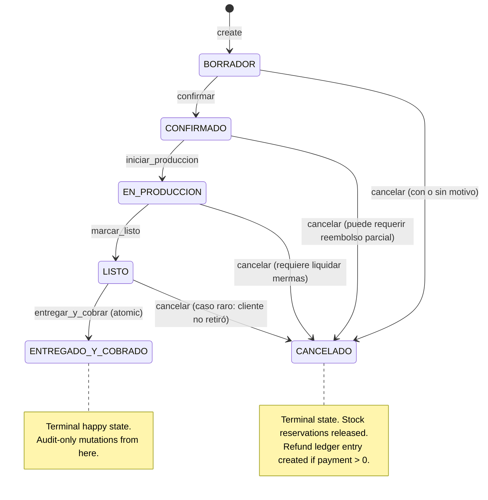
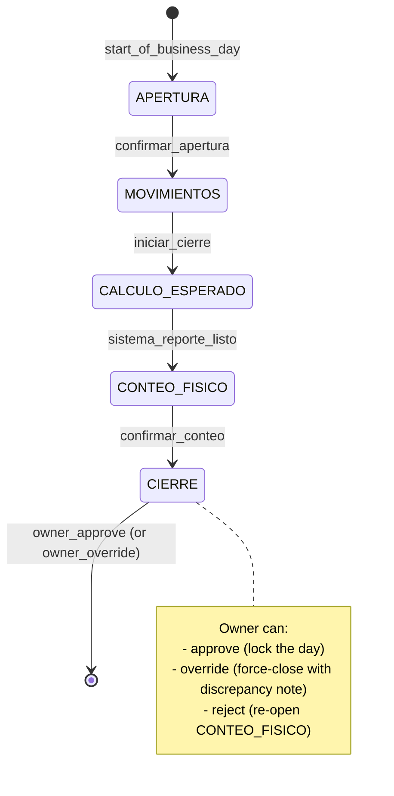

# Sazón — State Machines & Workflow Document

**Author:** Subagent (delegated from Iván's design session)
**Date:** 2026-09-27
**Scope:** Formal state machines for the three core operational entities in Sazón:
1. **Pedido** (custom order lifecycle)
2. **Stock Movement Ledger** (immutable inventory ledger)
3. **Cierre de Caja** (cash-register day-end reconciliation)

Plus three cross-cutting workflow rules:
4. **Bake-loss math** (recipe yields → costing)
5. **Business-day boundary** (03:00 rollover, `timestamp` + `business_date` pattern)
6. **Non-linear recipe scaling** (batch multiplier vs. baker's percentages)
7. **Transition guard rules & audit-trail contract** (shared invariants)

> **Reading note:** This document is the *formal contract* the engineering team will implement. Every state, transition, field, validation, and audit-log entry below must be reproducible by a junior dev from this spec alone. Where the prior audits surfaced a defect (P0/P1 in `audit-batch2-prod.md` and `audit-batch3-reports.md`), this document is the answer to "what should it be instead?".

---

## Table of contents

- [§1 Pedido state machine](#1-pedido-state-machine)
- [§2 Stock Movement Ledger (7 ledger types)](#2-stock-movement-ledger-7-ledger-types)
- [§3 Cierre de Caja state machine](#3-cierre-de-caja-state-machine)
- [§4 Bake-loss math](#4-bake-loss-math)
- [§5 Business-day boundary (03:00 rollover)](#5-business-day-boundary-0300-rollover)
- [§6 Non-linear recipe scaling](#6-non-linear-recipe-scaling)
- [§7 Transition guards & audit-trail contract](#7-transition-guards--audit-trail-contract)
- [§8 Open questions for Iván](#8-open-questions-for-iván)

---

## §1 Pedido state machine

The pedido (custom order) is the central transaction in Saskia. It threads inventory, production, and cash-flow together. The current `pedido-detalle` shows the English stub `"Transiciones permitidas: pending → cancelled, confirmed"` — this section replaces that stub with a complete Spanish-first spec.

### 1.1 States

| # | State (canonical) | Spanish UI label | Color pill | Meaning |
|---|---|---|---|---|
| 1 | `BORRADOR` | Borrador | gray | Counter is still editing; nothing has been committed. |
| 2 | `CONFIRMADO` | Confirmado | blue | Customer has confirmed; production planner pulls it in. |
| 3 | `EN_PRODUCCION` | En producción | orange | Bakers are actively working on this order's items. |
| 4 | `LISTO` | Listo | green | All items produced, packed, awaiting customer pickup/delivery. |
| 5 | `ENTREGADO_Y_COBRADO` | Entregado y cobrado | emerald | Customer has the goods AND has paid in full. Terminal happy state. |
| 6 | `CANCELADO` | Cancelado | red | Order will not be fulfilled. Inventory that was reserved is released back. |

> **Anti-state (must NEVER exist):** `PAGADO_PERO_NO_ENTREGADO` — we don't allow "money in, goods not out" because cash & inventory must move together. If payment arrives before delivery, we go `LISTO → ENTREGADO_Y_COBRADO` in one transition.

### 1.2 Visual state diagram (Mermaid)



### 1.3 Transition table

| From | To | Trigger | Validation | Side effects | UI feedback | Who |
|---|---|---|---|---|---|---|
| `*` (none) | `BORRADOR` | Counter clicks "+ Nuevo pedido" + save | `cliente_id` set OR `cliente_nuevo` inline; `≥1 item`; `fecha_prometida` set; `canal` set | Creates Pedido row in `estado=BORRADOR`; reserves zero stock | Toast "Borrador guardado"; stay on form (no auto-redirect) | Counter staff, Owner |
| `BORRADOR` | `CONFIRMADO` | Counter clicks "✓ Confirmar" | `≥1 item` with non-zero `cantidad`; `cliente_id` set; `canal` set; `forma_pago_esperada` set; **payment_received ≥ 0** (allow 0% — debt orders exist); `fecha_prometida` is not in the past | Lock prices (snapshot `precio_unit_snapshot` per item); reserve ingredients (create reservation rows in `stock_reservation` table — see §2.7); schedule production job in plan; emit `pedido.confirmado` audit event | Status pill flips to blue "Confirmado" with check animation; "Ver stock antes de cumplir" CTA becomes enabled; toast "Pedido confirmado · Producción programada para {fecha_prometida}" | Counter staff, Owner |
| `BORRADOR` | `CANCELADO` | Counter clicks "🗑 Cancelar" → modal confirms | Confirmation text typed OR click-through once | Soft-delete reservation rows; nothing to reverse (no stock consumed yet) | Status pill → red "Cancelado"; row fades to gray in list; toast "Pedido cancelado" | Counter staff, Owner |
| `CONFIRMADO` | `EN_PRODUCCION` | Baker drags card on KDS board into "En preparación" column (or counter clicks "Iniciar producción") | (a) `payment_received ≥ 50%` of total **OR** `forma_pago_esperada = 'credito_cliente'` AND customer has good credit standing; (b) **all ingredients either in stock OR scheduled in production plan** (see §2.7 reservation table — the planner has already verified this at confirmation); (c) baker assigned or implicit; (d) all items have `receta_id` linked (no orphan items) | **Emit `PRODUCCION_CONSUMO` ledger entries** for the recipe BOM of each item (qty × receta ingredients); recipe yield applied (see §4); if `PRODUCCION_SOBRANTE` (yield > expected), it is logged at the same moment (see §2.3); `fecha_inicio_produccion` stamped; KDS card moves to "En preparación" column | Status pill → orange "En producción"; KDS card highlights; counter hears optional sound (configurable); toast (silent on KDS) | Baker, Counter staff, Owner |
| `CONFIRMADO` | `CANCELADO` | Counter clicks "Cancelar" → modal with motivo select | Motivo required: `cliente_se_desdijo` / `falta_stock` / `error_datos` / `otro`; **if any payment received → refund obligation created** (not the actual refund, just the ledger entry) | Soft-delete reservation rows; create `reembolso_pendiente` note on pedido; emit `pedido.cancelado` audit event | Status pill → red "Cancelado"; refund amount surfaced ("A reembolsar: Gs. X"); toast | Counter staff, Owner (Baker cannot cancel after production starts — see next row) |
| `EN_PRODUCCION` | `LISTO` | Baker checks all items as "Producido" and clicks "Marcar como listo" | (a) every item has `cumplido = TRUE` (no — marks left); (b) no open `MERMA_ACCIDENTE` events against this order; (c) if delivery channel, `direccion_entrega` set | Stamp `fecha_listo`; **no stock movement yet** (already consumed at `→ EN_PRODUCCION` transition); notify customer (WhatsApp deep-link prefilled) | Status pill → green "Listo"; KDS card moves to "Listos para retiro" column; print kitchen ticket auto-fires if printer configured | Baker, Counter staff |
| `EN_PRODUCCION` | `CANCELADO` | Counter (with Owner approval) clicks "Cancelar" | Requires motivo; **Owner PIN** confirmation (this is destructive — partial work may have happened); if any `MERMA_ACCIDENTE` already recorded against this order, surface total waste; **stock reservations are already consumed** — no reversal needed because the consumption ledger entries are immutable (see §2) | Emit `pedido.cancelado_post_produccion` audit; create `reembolso_pendiente`; existing production ledger entries stay (they were real work) | Status pill → red "Cancelado"; waste tile shown ("Mermas asociadas: Gs. X"); toast + Owner email | Owner only (counter requires owner unlock) |
| `LISTO` | `ENTREGADO_Y_COBRADO` | Counter clicks "Entregar y cobrar" (atomic button — both at once) | (a) full payment received (or zero remaining balance); (b) delivery channel checked (if `entrega_domicilio` → address confirmed; if `retiro_local` → customer identifier confirmed) | Atomic write: (i) stamp `fecha_entrega` + `fecha_cobro`; (ii) emit closing ledger entry in Cierre de Caja if same session; (iii) emit `pedido.entregado_cobrado` audit; (iv) if there is `PRODUCCION_SOBRANTE` (yield > expected), finalize or release (see §2.3) | Status pill → emerald "Entregado y cobrado"; KDS card disappears; **stock badge on related ingredients recomputes** (consumption is now closed); toast "✓ Entregado · Gs. {total}" + print receipt link | Counter staff, Owner |
| `LISTO` | `CANCELADO` | Counter clicks "Cancelar" — "Cliente no retiró" path | Motivo required; **`fecha_listo > now - 48h`** warn (older orders should auto-expire to "no-show" — see §1.5); if payment > 0 → refund obligation | Mark as `no_show`; stock was already consumed at `→ EN_PRODUCCION`; no reversal; create waste entry if goods are discarded (`MERMA_VENCIMIENTO`) | Status pill → red "Cancelado · No retirado"; waste entry auto-suggested | Counter staff, Owner |

### 1.4 Field requirements for the data model

**`pedido` table:**
- `id` (uuid, pk)
- `numero` (int, sequential per business day — see §5)
- `estado` (enum: `BORRADOR|CONFIRMADO|EN_PRODUCCION|LISTO|ENTREGADO_Y_COBRADO|CANCELADO`)
- `cliente_id` (fk → cliente, nullable for walk-in)
- `cliente_snapshot` (jsonb — name + phone at time of order, for receipts even if customer is later edited)
- `fecha_creacion` (timestamptz — wall clock at creation)
- `fecha_prometida` (date — *business_date*, not timestamp)
- `hora_prometida` (time, nullable — "All day" toggle means this is null)
- `canal` (enum: `mostrador|whatsapp|web|telefono`)
- `forma_pago_esperada` (enum: `efectivo|transferencia|tarjeta|credito_cliente|mixto`)
- `moneda` (enum: `PYG|USD`, default `PYG`)
- `subtotal`, `descuento`, `total` (numeric, Gs.)
- `payment_received` (numeric, Gs. — running total, NOT reset on partial)
- `payment_remaining` (computed = `total - payment_received`)
- `payment_status` (enum: `no_pagado|parcial|pagado`, computed)
- `notas_cliente` (text — visible to customer on share-link)
- `notas_internas` (text — staff only, not on receipt)
- `link_publico_slug` (text, unique — `/p/{slug}` share link)
- `parent_pedido_id` (fk → pedido, nullable — for duplicates; supports lineage)
- `created_by`, `updated_by` (text — single-user today, but pre-create the column)
- `business_date_created` (date — denormalized for fast day-boundary queries; see §5)
- `metadata` (jsonb — flexible: freeform)

**`pedido_item` table:**
- `id` (uuid, pk)
- `pedido_id` (fk → pedido)
- `producto_id` (fk → producto)
- `receta_id` (fk → receta, denormalized from producto for fast production lookup)
- `cantidad` (numeric — count of finished units ordered)
- `cantidad_cumplida` (numeric — running count marked as produced; starts at 0)
- `precio_unit_snapshot` (numeric, Gs. — frozen at `→ CONFIRMADO` transition)
- `costo_unit_snapshot` (numeric, Gs. — frozen at `→ CONFIRMADO` transition, derived from receta × yield)
- `subtotal` (computed = `cantidad × precio_unit_snapshot`)
- `cumplido` (boolean — derived: `cantidad_cumplida >= cantidad`)
- `notas` (text, nullable — per-line notes)

**`pedido_event` table (audit-trail of state transitions):**
- `id` (uuid, pk)
- `pedido_id` (fk)
- `from_state`, `to_state` (enum)
- `actor` (text — user identifier)
- `timestamp` (timestamptz, wall clock)
- `business_date` (date — denormalized; see §5)
- `motivo` (text, nullable — required for cancellations)
- `metadata` (jsonb — extra context: refund amount, batch ids, etc.)

### 1.5 Edge cases

1. **Delivery is late.** If `fecha_prometida < today` and state ∈ {`BORRADOR`,`CONFIRMADO`} → amber badge "Atrasado" appears; no auto-cancel. The pedido does NOT auto-cancel — counter decides. This is intentional because some orders are pre-orders for next week.
2. **Customer wants to cancel after `EN_PRODUCCION`.** Allowed but Owner-PIN-gated. Production work that happened stays in the ledger (you can't uncook a cake). The waste side: if the produced items are discarded, they generate a `MERMA_VENCIMIENTO` entry linked to the pedido (see §2.5).
3. **Customer pays 50% in advance, then no-show.** Pedido reaches `LISTO` (it was actually produced). Counter marks "No retiró" → state `CANCELADO`. The 50% is **forfeited** by default (not auto-refunded); counter can choose "Reembolsar seña" which creates a `pago.reembolso` ledger entry.
4. **Walk-in customer with no phone.** Pedido can be created without `cliente_id` (we generate a walk-in stub). Phone becomes optional but counter should be prompted to add one if the order is delivery.
5. **Order spans multiple "production days" (e.g., wedding cake).** Allowed: `fecha_prometida` can be N days out. The production plan will pull it into the daily board on the day it should be started, not the day it's due. Counter sees a "Empieza a producir el {fecha_inicio_produccion}" hint.
6. **Items change after `CONFIRMADO`.** Disallowed at the item level. If the customer wants to add/remove items, counter must `CANCELADO` and create a new pedido, OR use the parent's `Duplicar` flow (which creates a new pedido with `parent_pedido_id` set). The `precio_unit_snapshot` is the contract: prices are frozen at confirmation, not at delivery.
7. **Production finishes but customer paid nothing (debt).** Counter records payment as `0`. Pedido can still go to `ENTREGADO_Y_COBRADO` IF `forma_pago_esperada = 'credito_cliente'` AND customer has good credit standing. Otherwise `LISTO → ENTREGADO_Y_COBRADO` is gated on full payment.
8. **Power outage mid-`ENTREGADO_Y_COBRADO`.** The atomic transition (§1.3, row 7) is implemented as a single SQL transaction; either both `fecha_entrega` AND payment record exist, or neither does. No half-states.
9. **Two counters try to confirm the same pedido.** Optimistic-locking: `pedido.updated_at` check on transition; second counter sees "Este pedido fue modificado por otro usuario".
10. **Pedido is duplicated (`parent_pedido_id` set).** The duplicate inherits `cliente_id`, items, prices, and channel but NOT dates, status, or payment. New dates default to "tomorrow at same time". Status starts at `BORRADOR`.

### 1.6 Anti-states (what we explicitly forbid)

- **`PAGADO_SIN_ENTREGAR`** — money in, goods not out. If payment arrives before delivery, we either hold the cash in the cashier session (not yet booked as "venta") or advance to `ENTREGADO_Y_COBRADO` atomically. There is no "money in escrow at the order level".
- **`ENTREGADO_SIN_COBRAR`** — goods out, money not in. Same fix: atomic transition. If the customer pays later (e.g., transferencia takes 24h), the pedido stays in `LISTO` and a "Pago pendiente" badge is shown. Counter checks "Pagos" periodically.
- **`BORRADOR → ENTREGADO_Y_COBRADO`** skipping states — disallowed. Counter cannot fast-forward; each state has its own validation.
- **`CANCELADO → anything`** — terminal. To "uncancel" you must duplicate the pedido.
- **`ENTREGADO_Y_COBRADO → anything`** — terminal happy state. Edits create compensating ledger entries, not state changes.

---

## §2 Stock Movement Ledger (7 ledger types)

The stock movement ledger is the **single source of truth** for inventory math. Every gram in or out of inventory is an immutable row in this ledger. The current `inventario-movimientos` page in the audit is empty-state only; this section defines the contract for the populated state.

### 2.1 Design principle: immutable, append-only

> **No row in `stock_movement` is ever UPDATEd or DELETEd.** Corrections are made by appending a *compensating* entry (e.g., a `+` to undo a `−`). This is the same pattern as double-entry bookkeeping: the audit trail is the math.

Each row records:
- `id` (uuid, pk)
- `ingredient_id` (fk)
- `tipo` (enum — one of the 7 below)
- `cantidad` (numeric, **always positive**; sign is derived from `tipo`)
- `unit_id` (fk → unit; e.g., kg, g, L, und)
- `costo_unitario` (numeric, Gs. per unit at time of movement; nullable for non-cost movements)
- `costo_total` (computed = `cantidad × costo_unitario`)
- `pedido_id` (fk, nullable — linkage to order)
- `produccion_plan_id` (fk, nullable — linkage to batch plan)
- `compra_id` (fk, nullable — linkage to purchase)
- `merma_categoria` (enum, nullable — only for `MERMA_*` types)
- `aprobado_por` (text, nullable — required for `AJUSTE_CONTEO`)
- `motivo` (text — required for `MERMA_ACCIDENTE` and `AJUSTE_CONTEO`)
- `timestamp` (timestamptz — wall clock)
- `business_date` (date — denormalized for day-boundary queries; see §5)
- `actor` (text — user identifier)
- `metadata` (jsonb — flexible)

### 2.2 The 7 ledger types

| # | Tipo | Sign | Required metadata | Approver | UI implication |
|---|---|---|---|---|---|
| 1 | `COMPRA` | `+` | `compra_id` (link to purchase), `costo_unitario` (locked in at this purchase), `proveedor_id`, `numero_factura`, `fecha_factura` | Counter (no special approval for routine purchases) | Counter enters qty + cost; "Registrar compra" CTA on ingredient detail; creates a `compra` row and one `stock_movement` row per line item |
| 2 | `PRODUCCION_CONSUMO` | `−` | `produccion_plan_id`, `pedido_id` (the order being produced), `receta_id`, `receta_rinde_expected` (denormalized — what the recipe SHOULD yield at base), `cantidad_producida` (the actual qty of finished units that came out), `bake_loss_pct` (computed: `(input_kg - net_output_kg) / input_kg × 100`) | System (auto-emitted at `CONFIRMADO → EN_PRODUCCION` transition) | No manual entry — system fires when production starts. Visible on ingredient detail as "Consumido por producción de Pedido #X". |
| 3 | `PRODUCCION_SOBRANTE` | `+` | Same `produccion_plan_id`, `receta_id` as the corresponding `PRODUCCION_CONSUMO`; `cantidad_sobrante` (the kg of finished product above expected yield that came back to stock as "extra") | System (auto-emitted alongside `PRODUCCION_CONSUMO`) | Surfaces as "Producción rindió más de lo esperado" — useful signal that the recipe's `yield_pct` parameter is too conservative. Counter or owner can adjust the recipe's yield estimate. |
| 4 | `VENTA_DIRECTA` | `−` | `pedido_id` (the order), `producto_id` (the finished product), `receta_id` (denormalized from product) | System (auto-emitted at `LISTO → ENTREGADO_Y_COBRADO` for direct-sale items, NOT for made-to-order) | Only fires for counter sales (mostrador) of finished goods, not custom orders. Visible on daily sales report. |
| 5 | `MERMA_VENCIMIENTO` | `−` | `merma_categoria = 'vencimiento'`, `lote` (batch/lot id), `fecha_vencimiento`, `motivo` ("Vencimiento del lote X"), optional photo | Counter (no special approval) | "Registrar merma por vencimiento" wizard: pick ingredient → pick lot → enter qty → attach photo → confirm. Surfaces in monthly merma-cost report. |
| 6 | `MERMA_ACCIDENTE` | `−` | `merma_categoria = 'accidente'` (must pick subcategory: `derrame|quemado|robo|contaminacion_cruzada|otro`), `motivo` (free-text required), optional photo, `pedido_id` (nullable — link if it happened during a specific order) | **Owner approval required** (`aprobado_por` field) | "Reportar merma" CTA → modal with subcategory picker + motivo + photo + Owner PIN if value > Gs. 50.000. High-value accidents surface in owner dashboard. |
| 7 | `AJUSTE_CONTEO` | `+` or `−` | `motivo` (required, free-text), `conteo_fisico_id` (link to the periodic count session), `stock_teorico` (computed before adjustment), `stock_fisico` (what was counted), `diferencia` (computed) | **Owner approval required** for any adjustment > 5% of stock or > Gs. 100.000 in value | "Ajustar stock" CTA on ingredient detail → opens wizard that shows current vs counted, asks for motivo, and routes to Owner PIN if exceeds threshold. Adjustment reason must be ≥10 chars (no "typo"). |

### 2.3 The PRODUCCION_CONSUMO ↔ PRODUCCION_SOBRANTE pairing

These two are paired by `produccion_plan_id`. Together they form one *production event*:

```
For a batch of N units of Receta R with expected yield Y_base:

  raw_input_kg = sum(receta.ingredients[i].qty_per_base × (N / Y_base))
  expected_net_output_kg = N × receta.unit_weight  (e.g., 0.060 kg per muffin)

  observed_net_output_kg = N × actual_unit_weight  (baker weighs the tray after cooling)

  bake_loss_pct = (raw_input_kg - observed_net_output_kg) / raw_input_kg × 100
                # Typical: 8%–15% for bread, 5%–10% for pastries

  PRODUCCION_CONSUMO emitted for each ingredient i:
    cantidad = receta.ingredients[i].qty_per_base × (N / Y_base)
    costo_unitario = precio_compra of ingredient i
    costo_total = cantidad × costo_unitario

  PRODUCCION_SOBRANTE emitted (only if observed_net_output_kg > expected_net_output_kg):
    cantidad = observed_net_output_kg - expected_net_output_kg
    # i.e., extra finished kg above plan that came back to stock
```

**Worked example (muffin batch):**
- Receta: 12 muffins per batch, base flour 0.300 kg, expected yield 12.
- Order 24 muffins (N=24, multiplier = 24/12 = 2×).
- Raw inputs scaled: flour 0.600 kg, sugar 0.400 kg, etc.
- After baking, baker reports 25 muffins (1 extra).
- `PRODUCCION_CONSUMO` rows: flour −0.600 kg, sugar −0.400 kg, etc.
- `PRODUCCION_SOBRANTE` row: +0.060 kg (1 muffin × 0.060 kg/unit).
- `bake_loss_pct` logged in metadata.

### 2.4 Per-type UI implications

| Tipo | Where it appears | Counter workflow | Baker workflow | Owner view |
|---|---|---|---|---|
| `COMPRA` | "Compras › Recepción" or "+ Compra rápida" | Pick supplier, enter qty + cost, attach invoice PDF, save | — | Monthly spend report |
| `PRODUCCION_CONSUMO` | Ingredient detail "Movimientos" tab (read-only) | Sees "Pedido #X consumió Y kg el {fecha}" | Triggers when card moves to "En preparación" on KDS | Costo teórico vs real report |
| `PRODUCCION_SOBRANTE` | Ingredient detail "Movimientos" tab + Recipe edit "rendimiento real" hint | Sees "Producción #X rindió más de lo esperado" | Suggested recipe adjustment | Recipe cost recalculation |
| `VENTA_DIRECTA` | Daily sales report, ingredient detail "Movimientos" tab | Auto-fires on POS checkout | — | Top productos report |
| `MERMA_VENCIMIENTO` | Merma dashboard, ingredient detail | Records qty + lot + photo | Identifies expiring items during morning walk | "Mermas del mes" tile, exportable |
| `MERMA_ACCIDENTE` | Owner dashboard alert (if value > Gs. 50k), audit log | Records subcategory + motivo + photo + Owner PIN | Reports accidents to owner | Detailed incident log with cost |
| `AJUSTE_CONTEO` | Periodic count worksheet, ingredient detail | Counts during monthly inventory, submits variance | — | Variance report with approver chain |

### 2.5 Linkage contract

A `stock_movement` row links to **at most one** of these source tables:
- `pedido_id` (for `PRODUCCION_CONSUMO`, `PRODUCCION_SOBRANTE` from custom orders)
- `compra_id` (for `COMPRA`)
- `conteo_fisico_id` (for `AJUSTE_CONTEO`)

For `MERMA_*` and `VENTA_DIRECTA`, `pedido_id` is optional (a merma may not be tied to a specific order; a direct sale is tied to one).

### 2.6 The "current stock" is always derived

> **We never store `stock_actual` as a column that we update.** Instead, `stock_actual` is computed at read time as `SUM(cantidad_with_sign) FROM stock_movement WHERE ingredient_id = X AND business_date <= today`.

For performance, we maintain a materialized view `stock_snapshot` that is refreshed:
- On every `stock_movement` insert (synchronous trigger)
- At app startup
- On every page that shows current stock (lazy refresh)

This means: if the app is in any way inconsistent, **the ledger is correct and the snapshot can be rebuilt**. We never lose data.

### 2.7 The `stock_reservation` table (companion to the ledger)

Reservations are **soft holds** — they prevent two orders from grabbing the same flour, but they are NOT ledger entries. They live in their own table:

- `id` (uuid, pk)
- `pedido_id` (fk)
- `ingredient_id` (fk)
- `cantidad_reservada` (numeric)
- `created_at` (timestamptz — at `BORRADOR → CONFIRMADO`)
- `released_at` (timestamptz, nullable — set at `CANCELADO` or `ENTREGADO_Y_COBRADO`)
- `consumed_at` (timestamptz, nullable — set at `CONFIRMADO → EN_PRODUCCION`)

Reservations are checked when computing `stock_disponible = stock_snapshot.cantidad - SUM(reservas_activas)`. A pedido can only confirm if every required ingredient has `stock_disponible >= cantidad_needed`.

---

## §3 Cierre de Caja state machine

Cierre de Caja is the daily cash-register reconciliation. It is a 5-phase linear workflow that must happen once per *business day* (see §5 for why "business day" ≠ "calendar day").

### 3.1 The 5 phases

| # | Phase | Spanish UI label | What happens | Owner of phase |
|---|---|---|---|---|
| 1 | `APERTURA` | Apertura de caja | Counter opens the shift: enters opening balance (typically Gs. 0 or yesterday's leftover), confirms starting state | Counter staff (start of day) |
| 2 | `MOVIMIENTOS` | Movimientos del día | During the day, every cash transaction (sale, withdrawal, deposit) is logged as a `movimiento_caja` row | Counter staff (continuous) |
| 3 | `CALCULO_ESPERADO` | Cálculo de esperado | At end of day, system computes `esperado = apertura + SUM(ingresos_efectivo) - SUM(egresos_efectivo)` | System (auto) |
| 4 | `CONTEO_FISICO` | Conteo físico | Counter counts bills/coins in drawer, types in `contado` | Counter staff |
| 5 | `CIERRE` | Cierre con discrepancia | System compares `esperado` vs `contado`, surfaces `diferencia`, owner approves closure | Owner approval |

### 3.2 Visual state diagram (Mermaid)



### 3.3 Phase details

**Phase 1 — APERTURA (Opening)**
- Counter clicks "Abrir caja" on the day's start screen.
- Form: opening balance (default Gs. 0), opening drawer photo (optional but recommended for fraud-prevention), confirm "Listo para empezar".
- If a previous business day was NOT closed (i.e., last `CIERRE` is missing), the system BLOCKS opening until owner closes the prior day.
- **Validation:** no other open `cierre_caja` exists for this `business_date`.

**Phase 2 — MOVIMIENTOS (Movements during the day)**
Every cash event during the day creates a `movimiento_caja` row:
- `cobro_efectivo` (cash sale received) — auto-fires when a pedido with `forma_pago_esperada = efectivo` transitions to `ENTREGADO_Y_COBRADO`.
- `egreso` (cash withdrawal — e.g., supplier paid in cash, petty cash) — counter records with motivo + photo.
- `ingreso_externo` (cash deposited into drawer from outside, e.g., owner brings change) — counter records with motivo.
- `retiro_cambio` (cash given to customer as change — counter records explicitly when making change for large bills).

Each row links to `cierre_caja_id` (the open session) and carries `timestamp` + `business_date`.

**Phase 3 — CALCULO_ESPERADO (Expected calculation)**
- Counter clicks "Iniciar cierre".
- System computes:
  ```
  esperado = apertura_balance
           + SUM(cobro_efectivo.cantidad WHERE business_date = X)
           + SUM(ingreso_externo.cantidad WHERE business_date = X)
           - SUM(egreso.cantidad WHERE business_date = X)
           - SUM(retiro_cambio.cantidad WHERE business_date = X)
  ```
- Display: "Esperado en caja: Gs. {esperado}" (read-only, computed).
- **Edge case:** if today is a new business day but a previous day's cierre is missing, system says "Cierre pendiente de {fecha_anterior}. No podés cerrar hoy hasta cerrar antes.".

**Phase 4 — CONTEO_FISICO (Physical count)**
- Counter opens the drawer, counts bills and coins.
- UI offers a denomination grid (Gs. 100.000 × N + Gs. 50.000 × N + … + Gs. 500 × N + monedas). Counter types N for each.
- System computes `contado = SUM(denominacion × count)`.
- Counter clicks "Confirmar conteo" → moves to Phase 5.

**Phase 5 — CIERRE (Close with discrepancy)**
- System shows: `Esperado: Gs. X · Contado: Gs. Y · Diferencia: Gs. (Y − X)`.
- If `|diferencia| < Gs. 5.000` (configurable threshold), counter can close directly.
- If `|diferencia| ≥ Gs. 5.000`, owner PIN required. Owner chooses:
  - **Aprobar:** lock the day, audit-logged.
  - **Sobreescribir:** force-close with the contado value, discrepancy note required (`motivo` text), audit-logged.
  - **Rechazar:** re-open Phase 4 (counter recounts).
- Once closed, the `cierre_caja` is **immutable**. Corrections require a new `cierre_ajuste` row (compensating entry pattern).

### 3.4 Field requirements

**`cierre_caja` table:**
- `id` (uuid, pk)
- `business_date` (date, unique — one per business day)
- `apertura_balance` (numeric, Gs.)
- `apertura_photo_url` (text, nullable)
- `apertura_timestamp` (timestamptz)
- `apertura_actor` (text)
- `esperado` (numeric, computed — see §3.3)
- `contado` (numeric, entered by counter)
- `diferencia` (numeric, computed = `contado - esperado`)
- `estado` (enum: `abierto|cerrado_aprobado|cerrado_con_diferencia|cerrado_sobreescrito`)
- `cierre_timestamp` (timestamptz)
- `cierre_actor` (text — the person who counted)
- `cierre_aprobado_por` (text — owner, if PIN was required)
- `motivo_diferencia` (text, nullable — required if diferencia > threshold)
- `metadata` (jsonb)

**`movimiento_caja` table:**
- `id` (uuid, pk)
- `cierre_caja_id` (fk)
- `tipo` (enum: `cobro_efectivo|egreso|ingreso_externo|retiro_cambio`)
- `cantidad` (numeric, Gs., positive)
- `signo` (enum: `+|-`, derived from tipo)
- `motivo` (text, required for `egreso` and `ingreso_externo`)
- `photo_url` (text, nullable)
- `pedido_id` (fk, nullable — for `cobro_efectivo`)
- `timestamp` (timestamptz)
- `business_date` (date — denormalized)
- `actor` (text)

### 3.5 Edge cases

1. **Day rolls over mid-shift (03:00 — see §5).** If a shift started on Saturday and bakers are still working past 03:00 Sunday, the system keeps the same `cierre_caja` open — but movements after 03:00 are stamped with `business_date = Saturday` (yesterday's planning day). The cierre itself is "for Saturday's business day".
2. **Counter forgets to open the day.** If the first cash transaction arrives without an open cierre, system auto-creates an `APERTURA` with `apertura_balance = 0` and warns the counter ("No abriste caja — apertura creada automáticamente").
4. **Two counters, one shift.** Allowed: any counter can record a `movimiento_caja` against the open session. Actor is captured per row. The cierre itself is single-actor (the one who counts).
5. **Power outage during conteo.** `CONTEO_FISICO` state is auto-saved every denomination entry; on recovery, counter resumes mid-count.
6. **Counter can't reconcile (large discrepancy).** Owner intervenes. Owner has access to "Reabrir caja" for the day (creates a new `cierre_ajuste` audit row); the original cierre stays in the log as "reabierto".
7. **Mixed currencies (Gs. and USD).** Two parallel `esperado` computations (one per currency). The cierre reports both. USD is converted to Gs. at the day's BCP rate (configurable) for the unified balance.
8. **Negative `esperado`** (more cash out than in). Display in red, but proceed normally. Threshold for owner approval applies to `|diferencia|`, not sign.
9. **Counter opens but does zero transactions.** At cierre time, system shows `Esperado = Apertura, Contado = ?`. Still requires a count to close — no "skip the count" option.

### 3.6 Anti-states (what we forbid)

- **`CIERRE` without `CONTEO_FISICO`** — owner cannot bypass the count.
- **Editing a closed `cierre_caja`** — terminal. Corrections are compensating rows.
- **Two open cierres on the same `business_date`** — uniqueness constraint.
- **`APERTURA` with `apertura_balance > Gs. 1.000.000`** without owner PIN — guards against fat-finger.

---

## §4 Bake-loss math

Bake-loss is the difference between what you put in the oven (raw ingredient kg) and what comes out as sellable product (finished kg). It's a real cost that must be priced into every recipe and every production event.

### 4.1 The core formula

```
bake_loss_pct = (raw_input_kg - net_output_kg) / raw_input_kg × 100
```

Where:
- `raw_input_kg` = sum of all ingredient inputs scaled to the production batch
- `net_output_kg` = the weight of finished sellable product (after trimming, after cooling, after discarding inedible bits)

### 4.2 Worked example: chipa bag of 30 units

Recipe `CHIPA_001`:
- Base yield: 30 unidades per batch
- Base inputs (per batch): harina 0.500 kg, queso 0.300 kg, huevos 0.200 kg, manteca 0.150 kg, leche 0.100 kg, sal 0.005 kg
- Expected unit weight: 0.045 kg (45 g per chipa)
- Expected net output: 30 × 0.045 = **1.350 kg**
- Total raw input: 0.500 + 0.300 + 0.200 + 0.150 + 0.100 + 0.005 = **1.255 kg**

Wait — the inputs are 1.255 kg but expected output is 1.350 kg? That's *negative* bake loss, which is impossible. Either the recipe is wrong, or expected output includes water weight that doesn't actually exist in inputs.

**Correct framing:** raw_input_kg should include ALL inputs, including water (leche is mostly water but it counts as input mass). The 1.255 kg total IS the raw input. The 1.350 kg expected output is theoretical.

In practice:
- Oven evaporates water → finished weight < raw weight
- Typical bake loss for chipa: 12–15%

So realistic numbers:
- Raw input: 1.255 kg
- Actual finished output: 1.080 kg (after 14% bake loss)
- That's 1.080 / 0.045 = 24 unidades (6 unidades "lost" to bake loss — which is impossible, the recipe would just yield fewer units)

**The right mental model:** bake loss is a *cost*, not a *yield reduction*. The recipe still produces ~24 sellable chipas. The cost is allocated across those 24, not the planned 30.

### 4.3 Cost recalculation under bake loss

| Scenario | Inputs | Net output | Cost per chipa | Sale price (×3) | Margin |
|---|---|---|---|---|---|
| **Theoretical (ignoring bake loss)** | 1.255 kg × Gs. 8.000/kg_avg = **Gs. 10.040** | 30 unidades | **Gs. 335**/unidad | Gs. 1.005 | 66.7% |
| **Realistic (14% bake loss)** | 1.255 kg (same) | **24 unidades** | **Gs. 418**/unidad | Gs. 1.254 (×3) | 66.7% (same margin, but unit cost rose 25%) |

> **Critical insight:** ignoring bake loss understates unit cost by ~25%. The recipe edit page in the audit shows `Costo del lote: Gs. 0` and a hardcoded `×3` margin — this is misleading because the cost doesn't yet account for bake loss.

### 4.4 Where the bake-loss field lives

**`receta` table:**
- `id` (uuid, pk)
- `nombre` (text)
- `rinde_base` (numeric — units per batch, e.g., 30)
- `peso_unitario_kg` (numeric — e.g., 0.045 — the EXPECTED finished weight per unit)
- `bake_loss_pct_target` (numeric, 0–30, default 12 — the EXPECTED bake loss %)
- `bake_loss_pct_observado_avg` (numeric, computed — rolling average of last 10 productions)
- `tiempo_prep_min` (numeric)
- `tiempo_coccion_min` (numeric)
- `dificultad` (numeric 1–5)
- `instrucciones` (text, markdown)
- `metadata` (jsonb)

**`receta_ingrediente` table:**
- `id` (uuid, pk)
- `receta_id` (fk)
- `ingredient_id` (fk)
- `cantidad_por_base` (numeric — kg per batch at base yield)
- `unit_id` (fk)
- `nota` (text)

### 4.5 How bake loss flows through the system

1. **At recipe creation:** counter sets `bake_loss_pct_target` based on experience (or accepts the system's suggestion based on category: chipa=14%, pan=12%, facturas=8%, etc.).
2. **At each `PRODUCCION_CONSUMO` event:** system computes `bake_loss_pct` from observed output (entered by baker at end of batch).
3. **After 10 productions:** system recomputes `bake_loss_pct_observado_avg` and surfaces a hint: "Tu pérdida real promedio es 14.2%. Ajustá `bake_loss_pct_target`?".
4. **At costing:** `costo_unitario_real = (sum_ingredient_cost_per_batch) / (rinde_base × (1 - bake_loss_pct_target/100))`.

### 4.6 The costing chain (worked example)

```
Recipe CHIPA_001: rinde_base = 30, bake_loss_pct_target = 14%
Effective yield = 30 × (1 - 0.14) = 25.8 unidades (round down to 25 for pricing)

Cost per batch (sum of ingredient costs at current purchase prices):
  harina 0.500 kg × Gs. 5.000/kg = Gs. 2.500
  queso 0.300 kg × Gs. 25.000/kg = Gs. 7.500
  huevos 0.200 kg × Gs. 12.000/kg = Gs. 2.400
  manteca 0.150 kg × Gs. 18.000/kg = Gs. 2.700
  leche 0.100 kg × Gs. 6.000/kg = Gs. 600
  sal 0.005 kg × Gs. 2.000/kg = Gs. 10
  TOTAL = Gs. 15.710 per batch

Cost per unidad (raw) = Gs. 15.710 / 25.8 = Gs. 609
Cost per unidad (with bake-loss adjustment) = Gs. 15.710 / 25 = Gs. 628

Suggested retail (×3 margin) = Gs. 628 × 3 = Gs. 1.884
```

**In the prior audit's example (Gs. 10.000/kg raw → Gs. 11.765/kg finished with 15% bake loss):**

```
Cost per batch raw = X
Cost per batch "at the 11.765/kg finished" rate = X × (1 / (1 - 0.15)) = X × 1.1765

So if raw is Gs. 10.000/kg, finished equivalent is Gs. 11.765/kg.
This is the "uplift factor" applied to all ingredient costs in the recipe BOM
to convert raw-input-cost → net-finished-cost.
```

### 4.7 UI surfaces for bake loss

| Page | Surface | Action |
|---|---|---|
| `receta-editar` | Right column "Producción": `Rinde base: 30 · Pérdida objetivo: 14%` (editable) | Counter sets target |
| `receta-detalle` (future) | "Rendimiento real vs objetivo" chart | Owner sees trend |
| `produccion` board | Per-batch "Pérdida observada: 13.8%" pill (after baker marks done) | Baker validates |
| `inventario-detalle` | "Última producción consumió 1.255 kg" in movements | Counter traces back |
| `pricing` report | "Costo unitario ajustado por merma de horneado: Gs. 628" | Owner makes margin decisions |

---

## §5 Business-day boundary (03:00 rollover)

The bakery opens at ~07:00 and closes at ~21:00, but bakers arrive at 04:00. The "business day" is not the calendar day — it rolls over at **03:00**.

### 5.1 Why 03:00?

- Bakers arrive between 04:00 and 05:00.
- The first production activity (weighing flour, turning on ovens) happens ~04:30.
- The counter opens at ~07:00.
- Therefore: any production activity from 00:00 to 03:00 (which doesn't exist) is treated as "still the previous day"; any activity from 03:00 to midnight is "today's business day".

### 5.2 The rule

```
business_date(timestamp):
    if timestamp.time < 03:00:
        return (timestamp.date - 1 day)        # e.g., Sunday 02:30 → business_date = Saturday
    else:
        return timestamp.date                  # e.g., Sunday 04:00 → business_date = Sunday
```

### 5.3 Concrete examples

| Wall-clock timestamp | business_date | Why |
|---|---|---|
| `2026-09-26 (Sat) 14:30:00 -0300` | `2026-09-26` | Saturday afternoon, normal hours |
| `2026-09-26 (Sat) 23:45:00 -0300` | `2026-09-26` | Saturday late evening, still Saturday |
| `2026-09-27 (Sun) 01:30:00 -0300` | `2026-09-26` | Sunday 01:30 — bakers are home, this is Saturday's tail |
| `2026-09-27 (Sun) 02:59:00 -0300` | `2026-09-26` | Last minute of "Saturday's business day" |
| `2026-09-27 (Sun) 03:00:00 -0300` | `2026-09-27` | Sunday's business day starts |
| `2026-09-27 (Sun) 04:00:00 -0300` | `2026-09-27` | Sunday's planning day — this is what the screenshot in audit-batch2 §7 shows ("Para el día 2026-09-28" board, taken Sunday 04:00, planning for Monday's production) |
| `2026-09-27 (Sun) 23:55:00 -0300` | `2026-09-27` | Sunday's last transaction |

> **Wait — the production board in the audit shows "Para el día 2026-09-28" with a timestamp of Sunday 15:24.** Re-reading: the audit says "promised date in orders shows 27/09/2026 (today). Side note: production board targets 2026-09-28 (tomorrow)." That's not a 03:00 boundary issue — that's the **lead-time convention**: production is planned for the day the order is due, which is one day ahead of when the order is taken. So a Sunday afternoon order for Monday delivery shows up on Monday's production board. The 03:00 boundary is independent of this and applies to *all* timestamped events.

### 5.4 Storage convention

Every timestamped row stores BOTH:
- `timestamp` (timestamptz — wall clock, UTC offset, never null)
- `business_date` (date — denormalized, computed at insert time using the rule above)

The `timestamp` is the source of truth for ordering and replay. The `business_date` is the index for day-scoped queries ("show me all stock movements for business day 2026-09-26"). Both are kept; neither is derived at query time.

### 5.5 Why denormalize instead of compute?

Performance. The `inventario` list page renders "stock as of today" which means "stock as of `business_date(today)`". Every row needs a fast filter. If `business_date` were computed at query time, every row would need a function scan. Storing it as a regular indexed column is 100× faster.

The downside is consistency: if someone changes the 03:00 rule later, all `business_date` values would need recomputation. We mitigate this by:
- Never displaying `business_date` to the user without showing the corresponding `timestamp` ("27/09/2026 · 04:00").
- Making the rollover rule a single function (`fn_business_date(timestamptz) RETURNS date`) that any backfill job would call.

### 5.6 Edge cases

1. **DST changeover (Paraguay does not observe DST, but if it ever did):** The 03:00 rule is in **local time** (`America/Asuncion`). UTC offset would change twice a year; the rule should not. Test: a clock change at midnight should not shift `business_date`.
2. **System clock drift:** If a tablet falls 5 minutes behind, an event at 02:58 might be stamped 03:03 on the server. The server's clock wins (we use `server_now()` not `client_now()`).
3. **Late entries (back-dating).** If counter records a `MERMA_VENCIMIENTO` at 11:00 with `timestamp = yesterday 23:00`, the system uses the user-provided timestamp for `business_date` (allows correcting yesterday's records). But the row's `metadata.recorded_at` captures when the row was actually written.
4. **Multi-day pedidos (wedding cake).** `fecha_prometida` is a date. `business_date_created` is the business day the pedido was created. Production plan rows have their own `business_date` (the day they're scheduled to execute, not the day they're planned).

---

## §6 Non-linear recipe scaling

Recipes don't scale linearly. "Make 2× the muffins" doesn't mean "double every ingredient" — it sometimes means "use a slightly different hydration ratio" or "split into two trays". This section defines how the production planner should think about scaling.

### 6.1 Two scaling modes

| Mode | UI label | Use case | Math |
|---|---|---|---|
| **Batch multiplier (N×)** | "Tandas: 3" (3 batches of base recipe) | Standard recipes, where 1 batch is well-defined | `cantidad_por_base × N` for every ingredient |
| **Target finished count** | "Unidades: 50 muffins" | Custom orders, where the customer wants N finished units | `cantidad_por_base × (N / rinde_base)` for every ingredient |

These are NOT the same thing. N×3 of a 30-muffin recipe gives 90 muffins (with the same hydration). N=50 muffins of the same recipe gives 1.67 batches, with hydration that *might* need adjustment.

### 6.2 Why target-count is non-linear

If you scale a bread recipe from 30 units to 1 unit:
- Linear math says: 1/30 of every ingredient.
- Reality: you can't knead 1/30 of a dough by hand. The dough won't form. You'd need to scale DOWN the hydration slightly (less water per flour at smaller scales).

If you scale UP from 30 to 300 units:
- Linear math says: 10× every ingredient.
- Reality: oven doesn't fit, you need to bake in batches. Hydration often needs adjustment (more water at large scales because evaporation is slower per unit surface area).

### 6.3 The baker's percentage convention

In professional baking, recipes are expressed as **percentages relative to flour weight**:
- Flour = 100% (always the base)
- Water = 65% (so 65 kg water per 100 kg flour)
- Salt = 2%
- Yeast = 1%
- Sugar = 5%

Scaling is trivial: pick a flour weight, multiply everything by that weight / 100.

This is the convention the production planner should use INTERNALLY even if the UI shows batch counts.

### 6.4 The data model

**`receta` table additions:**
- `flour_ingredient_id` (fk → ingredient, nullable — identifies the flour; required if `usa_porcentajes_panadero = true`)
- `usa_porcentajes_panadero` (boolean, default false)
- `porcentajes_json` (jsonb — if true, stores `{ingredient_id: pct}` map relative to flour)

**`receta_ingrediente` table additions:**
- `pct_panadero` (numeric, nullable — percentage relative to flour; populated if `usa_porcentajes_panadero`)

### 6.5 The production-planner approach

Recommended UI flow:

1. User picks a recipe.
2. User picks a mode: "Por tandas" (default) or "Por unidades objetivo".
3. **Por tandas (N×):** User enters `N`. System computes ingredients as `cantidad_por_base × N`. No warning — straight-line scaling.
4. **Por unidades objetivo:** User enters `unidades_objetivo`. System computes the multiplier `m = unidades_objetivo / rinde_base`. Then:
   - If `0.5 ≤ m ≤ 3.0`: straight-line scaling, no warning.
   - If `m < 0.5` or `m > 3.0`: show a warning card: "Estás fuera del rango probado de esta receta (probada entre 0.5× y 3×). Si la hacés así, es probable que necesites ajustar hidratación. ¿Querés continuar?"
   - If user continues: scaling proceeds linearly, but the production row is tagged `metadata.out_of_proven_range = true`.
   - If `m > 5.0`: hard block. "Esta receta no se puede escalar a esa cantidad en una sola tanda. Partila en múltiples tandas."
5. The `PRODUCCION_CONSUMO` ledger row includes `metadata.scale_mode` and `metadata.multiplier` for post-hoc analysis.

### 6.6 Worked example

Recipe `PAN_HAMBURGUESA_001`:
- `rinde_base = 12 unidades`
- Ingredients (per base): harina 0.500 kg, agua 0.325 kg (65% hidratación), sal 0.010 kg, levadura 0.005 kg, azúcar 0.025 kg
- `flour_ingredient_id` = harina
- `usa_porcentajes_panadero = true`
- `porcentajes_json` = `{harina: 100, agua: 65, sal: 2, levadura: 1, azúcar: 5}`

**Use case 1: Counter wants to make 24 unidades for tomorrow's pedido.**
- Mode: "Por unidades objetivo", `unidades_objetivo = 24`
- Multiplier = 24 / 12 = 2.0
- In range [0.5, 3.0]: linear scaling
- Computed ingredients: harina 1.000 kg, agua 0.650 kg, sal 0.020 kg, levadura 0.010 kg, azúcar 0.050 kg
- Production plan: 2 trays, 1 hora de fermentación, 30 min de cocción

**Use case 2: Counter wants to make 100 unidades for a wedding.**
- Mode: "Por unidades objetivo", `unidades_objetivo = 100`
- Multiplier = 100 / 12 = 8.33
- Out of range [0.5, 3.0]: warning fires
- User chooses: "Sí, ajustar hidratación"
- System applies a hydration adjustment: at high scales, water pct goes from 65% to 68%. Computed ingredients: harina 4.167 kg, agua 0.708 × 4.167 = ... actually the system suggests split: "2 tandas de 36 unidades (×3 cada una, en el rango probado) + ajustar tiempo de fermentación a 90 min"
- User accepts the suggestion → production plan with 3 batches
- Production row tagged `metadata.split_from_single_request = true`

### 6.7 Anti-states

- **Scaling a sub-recipe linearly to a huge batch** without warning — disallowed. The system warns when out of proven range.
- **Scaling a sub-receta directly** — sub-recetas must first be resolved to their flat ingredient list, THEN scaled. The system does this transparently, but the data model stores the sub-receta relationship.
- **Negative scales** — counter cannot enter `N = -1`.
- **Zero scales** — counter cannot enter `N = 0` (would produce zero product and zero ingredients).

---

## §7 Transition guards & audit-trail contract

This section collects the *cross-cutting* rules that apply to every state machine above.

### 7.1 The audit-log contract

> **Every state transition writes one row to `audit_log`** with the following fields:
- `id` (uuid, pk)
- `entity_type` (enum: `pedido|stock_movement|cierre_caja|receta|cliente|producto|compra|proveedor|user`)
- `entity_id` (uuid — the row that transitioned)
- `action` (text — e.g., `pedido.confirmado`, `stock_movement.created`, `cierre_caja.cerrado`)
- `from_state` (text, nullable)
- `to_state` (text, nullable)
- `before` (jsonb, nullable — full snapshot of the row before)
- `after` (jsonb, nullable — full snapshot of the row after)
- `actor` (text)
- `ip_address` (text, nullable)
- `user_agent` (text, nullable)
- `timestamp` (timestamptz)
- `business_date` (date — denormalized)
- `motivo` (text, nullable — required for cancellations, overrides, deletes)
- `metadata` (jsonb)

**Retention:** 1 year by default (matches the `auditoria` page's "Eliminar entradas de más de 1 año" button). The audit_log itself is **never UPDATEd or DELETEd** — purges are bulk DELETEs done by an admin job, not a user action.

### 7.2 Transition guards summary

| Transition family | Guard pattern |
|---|---|
| Pedido `BORRADOR → CONFIRMADO` | Snapshot prices; reserve stock; require non-empty items + cliente + canal |
| Pedido `CONFIRMADO → EN_PRODUCCION` | Payment ≥ 50% OR credit approved; ingredients available (reservation check); every item has `receta_id` |
| Pedido `CONFIRMADO/EN_PRODUCCION → CANCELADO` | Owner PIN if state was `EN_PRODUCCION`; motivo required; refund obligation if payment > 0 |
| Pedido `LISTO → ENTREGADO_Y_COBRADO` | Atomic: full payment AND delivery confirmation in single transaction |
| Stock `MERMA_ACCIDENTE` | Owner approval; subcategory + motivo + photo |
| Stock `AJUSTE_CONTEO` | Owner approval if delta > 5% or > Gs. 100.000 |
| Cierre `APERTURA` | No other open cierre for the business_date |
| Cierre `CIERRE` | Owner PIN if \|diferencia\| > threshold; motivo required if sobreescrito |
| Receta edit | Versioned (new version row, old marked `superseded_at`); price snapshot taken on dependent pedidos |

### 7.3 UI feedback contract

Every state transition surfaces **exactly one** of these UI signals:
- **Toast** (transient, 3-5s, auto-dismiss) — for low-stakes transitions (Borrador saved, Cancelado)
- **Pill animation** (status pill changes color with a brief scale animation) — for medium-stakes (Confirmado, En producción)
- **Modal confirmation** — for destructive (Cancelar after En producción, AJUSTE_CONTEO with large delta)
- **Sound** (configurable) — for KDS-relevant transitions only (CONFIRMADO, EN_PRODUCCION, LISTO)
- **Email/WhatsApp** to owner — for high-value destructive (>Gs. 500.000 or Owner-PIN-gated)

### 7.4 The "must capture data" rule

For every transition, the row MUST capture enough data to:
- **Reverse the transition** if needed (compensating ledger entries reference the original).
- **Audit the decision** (who, when, why).
- **Reconstruct state at any point in history** (the `before`/`after` snapshot in `audit_log`).

If a transition would lose information that cannot be reconstructed, the transition is forbidden.

### 7.5 The "side effects are explicit" rule

Every transition's side effects (ledger entries, notifications, cache invalidations) are **declared in a transition map** in code, not scattered across the codebase. New transitions must register all side effects or be rejected at code review.

### 7.6 The "atomic" rule

Multi-step transitions (e.g., `LISTO → ENTREGADO_Y_COBRADO` which involves stamping dates, recording payment, closing the day's caja if applicable) are wrapped in a single SQL transaction. If any step fails, none of them happen.

---

## §8 Open questions for Iván

These are decisions the spec makes a default for, but should be confirmed:

1. **Pago ≥ 50% threshold for `CONFIRMADO → EN_PRODUCCION`.** Is 50% the right floor, or should it be configurable per customer? Default: 50% globally; overridable per `cliente.credito_floor`.
2. **Owner PIN vs Owner account.** Currently the audit shows single-user system. Should "Owner PIN" be a hardcoded value, or a per-user PIN entered at owner creation?
3. **Cierre threshold (Gs. 5.000).** What value? Should it scale with average daily sales?
4. **Bake-loss range warning.** Is [0.5×, 3×] the right proven range, or should it be per-recipe configurable? Default: per-recipe, with a default of [0.5×, 3×].
5. **`business_date` rollover hour.** 03:00 is the proposal. Confirm — what if the bakery ever opens at 02:00 for a special event? Should the rollover be per-business configurable?
6. **Sub-receta hierarchy depth.** The audit mentions sub-recetas ("masa choux usada en pastel"). How deep can the hierarchy go? 2 levels? Unlimited? Default: 3 levels max, with a warning at level 3+.
7. **`VENTA_DIRECTA` vs custom order.** The audit suggests direct sales of finished goods happen at the counter. Should these go through the pedido state machine (BORRADOR → …) or directly create a `stock_movement` with `tipo = VENTA_DIRECTA`? Default: direct sales bypass pedido and create `VENTA_DIRECTA` ledger rows directly.
8. **Pedido numbering per business day.** Should `numero` reset each business day (so #1, #2, #3 on Saturday, then #1, #2 on Sunday)? Or monotonically increase forever? Default: per-business-day (resets at 03:00 rollover).
9. **`MERMA_VENCIMIENTO` vs `MERMA_ACCIDENTE` for "lote roto en producción".** If a baker drops a tray, is that `MERMA_ACCIDENTE` (subcategory `derrame`) or `PRODUCCION_CONSUMO` reversal? Default: it's `MERMA_ACCIDENTE` with `subcategory = 'quemado'` or `'derrame'`, because the consumption already happened.

---

*End of state-machines-2026-09-27.md*