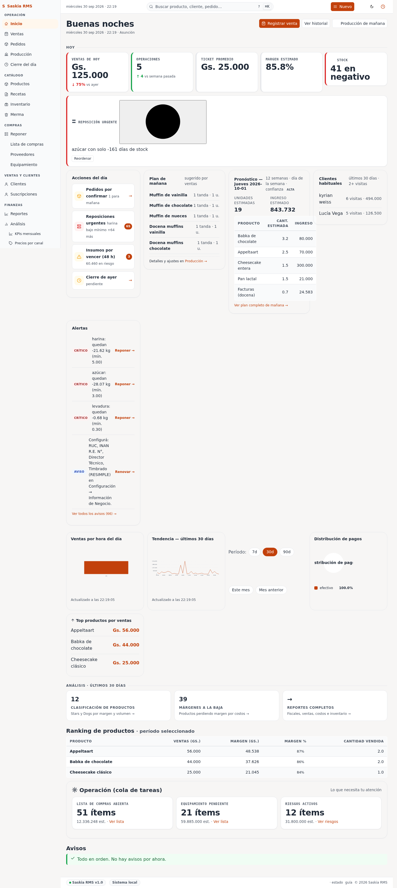

# 01 — Pantalla de inicio (Dashboard)

> **Qué es:** la pantalla principal que ves al entrar a la app. Te da
> un resumen rápido de cómo va el día.

## Cómo llegar

Es la primera pantalla cuando iniciás sesión. También podés volver
haciendo clic en **Inicio** en la barra de arriba.

## Qué muestra

De arriba para abajo:

### 1. Resumen del día / semana / mes

Tres botones: **Hoy**, **Semana**, **Mes**. Tocá el que querés ver.
Cambian los números de abajo:

| Cifra | Qué significa |
|---|---|
| **Ventas** | Cuánto plata entró en ventas (en guaraníes, **post-descuento**) |
| **Costo de lo vendido** | Cuánto te costó hacer lo que vendiste (materias primas) |
| **Margen** | Ventas − Costo = ganancia bruta |

> **Cómo interpretarlo:**
> - Si **Margen** es verde y grande, vas bien.
> - Si **Margen** es muy bajo (menos de 30%), mirá los precios en
>   [Productos](05-productos.md) o los costos de ingredientes en
>   [Inventario](04-inventario.md).
> - Si **Costo de lo vendido** está en rojo, te falta cargar
>   precios de ingredientes — la app no puede calcular el margen
>   real.

### 2. Ranking de productos

Lista de los productos más vendidos. Te muestra cuáles son tus
"estrellas". Si un producto siempre está arriba, considerá subirle un
poco el precio o hacer más cantidad en la producción del día.

### 3. Avisos (sección amarilla)

Esta es **la sección que más tenés que mirar**. Lista todo lo que
necesita tu atención:

| Aviso | Qué significa | Qué hacer |
|---|---|---|
| **"Stock bajo: esencia de vainilla (0 ml, mínimo 50 ml)"** | Te quedás sin un ingrediente | Ir a [Reponer](reorder-route.md) y comprar |
| **"Sin precio"** | Tenés un ingrediente sin precio de compra cargado | Ir a Inventario y ponerle precio |
| **"Merma alta esta semana (8%)"** | Estás tirando mucho producto | Ver [Merma](08-merma.md) y revisar qué se descarta |
| **"Producto sin receta: torta de chocolate"** | Vendés algo que no tiene ingredientes cargados | Ir a Recetas y crear la receta |

**Esta sección es importante: revisala todos los días cuando llegues.**

### 4. Inteligencia (artículos)

Una columna a la derecha con "tips" automáticos basados en los datos:
productos que están bajando en ventas, tendencias, etc. Por ahora es
informativa — leela cuando tengas un momento.

## Cómo usar la pantalla día a día

**Tu rutina sugerida al abrir la app:**

1. Mirá la sección de **Avisos**. ¿Hay stock bajo? ¿Hay merma alta?
   Anotá las acciones pendientes.
2. Mirá **Ventas del día**. ¿Es un día normal o algo cambió?
3. Si tenés algo que preparar para mañana, andá a
   [Producción](09-produccion.md) para ver qué se sugiere hornear.

**No necesitás mirar el resto todos los días.** El resto de las pantallas
es para cuando hacés acciones específicas.

## Si los números están en cero

Si **Ventas = 0** y **Costo = 0**, hay dos posibilidades:

1. **Hoy no hubo ventas** — eso es lo normal al empezar.
2. **Las ventas no se están registrando** — revisá [02-ventas.md](02-ventas.md)
   para ver si algo falló.

## Siguiente paso

→ [02-ventas.md](02-ventas.md) — cómo registrar una venta (lo más usado).
