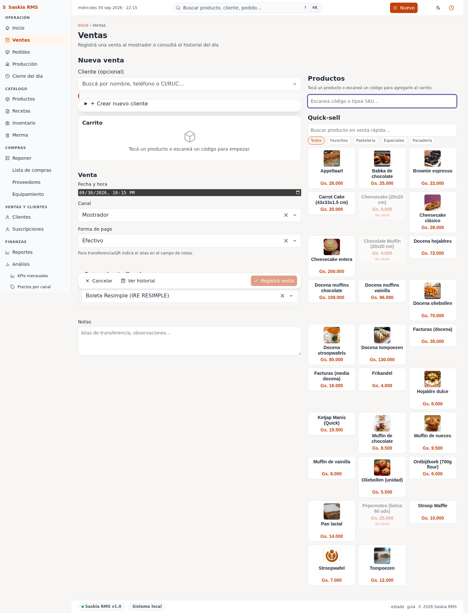

# 02 — Ventas

> **Qué es:** el registro de cada venta del día. **La pantalla que más vas a usar.**

## Cómo llegar

**Ventas** en la barra superior. Verás tres secciones: **Quick-sell**,
**Nueva venta**, e **Historial**.

## Sección 1: Quick-sell (botones grandes arriba)

Son los **5 productos más vendidos en los últimos 14 días**. Cada uno
es un botón grande con el nombre + precio.

**Uso:** tocá el botón cuando vendés uno de esos productos. Se registra
una venta de **1 unidad** automáticamente. Si vendés 2 unidades, tocá el
botón dos veces.

> **Truco:** los botones son grandes para que un cliente pueda cobrar
> en menos de 5 segundos.

## Sección 2: Nueva venta (formulario completo)

Para ventas que **no son los top 5** o que requieren más detalle:

El formulario tiene estos campos:

| Campo | Qué poner |
|---|---|
| **Escanear SKU (opcional)** | Si tenés un lector de código de barras, escanealo acá. Si no, dejalo vacío. |
| **Producto** | Elegí el producto desde el menú. |
| **Cantidad** | Cuántas unidades (por defecto: 1). |
| **Forma de pago** | efectivo / transferencia / tarjeta / otro. |
| **Descuento (%)** | Porcentaje de descuento por línea (0 a 100). La app calcula el descuento en guaraníes por vos. |
| **Cliente (teléfono)** | Si querés registrar quién compró, escribí el teléfono. |
| **Notas** | Algo que quieras anotar ("cliente pidió extra queso"). |
| **Fecha y hora** | Por defecto: ahora. Tocá para cambiarla si necesitás registrar una venta anterior. |

> **Sobre los descuentos:**
> - El campo es un **porcentaje** entre 0 y 100, no guaraníes. La app
>   calcula el monto por vos usando el subtotal de la línea (sin errores
>   de redondeo).
> - Si cargás ventas con descuentos, el **Dashboard** ya muestra los
>   totales **post-descuento** (antes mostraba el bruto y sobreestimaba
>   la ganancia cuando había descuentos).
> - El sistema registra el descuento por línea, no por venta total — si
>   tenés dos productos con descuentos distintos, cada uno se guarda
>   por separado.

Después de completar, hacé clic en **Registrar venta**.

### Opción A: Escaneo de SKU (si tenés lector de código de barras)

Si tu panadería usa lectores de código de barras USB (los que parecen
un control remoto), esto es para vos:

1. Tocá el campo **"Escanear SKU"**.
2. Escaneá el producto. La app busca el producto en la base de datos
   y llena el formulario automáticamente.
3. Revisá que sea el producto correcto, completá la cantidad, y
   confirmá.

**Si el SKU no existe:** la app muestra "SKU no encontrado". Tendrás que
cargar ese producto primero en
[Productos](05-productos.md) → Asignar SKU.

### Opción B: Selección manual

Si no usás lector:

1. Toca el campo **Producto** — se abre una lista.
2. Buscá por nombre o scrolleá.
3. Toca el producto.
4. Completá el resto del formulario.
5. Confirmá.

## Sección 3: Historial (tabla abajo)

Muestra todas las ventas registradas. Podés filtrar:

| Filtro | Para qué sirve |
|---|---|
| **Buscar** | Escribí parte del nombre del producto o teléfono del cliente. |
| **Todos los productos** | Filtrá por un producto específico. |
| **Todo el historial** | Filtrá por últimos 7 / 30 / 90 días. |
| **Limpiar** | Borra todos los filtros. |

## Anular una venta

Si te equivocás (vendiste algo dos veces, o cobraste mal):

1. Buscá la venta en el **Historial**.
2. Tocá **Anular** al final de la fila.
3. Confirmá.

**La venta se marca como anulada** (no se borra) y el stock de los
ingredientes se devuelve automáticamente. Es importante no borrar — el
log de auditoría necesita el registro para que sepamos qué pasó.

> **Anular vs Reembolsar**: anulación borra la venta entera (no hubo
> cobro real o cobraste mal y devolvés toda la plata). Reembolso es
> cuando la venta sí existió pero el cliente devuelve algo (1 medialuna
> de las 3 que compró) y le das una parte de la plata. Para lo segundo,
> usá **Reembolsar** en la página de detalle de la venta — la próxima
> sección.

## Reembolsar (devolución parcial o total)

Si la venta **sí ocurrió** y el cliente te devuelve algo (o cobraste de
más por error), registrá un reembolso en lugar de anular la venta:

1. En el **Historial**, tocá el número `#N` para abrir el detalle de la
   venta (`/ventas/{id}`).
2. En la página de detalle, completá el formulario **Reembolsar** (abajo
   de los totales):
   - **Monto a reembolsar (Gs.)** — cuánto le devolvés. Puede ser hasta
     el total de la venta (cap automático, no te deja pasar).
   - **¿Devolver stock?** — marcala si los ingredientes vuelven al
     inventario (torta intacta). Si la torta ya está comida, dejala
     sin marcar y se registra como merma del cliente.
   - **Motivo** — opcional pero recomendado para auditoría
     (ej. "cliente devolvió torta").
3. Tocá **Registrar reembolso**.
4. La pantalla muestra el reembolso en el historial de la venta, y un
   flash verde arriba confirma la operación**.

> **Puntos de fidelidad**: si el cliente ganó puntos en esa venta, el
> reembolso revierte la misma proporción de puntos. No tenés que hacer
> nada extra — la app lo calcula solo con la fórmula
> `floor(puntos_ganados × reembolso / total)`.

> **Cierre del día**: una vez que hiciste el cierre diario de la fecha
> de la venta original, no podés registrar reembolsos nuevos sobre esa
> venta. La fecha del reembolso debe caer ANTES del cierre.

> **Reporte de auditoría**: el reembolso aparece en
> [Libro de Ventas](../user-guide/10-reportes.md#libro-de-ventas) con
> una columna "Reembolso" y una columna "Neto" (= Total − Reembolso)
> para que el SET vea el descuento. El PDF descargable
> (`/reportes/libro-ventas/set-pdf`) también incluye los totales
> brutos, reembolsos y neto.

## Cómo funciona el stock al vender

Cuando registrás una venta, la app **descuenta automáticamente** los
ingredientes del inventario según la receta del producto. Si vendés
una docena de medialunas, se descuenta la harina, los huevos, la
manteca, etc., en las proporciones correctas.

> **Si la receta no está bien cargada**, las proporciones se calculan
> mal y tu stock queda incorrecto. Es importante mantener las recetas
> actualizadas — ver [06-recetas.md](06-recetas.md).

## Compartir un recibo por WhatsApp (recibo digital)

Si el cliente quiere el recibo en el celular (en vez del ticket
impreso), generá un link compartible:

1. Abrí la venta en **Historial** → tocá el número `#N` para ir al
   detalle (`/ventas/{id}`).
2. Tocá **Compartir recibo** (botón azul, al lado de "Ver recibo imprimible").
3. Aparece un cuadro con la URL — tocá **Copiar** (queda copiada al portapapeles).
4. Pegala en el chat de WhatsApp del cliente.

El cliente abre el link en su navegador y ve el mismo recibo
imprimible que vos, sin login. **El link vence en 30 días** y cada
clic en "Compartir" genera uno nuevo (así podés rotarlo si te
equivocaste). Para anular una venta, andá a **Anular venta** arriba —
el recibo compartido devolverá 410 Gone.

> **PedidosYa maneja su propio recibo** — the operator comparte el tuyo
> cuando el pedido vino por mostrador/WhatsApp. Para pedidos PedidosYa,
> el recibo del cliente se lo manda PedidosYa.

## Errores comunes

| Error | Qué significa | Qué hacer |
|---|---|---|
| **"Producto sin receta"** | Estás vendiendo algo sin ingredientes cargados | Crear la receta primero |
| **"Stock insuficiente"** | No te queda suficiente ingrediente | Anotar para reponer, pero la venta igual se registra (no se bloquea) |
| **"Stock bajo"** | Te queda poco del ingrediente | Ir a Reponer después |

## Tu día a día con esta pantalla

**Cuando entra un cliente:**

1. Si es uno de los 5 productos top → tocá el botón de Quick-sell.
2. Si no → usá el formulario, elegí el producto, completá.
3. Con código de barras → escaneá directo.

**Al final del día:**

1. Mirá el **Historial** para confirmar que todas las ventas están.
2. Si falta alguna, registrala manualmente con la fecha y hora real.

## Siguiente paso

→ [04-inventario.md](04-inventario.md) — cómo gestionar ingredientes y stock.
