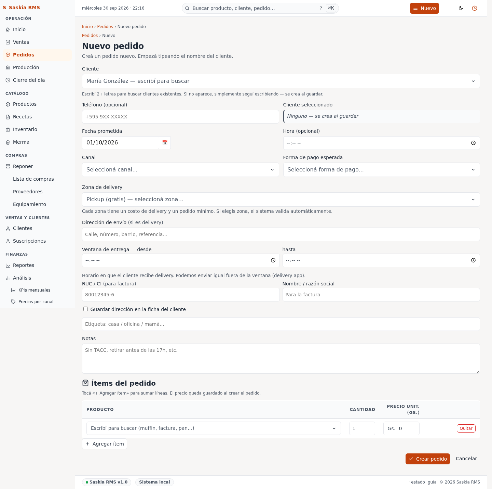
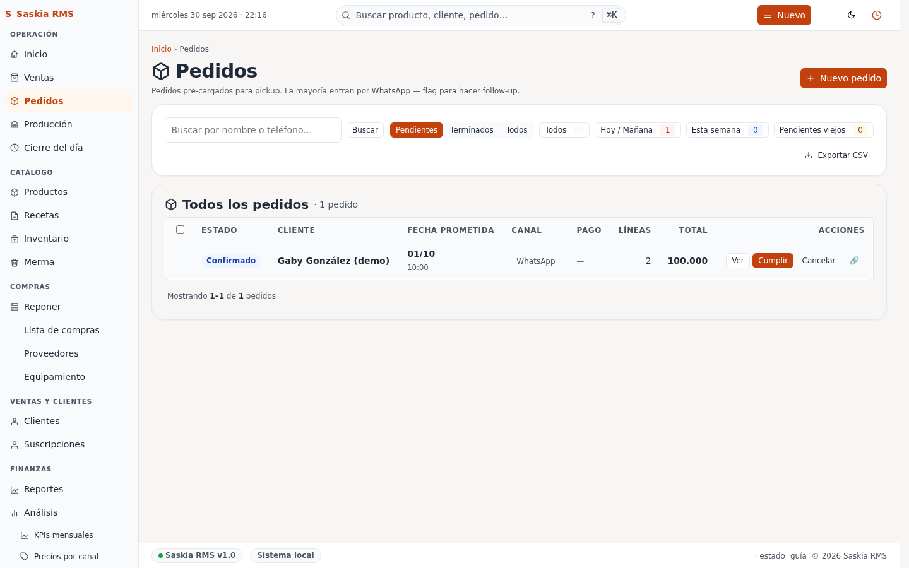

# 03 — Pedidos (anticipados, suscripciones y entregas)

> **Qué es:** el sistema de pedidos para cuando un cliente encarga algo
> **para más tarde** (mañana, pasado, la semana que viene) o se suscribe
> a un pedido recurrente (ej: "1 docena de medialunas todos los lunes").

A diferencia de **Ventas** (que registra algo que se entrega en el
momento), un **pedido** registra un encargo con una **fecha prometida**
(para cuándo lo quiere el cliente) y, opcionalmente, una **ventana de
entrega** (ej: "entre las 14:00 y las 15:00").

## Cómo llegar

**Pedidos** en la barra superior. Verás dos vistas:

- **Nuevo** (`/pedidos/nuevo`) — el formulario para crear un pedido.
- **Board** (`/pedidos/board`) — el kanban con todos los pedidos pendientes
  (KDS, "Kitchen Display").

## Crear un pedido nuevo (paso a paso)

1. Andá a **Pedidos → Nuevo** en la barra superior.
2. **Elegí el cliente.** Empezá a escribir el teléfono o el nombre — la
   app autocompleta desde
   [Clientes](07-clientes.md). Si es cliente nuevo, primero tenés que
   crearlo ahí.
3. **Elegí los productos** del menú desplegable. La cantidad por defecto
   es 1; cambiala si el cliente pide más.
4. **Fecha prometida** — tocá el campo y elegí cuándo lo quiere el
   cliente (por defecto: mañana).
5. **Ventana de entrega** — opcional. Si el cliente sólo puede recibir
   entre las 14:00 y las 15:00, completá acá. Si no, dejá la sugerida.
7. **Notas** — cualquier detalle (ej: "sin azúcar", "torta con letra
   'Feliz cumple Ana'").
8. Hacé clic en **Crear pedido**.

> **Truco:** si el cliente ya tiene pedidos anteriores con la misma
> combinación de productos, el formulario te ofrece **"Pedir de nuevo"**
> desde su ficha — un solo clic copia los productos y la fecha
> recurrente.

## El board (kanban KDS)

El board muestra **todos los pedidos pendientes** en tres columnas:

| Columna | Qué significa |
|---|---|
| **Pendientes** | Aceptados pero todavía no se empezaron a preparar |
| **En preparación** | Alguien los está armando ahora mismo |
| **Listos** | Terminados y listos para entregar al cliente |

Cada tarjeta muestra el nombre del cliente, los productos, la fecha
prometida y la ventana de entrega (si la tiene).

**Para mover un pedido** de columna, arrastralo o tocá el botón
correspondiente en la tarjeta.

## Suscripciones (pedidos recurrentes)

Si un cliente quiere el **mismo pedido cada semana** (ej: "1 docena de
medialunas todos los lunes a las 8:00"):

1. Creá el pedido normal como arriba.
2. Al confirmar, tildá **"Es una suscripción"** y elegí la frecuencia
   (semanal).
3. La app genera automáticamente un pedido nuevo cada semana en la fecha
   indicada. Lo ves en el board como cualquier otro pedido, marcado con
   un ícono de **repetición**.

**Para cancelar una suscripción**, andá a la ficha del cliente →
"Suscripciones" → Cancelar. Los pedidos ya generados no se borran; sólo
se deja de generar nuevos.

## Entregas a domicilio

Si el cliente quiere **recibir el pedido en su casa**:

1. Al crear el pedido, elegí **"Entrega a domicilio"** (no "Retira en
   local").
2. La app te muestra las **direcciones guardadas** del cliente.
   Seleccioná una — o escribí una nueva.
3. La ventana de entrega se vuelve obligatoria (la app sugiere
   "mañana" como mínimo).

> **Aviso:** si el pedido es para entrega y la fecha prometida es **hoy**
> o **mañana**, la app muestra un **aviso amarillo** ("entrega ajustada
> al horario actual"). Es para que veas si vas a tener tiempo de hacer
> la entrega. No bloquea — podés confirmar igual.

## Errores comunes

| Error | Qué significa | Qué hacer |
|---|---|---|
| **"Cliente no encontrado"** | El teléfono/nombre no existe en [Clientes](07-clientes.md) | Crear el cliente primero |
| **"Fecha pasada"** | La fecha prometida es anterior a hoy | Corregir la fecha |
| **"Stock bajo"** | No te alcanza el ingrediente para todos los pedidos de mañana | Ir a [Reponer](14-reponer.md), pero el pedido igual se guarda |
| **"Pedido duplicado"** | Enviás el mismo pedido dos veces por error | La app lo detecta y muestra el original — confirmá que NO querés duplicar |

## Tu día a día con pedidos

**A la mañana** (cuando llegan los pedidos de hoy):

1. Abrí **Pedidos → Board**.
2. Filtrá por "hoy" — sólo ves los pedidos a entregar hoy.
3. Cada tarjeta tiene la lista de productos y la ventana de entrega.
4. A medida que preparás cada uno, mové la tarjeta a "En preparación".
5. Cuando está listo, "Listos" y avisale al cliente.

**Para entregas a domicilio**, mirá la columna "Listos" y usá la
dirección de la tarjeta para ir a dejar.

## Más info

- El **historial completo** de cada pedido (cambios de fecha, productos,
  cancelaciones) está en la ficha del pedido — tocá "Ver timeline". Lo
  registra la app automáticamente.
- Si necesitás **anular un pedido** después de crearlo, abrí la ficha →
  "Anular pedido". Stock y puntos se devuelven automáticamente.
- Las suscripciones se generan **los lunes a las 00:00**. Si querés
  ver las próximas, mirá la ficha del cliente → "Próximos pedidos".

---

**Próximo paso:** [04-inventario.md](04-inventario.md) →