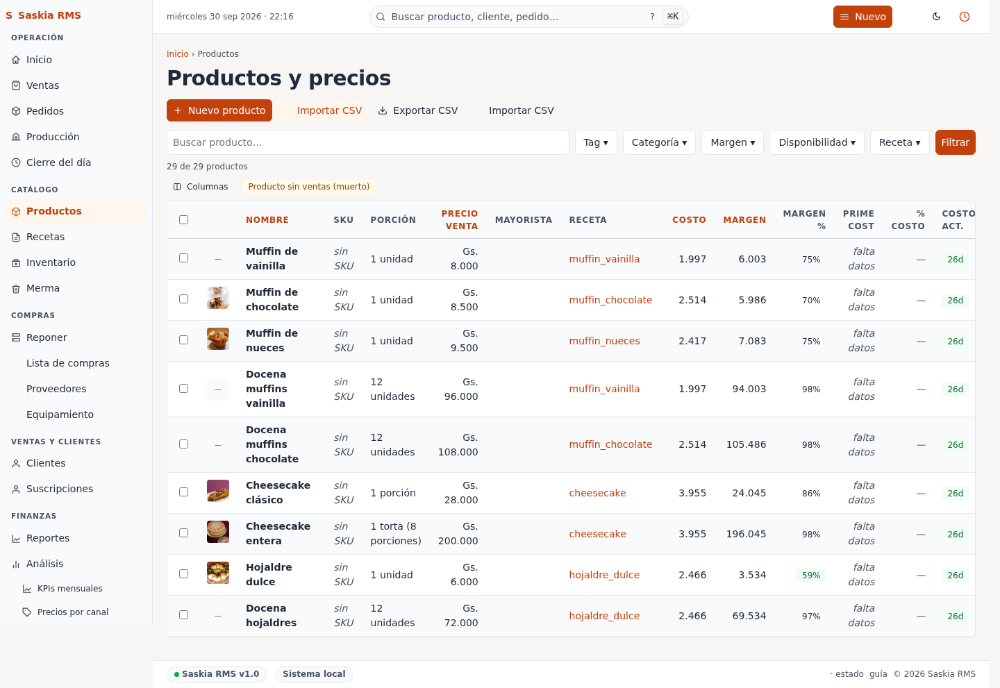
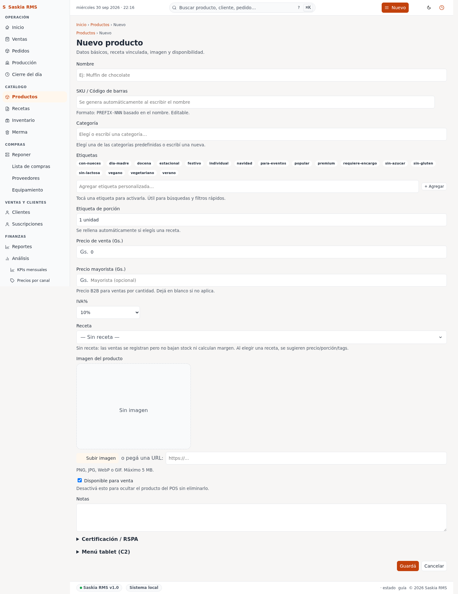

# 04 — Productos y precios

> **Qué es:** la lista de todo lo que vendés (medialunas, tortas, panes)
> con su precio al público y margen.

## Cómo llegar

**Productos** en la barra superior.



## Qué muestra la tabla

| Columna | Qué significa |
|---|---|
| **Nombre** | El producto (ej. "Docena medialunas"). |
| **Porción** | Cuánto se considera "1 unidad" (1 docena, 1 kilo, etc.). |
| **Precio venta** | A cuánto lo vendés (Gs.). |
| **Receta** | Qué ingredientes lleva (si tiene receta cargada). |
| **Costo** | Cuánto te cuesta hacer 1 unidad. |
| **Margen** | Precio − Costo = ganancia por unidad. |
| **Margen %** | Ganancia como porcentaje. |

## Filtrar

Arriba de la tabla hay filtros:

- **Buscar** — escribí parte del nombre.
- **Con receta / Sin receta / Todos** — para ver solo los que tienen
  ingredientes cargados o los que faltan.
- **Limpiar** — borra los filtros.

## Crear un producto nuevo

Tocá **+ Nuevo producto**.



Llená:

| Campo | Ejemplo |
|---|---|
| **Nombre** | "Docena medialunas" |
| **Porción** | "1 docena" |
| **Precio de venta (Gs.)** | 25000 |
| **Receta** | Elegí la receta correspondiente. Si todavía no la creaste, dejalo vacío y completalo después. |

Tocá **Guardar**.

## Editar un producto

Toca **Editar** al final de la fila. Te deja cambiar nombre, precio,
porción, o receta.

**Cuándo cambiar el precio:**
- Cuando cambia la harina o los huevos (cambia tu costo).
- Cuando querés hacer una promo.
- Una vez por mes, revisá y compará con la competencia.

## El secreto: cómo se calcula el costo

El **costo** de cada producto se calcula automáticamente desde la
**receta**. Si tu receta dice "100g harina + 1 huevo" y vos vendés "1
docena medialunas", el costo es:

```
costo = (100g × precio_kg_harina / 1000) + (1 × precio_unidad_huevo)
```

**Si te aparece "—" en la columna Costo**, es porque el producto no
tiene receta cargada, o los ingredientes no tienen precio. Cargá
ambos y el costo va a aparecer.

## Tu rutina sugerida

**Al subir un precio:**

1. Productos → buscá el producto.
2. Toca Editar.
3. Cambiá el precio.
4. Guardar.
5. Andá a Inicio → mirá si el Margen % sigue siendo razonable (40-60%
   es lo típico para panadería).

**Cuando cambia un proveedor:**

1. Inventario → actualizá el precio de compra del ingrediente que
   cambió.
2. Productos → el margen de todos los productos que usan ese
   ingrediente se recalcula automáticamente.

## Siguiente paso

→ [06-recetas.md](06-recetas.md) — cómo hacer una receta.
