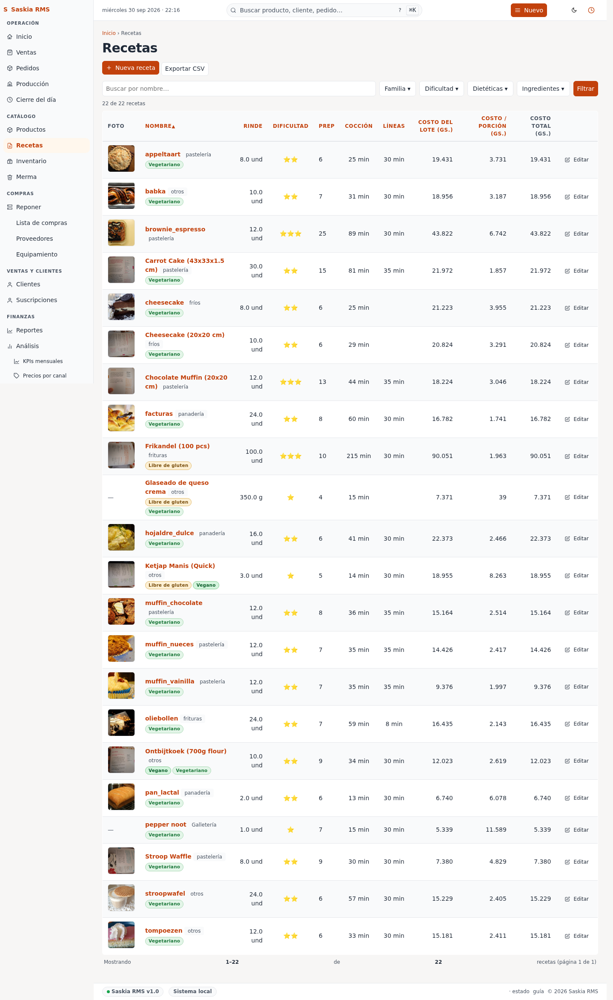
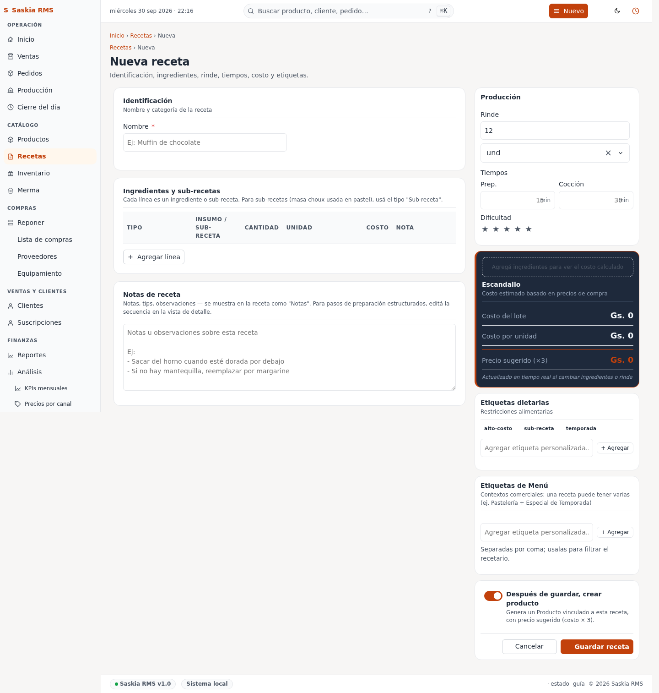

# 05 — Recetas

> **Qué es:** la "fórmula" de cada producto. Qué ingredientes lleva y
> cuánto. Sin receta, no podés saber cuánto cuesta hacer cada cosa.

## Cómo llegar

**Recetas** en la barra superior.



## Qué muestra

Cada fila es una receta. Las columnas son:

| Columna | Qué significa |
|---|---|
| **Nombre** | El nombre de la receta (suele llamarse igual que el producto). |
| **Rinde** | Cuánto sale de la receta (ej. "12 unidades"). |
| **Ingredientes** | Cuántas líneas de ingredientes tiene. |

## Crear una receta

Tocá **+ Nueva receta**.



### Campos principales

| Campo | Ejemplo |
|---|---|
| **Nombre** | "Medialunas" |
| **Rinde** | 12 (cuántas unidades salen) |
| **Unidad de rinde** | und |
| **Tiempo de preparación (min)** | 35 (opcional, lo usa la Producción para sugerir qué hacer primero) |
| **Notas** | "Horneado a 180°C" |

### Agregar ingredientes (líneas)

Después de tocar Guardar, te aparece la receta con un formulario abajo
para agregar ingredientes. Para cada ingrediente:

| Campo | Ejemplo |
|---|---|
| **Tipo** | Ingrediente (o sub-receta, si querés anidar). |
| **Ingrediente** | Elegí "harina 0000" |
| **Cantidad** | 0.5 (kg) |
| **Unidad** | kg |

Tocá **Agregar línea** y repetí. Al final tocá **Guardar cambios**.

**Una receta típica de medialunas:**

```
- 0.5 kg de harina 0000
- 0.05 kg de azúcar
- 0.04 kg de manteca
- 0.005 kg de sal
- 0.3 l de leche
- 1 und de huevo (por docena, multiplicar por 12)
```

## Vincular receta a producto

Una vez que tenés la receta, andá a [Productos](04-productos.md) y en el
producto correspondiente elegí esta receta en el campo "Receta".

A partir de ahí, cada vez que vendas ese producto, la app descuenta
los ingredientes del stock automáticamente.

## Editar una receta

Toca **Editar** al final de la fila. Te deja cambiar todo: nombre,
rinde, ingredientes, cantidades.

## Eliminar una receta

Toca **Editar → Eliminar**. La receta se borra, pero los productos
que la usaban quedan sin receta (te va a avisar "sin receta" en
Productos).

> **Cuidado:** no borres una receta que están usando productos activos.
> Mejor desvinculala del producto primero.

## Recetas anidadas (avanzado)

Si querés hacer una "torta de chocolate" que usa "bizcochuelo" como
sub-producto, podés:

1. Creá la receta de "bizcochuelo" como receta normal.
2. En la receta de "torta de chocolate", agregá una línea con tipo
   **Sub-receta** y elegí "bizcochuelo".
3. La cantidad que pongas es **cuántas unidades de bizcochulo usás**
   (no el peso).

## Tu rutina sugerida

**Al probar una receta nueva:**

1. Creá la receta con los ingredientes que vas a usar.
2. Vendé una unidad del producto (registrala aunque no cobres al cliente).
3. Mirá Inventario — el stock de cada ingrediente tiene que haber bajado
   en la proporción correcta.
4. Si algo no cuadra, editá la receta.

**Cada vez que ajustás una receta (más harina, menos azúcar):**

1. Productos → revisá el Margen % del producto correspondiente.
2. Si el margen cambió mucho, considerá ajustar el precio de venta.

## Siguiente paso

→ [06-clientes.md](06-clientes.md) — cómo registrar clientes.
