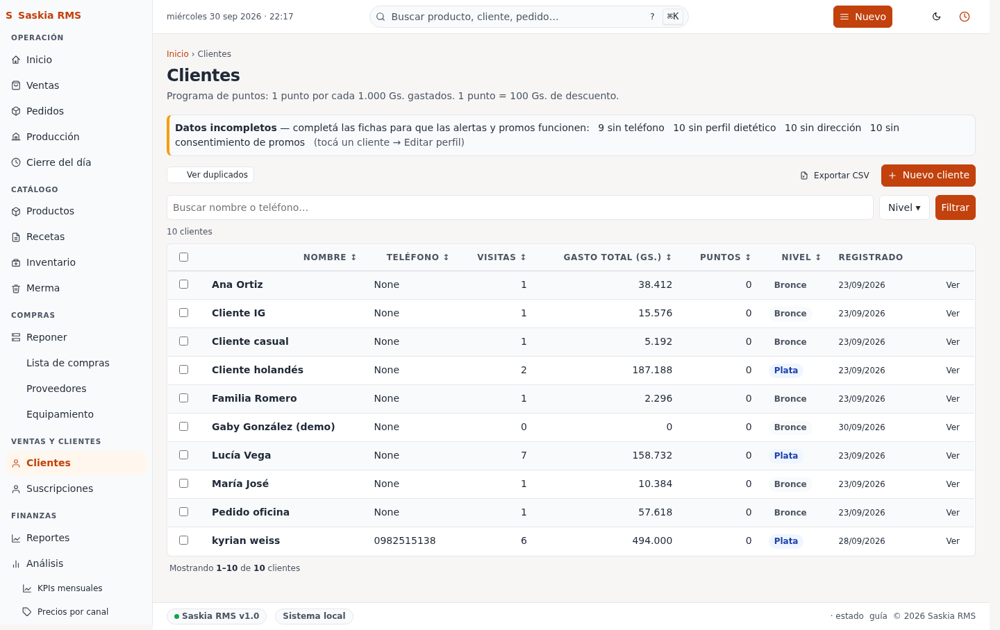

# 06 — Clientes

> **Qué es:** la lista de clientes que compran en tu panadería. La app
> les asigna puntos automáticamente por cada compra, y muestra un
> ranking de los mejores clientes.

## Cómo llegar

**Clientes** en la barra superior.

## Tu rutina diaria con clientes

**No necesitás cargar clientes manualmente.** La app los crea sola:

1. Cuando registrás una venta en
   [Ventas](02-ventas.md), escribís el teléfono del cliente en el campo
   "Cliente (teléfono)".
2. La app crea automáticamente el cliente con ese teléfono.
3. A partir de la segunda compra, empieza a sumar puntos.

> **Tip:** en la panadería, basta con pedir el teléfono al cliente y
> escribirlo en la venta. No necesitás nombre completo.

## Programa de puntos

La regla es: **1 punto por cada 1.000 Gs. gastados**, y **cada punto vale
1.000 Gs. de descuento**.

Ejemplo:

| Compra | Gastado | Puntos ganados |
|---|---|---|
| Docena medialunas (25.000 Gs.) | 25.000 | 25 puntos |
| Torta mediana (60.000 Gs.) | 60.000 | 60 puntos |
| 5 medialunas + 1 café (30.000 Gs.) | 30.000 | 30 puntos |

Después de 100 puntos acumulados (100.000 Gs. gastados), el cliente
puede canjear 100.000 Gs. de descuento en su próxima compra.

**Cómo aplicar el descuento:**

Cuando registrás una venta para ese cliente, escribí el descuento en
guaraníes. La app valida que el cliente tenga suficientes puntos. Si
no los tiene, no te deja aplicar el descuento.

## Niveles (tiers)

Los clientes suben de nivel según lo que gastaron en total:

| Nivel | Acumulado | Color en la app |
|---|---|---|
| **Bronce** | < 100.000 Gs. | Sin badge |
| **Plata** | 100.000 - 500.000 Gs. | Plateado |
| **Oro** | 500.000 - 1.500.000 Gs. | Dorado |
| **Platino** | > 1.500.000 Gs. | Platino |

Los niveles son solo informativos — no dan descuentos automáticos.

## Ver un cliente

Toca el nombre del cliente en la tabla. Te lleva a su perfil, donde
ves:

- Total gastado en la panadería.
- Cuántas compras hizo.
- Fecha de la última compra.
- Lista completa de todas sus compras.
- Sus puntos acumulados.

## Buscar un cliente

Arriba de la tabla hay una barra de búsqueda. Escribí parte del nombre
o el teléfono. También podés filtrar por nivel.

## Tu día a día con clientes

**Al cobrar a un cliente conocido:**

1. Pedíle su teléfono.
2. Buscá el teléfono en la venta.
3. Si quiere gastar puntos, calculá: "tiene X puntos, puede descontar X
   mil Gs." y aplicá el descuento manualmente.

**Al final del día:**

No hay una rutina diaria específica para clientes. La app registra
todo automáticamente cuando cargás ventas con teléfono.

## Siguiente paso

→ [07-merma.md](07-merma.md) — cómo registrar desperdicio.
