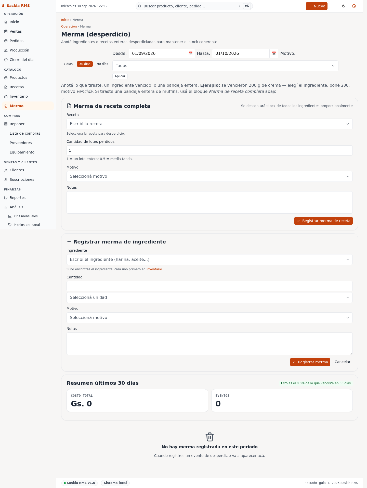

# 07 — Merma (desperdicio)

> **Qué es:** el registro de todo lo que se tira, se vence, o se
> pierde. La app te muestra cuánto te cuesta el desperdicio.

## Por qué importa

El **food cost** de una panadería típica es 30-40%. Si tu merma sube
mucho, el margen real cae sin que te des cuenta. Registrar la merma te
permite ver las tendencias.

**Benchmark saludable:** menos del 5% de merma sobre ventas.
Si estás tirando más que eso, algo está mal.

## Cómo llegar

**Merma** en la barra superior.

La pantalla tiene dos secciones:

### 1. Registrar merma

Para cargar un evento de desperdicio nuevo:

| Campo | Ejemplo |
|---|---|
| **Ingrediente** | "harina 0000" |
| **Cantidad** | 0.5 (en la unidad del ingrediente, ej. kg) |
| **Motivo** | vencida / quemada / rota / caída / sobrante / otra |
| **Notas** | "se venció el 5/sep" (opcional) |

Tocá **Registrar merma**. La app descuenta automáticamente del stock.

### 2. Resumen últimos 30 días

Abajo de la pantalla, ves un resumen:

- **Total**: cuánto te costó la merma en guaraníes.
- **% de ingresos**: qué porcentaje de tus ventas representa.
- **Por motivo**: cuál es la razón principal de la merma.

Si "vencida" es tu razón número uno, puede significar que comprás de
más o que no rotás el stock bien.

## Ejemplos de cuándo registrar merma

- **Una medialuna se cayó al piso** → 1 und de medialunas, motivo "caída".
- **Toda una bolsa de harina se venció** → 5 kg de harina, motivo "vencida".
- **Una torta se quemó en el horno** → 1 und de torta, motivo "quemada".
- **Sobró masa al final del día y la tiraste** → la cantidad, motivo "sobrante".

## Relación con ventas

**No registres ventas anuladas como merma.** Si vendiste algo y el
cliente lo devolvió, anulá la venta (ver
[02-ventas.md](02-ventas.md)). La merma es para cosas que **nunca se
vendieron** (se vencieron, se cayeron, se quemaron en producción).

## Tu rutina con merma

**Al final del día** (1 minuto):

1. Mirá qué sobró o qué se venció.
2. Cargá los eventos en esta pantalla.
3. Listo.

**Una vez por semana** (5 minutos):

1. Mirá la sección "Por motivo" abajo.
2. ¿Hay un motivo que crece? Si "vencida" sube cada semana, comprás
   demasiado de un ingrediente.
3. Si "caída" o "quemada" sube, fijate si hay un patrón (¿siempre es
   el mismo producto? ¿siempre a la misma hora?).

## Errores comunes

- **“No me deja registrar”** — puede ser que el ingrediente no exista.
  Cargá primero el ingrediente en Inventario.
- **“El stock quedó en negativo”** — la app descuenta la merma del
  stock. Si vendiste algo y después registrás merma, el stock puede
  quedar en números raros. Cargá primero la merma, después vendés.

## Merma de tandas enteras

Si perdiste **toda una tanda** (por ejemplo, se cortó la luz o la hornada
entera salió mal), **no registres merma ingrediente por ingrediente**:
usa el botón **🔥 Merma** directamente desde la vista de producción. Esto
descuenta todos los ingredientes del lote de una sola vez.

| Lugar | Botón | Ideal para |
|---|---|---|
| `/produccion` | **🔥 Merma** (botón rojo por cada producto) | Tandas enteras quemadas, cortes de luz, falla de horno |
| `/merma` | **Registrar merma** | Ingredientes sueltos (vencidos, caídos, pequeños sobrantes) |

Para mermas de lote, andá a [Producción](09-produccion.md) y tocá el
botón 🔥 Merma en la fila del producto perdido.

## ¿Cómo saber cuándo usar cada uno?

- **Usa 🔥 Merma de producción** si perdiste más de 5-10 unidades de un producto
  o si un lote entero no salió bien.
- **Usa Registrar merma** si tiraste cosas sueltas (ej. “un ingrediente
  venció”, “se cayó una porción”, “sobró un poco de crema”).

## Auditoría y seguimiento

La app ahora muestra **Origen** en cada evento de merma para saber si fue
registrado manualmente desde `/merma` (`✍️ Manual`) o desde la vista de
producción (`📍 Producción`). Esto ayuda a entender si hubo falla de proceso
(el segundo caso) o desperdicio suelto (el primero).

Además, en la pantalla de [Auditoría](11-auditoria.md), podrás ver los
detalles técnicos de cada registro incluyendo la fuente del registro.

## Siguiente paso

→ [09-produccion.md](09-produccion.md) — el plan diario de producción.
