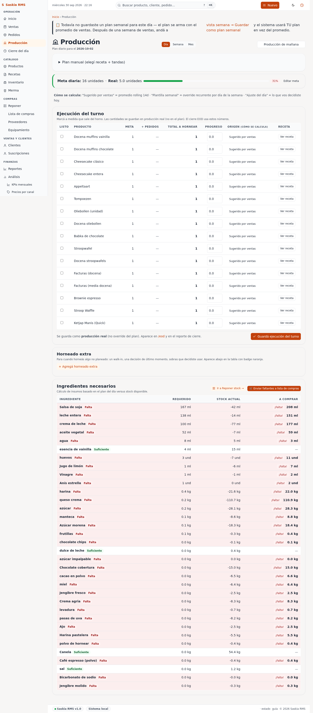

# 08 — Producción (plan diario)

> **Qué es:** la app te sugiere cuánto hornear mañana, basado en
> cuánto vendiste en los últimos días.

## Cómo llegar

**Producción** en la barra superior.



## Qué muestra

Una tabla con los productos sugeridos para producir mañana. Para cada
producto:

| Columna | Qué significa |
|---|---|
| **Producto** | Qué tenés que hacer. |
| **Cantidad** | Cuántas unidades sugiere. |
| **Forecast source** | Por qué sugiere esa cantidad (ej. "rolling 14-day average" = promedio de los últimos 14 días). |

Después de la tabla, una lista de **ingredientes** que necesitás
comprar para hacer todo lo sugerido.

## Cómo se calcula la sugerencia

Por ahora la app usa **promedio de los últimos 14 días**. Si vendiste
un promedio de 8 docenas de medialunas por día en los últimos 14
días, te sugiere hacer 8 docenas mañana.

**Excepciones** que la app considera:

- **Fines de semana** — vende más. La app lo detecta.
- **Feriados** (Día de la Madre, Navidad) — vende mucho más. La app
  sabe las fechas especiales paraguayas.
- **Días de lluvia** — vende menos (pero la app todavía no considera
  el clima, eso es trabajo futuro).

## La tabla de ingredientes

Abajo de la lista de productos, ves qué ingredientes necesitás comprar:

```
- harina 0000: 4.5 kg
- manteca: 0.6 kg
- azúcar: 1.0 kg
- huevos: 12 und
```

Es la suma de lo que consumen todas las recetas de los productos
sugeridos. **Esta lista es lo que tenés que comprar** antes de mañana.

**Si algún ingrediente no aparece** en esta lista, probablemente
significa que el producto no tiene receta cargada. Andá a
[Recetas](05-recetas.md) y completá.

## Botón "Marcar como hecho"

Una vez que produjiste todo, podés tildar "hecho" para que la app lo
recuerde. Mañana no te va a sugerir lo mismo (porque ya está
"producido").

> **Esta función está en desarrollo.** Por ahora es solo informativa.

## Usar esta pantalla

**Todos los días, a la tarde:**

1. Andá a Producción.
2. Mirá los productos sugeridos.
3. Si te parece bien, anotá la lista de ingredientes.
4. Ir a Reponer y comprar lo que falta.

**Si querés cambiar la cantidad sugerida:**

Por ahora no podés (la app toma el promedio y listo). En el futuro va a
haber un slider para ajustar.

## Tu rutina con Producción

**Lunes a viernes, 18:00:**

1. Mirá la lista.
2. Compará con lo que ya tenés en la heladera.
3. Anotá lo que falta.
4. Mañana temprano, comprá lo que falta y arrancá a hornear.

**Los domingos a la noche:**

Producción suele ser más grande porque lunes y martes hay más
venta. La app ya sabe esto.

## Siguiente paso

→ [09-reportes.md](09-reportes.md) — los reportes financieros.
