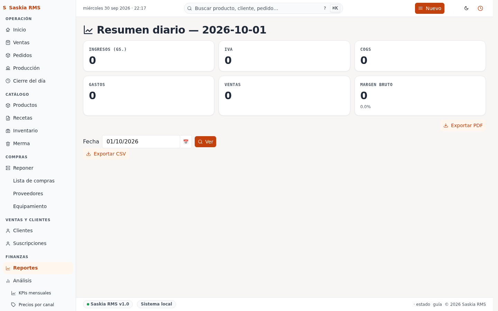

# 09 — Reportes

> **Qué es:** los reportes financieros. Tres vistas: **IVA**, **Libro
> de Ventas**, y **Diario**.

## Cómo llegar

**Reportes** en la barra superior. Te aparece una sub-página con los
tres tipos de reporte.

## Reporte 1: IVA (mensual)

**Qué hace:** te muestra cuánto IVA facturás en un mes, para presentar
a la SET.

**Cómo usarlo:**

1. Elegí el mes en el filtro (ej. "Septiembre 2026").
2. La app te muestra:
   - Total vendido (con IVA incluido).
   - Total gravado (sin IVA).
   - IVA 10% (o 5% si corresponde).
3. Descargá la planilla Excel si necesitás presentarla.

**Importante:** este reporte **asume que ya tenés cargado el precio de
venta con IVA incluido** (es la práctica común en Paraguay para
panaderías). Si cargás los precios sin IVA, los números van a estar
mal.

**Si tenés distintos tipos de IVA** (algunos productos con 10%, otros
con 5%), avisale a Iván — la app actual no diferencia.

## Reporte 2: Libro de Ventas (mensual)

**Qué es:** el detalle factura por factura de todas las ventas del mes.

**Cómo usarlo:**

1. Filtrá por mes.
2. La lista muestra cada venta con:
   - Fecha y hora.
   - Producto vendido.
   - Cantidad.
   - Precio unitario.
   - Total.
   - **Reembolso (Gs.)** — total devuelto en reembolsos de esa venta
     (aparece `—` si no hubo reembolsos).
   - **Neto (Gs.)** — Total − Reembolso (lo que efectivamente cobraste).
   - Si está anulada (tachado).
3. Sirve para:
   - Llevar al contador.
   - Sacar copia de seguridad mensual.
   - Revisar si hay ventas anuladas que deberías explicar.

**Anuladas:** aparecen tachadas en gris. **No se borran** — quedan
registradas para auditoría.

**Reembolsos:** desde octubre 2026 cada fila muestra el reembolso
aplicado a esa venta y el neto. Esto es para cumplimiento del SET
(Paraguay) — la columna reembolso es obligatoria en la registración de
devoluciones.

> **Totales al pie**: la tabla muestra tres totales al final del período:
> Total bruto, Reembolso, Neto. Verificá que coincida con el efectivo
> en caja al cierre del mes.

> **Exportar PDF para la SET**: tocá **Exportar PDF (formato SET)** arriba.
> El PDF sale con tres totales consecutivos: Total ventas (bruto),
> Reembolsos (N operaciones), Total ventas (neto). Es el formato que el
> contador necesita para presentar el libro mensual.

> **Exportar CSV**: cada fila del Libro de Ventas vive en
> `rms-csv-YYYYMMDD-HHMMSS-sale.csv`. Los reembolsos viven en
> `rms-csv-YYYYMMDD-HHMMSS-refund.csv` (tabla nueva, octubre 2026).
> El auditor puede hacer JOIN por `sale.id == refund.target_id`
> donde `refund.target_type = 'sale'` para reconstruir el NET.

## Reporte 3: Diario (un día específico)

**Qué es:** el resumen de un día puntual: ventas, costos, margen,
merma.

**Cómo usarlo:**

1. Elegí la fecha.
2. Te muestra:
   - Ingresos del día.
   - Costo de lo vendido.
   - Margen bruto.
   - Ventas anuladas.
   - Merma del día.

**Útil para** entender por qué un día específico fue mejor o peor que
el promedio.

## Cómo presentar el IVA a la SET

1. Andá a **Reportes → IVA**.
2. Elegí el mes que vas a declarar.
3. **Descargá el Excel** (botón arriba).
4. Abrí el Excel.
5. Verificá que los números coincidan con tus tickets físicos.
6. Si todo cuadra, usá ese Excel como base para tu declaración.

> **No es suficiente con esto.** El reporte de IVA en la app te da los
> números, pero vos seguís siendo responsable de:
> - Cargar las facturas correctamente en el sistema de la SET (Marangatu).
> - Verificar que tu contador lo revise.
> - Mantener los tickets físicos por 5 años.

## Tu rutina con Reportes

**Cada mes, después de cerrar el mes (entre el 1 y el 5 del mes siguiente):**

1. Reportes → IVA → elegí el mes.
2. Descargá Excel.
3. Reportes → Libro de Ventas → verificá que esté completo.
4. Pasale al contador.

**Cuando hay algo raro que querés entender:**

1. Reportes → Diario.
2. Elegí el día.
3. Mirá qué productos se vendieron y a qué precio.

## Siguiente paso

→ [11-auditoria.md](11-auditoria.md) — el log de auditoría.
