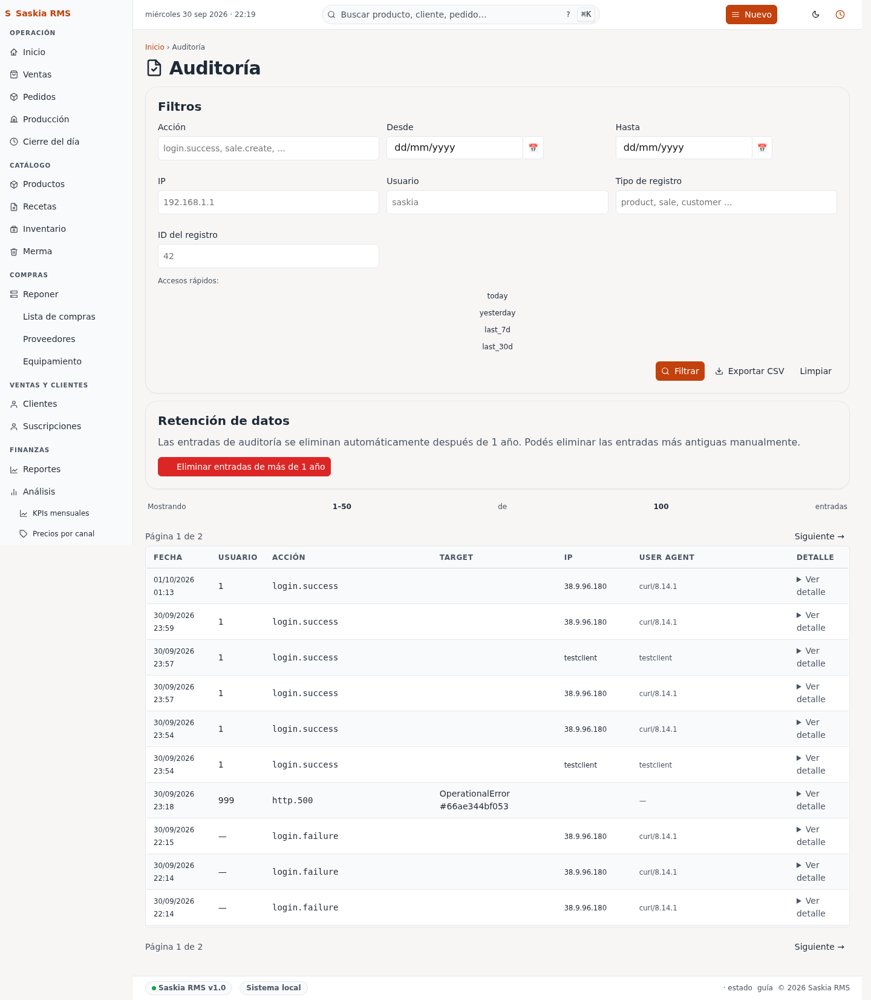

# 10 — Auditoría (log de operaciones)

> **Qué es:** el registro automático de todo lo que pasa en la app.
> Quién hizo qué, cuándo, y desde qué IP.

## Cómo llegar

**Auditoría** en la barra superior.

## Qué se registra

La app registra automáticamente:

| Acción | Ejemplo |
|---|---|
| **login.success** | Cuando vos entrás con éxito. |
| **login.failure** | Cuando alguien intenta entrar y falla. |
| **settings.update** | Cuando cambia un ajuste (moneda, IVA, etc.). |
| **write.sale.create** | Cada venta registrada. |
| **write.sale.void** | Cada venta anulada. |
| **write.merma.create** | Cada evento de merma. |
| **http.500** | Cualquier error técnico. |

**Quién lo hizo:** tu usuario (login). La app extrae tu ID de la sesión.

**Desde dónde:** la dirección IP. Si ves un login desde una IP que no
reconocés, alguien entró con tu cuenta.

**Cuándo:** fecha y hora exacta.

## Filtrar

Podés buscar eventos por:

| Filtro | Para qué sirve |
|---|---|
| **Acción** | Solo los de un tipo (ej. "void" para ver anulaciones). |
| **Desde / Hasta** | Por fecha. |
| **IP** | Buscar actividad sospechosa desde una IP específica. |
| **Usuario** | Ver todo lo que hizo una persona en particular. |
| **Limpiar** | Borra todos los filtros. |

## Tu día a día con auditoría

**No necesitás mirar la auditoría todos los días.** Es para cuando algo
raro pasa:

- "Vendí 10 docenas de medialunas ayer y no me acuerdo cuánto fue."
  → Filtrá por fecha, buscá "sale.create", sumá.
- "Alguien anuló una venta que no debí." → Filtrá por "void" + ayer.
- "Creo que alguien entró con mi contraseña." → Filtrá por tu
  usuario, mirá las IP y los horarios.

## Privacidad

**La auditoría es privada.** Solo vos (y la persona con tu usuario)
pueden verla. Iván (el operador técnico) puede pedir logs específicos
para diagnosticar problemas, pero no los mira rutinariamente.

## Errores 500

Si la app tuvo un error técnico (no culpa tuya), queda registrado como
**http.500**. La página [13-ops.md](13-ops.md) te deja ver el resumen
rápido sin entrar al log completo.

Si ves muchos errores 500 seguidos, **avisá a Iván** — algo no está
funcionando bien.

## Siguiente paso

→ [12-configuracion.md](12-configuracion.md) — cómo cambiar preferencias.
