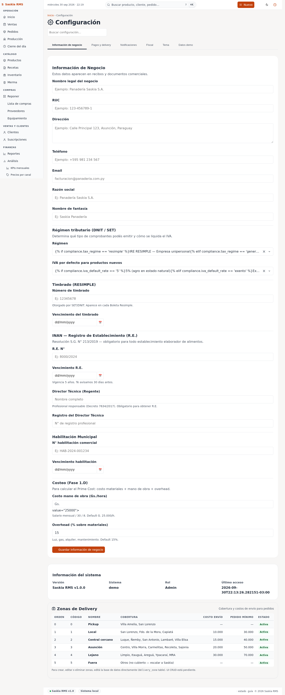

# 11 — Configuración (preferencias)

> **Qué es:** los ajustes generales de la app. Moneda, IVA, formato
> de tickets, etc.

## Cómo llegar

**Configuración** en la barra superior.

Los ajustes están agrupados por categoría: General, Inventario, Ventas,
Dashboard, Backup, Sesión, Demo.

## General

| Ajuste | Para qué sirve | Cuándo tocarlo |
|---|---|---|
| **business_name** | Nombre del negocio (aparece en tickets) | Una vez, al configurar. |
| **currency_symbol** | Gs. o ₲ | Una vez. |
| **decimal_places** | 0 para guaraníes enteros | Una vez. |

## Inventario

| Ajuste | Para qué sirve | Cuándo tocarlo |
|---|---|---|
| **inventory.low_stock_threshold_pct** | Porcentaje del mínimo que dispara aviso | Si querés avisos más sensibles. |
| **inventory.units** | Sistema de unidades (kg, und) | No tocar — está bien para panadería. |

## Ventas

| Ajuste | Para qué sirve | Cuándo tocarlo |
|---|---|---|
| **sales.tax_mode** | Si los precios tienen IVA incluido o no | Al configurar, una vez. |
| **sales.default_tax_pct** | Qué % de IVA aplicar | 10% en Paraguay. |
| **sales.currency_decimals** | Cuántos decimales mostrar | 0. |
| **sales.allow_negative_stock** | Si podés vender sin stock | Solo si querés. |

## Dashboard

| Ajuste | Para qué sirve |
|---|---|
| **dashboard.period_default** | Hoy / Semana / Mes (qué muestra al entrar). |
| **dashboard.top_n_products** | Cuántos productos en el ranking (5 es suficiente). |

## Backup

| Ajuste | Para qué sirve |
|---|---|
| **backup.threshold_hours** | Cada cuántas horas hacer copia de seguridad. |

## Sesión

| Ajuste | Para qué sirve |
|---|---|
| **session.timeout_minutes** | Cuánto tiempo dura la sesión antes de pedir login de nuevo. |

## Demo

(Estas son para que Iván pruebe cosas sin afectar datos reales. **No
toques** a menos que Iván te pida.)

## Cómo cambiar un ajuste

1. Buscá el ajuste que querés cambiar (puede ser con Ctrl+F).
2. En la columna "Valor actual" podés ver qué está puesto.
3. En la columna "Acción", escribí el nuevo valor en el campo y tocá
   **Guardar**.
4. Si querés volver al valor de fábrica, tocá **Reset**.

**Todos los cambios quedan registrados en [Auditoría](11-auditoria.md).**

## Tu día a día con Configuración

**No es una pantalla que uses seguido.** Los ajustes típicos se hacen
una vez al configurar la panadería. Después, no necesitás volver.

**Excepciones:**

- Si querés cambiar el símbolo de la moneda.
- Si querés que el dashboard muestre "Mes" en vez de "Hoy" por
  defecto.

## Riesgos (issues / riesgos operativos)

En la barra superior vas a ver también **Riesgos** (con un ícono de
advertencia). Sirve para anotar cosas que **no son urgentes** pero que
querés que Iván vea la próxima vez que entre al sistema:

- "La balanza está descalibrada — descuadra ~10 g por kilo."
- "El horno 2 hace un ruido raro cuando arranca."
- "Faltan bandejas de aluminio para medialunas."

Cada riesgo tiene **descripción**, **probabilidad** (baja / media / alta)
e **impacto estimado** (en Gs., si es cuantificable). Cuando el tema se
resuelve, lo marcás como **mitigado** desde la misma pantalla — no se
borra, queda en el historial.

**Cuándo usarlo:**

- ✅ Cuando algo funciona mal pero no bloquea el día (no es un 911).
- ✅ Cuando notás un patrón que se repite (cliente se queja seguido de X).
- ❌ **NO** para ventas anuladas o problemas urgentes — esos se resuelven
  en el momento con Iván por WhatsApp.

## Siguiente paso

→ [13-ops.md](13-ops.md) — la pantalla de diagnóstico (poco frecuente).
