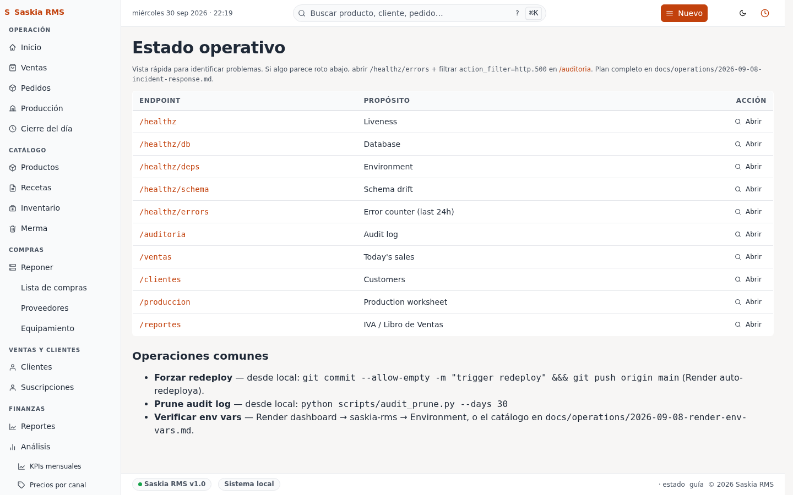

# 12 — Estado operativo (diagnóstico)

> **Qué es:** la pantalla que muestra si la app está funcionando bien
> técnicamente. Sirve para que Iván (el operador técnico) sepa
> rápidamente si hay un problema.

## Cómo llegar

**Ops** en la barra superior.

> **Esta pantalla es raramente útil para vos.** Es más para Iván.
> Si la app está funcionando normal, no necesitás mirar esto.

## Qué muestra

| Indicador | Qué significa |
|---|---|
| **Healthz** (puntito verde arriba a la derecha) | La app responde. Si está rojo, no responde. |
| **Base de datos** | La conexión a Postgres funciona. |
| **Esquema** | Las migraciones están al día. |
| **Errores** | Cuántos errores 500 hubo en la última hora / 24h. |

Si todo está verde, todo está bien. Si algo está rojo, **avisá a Iván**.

## Qué hacer si ves rojo

| Indicador rojo | Qué significa | Qué hacer |
|---|---|---|
| **Healthz** | La app está caída | Esperá 30 segundos y refrescá. Si sigue rojo, avisá a Iván. |
| **Base de datos** | No se puede conectar a Postgres | Avisá a Iván — puede ser problema del proveedor de Neon. |
| **Esquema** | Las migraciones no corrieron | Iván tiene que correrlas. |
| **Errores** | Más de 5 errores en 1 hora | Avisá a Iván — ver [10-auditoria.md](10-auditoria.md) para detalles. |

## Tu día a día con Ops

**No necesitás mirar esta pantalla todos los días.** Es solo cuando
algo falla y querés entender qué.

Si la app parece lenta o no carga, podés mirar acá para ver si hay
un error técnico.

## Siguiente paso

Si querés ver todos los detalles de los errores, andá a
[10-auditoria.md](10-auditoria.md) y filtrá por `http.500`.

Si todo está bien y querés volver al trabajo, andá a
[01-dashboard.md](01-dashboard.md).
