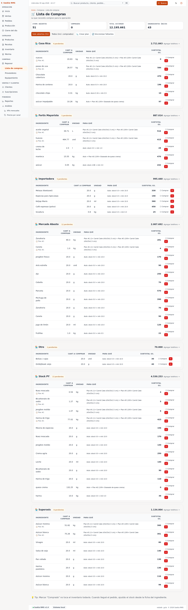

# 17 — Lista de compras

> **Qué es:** una lista concreta de qué comprar y cuánto, generada
> automáticamente por la app según el stock actual y el plan de producción
> de los próximos días. Pensada para que la lleves al super o al proveedor
> y marques lo que conseguiste.

## Cómo llegar

**Compras → Lista de compras** en la barra lateral.

> **Tip:** la lista se genera desde **Reponer** (ver [14-reponer.md](14-reponer.md)).
> Si nunca entraste a "Reponer", la lista arranca vacía. Empezá por ahí.

## Qué muestra

Cada fila es un ingrediente a reponer:

| Columna | Qué significa |
|---|---|
| **Ingrediente** | El nombre (ej. "harina 0000"). |
| **A reponer** | Cuánto falta para llegar al stock objetivo (en kg / litros / unidades). |
| **Proveedor sugerido** | El proveedor más barato registrado para ese ingrediente. |
| **Precio estimado** | Lo que te saldría, según los últimos precios registrados. |

Debajo de la tabla hay un **total estimado en Gs.** para que sepas cuánto
vas a gastar antes de ir.

## Marcar lo que ya compraste

A la derecha de cada fila hay un botón **✓ Comprado**. Cuando lo tocás:

- La fila se tacha y se mueve al final de la lista
- El stock en Inventario se actualiza automáticamente con la cantidad comprada
- Si el precio real fue distinto al estimado, te pregunta cuánto pagaste
  (para mantener los precios actualizados)

> **Tip:** si comprás TODO de la lista de un proveedor, en vez de tildar
> uno por uno, tocá **"Marcar todo del proveedor"** arriba. Es más rápido.

## Si no conseguís algo

Tocá **"No conseguí"** en la fila. La app:

1. Marca el ingrediente como "pendiente" (no actualiza stock)
2. Lo deja en la lista para el próximo día
3. Si es la segunda vez consecutiva que no lo conseguís, te lo marca en
   rojo y sugiere buscar un proveedor alternativo

## Imprimir o compartir

- **Imprimir:** botón **🖨 Imprimir** arriba a la derecha — formato
  optimizado para hoja A4.
- **WhatsApp:** botón **📱 Enviar** — abre WhatsApp Web con un mensaje
  pre-armado para mandarle al proveedor. Podés editarlo antes de enviar.

## Agregar algo que no estaba en la lista

A veces te das cuenta de que falta algo que la app no detectó
(porque no estaba en el plan de producción, o es un ingrediente nuevo).
En ese caso:

1. Tocá **+ Agregar manualmente** abajo de la tabla
2. Buscá el ingrediente (o creá uno nuevo desde Inventario)
3. Poné la cantidad que querés comprar
4. Guardá

La fila aparece mezclada con las generadas automáticamente. Cuando la
marcás como comprada, se descuenta del stock igual que una fila normal.

## Limpiar la lista

Una vez que terminaste la compra y todo está marcado, la lista se "reinicia"
automáticamente la próxima vez que la app genere una nueva (generalmente
cuando cambia el plan de producción o baja el stock).

Si querés forzar el reinicio antes: **Limpiar lista** arriba a la derecha
(te pide confirmación).

## Siguiente paso

→ [14-reponer.md](14-reponer.md) — cómo se genera esta lista desde "Reponer".
