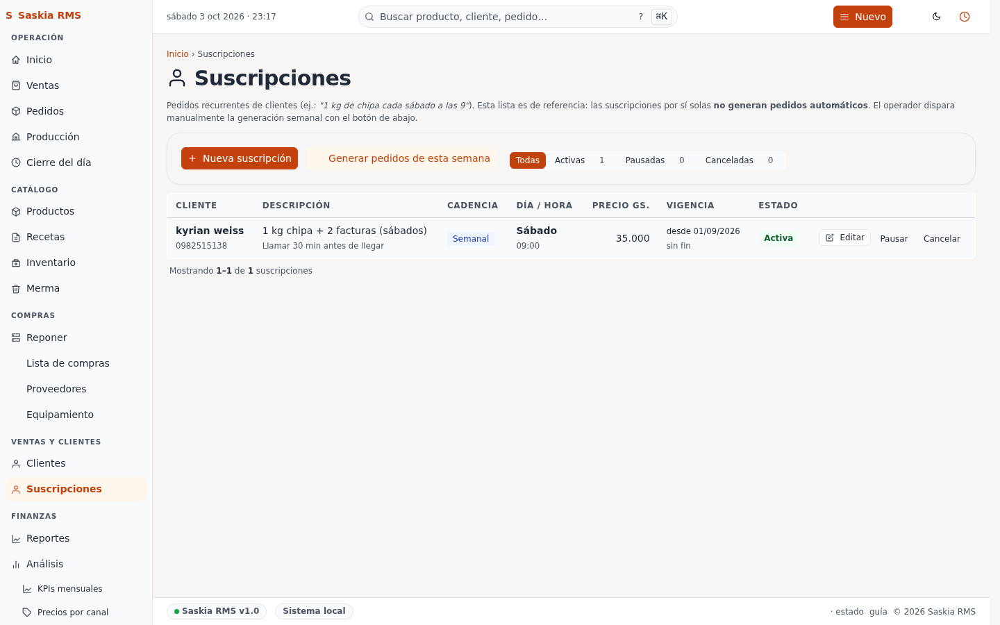

# 18 — Suscripciones (entregas recurrentes)

> **Qué es:** la lista de clientes que tienen entregas periódicas
> (diarias, semanales, etc.) — por ejemplo, el café de la esquina que
> recibe 1 kg de chipa todos los sábados a las 9.

## Cómo llegar

**Ventas y clientes → Suscripciones** en la barra lateral.

> **Importante:** esta lista es de **referencia**. Las suscripciones
> por sí solas **no generan pedidos automáticamente**. Una vez por
> semana (generalmente Domingos) hay que tocar el botón
> **"Generar pedidos de esta semana"** para que la app cree los pedidos
> de los clientes que correspondan.

## Qué muestra la tabla

Cada fila es una suscripción activa:

| Columna | Qué significa |
|---|---|
| **Cliente** | Nombre del cliente + teléfono (clickeable para llamar). |
| **Descripción** | Qué productos lleva y en qué cantidad. |
| **Cadencia** | Frecuencia (Semanal, Quincenal, Mensual). |
| **Día / Hora** | Cuándo se entrega (ej. "Sábado 09:00"). |
| **Precio Gs.** | Precio total de la entrega recurrente. |
| **Vigencia** | Desde cuándo y hasta cuándo (puede ser "sin fin"). |
| **Estado** | Activa / Pausada / Cancelada. |

## Filtros arriba de la tabla

- **Todas** (1) / **Activas** (1) / **Pausadas** (0) / **Canceladas** (0)
- Click en cualquiera para ver solo ese estado

## Crear una nueva suscripción

1. **+ Nueva suscripción** arriba a la izquierda
2. Elegí el cliente (o creá uno nuevo desde Clientes)
3. Tildá los productos que va a llevar
4. Para cada producto, poné la cantidad
5. Definí la cadencia (semanal, quincenal, mensual) y el día/hora de entrega
6. Poné el precio (en Gs.)
7. Definí la vigencia (desde cuándo, hasta cuándo)
8. **Guardar**

> **Tip:** si la cadencia es semanal, elegí el **día específico**
> (por ejemplo, "sábados a las 9:00"). La columna "Día / Hora" lo
> muestra en formato legible ("Sábado 09:00").

## Generar pedidos de la semana

Una vez por semana (generalmente Domingos, antes de empezar a hornear
la semana siguiente):

1. Tocá **"Generar pedidos de esta semana"** arriba
2. La app revisa todas las suscripciones activas y crea un pedido
   por cada una para los próximos 7 días
3. Los pedidos quedan en la pantalla de Pedidos con la fecha correcta
4. Si un cliente ya tiene un pedido para esa fecha, no se duplica

> **Tip:** podés tocar este botón más de una vez — si ya generaste los
> pedidos y volvés a tocarlo, te avisa cuántos ya existían y no hace nada
> nuevo. Es seguro.

## Ver entregas pendientes del día

Las entregas de hoy se ven en la pantalla **Pedidos** con el filtro
"Para hoy". Cada pedido generado desde una suscripción tiene una
etiqueta **"Auto"** al lado para que sepas que vino de una suscripción.

## Pausar una suscripción

Si el cliente se va de vacaciones o no necesita entregas por un tiempo:

1. Tocá **Pausar** al final de la fila
2. Elegí hasta qué fecha queda pausada
3. La suscripción queda en estado "Pausada" (no genera pedidos)
4. Vuelve a "Activa" automáticamente el día siguiente de la fecha de pausa

## Editar / Cancelar definitivamente

- **Editar** (lápiz al final de la fila): cambia cualquier campo de la
  suscripción. Útil para ajustar el día, el precio o los productos.
- **Cancelar**: la suscripción pasa a estado "Cancelada" — no genera
  más pedidos. Queda visible en el historial del cliente por si
  necesitás reactivarla después (creando una nueva).

## Diferencia con Pedidos

- **Pedido** = un encargo puntual para una fecha específica (cumpleaños,
  torta para el sábado). Una sola entrega. Lo creás vos manualmente.
- **Suscripción** = una regla recurrente. La suscripción sola no hace
  nada — hay que tocar "Generar pedidos de esta semana" para que se
  materialice en pedidos reales.

Si un cliente te pide "20 medialunas todos los lunes hasta fin de mes",
es una suscripción. Si te pide "30 medialunas para el sábado", es un
pedido.

## Siguiente paso

→ [07-clientes.md](07-clientes.md) — cómo cargar clientes nuevos.
