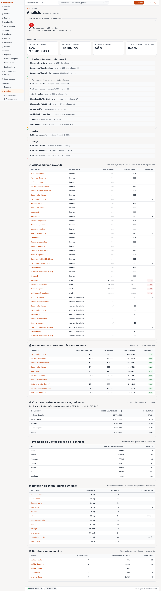

# 19 — Análisis (inteligencia de negocio)

> **Qué es:** una vista de "inteligencia de negocio" del local. Muestra
> qué productos son más rentables, qué alertas de stock hay, qué
> recetas son más complejas, etc. Es la pantalla que más mirás cuando
> querés entender **por qué** los números son como son.

> **Esta pantalla es para Iván (operador técnico).** Saskia no necesita
> usarla en el día a día. Está acá en el manual como referencia por si
> Iván necesita explicarte algo que vio en esta pantalla.

## Cómo llegar

**Finanzas → Análisis** en la barra lateral.

## Qué muestra (de arriba hacia abajo)

La página es larga — son múltiples secciones apiladas. Cada una
responde a una pregunta distinta:

### 1. KPIs del día / mes

Cuatro tarjetas arriba del todo:

| Tarjeta | Qué significa |
|---|---|
| **Mañana** | Cuánto se espera facturar mañana según el plan de producción y la cadencia histórica. |
| **Mes en curso · ventas** | Total facturado este mes hasta hoy. |
| **Mes en curso · horas** | Horas de producción estimadas este mes. |
| **% de merma · 30 días** | Porcentaje de producto que se tiró en los últimos 30 días. |

### 2. Pronóstico (forecast)

Lista de "qué se espera" para los próximos días:

- **Estrella (sin margen + alta volumen)** — productos que se venden mucho pero dejan poca ganancia. Sirve para detectar si hay que ajustar el precio.
- **Desbalanceo crítico** — productos cuya receta tiene cantidades que no cierran.
- **Gólem de merma observado** — productos cuya merma es desproporcionada.
- **Faltan en forecast (bajo margen + bajo volumen)** — oportunidades de mejora.
- **Muffin sin nombre** — productos con metadata incompleta (hay que renombrarlos).
- **Muffin sin receta** — productos vendidos sin receta cargada (no podés calcular margen).
- **Gólem de doble falta** — productos con datos faltantes y merma alta.

### 3. Alertas (urgentes)

- **Stock crítico** — ingredientes con stock menor al mínimo configurado.
- **Margen bajo** — productos cuyo margen está por debajo del objetivo.
- **Sin nombre / sin receta** — metadata incompleta.
- **A Pedir** — ingredientes que la app sugiere reponer ya (aunque el stock no esté crítico).

### 4. Alerta: margen cayendo

Lista de los productos cuyo margen está **bajando** respecto al histórico.
Es un aviso temprano de "esto dejó de dar ganancia, ojo".

### 5. Productos más rentables (últimos 30 días)

Tabla ordenada por ganancia absoluta, con:
- Producto
- Cantidad vendida
- Ventas en Gs.
- Margen en Gs.
- Margen % (objetivo, generalmente 50%)

### 6. Costo concentrado en pocos ingredientes

Muestra qué ingredientes son los que más impactan en el costo total.
Útil para detectar dependencia de un solo proveedor o de un solo
ingrediente caro.

### 7. Promedio de ventas por día de la semana

Histórico de cuánto se vende cada día. Sirve para detectar
patrones (ej. "los viernes vendo el doble que los lunes").

### 8. Rotación de stock (últimos 30 días)

Para cada ingrediente, cuántos días de stock quedan al ritmo de
consumo actual. Una rotación lenta = capital trabado en mercadería.

### 9. Recetas más complejas

Ranking de recetas por número de ingredientes. Las recetas con
muchos ingredientes son más sensibles a faltantes y más difíciles
de mantener.

## Cómo usar esta pantalla

1. **Una vez por semana** (Domingo, antes de planificar la semana
   siguiente): mirá las alertas de stock crítico y margen bajo. Te
   dice qué reponer y qué precio reconsiderar.
2. **Una vez por mes**: mirá la tabla de "Productos más rentables".
   Si algo te sorprende (un producto que creías bueno está abajo),
   investigá la receta.
3. **Cuando algo falla**: si las ventas bajan o la merma sube,
   esta pantalla te muestra el "por qué" sin tener que armar
   planillas a mano.

## Siguiente paso

→ [26-kpis-mensuales.md](26-kpis-mensuales.md) — vista resumida del mes.
