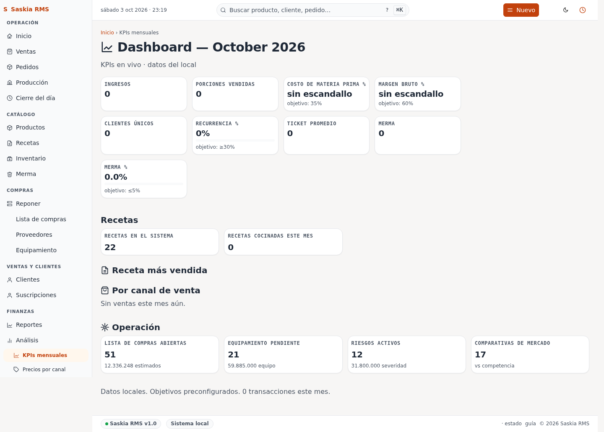

# 20 — KPIs mensuales (Dashboard)

> **Qué es:** una vista resumida del mes en curso, con los indicadores
> clave de negocio (ingresos, porciones, márgenes, etc.) y un panel
> de "operación" (lista de compras abiertas, equipamiento pendiente,
> riesgos activos, comparativas de mercado).

> **Esta pantalla es para Iván (operador técnico).** the operator no la
> necesita en el día a día.

## Cómo llegar

**Finanzas → KPIs mensuales** en la barra lateral.

## Qué muestra

### KPIs principales (arriba)

| KPI | Qué significa | Objetivo |
|---|---|---|
| **Ingresos** | Total facturado este mes. | — |
| **Porciones vendidas** | Cantidad de unidades vendidas. | — |
| **Costo de materia prima %** | Cuánto del ingreso se va en ingredientes. | ≤ 35% |
| **Margen bruto %** | Ganancia bruta / ingreso. | ≥ 60% |
| **Clientes únicos** | Cuántos clientes distintos compraron. | — |
| **Recurrencia %** | % de clientes que ya habían comprado antes. | ≥ 30% |
| **Ticket promedio** | Ingreso / cantidad de ventas. | — |
| **Merma** | Total tirado a la basura (en Gs.). | — |
| **Merma %** | Merma / producción. | ≤ 5% |

Si una métrica no tiene valor (sale "sin escandallo" o "0"), es
porque todavía no hay datos para calcularla.

### Recetas

- **Recetas en el sistema** — cuántas recetas hay cargadas.
- **Recetas cocinadas este mes** — cuántas se cocinaron al menos una vez.

### Receta más vendida

Una sola receta destacada — la que más se vendió este mes. Sirve
para detectar tu "producto estrella".

### Por canal de venta

Distribución de ventas por canal (minorista, mayorista, etc.).
Si dice "Sin ventas este mes aún", es porque todavía no se vendió
nada este mes.

### Operación (abajo)

Cuatro tarjetas que resumen qué hay pendiente en distintas áreas:

- **Lista de compras abiertas** — cuántas líneas de la lista de
  compras todavía no se marcaron como compradas + Gs. estimados.
- **Equipamiento pendiente** — items de la wishlist sin comprar +
  Gs. estimados.
- **Riesgos activos** — cantidad de riesgos abiertos en el
  registro de riesgos + Gs. de severidad total.
- **Comparativas de mercado** — productos comparados con la
  competencia (cuántos tenés registrados).

## Cuándo mirar esta pantalla

- **A fin de mes** — para ver el cierre del mes y comparar con
  el mes anterior.
- **A mediados de mes** — para ver si vas bien encaminado o hay
  que ajustar algo.
- **Cuando Iván te pida números** — esta es la pantalla que
  captura para los reportes.

## Siguiente paso

→ [19-analisis.md](19-analisis.md) — vista más detallada de
inteligencia de negocio (alertas, márgenes, rotación).
